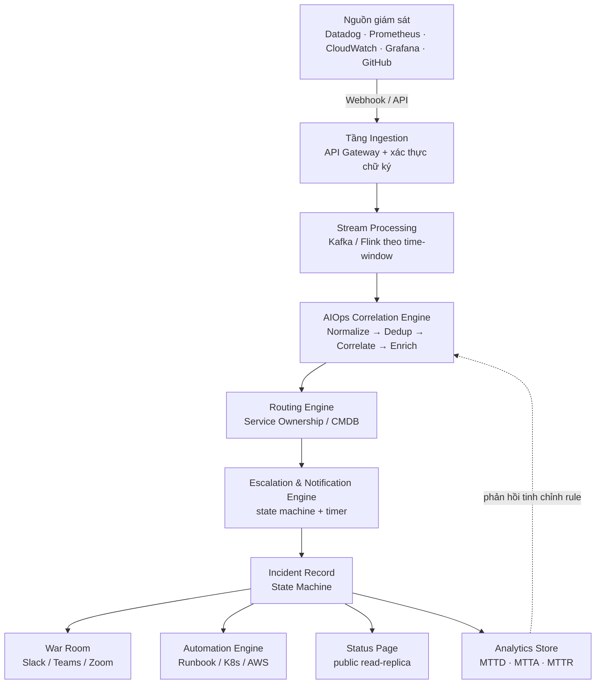
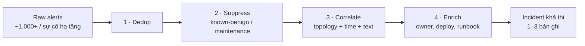
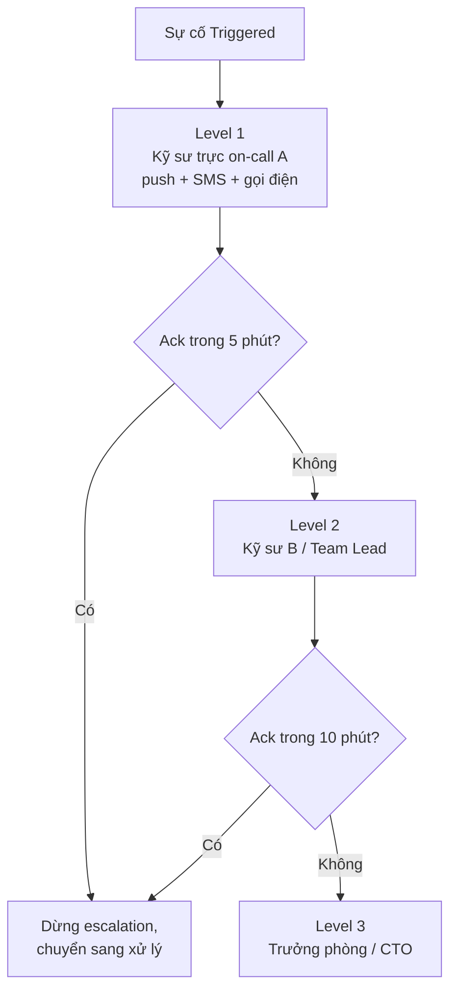
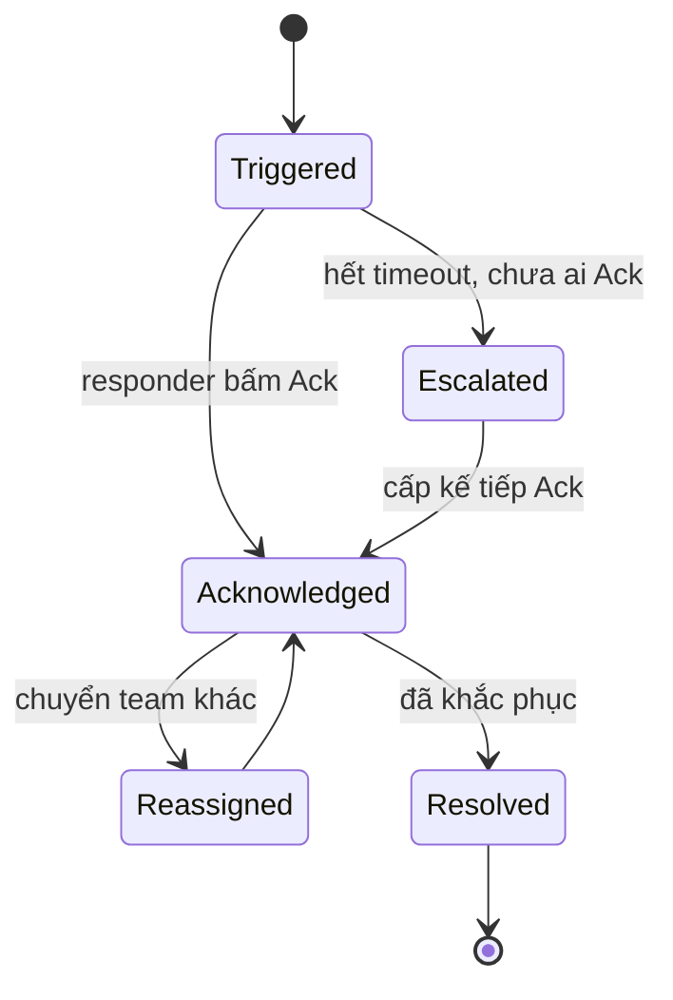

# Kiến trúc và cơ chế vận hành của hệ thống quản lý sự cố

*Tài liệu kỹ thuật · Incident Management Systems · cập nhật theo thông tin thị trường và chuẩn ngành 2026*

**Vòng lặp cốt lõi:** Phát hiện (event ingestion · AIOps correlation) → Phản ứng (escalation · on-call · automation) → Học hỏi (MTTR/MTTA · postmortem · SLO).

---

> ### 🧭 Tóm tắt điều hành & Phạm vi tài liệu
>
> **Tóm tắt:** Tài liệu trình bày kiến trúc tham chiếu 9 tầng của hệ thống Incident Management hiện đại, cơ chế thiết kế chi tiết từng tầng (bao gồm các edge case/failure mode ở mục 4.10), và đối chiếu với ba chuẩn vận hành quốc tế — ITIL 4, NIST SP 800-61 Rev.3 / CSF 2.0, và Google SRE.
>
> **Phương pháp luận:** Nội dung được tổng hợp và diễn giải hoàn toàn từ **nguồn công khai** (blog kỹ thuật của các nhà cung cấp, publication chính thức của NIST/AXELOS, sách *Site Reliability Engineering* của Google) — không sử dụng, không tham chiếu bất kỳ tài liệu nội bộ, mã nguồn độc quyền hay thông tin bảo mật của tổ chức nào. Tên thương hiệu (PagerDuty, Opsgenie, Grafana, Datadog...) chỉ dùng với mục đích so sánh/tham chiếu khách quan, không sao chép logo, khẩu hiệu hay văn bản marketing nguyên văn. Thời điểm tổng hợp: 9/2026 — số liệu thị trường có thể đã thay đổi.
>
> **Quy ước độ tin cậy:** Số liệu định lượng được đánh dấu số tham chiếu `[n]` (xem mục Nguồn tham khảo). Claim từ nguồn sơ cấp/trung lập (sách SRE, publication NIST/AXELOS) không kèm nhãn thêm; claim do chính vendor tự công bố (ví dụ % giảm nhiễu, % cải thiện MTTR) được đánh dấu `nguồn: vendor` để người đọc tự cân nhắc mức độ khách quan.

---

## Mục lục

1. [Vì sao "hệ thống dập lửa" lại là một bài toán kiến trúc khó](#1-vì-sao-hệ-thống-dập-lửa-lại-là-một-bài-toán-kiến-trúc-khó)
2. [Bức tranh thị trường 2026](#2-bức-tranh-thị-trường-2026)
3. [Kiến trúc tham chiếu (Reference Architecture)](#3-kiến-trúc-tham-chiếu-reference-architecture)
4. [Thiết kế lõi của từng tầng](#4-thiết-kế-lõi-của-từng-tầng)
5. [Vận hành theo chuẩn quốc tế](#5-vận-hành-theo-chuẩn-quốc-tế)
6. [Xu hướng thiết kế 2025–2026](#6-xu-hướng-thiết-kế-20252026)
7. [Checklist thiết kế — nếu bạn tự xây hệ thống này](#7-checklist-thiết-kế--nếu-bạn-tự-xây-hệ-thống-này)
8. [Nguồn tham khảo & Tuyên bố tính hợp pháp](#nguồn-tham-khảo)

---

## 1. Vì sao "hệ thống dập lửa" lại là một bài toán kiến trúc khó

PagerDuty ra đời năm 2009 với một ý tưởng đơn giản: thay vì để kỹ sư trực đêm ngồi canh dashboard, hãy tự động "gọi pager" khi có sự cố. Gần 17 năm sau, bài toán đó đã phình to thành cả một tầng hạ tầng riêng — gọi chung là **Incident Management** hay **IT Operations Management (ITOM)**.

Lý do bài toán khó không nằm ở việc "gửi thông báo" — cái đó một webhook đơn giản cũng làm được. Cái khó nằm ở quy mô: trong kiến trúc microservices hiện đại, một node bị đầy đĩa có thể kích hoạt cùng lúc alert từ Prometheus (CPU), Datadog (latency), một synthetic monitor (uptime) và cả một cảnh báo bảo mật — bốn nguồn, một nguyên nhân. Nhân con số đó lên hàng trăm service phụ thuộc lẫn nhau, và một sự cố hạ tầng có thể tạo ra hàng nghìn alert trong vài phút.

Vì vậy, một nền tảng incident management hiện đại không còn là "công cụ gửi pager" — nó là một **hệ thống phân tán xử lý sự kiện thời gian thực**, phải giải đồng thời bốn bài toán kỹ thuật: nuốt và chuẩn hoá dữ liệu ở tốc độ cao, nén hàng nghìn alert thành vài incident có ý nghĩa, định tuyến đúng người trong vài giây, và giữ lại một bản ghi đầy đủ để tổ chức học được điều gì đó sau mỗi lần cháy nhà.

> **📌 Phạm vi tài liệu này**
> Tài liệu tập trung vào **cấu trúc, thiết kế và cơ chế vận hành** của lớp hệ thống này nói chung — dùng PagerDuty làm ví dụ tham chiếu vì đây là nền tảng lâu đời và phổ biến nhất, nhưng các nguyên lý áp dụng cho toàn bộ nhóm sản phẩm: Opsgenie, Grafana IRM, Datadog On-Call, incident.io, Rootly, Squadcast, xMatters, ServiceNow, v.v.

---

## 2. Bức tranh thị trường 2026

Thị trường đang tái cấu trúc mạnh. Atlassian ngừng bán Opsgenie từ tháng 6/2025 và sẽ ngừng hỗ trợ hẳn vào tháng 4/2027 `[9]`, buộc hàng loạt đội ngũ phải di chuyển sang Jira Service Management hoặc nền tảng khác. Grafana đã gộp OnCall và Incident thành một ứng dụng Grafana Cloud IRM duy nhất từ tháng 3/2025; riêng bản mã nguồn mở Grafana OnCall OSS (tự host) chuyển sang chế độ chỉ đọc và chính thức bị archive từ ngày 24/3/2026 `[7]`, buộc người tự host phải cân nhắc chuyển sang Grafana Cloud IRM hoặc nền tảng khác. Trong khi đó, nhóm "incident-native" như incident.io và Rootly đang cạnh tranh trực diện với PagerDuty bằng cách gộp luôn alerting, điều phối chat và postmortem vào một luồng duy nhất, thay vì để kỹ sư nhảy qua lại giữa nhiều công cụ `[1,2]`.

| Nền tảng | Trọng tâm thiết kế | Phù hợp nhất với |
|---|---|---|
| **PagerDuty** `[10]` | Alerting và escalation quy mô lớn, hệ sinh thái tích hợp rộng (750+ theo trang chính thức) | Doanh nghiệp lớn, ngành có quy định chặt |
| **Opsgenie** `[9]` | Alerting/escalation gắn với Jira Service Management | Đang bị khai tử — cần lên kế hoạch di chuyển trước 4/2027 |
| **Grafana IRM** `[7]` (kế thừa OnCall) | Điều phối on-call gắn liền observability stack | Đội đã dùng Grafana Cloud làm nền quan sát chính |
| **incident.io** `[1]` | Chat-native (Slack/Teams), gộp on-call + response + postmortem | Đội 50–500 kỹ sư, vận hành chủ yếu qua Slack |
| **Rootly** `[2]` | AI-SRE: tự động điều tra nguyên nhân, soạn retro | Đội muốn AI làm hộ phần "điều tra" trong lúc cháy nhà |
| **Datadog On-Call** | On-call tích hợp thẳng vào dữ liệu observability sẵn có | Đội đã dùng Datadog làm nền giám sát chính |
| **Squadcast** | Alerting + SRE workflow, giá cạnh tranh | Đội vừa và nhỏ, ngân sách hạn chế |
| **xMatters** | Workflow linh hoạt, audit trail chi tiết | Tổ chức cần audit trail nghiêm ngặt, quy định tuân thủ chặt |
| **BigPanda** `[3]` | AIOps thuần — tương quan cảnh báo ở quy mô rất lớn | Enterprise IT Ops, không cần lớp chat/collab |

*Bảng tổng hợp từ các báo cáo so sánh nền tảng công khai năm 2026 (xem mục Nguồn tham khảo cuối trang) — mô hình giá và tính năng thay đổi liên tục nên nên kiểm tra lại trang chính thức trước khi quyết định.*

---

## 3. Kiến trúc tham chiếu (Reference Architecture)

Dù tên gọi từng phân hệ khác nhau giữa các nền tảng, bên dưới đều là cùng một đường ống dữ liệu chín tầng. Đây là sơ đồ tổng quát mà gần như mọi nền tảng incident management hiện đại đều triển khai, chỉ khác nhau ở việc tầng nào được đầu tư mạnh nhất.

**Sơ đồ 1 — Reference Architecture**

*Chú thích sơ đồ: mũi tên liền là luồng dữ liệu chính (alert → incident → xử lý); mũi tên đứt (từ Analytics Store quay lại Correlation Engine) là vòng phản hồi dùng để tinh chỉnh rule — không phải luồng xử lý thời gian thực.*

Mấu chốt của thiết kế này là **tách rời lớp thu thập khỏi lớp quyết định**. Tầng Ingestion không biết gì về "ai sẽ bị gọi" — nó chỉ có nhiệm vụ nhận, xác thực và chuẩn hoá. Việc quyết định gom nhóm, định tuyến, và gọi ai nằm ở các tầng sau. Tách như vậy giúp hệ thống chịu được việc một nguồn giám sát đột nhiên "bão" hàng chục nghìn sự kiện/giây mà không làm sập luôn cả pipeline điều phối.

> **⚠️ Điểm dễ bị bỏ sót khi tự thiết kế**
> Webhook đến từ bên ngoài phải được coi là không đáng tin cho tới khi xác thực: chữ ký HMAC, giới hạn tốc độ (rate limit) theo từng nguồn, và một `idempotency key` có TTL rõ ràng (ví dụ 24h) để một sự kiện gửi lặp (do retry mạng) không bị đếm thành hai alert khác nhau. Lưu ý: rate limit không nên áp dụng "mù" — một nguồn giám sát bị lỗi/bão do misconfigure và một outage hạ tầng thật gây bão alert hợp lệ trông giống hệt nhau ở tầng này; phân tích chi tiết ở mục 4.10.

---

## 4. Thiết kế lõi của từng tầng

Phần này đi sâu vào cơ chế bên trong — cách mỗi tầng thực sự "nghĩ" và ra quyết định, không chỉ liệt kê tính năng.

### 4.1 — Noise reduction: từ 1.000 alert xuống 1 incident

Đây là tầng quan trọng nhất và cũng là nơi các nền tảng cạnh tranh nhau gắt nhất bằng AI/ML. Cơ chế chuẩn gồm bốn bước tuần tự, mỗi bước nén dữ liệu lại một chút trước khi chuyển sang bước kế:

1. **Deduplication (khử trùng lặp)** — Gộp các alert giống hệt nhau từ cùng một nguồn thành một bản ghi duy nhất, cập nhật trạng thái thay vì tạo alert mới.
2. **Suppression (nén nhiễu đã biết)** — Tự động ẩn các alert phát sinh từ hoạt động đã lên lịch — deploy đang chạy, cửa sổ bảo trì đã khai báo trước.
3. **Correlation (tương quan)** — Gom các alert khác nhau nhưng cùng gốc, dựa trên ba tín hiệu: *topology*, *time window*, và *text similarity*.
4. **Enrichment (làm giàu ngữ cảnh)** — Gắn thêm dữ liệu hữu ích: ai vừa deploy, runbook liên quan, owner của service.

**Sơ đồ 2 — Pipeline nén nhiễu (noise reduction)**

Về mặt hạ tầng, tầng này thường chạy trên một stream processor (Kafka/Flink là lựa chọn phổ biến) để xử lý theo cửa sổ thời gian trượt thay vì batch — vì độ trễ ở đây trực tiếp cộng vào MTTD. Các nền tảng AIOps trưởng thành báo cáo mức nén nhiễu 90–95%+ khi correlation engine đã được huấn luyện đủ dữ liệu lịch sử `[3,4]` `nguồn: vendor`; con số cụ thể luôn phụ thuộc vào việc metadata topology của tổ chức có đầy đủ hay không.

> **⚠️ Rủi ro ngược: over-correlation**
> Nén nhiễu quá tay cũng là một rủi ro thật: nếu hai sự cố *khác nhau nhưng thật* xảy ra trùng thời điểm và trùng một phần topology, correlation engine có thể gộp nhầm chúng thành một incident — khiến sự cố thứ hai bị "nuốt" và không ai xử lý cho tới khi có người phát hiện thủ công. Vì vậy ngưỡng correlation (similarity threshold) nên là tham số có thể chỉnh, không hard-code.

### 4.2 — Escalation Policy: state machine có hẹn giờ

Escalation policy về bản chất là một **state machine có timer**: mỗi cấp (level) có một danh sách người nhận và một ngưỡng thời gian chờ Acknowledge. Hết thời gian mà không ai xác nhận, hệ thống tự động "rơi" xuống cấp kế tiếp.

**Sơ đồ 3 — Chuỗi chuyển cấp (escalation chain)**

Thiết kế đúng đòi hỏi vài chi tiết dễ bị xem nhẹ: kênh thông báo phải **đa kênh và có thứ tự ưu tiên**; việc "Ack" phải **idempotent**; và mọi hành động chuyển cấp phải được ghi log bất biến.

> **🔴 Race condition chưa xử lý: Ack vs. Timer hết hạn**
> Sơ đồ 3 vẽ timer và hành động Ack như hai luồng tách biệt, nhưng thực tế chúng có thể xảy ra gần như đồng thời: timer vừa hết hạn và bắn escalate đúng lúc responder A bấm Ack. Nếu không có **atomic state transition** (transition kiểu compare-and-swap: chỉ chuyển state khi state hiện tại còn đúng như kỳ vọng), hệ quả là incident vừa được Ack vừa tiếp tục escalate lên Level 2 — gọi nhầm người không liên quan. Cùng lớp vấn đề: hai responder bấm Ack gần như cùng lúc cũng cần transition idempotent, để người đến sau nhận "đã được X xác nhận" thay vì tạo ra state xung đột.

Một điểm khác cũng hay bị bỏ sót: chuỗi escalation ở Sơ đồ 3 dừng ở Level 3 mà chưa định nghĩa "backstop" — nếu Level 3 (CTO/Trưởng phòng) cũng không Ack thì sao? Một thiết kế hoàn chỉnh cần một bước cuối cùng không thể bỏ qua: gọi số khẩn cấp cố định, kích hoạt cảnh báo toàn tổ chức, hoặc escalate ra ngoài phạm vi kỹ thuật — nếu không, chuỗi escalation có nguy cơ "rơi vào im lặng" ngay ở cấp cao nhất.

### 4.3 — Lịch trực (On-Call Scheduling)

Bài toán lập lịch trực tưởng đơn giản nhưng thực ra là một dạng bài toán ghép lịch có ràng buộc: xoay vòng công bằng giữa các thành viên, tôn trọng múi giờ khác nhau trong đội phân tán, và cho phép "Override". Phần lớn nền tảng đồng bộ lịch này ra ngoài qua chuẩn iCalendar (.ics).

Một lớp bug kinh điển đáng nêu tên cụ thể: chuyển ca đúng vào thời điểm đổi giờ **Daylight Saving Time (DST)** — "spring forward" làm mất một giờ đồng hồ, "fall back" tạo ra một giờ lặp lại — có thể khiến job tính giờ handoff chạy sai lệch nếu lịch được lưu bằng local time thay vì UTC. Quy ước an toàn: luôn lưu và tính toán lịch trực bằng UTC, chỉ convert sang local time ở tầng hiển thị.

### 4.4 — Vòng đời trạng thái của một Incident

Bản ghi incident cũng là một state machine, nhưng đơn giản hơn escalation policy.

**Sơ đồ 4 — Vòng đời trạng thái incident**

Sơ đồ trên đơn giản hoá ở một điểm: nó không phân biệt **"Delivered"** (thông báo đã gửi thành công tới thiết bị) với **"Acknowledged"** (người nhận thực sự xác nhận) — một push notification "delivered" không đảm bảo có người đã đọc nó. Một state machine đầy đủ hơn nên có state trung gian "Notified/Delivered" trước "Acknowledged" để phát hiện được trường hợp "đã gửi nhưng im lặng". Race condition giữa Ack và timer escalation được phân tích riêng ở mục 4.2.

### 4.5 — Automation & Runbooks: tự sửa lỗi không cần người

Với các lỗi đã biết trước (pod bị OOM, cache cần xoá, service cần restart), nền tảng cho phép gắn một script tự động vào nút bấm ngay trên dashboard. Hai nguyên tắc thiết kế bắt buộc: hành động phải **idempotent**, và với hành động rủi ro cao, phải có **approval gate**.

"Idempotent" không tự nhiên mà có — nó đòi hỏi cơ chế cụ thể: mỗi lần thực thi cần một idempotency key riêng gắn với request, và trước khi hành động, script nên **kiểm tra trạng thái hiện tại** (ví dụ pod generation/status) thay vì thực thi mù. Thiếu bước kiểm tra này, nhiều alert trùng lặp có thể kích hoạt cùng một runbook liên tục và gây ra *restart storm* — tự hệ thống automation trở thành nguồn gây sự cố mới.

### 4.6 — War Room: điều phối sự cố theo thời gian thực

Khi một incident đủ nghiêm trọng, nền tảng tự tạo một kênh chat riêng và bắt đầu ghi lại mọi hành động thành một **timeline bất biến**. Về mặt kỹ thuật đây là một ứng dụng của *event sourcing*: thay vì lưu "trạng thái hiện tại", hệ thống lưu toàn bộ chuỗi sự kiện đã xảy ra, và trạng thái hiện tại chỉ là kết quả suy ra từ chuỗi đó.

### 4.7 — Status Page: tách khỏi lõi để không sập theo

Trang trạng thái công khai gần như luôn được thiết kế như một **read-replica tách biệt**, phục vụ qua CDN — vì nếu chính hạ tầng lõi đang gặp sự cố, status page vẫn phải sống để thông báo cho người dùng.

> **⚠️ Trade-off CAP chưa nói rõ: điều gì xảy ra khi chính pipeline đồng bộ bị đứt?**
> Tách replica giải quyết phần lớn vấn đề, nhưng bỏ qua đúng kịch bản tệ nhất: nếu sự cố đang xảy ra làm gián đoạn luôn cả pipeline replicate dữ liệu sang status page, trang này có nguy cơ hiển thị thông tin cũ (stale) — hoặc tệ hơn, hiển thị "mọi thứ bình thường" trong khi thực tế đang down. Theo CAP theorem, đây là lựa chọn thiết kế thiên về **Availability** hơn **Consistency** khi có Partition — cần công bố rõ SLA độ trễ đồng bộ tối đa, và có fallback (snapshot tĩnh cuối cùng, cache sẵn ở CDN edge, không phụ thuộc origin) cho trường hợp pipeline đồng bộ chết hẳn.

### 4.8 — Analytics & Postmortem: đo để cải thiện

Bốn chỉ số vận hành cốt lõi:

| Chỉ số | Công thức | Ý nghĩa |
|---|---|---|
| **MTTD** | (1/n)·Σ(tᵢ,detect − tᵢ,occur) | Trung bình thời gian phát hiện trên n incident |
| **MTTA** | (1/n)·Σ(tᵢ,ack − tᵢ,trigger) | Trung bình thời gian có người nhận trên n incident |
| **MTTR** | (1/n)·Σ(tᵢ,resolve − tᵢ,ack) | Trung bình thời gian xử lý xong trên n incident |
| **MTBF** | tổng uptime ÷ số lần hỏng | n incident trong kỳ đo |

*Lưu ý ký hiệu: chữ "Mean" trong tên các chỉ số nghĩa là **giá trị trung bình trên nhiều incident** (n), không phải khoảng thời gian của một incident đơn lẻ — công thức trên tính đúng theo định nghĩa "Mean". Riêng MTBF: công thức ở đây theo quy ước tính trên uptime thuần (không gồm thời gian downtime để khắc phục); một số tài liệu công nghiệp định nghĩa MTBF = MTTF + MTTR — cần nêu rõ quy ước đang dùng khi báo cáo số liệu này.*

Nhóm nền tảng "incident-native" thế hệ mới — rõ nhất là Rootly và incident.io `[1,2]` `nguồn: vendor` — hiện dùng LLM để tự soạn bản nháp postmortem từ chính timeline event-sourced ở mục 4.6. (Datadog Bits AI cũng là một trợ lý AI tạo sinh tích hợp sẵn trong nền tảng, nhưng năng lực được xác nhận rõ nhất của nó là truy vấn dữ liệu observability bằng ngôn ngữ tự nhiên để hỗ trợ điều tra, chứ chưa có nguồn xác nhận rõ ràng việc tự động soạn thảo postmortem như hai cái tên trên.) Cần lưu ý đây là số liệu do chính vendor công bố, nên xem như một chỉ dấu tiềm năng hơn là một cam kết chắc chắn.

### 4.9 — Xu hướng mới nhất: từ AIOps sang "AI SRE"

AIOps (mục 4.1) giỏi ở việc *tương quan* — cho biết những alert nào có khả năng liên quan đến nhau. Nhưng tương quan không phải nhân quả. Thế hệ công cụ mới, thường được gọi là **AI SRE**, đi xa hơn bằng cách dùng agent dựa trên LLM để chủ động truy vết qua chuỗi phụ thuộc, nhằm đề xuất nguyên nhân gốc kèm mức độ tin cậy `[4]` `nguồn: vendor`.

*Lưu ý về thuật ngữ: ranh giới "AIOps vs. AI SRE" ở trên **chưa phải một taxonomy được chuẩn hoá bởi tổ chức trung lập** (không phải định nghĩa của Gartner, NIST hay IEEE) — đây là cách phân loại đang nổi lên từ một số nhà cung cấp (đặc biệt Traversal, Rootly), nên cần hiểu là một khung diễn giải đang hình thành, không phải chuẩn ngành đã đồng thuận.*

### 4.10 — Điểm mù kỹ thuật & Failure Modes

Các mục 4.1–4.9 mô tả "happy path" của từng tầng. Bảng dưới tổng hợp lại các edge case đã nêu rải rác ở trên, cộng thêm vài trường hợp bổ sung, thành một checklist failure-mode tường minh.

| Vấn đề | Rủi ro nếu bỏ qua | Cơ chế giải quyết tham chiếu |
|---|---|---|
| Race condition: Ack vs. Timer hết hạn (§4.2) | Gọi nhầm người ở Level 2/3 dù đã có người xử lý | Atomic state transition (compare-and-swap) |
| Không có backstop cuối chuỗi escalation (§4.2) | Chuỗi escalation "im lặng" nếu cấp cao nhất cũng không phản hồi | Break-glass fallback: số khẩn cấp cố định / cảnh báo toàn tổ chức |
| Timer không có persistence (§Ingestion) | Node giữ timer chết giữa chừng → incident không bao giờ escalate | Durable timer: delayed queue (Kafka/SQS) hoặc workflow engine có persistence (Temporal, Cadence) |
| Split-brain trên Status Page (§4.7) | Hiển thị "bình thường" khi thực tế đang down nếu pipeline đồng bộ bị ảnh hưởng | Thiết kế thiên AP theo CAP + SLA độ trễ công bố + fallback cache tĩnh tại CDN edge |
| Idempotency chỉ là nguyên tắc, chưa có cơ chế (§4.5) | Restart storm từ automation; alert thật bị dedup nhầm vào incident cũ | Idempotency key có TTL rõ ràng; state-check trước khi thực thi |
| Rate limiting không phân biệt loại nguồn (§Ingestion) | Alert thật của một outage nghiêm trọng bị rate-limit nhầm cùng nguồn lỗi | Backpressure có phân biệt: buffer + ưu tiên theo severity |
| Over-correlation trong Correlation Engine (§4.1) | Hai incident thật, không liên quan, bị gộp nhầm — một bên bị "nuốt" | Similarity threshold có thể chỉnh, cảnh báo khi merge quá nhiều service |
| "Delivered" chưa phân biệt với "Acknowledged" (§4.4) | Không phát hiện được trường hợp gửi thành công nhưng không ai đọc | Thêm state trung gian "Notified/Delivered" |
| DST trong lịch trực (§4.3) | Job tính giờ handoff sai lệch vào ngày đổi giờ nếu dùng local time | Luôn lưu/tính lịch bằng UTC |

---

## 5. Vận hành theo chuẩn quốc tế

Phần mềm chỉ là công cụ — cách một tổ chức *vận hành* incident mới là thứ quyết định MTTR thực tế.

### 5.1 — ITIL 4: Incident Management như một "practice"

ITIL 4 không còn quy định một quy trình cứng nhắc như bản v3, mà mô tả Incident Management như một trong 34 "practice" (thông lệ thực hành) `[8]`, để tổ chức tự thiết kế quy trình phù hợp. Dù vậy, khung 5 bước bắt nguồn từ ITIL v3 vẫn là cách tóm lược được nhiều tài liệu đào tạo và triển khai ITIL 4 dùng lại trong thực tế:

1. **Incident Identification** — phát hiện gián đoạn dịch vụ
2. **Incident Logging** — ghi nhận thành bản ghi có thể theo dõi
3. **Incident Categorization** — phân loại theo dịch vụ/hệ thống bị ảnh hưởng
4. **Incident Prioritization** — xếp mức độ ưu tiên
5. **Incident Response and Resolution** — xử lý và khôi phục dịch vụ

### 5.2 — NIST: mô hình 4 pha quen thuộc đã bị thay thế từ 4/2025

Trong hơn một thập kỷ, **NIST SP 800-61 Revision 2** (2012) — mô tả một chu trình 4 pha tuyến tính — là khung tham chiếu phổ biến nhất cho incident response:

1. **Preparation**
2. **Detection & Analysis**
3. **Containment, Eradication & Recovery**
4. **Post-Incident Activity**

> **🔄 Cập nhật quan trọng: mô hình 4 pha ở trên đã chính thức bị thay thế**
> Ngày 3/4/2025, NIST công bố bản hoàn chỉnh **SP 800-61 Revision 3**, chính thức thay thế Revision 2. Bản mới bỏ hẳn mô hình 4 pha tuyến tính, tổ chức lại theo sáu chức năng (Functions) của **NIST Cybersecurity Framework (CSF) 2.0**: **Govern → Identify → Protect → Detect → Respond → Recover**. Đây là lần đầu tiên SP 800-61 được ánh xạ trực tiếp vào CSF, vì bản Rev. 2 (2012) ra đời trước cả CSF 1.0 (2014). Mục tiêu của Rev. 3 là gắn incident response vào quản trị rủi ro chung của tổ chức — có thêm hẳn chức năng "Govern" ở cấp lãnh đạo. `[6]`

### 5.3 — Google SRE: error budget và văn hoá blameless

- **SLI / SLO / SLA** — Nếu SLO là 99,9% uptime/tháng, error budget tương ứng khoảng 43 phút downtime được phép trong cả tháng (giả định chu kỳ đo 30 ngày; với tháng dương lịch 31 ngày con số thực tế là ~44,6 phút — cần nêu rõ cửa sổ đo khi báo cáo). `[5]`
- **Playbook trước, ứng biến sau** — chuẩn bị sẵn playbook giúp cải thiện MTTR khoảng gấp ba lần so với "ứng biến tại chỗ". `[5]`
- **Blameless postmortem** — phần lớn sự cố (ước tính khoảng 70%) bắt nguồn từ một thay đổi trên hệ thống đang chạy — nên rollout dần dần (canary/progressive rollout) và khả năng rollback nhanh là hai cơ chế phòng ngừa hiệu quả nhất. `[5]`

Bảng dưới so sánh tương đối ba khung theo sáu chức năng CSF 2.0 hiện hành — đây là cách tổng hợp riêng của tài liệu để dễ đối chiếu, **không phải** bản ánh xạ chính thức do ITIL, NIST hay Google công bố.

| Chức năng (NIST CSF 2.0) | ITIL 4 — practice tương ứng | Google SRE — thực hành tương ứng |
|---|---|---|
| **Govern** — chiến lược, chính sách rủi ro | Governance chung của tổ chức | Chính sách error budget, do lãnh đạo phê duyệt |
| **Identify** — hiểu tài sản, rủi ro | Service Asset & Config Management | Định nghĩa SLI/SLO cho từng service |
| **Protect** — phòng ngừa | Change Enablement | Canary release, progressive rollout |
| **Detect** — phát hiện | Incident Identification | Monitoring & alerting policy |
| **Respond** — khoanh vùng, xử lý | Logging → Categorization → Prioritization → Response | Mitigate trước, tìm root cause sau |
| **Recover** — khôi phục, rút kinh nghiệm | Resolution + Problem Management | Blameless postmortem, action item |

*Hai điểm cần lưu ý về bảng trên: (1) Hàng **Govern** là ánh xạ yếu nhất — ITIL 4 không có một practice riêng tên "Governance"; khái niệm này nằm rải trong Service Value System bao quanh 34 practice, nên ô này chỉ mang tính minh hoạ khái niệm, không phải tương đương cấu trúc. (2) Hàng **Respond** gộp bốn bước con của ITIL vào một ô do CSF 2.0 không chia nhỏ chức năng này — sự bất đối xứng là đặc điểm của việc so sánh liên-khung, không phải lỗi trình bày.*

---

## 6. Xu hướng thiết kế 2025–2026

**Hội tụ về Chat-native / ChatOps-first** — Toàn bộ vòng đời incident diễn ra ngay trong Slack hoặc Microsoft Teams thông qua slash command, thay cho mô hình "web app + thông báo đẩy sang chat" kiểu cũ.

**Incident-as-code** — Escalation policy, lịch trực, và runbook ngày càng được quản lý như cấu hình có version control (Terraform/YAML), giúp review qua pull request và rollback khi cấu hình sai.

**Hội tụ Observability + Incident Response** — Ranh giới giữa "công cụ giám sát" và "công cụ điều phối sự cố" đang mờ dần: Datadog On-Call và Grafana IRM là hai ví dụ rõ nhất `[7]`.

**Tái cấu trúc thị trường** — Việc Opsgenie bị khai tử là dấu hiệu rõ nhất cho xu hướng rộng hơn: nền tảng "alerting đơn thuần" đang bị nhóm full-lifecycle (on-call + response + automation + postmortem) lấn át.

---

## 7. Checklist thiết kế — nếu bạn tự xây hệ thống này

- [ ] Ingestion có xác thực chữ ký webhook, có idempotency key kèm TTL rõ ràng, và có backpressure phân biệt "alert storm thật" với "nguồn lỗi" chưa?
- [ ] Lớp correlation dựa trên tín hiệu gì — chỉ time-window, hay có cả topology và text similarity? Ngưỡng similarity có chỉnh được để tránh over-correlation không?
- [ ] Escalation timer chạy ở đâu — có persistence, chịu được app server chết giữa chừng?
- [ ] State transition (đặc biệt là Ack) có atomic không — hai người Ack cùng lúc, hoặc Ack trùng thời điểm timer hết hạn, có gây state xung đột không?
- [ ] Chuỗi escalation có "backstop" ở cấp cuối cùng không?
- [ ] Trạng thái incident có lưu dạng event log bất biến không? Có phân biệt "Delivered" và "Acknowledged" không?
- [ ] Hành động automation/runbook có kiểm tra trạng thái hiện tại trước khi thực thi (tránh restart storm) không?
- [ ] Status page có tách hạ tầng khỏi lõi, và có fallback khi chính pipeline đồng bộ bị đứt không?
- [ ] MTTD/MTTA/MTTR có đúng là giá trị trung bình (Mean) trên nhiều incident không — và có tài liệu hoá rõ công thức không?

> **✅ Gợi ý thực hành**
> Phần khó nhất khi tự xây không phải là escalation hay notification — mà là correlation engine ở mục 4.1. Nếu chỉ làm đồ án/demo, có thể bắt đầu với luật đơn giản (cùng service + trong cùng cửa sổ 5 phút = cùng incident) trước khi nghĩ tới machine learning.

---

## Nguồn tham khảo

1. incident.io Blog — "PagerDuty alternatives 2026" và "PagerDuty vs Grafana OnCall vs incident.io" (cập nhật 2026)
2. Rootly Blog — "15 Best Incident Response Software Platforms 2026", "Top AI SRE Tools 2026"
3. BigPanda Glossary — "What is alert correlation?", "What is alert noise?"
4. ClickHouse Engineering — "What is AIOps"; Traversal — "AIOps vs AI SRE"
5. Google — *Site Reliability Engineering* (sre.google) — chương Managing Incidents, Embracing Risk
6. NIST Special Publication 800-61 Revision 3 (4/2025) — *Incident Response Recommendations and Considerations for Cybersecurity Risk Management: A CSF 2.0 Community Profile*; NIST Cybersecurity Framework (CSF) 2.0
7. Grafana Labs Blog — "Introducing Grafana Cloud IRM" (3/2025) và thông báo archive Grafana OnCall OSS
8. AXELOS / ITIL 4 — 34 management practices (tổng hợp đối chiếu từ itsm.tools, it-processmaps.com, ClearBridge Technology)
9. Atlassian — thông báo lộ trình ngừng hỗ trợ (End-of-Life) Opsgenie
10. PagerDuty — trang tích hợp chính thức (pagerduty.com/integrations)

> **✅ Tuyên bố về tính hợp pháp & minh bạch nguồn**
> (1) Toàn bộ nội dung được tổng hợp từ 10 nguồn công khai liệt kê ở trên — không sử dụng, không tiếp cận bất kỳ tài liệu nội bộ, mã nguồn độc quyền, hợp đồng hay thông tin bảo mật nào của bất kỳ tổ chức nào. (2) Không có đoạn văn bản nào được sao chép nguyên văn — toàn bộ là diễn giải lại bằng lời văn riêng. (3) Tên thương hiệu và sản phẩm (PagerDuty, Opsgenie, Grafana, Datadog, incident.io, Rootly, Squadcast, xMatters, BigPanda...) chỉ được dùng với mục đích so sánh/tham chiếu khách quan (nominative reference) để mô tả đặc điểm sản phẩm công khai — không sao chép logo, khẩu hiệu, giao diện hay bất kỳ tài sản trực quan độc quyền nào. (4) Thời điểm tổng hợp thông tin: 9/2026 — số liệu về giá, tính năng và định vị sản phẩm thay đổi thường xuyên, nên đối chiếu lại trang chính thức trước khi đưa vào quyết định thực tế hoặc công bố lại.v
