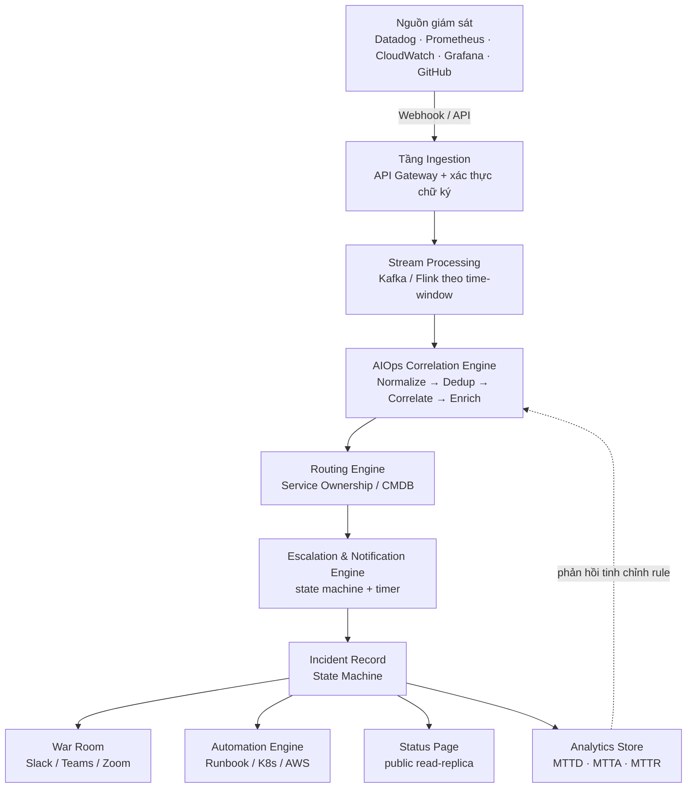
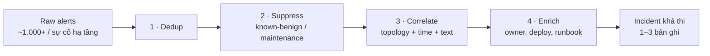
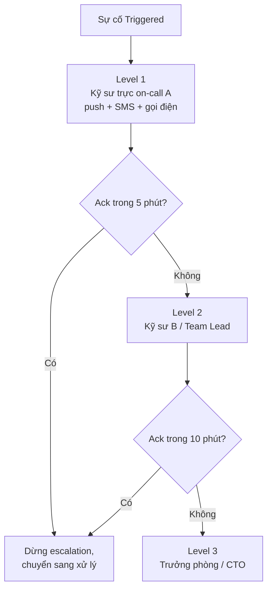
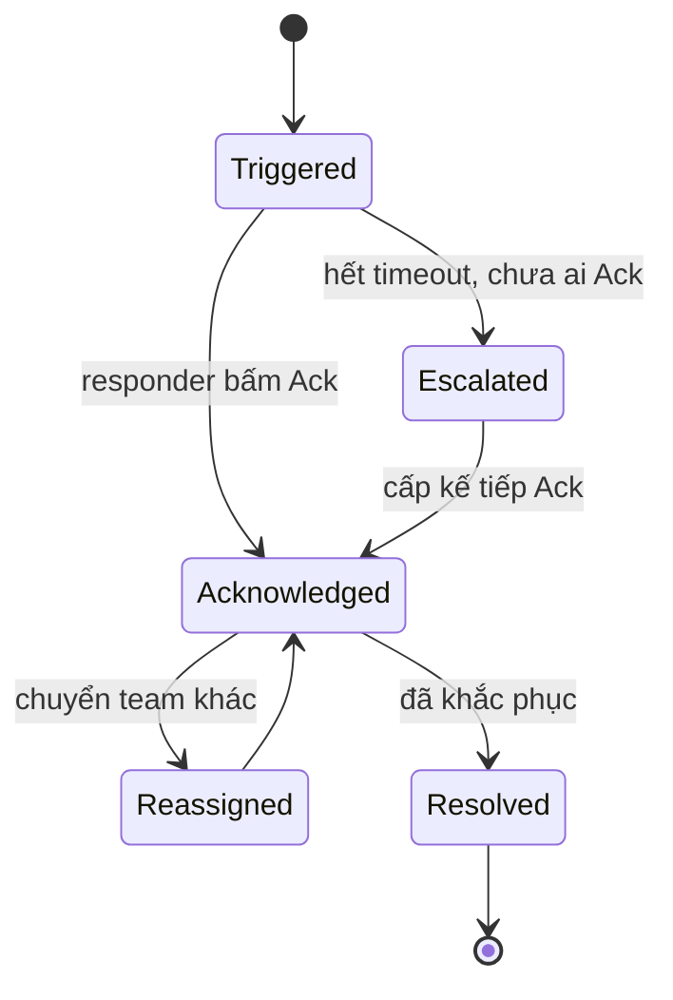

# Kiến trúc và cơ chế vận hành của hệ thống quản lý sự cố

*Tài liệu kỹ thuật · Incident Management Systems · cập nhật theo thông tin thị trường và chuẩn ngành 2026*

Bóc tách cấu trúc, thiết kế và vòng đời vận hành đứng sau các nền tảng tiêu biểu — từ pipeline nuốt hàng nghìn cảnh báo mỗi phút, đến chuẩn ITIL, NIST và Google SRE mà đội ngũ vận hành thực sự dùng.

**Vòng lặp cốt lõi:** Phát hiện (event ingestion · AIOps correlation) → Phản ứng (escalation · on-call · automation) → Học hỏi (MTTR/MTTA · postmortem · SLO).

---

## Mục lục

1. [Vì sao "hệ thống dập lửa" lại là một bài toán kiến trúc khó](#1-vì-sao-hệ-thống-dập-lửa-lại-là-một-bài-toán-kiến-trúc-khó)
2. [Bức tranh thị trường 2026](#2-bức-tranh-thị-trường-2026)
3. [Kiến trúc tham chiếu (Reference Architecture)](#3-kiến-trúc-tham-chiếu-reference-architecture)
4. [Thiết kế lõi của từng tầng](#4-thiết-kế-lõi-của-từng-tầng)
5. [Vận hành theo chuẩn quốc tế](#5-vận-hành-theo-chuẩn-quốc-tế)
6. [Xu hướng thiết kế 2025–2026](#6-xu-hướng-thiết-kế-20252026)
7. [Checklist thiết kế — nếu bạn tự xây hệ thống này](#7-checklist-thiết-kế--nếu-bạn-tự-xây-hệ-thống-này)
8. [Nguồn tham khảo](#nguồn-tham-khảo)

---

## 1. Vì sao "hệ thống dập lửa" lại là một bài toán kiến trúc khó

PagerDuty ra đời năm 2009 với một ý tưởng đơn giản: thay vì để kỹ sư trực đêm ngồi canh dashboard, hãy tự động "gọi pager" khi có sự cố. Gần 17 năm sau, bài toán đó đã phình to thành cả một tầng hạ tầng riêng — gọi chung là **Incident Management** hay **IT Operations Management (ITOM)**.

Lý do bài toán khó không nằm ở việc "gửi thông báo" — cái đó một webhook đơn giản cũng làm được. Cái khó nằm ở quy mô: trong kiến trúc microservices hiện đại, một node bị đầy đĩa có thể kích hoạt cùng lúc alert từ Prometheus (CPU), Datadog (latency), một synthetic monitor (uptime) và cả một cảnh báo bảo mật — bốn nguồn, một nguyên nhân. Nhân con số đó lên hàng trăm service phụ thuộc lẫn nhau, và một sự cố hạ tầng có thể tạo ra hàng nghìn alert trong vài phút.

Vì vậy, một nền tảng incident management hiện đại không còn là "công cụ gửi pager" — nó là một **hệ thống phân tán xử lý sự kiện thời gian thực**, phải giải đồng thời bốn bài toán kỹ thuật: nuốt và chuẩn hoá dữ liệu ở tốc độ cao, nén hàng nghìn alert thành vài incident có ý nghĩa, định tuyến đúng người trong vài giây, và giữ lại một bản ghi đầy đủ để tổ chức học được điều gì đó sau mỗi lần cháy nhà.

> **📌 Phạm vi tài liệu này**
> Tài liệu tập trung vào **cấu trúc, thiết kế và cơ chế vận hành** của lớp hệ thống này nói chung — dùng PagerDuty làm ví dụ tham chiếu vì đây là nền tảng lâu đời và phổ biến nhất, nhưng các nguyên lý áp dụng cho toàn bộ nhóm sản phẩm: Opsgenie, Grafana IRM, Datadog On-Call, incident.io, Rootly, Squadcast, xMatters, ServiceNow, v.v.

---

## 2. Bức tranh thị trường 2026

Thị trường đang tái cấu trúc mạnh. Atlassian ngừng bán Opsgenie từ tháng 6/2025 và sẽ ngừng hỗ trợ hẳn vào tháng 4/2027, buộc hàng loạt đội ngũ phải di chuyển sang Jira Service Management hoặc nền tảng khác. Grafana đã gộp OnCall và Incident thành một ứng dụng Grafana Cloud IRM duy nhất từ tháng 3/2025; riêng bản mã nguồn mở Grafana OnCall OSS (tự host) chuyển sang chế độ chỉ đọc và chính thức bị archive từ ngày 24/3/2026, buộc người tự host phải cân nhắc chuyển sang Grafana Cloud IRM hoặc nền tảng khác. Trong khi đó, nhóm "incident-native" như incident.io và Rootly đang cạnh tranh trực diện với PagerDuty bằng cách gộp luôn alerting, điều phối chat và postmortem vào một luồng duy nhất, thay vì để kỹ sư nhảy qua lại giữa nhiều công cụ.

| Nền tảng | Trọng tâm thiết kế | Phù hợp nhất với |
|---|---|---|
| **PagerDuty** | Alerting và escalation quy mô lớn, hệ sinh thái tích hợp rộng (750+ theo trang chính thức) | Doanh nghiệp lớn, ngành có quy định chặt |
| **Opsgenie** | Alerting/escalation gắn với Jira Service Management | Đang bị khai tử — cần lên kế hoạch di chuyển trước 4/2027 |
| **Grafana IRM** (kế thừa OnCall) | Điều phối on-call gắn liền observability stack | Đội đã dùng Grafana Cloud làm nền quan sát chính |
| **incident.io** | Chat-native (Slack/Teams), gộp on-call + response + postmortem | Đội 50–500 kỹ sư, vận hành chủ yếu qua Slack |
| **Rootly** | AI-SRE: tự động điều tra nguyên nhân, soạn retro | Đội muốn AI làm hộ phần "điều tra" trong lúc cháy nhà |
| **Datadog On-Call** | On-call tích hợp thẳng vào dữ liệu observability sẵn có | Đội đã dùng Datadog làm nền giám sát chính |
| **Squadcast** | Alerting + SRE workflow, giá cạnh tranh | Đội vừa và nhỏ, ngân sách hạn chế |
| **xMatters** | Workflow linh hoạt, audit trail chi tiết | Tổ chức cần audit trail nghiêm ngặt, quy định tuân thủ chặt |
| **BigPanda** | AIOps thuần — tương quan cảnh báo ở quy mô rất lớn | Enterprise IT Ops, không cần lớp chat/collab |

*Bảng tổng hợp từ các báo cáo so sánh nền tảng công khai năm 2026 (xem mục Nguồn tham khảo cuối trang) — mô hình giá và tính năng thay đổi liên tục nên nên kiểm tra lại trang chính thức trước khi quyết định.*

---

## 3. Kiến trúc tham chiếu (Reference Architecture)

Dù tên gọi từng phân hệ khác nhau giữa các nền tảng, bên dưới đều là cùng một đường ống dữ liệu chín tầng. Đây là sơ đồ tổng quát mà gần như mọi nền tảng incident management hiện đại đều triển khai, chỉ khác nhau ở việc tầng nào được đầu tư mạnh nhất.

**Sơ đồ 1 — Reference Architecture**

Mấu chốt của thiết kế này là **tách rời lớp thu thập khỏi lớp quyết định**. Tầng Ingestion không biết gì về "ai sẽ bị gọi" — nó chỉ có nhiệm vụ nhận, xác thực và chuẩn hoá. Việc quyết định gom nhóm, định tuyến, và gọi ai nằm ở các tầng sau. Tách như vậy giúp hệ thống chịu được việc một nguồn giám sát đột nhiên "bão" hàng chục nghìn sự kiện/giây mà không làm sập luôn cả pipeline điều phối.

> **⚠️ Điểm dễ bị bỏ sót khi tự thiết kế**
> Webhook đến từ bên ngoài phải được coi là không đáng tin cho tới khi xác thực: chữ ký HMAC, giới hạn tốc độ (rate limit) theo từng nguồn, và một `idempotency key` để một sự kiện gửi lặp (do retry mạng) không bị đếm thành hai alert khác nhau.

---

## 4. Thiết kế lõi của từng tầng

Phần này đi sâu vào cơ chế bên trong — cách mỗi tầng thực sự "nghĩ" và ra quyết định, không chỉ liệt kê tính năng.

### 4.1 — Noise reduction: từ 1.000 alert xuống 1 incident

Đây là tầng quan trọng nhất và cũng là nơi các nền tảng cạnh tranh nhau gắt nhất bằng AI/ML. Cơ chế chuẩn gồm bốn bước tuần tự, mỗi bước nén dữ liệu lại một chút trước khi chuyển sang bước kế:

1. **Deduplication (khử trùng lặp)** — Gộp các alert giống hệt nhau từ cùng một nguồn (ví dụ server flapping lên-xuống liên tục) thành một bản ghi duy nhất, cập nhật trạng thái thay vì tạo alert mới.
2. **Suppression (nén nhiễu đã biết)** — Tự động ẩn các alert phát sinh từ hoạt động đã lên lịch — ví dụ một deploy đang chạy, hoặc cửa sổ bảo trì đã khai báo trước.
3. **Correlation (tương quan)** — Gom các alert khác nhau nhưng cùng gốc, dựa trên ba tín hiệu: *topology* (bản đồ phụ thuộc giữa các service), *time window* (xảy ra gần nhau về thời gian), và *text similarity* (nội dung mô tả giống nhau).
4. **Enrichment (làm giàu ngữ cảnh)** — Gắn thêm dữ liệu hữu ích vào incident đã gom: ai vừa deploy, runbook liên quan, owner của service, các incident tương tự trong quá khứ.

**Sơ đồ 2 — Pipeline nén nhiễu (noise reduction)**

Về mặt hạ tầng, tầng này thường chạy trên một stream processor (Kafka/Flink là lựa chọn phổ biến) để xử lý theo cửa sổ thời gian trượt (sliding time window) thay vì batch — vì độ trễ ở đây trực tiếp cộng vào MTTD. Các nền tảng AIOps trưởng thành báo cáo mức nén nhiễu 90–95%+ khi correlation engine đã được huấn luyện đủ dữ liệu lịch sử; con số cụ thể luôn phụ thuộc vào việc metadata topology của tổ chức có đầy đủ hay không — engine không thể tương quan những gì nó không biết là có liên quan.

### 4.2 — Escalation Policy: state machine có hẹn giờ

Escalation policy về bản chất là một **state machine có timer**: mỗi cấp (level) có một danh sách người nhận và một ngưỡng thời gian chờ Acknowledge. Hết thời gian mà không ai xác nhận, hệ thống tự động "rơi" xuống cấp kế tiếp.

**Sơ đồ 3 — Chuỗi chuyển cấp (escalation chain)**

Thiết kế đúng đòi hỏi vài chi tiết dễ bị xem nhẹ: kênh thông báo phải **đa kênh và có thứ tự ưu tiên** (push app → SMS → gọi điện thoại, vì gọi điện khó bỏ lỡ nhất nhưng tốn chi phí nhất); việc "Ack" phải **idempotent** — bấm hai lần không được tạo ra lỗi; và mọi hành động chuyển cấp phải được ghi log bất biến để phục vụ phân tích sau này.

### 4.3 — Lịch trực (On-Call Scheduling)

Bài toán lập lịch trực tưởng đơn giản nhưng thực ra là một dạng bài toán ghép lịch có ràng buộc: xoay vòng công bằng giữa các thành viên, tôn trọng múi giờ khác nhau trong đội phân tán, và cho phép "Override" — một kỹ sư xin đổi ca mà không phá vỡ lịch của cả nhóm. Phần lớn nền tảng đồng bộ lịch này ra ngoài qua chuẩn iCalendar (.ics) để kỹ sư xem trực tiếp trên Google Calendar hay Outlook thay vì phải mở riêng một app.

### 4.4 — Vòng đời trạng thái của một Incident

Bản ghi incident cũng là một state machine, nhưng đơn giản hơn escalation policy — vì mục tiêu là phản ánh đúng những gì con người đang thực sự làm, không áp thêm quy trình cứng nhắc.

**Sơ đồ 4 — Vòng đời trạng thái incident**

### 4.5 — Automation & Runbooks: tự sửa lỗi không cần người

Với các lỗi đã biết trước (pod bị OOM, cache cần xoá, service cần restart), nền tảng cho phép gắn một script tự động vào nút bấm ngay trên dashboard — kỹ sư chỉ cần bấm "Restart Pod", backend sẽ gọi webhook tới Kubernetes hoặc AWS Lambda để thực thi. Hai nguyên tắc thiết kế bắt buộc ở đây: hành động phải **idempotent** (chạy lại nhiều lần không gây hại thêm), và với hành động rủi ro cao, phải có **approval gate** — tức một bước xác nhận của con người trước khi thực thi, thay vì để hệ thống tự quyết hoàn toàn.

### 4.6 — War Room: điều phối sự cố theo thời gian thực

Khi một incident đủ nghiêm trọng, nền tảng tự tạo một kênh chat riêng (thường tích hợp Slack/Teams) và một cuộc gọi video, rồi bắt đầu ghi lại mọi hành động — ai chạy lệnh gì, ai vừa nhắn tin gì — thành một **timeline bất biến**. Về mặt kỹ thuật đây là một ứng dụng của *event sourcing*: thay vì lưu "trạng thái hiện tại", hệ thống lưu toàn bộ chuỗi sự kiện đã xảy ra, và trạng thái hiện tại chỉ là kết quả suy ra từ chuỗi đó. Cách này cho phép dựng lại chính xác "chuyện gì đã xảy ra lúc 3:14 sáng" khi viết postmortem sau này.

### 4.7 — Status Page: tách khỏi lõi để không sập theo

Trang trạng thái công khai (nơi khách hàng xem "hệ thống có đang lỗi không") gần như luôn được thiết kế như một **read-replica tách biệt**, phục vụ qua CDN. Lý do: nếu chính hạ tầng lõi đang gặp sự cố, status page vẫn phải sống để thông báo cho người dùng — nó không thể phụ thuộc vào cùng một cụm hạ tầng đang bị ảnh hưởng.

### 4.8 — Analytics & Postmortem: đo để cải thiện

Bốn chỉ số vận hành cốt lõi mà gần như mọi nền tảng đều tính, dựa trên các mốc thời gian ghi lại xuyên suốt vòng đời incident:

| Chỉ số | Công thức | Ý nghĩa |
|---|---|---|
| **MTTD** | detected − occurred | Thời gian phát hiện |
| **MTTA** | acknowledged − triggered | Thời gian có người nhận |
| **MTTR** | resolved − acknowledged | Thời gian xử lý xong |
| **MTBF** | tổng thời gian hoạt động ÷ số lần hỏng | Độ ổn định giữa hai lần hỏng |

Nhóm nền tảng "incident-native" thế hệ mới — rõ nhất là Rootly và incident.io — hiện dùng LLM để tự soạn bản nháp postmortem từ chính timeline event-sourced ở mục 4.6: kéo số liệu, dựng lại trình tự, và gợi ý action item. (Datadog Bits AI cũng là một trợ lý AI tạo sinh tích hợp sẵn trong nền tảng, nhưng năng lực được xác nhận rõ nhất của nó là truy vấn dữ liệu observability bằng ngôn ngữ tự nhiên để hỗ trợ điều tra, chứ chưa có nguồn xác nhận rõ ràng việc tự động soạn thảo postmortem như hai cái tên trên.) Theo các nhà cung cấp, cách làm này giảm đáng kể thời gian "khảo cổ học postmortem" (postmortem archaeology) — công việc tốn hàng giờ để lục lại Slack, log và ticket sau mỗi sự cố. Cần lưu ý đây là số liệu do chính vendor công bố, nên xem như một chỉ dấu tiềm năng hơn là một cam kết chắc chắn.

### 4.9 — Xu hướng mới nhất: từ AIOps sang "AI SRE"

AIOps (mục 4.1) giỏi ở việc *tương quan* — cho biết những alert nào có khả năng liên quan đến nhau. Nhưng tương quan không phải nhân quả: nó không tự trả lời được "vì sao" alert đó xảy ra. Thế hệ công cụ mới, thường được gọi là **AI SRE**, đi xa hơn bằng cách dùng agent dựa trên LLM để chủ động truy vết qua chuỗi phụ thuộc (dependency chain) — xem xét log, metric, và các thay đổi code gần nhất — nhằm đề xuất nguyên nhân gốc kèm mức độ tin cậy, thay vì chỉ nhóm alert lại và để kỹ sư tự suy luận.

---

## 5. Vận hành theo chuẩn quốc tế

Phần mềm chỉ là công cụ — cách một tổ chức *vận hành* incident mới là thứ quyết định MTTR thực tế. Ba khung tham chiếu dưới đây là nền tảng mà phần lớn quy trình on-call hiện nay được xây dựa trên.

### 5.1 — ITIL 4: Incident Management như một "practice"

ITIL 4 không còn quy định một quy trình cứng nhắc như bản v3, mà mô tả Incident Management như một trong 34 "practice" (thông lệ thực hành), để tổ chức tự thiết kế quy trình phù hợp. Dù vậy, khung 5 bước bắt nguồn từ ITIL v3 vẫn là cách tóm lược được nhiều tài liệu đào tạo và triển khai ITIL 4 dùng lại trong thực tế:

1. **Incident Identification** — phát hiện gián đoạn dịch vụ
2. **Incident Logging** — ghi nhận thành bản ghi có thể theo dõi
3. **Incident Categorization** — phân loại theo dịch vụ/hệ thống bị ảnh hưởng
4. **Incident Prioritization** — xếp mức độ ưu tiên dựa trên tác động và mức khẩn cấp
5. **Incident Response and Resolution** — xử lý và khôi phục dịch vụ

### 5.2 — NIST: mô hình 4 pha quen thuộc đã bị thay thế từ 4/2025

Đây là điểm rất nhiều tài liệu trên mạng đang trình bày lỗi thời, nên đáng nói kỹ. Trong hơn một thập kỷ, **NIST SP 800-61 Revision 2** (2012) — mô tả một chu trình 4 pha tuyến tính — là khung tham chiếu phổ biến nhất cho incident response, và đến nay vẫn ảnh hưởng lớn tới cách nhiều đội SOC/IR thiết kế playbook:

1. **Preparation** — chuẩn bị công cụ, playbook, quyền truy cập trước khi sự cố xảy ra
2. **Detection & Analysis** — phát hiện và phân tích phạm vi ảnh hưởng
3. **Containment, Eradication & Recovery** — khoanh vùng, loại bỏ nguyên nhân, khôi phục
4. **Post-Incident Activity** — rút kinh nghiệm

> **🔄 Cập nhật quan trọng: mô hình 4 pha ở trên đã chính thức bị thay thế**
> Ngày 3/4/2025, NIST công bố bản hoàn chỉnh **SP 800-61 Revision 3**, chính thức thay thế Revision 2. Bản mới bỏ hẳn mô hình 4 pha tuyến tính, viết lại toàn bộ nội dung và tổ chức lại theo sáu chức năng (Functions) của **NIST Cybersecurity Framework (CSF) 2.0**: **Govern → Identify → Protect → Detect → Respond → Recover**. Đây là lần đầu tiên SP 800-61 được ánh xạ trực tiếp vào CSF, vì bản Rev. 2 (2012) ra đời trước cả CSF 1.0 (2014). Mục tiêu của Rev. 3 là gắn incident response vào quản trị rủi ro chung của tổ chức — có thêm hẳn chức năng "Govern" ở cấp lãnh đạo — thay vì để nó là quy trình tách biệt chỉ của đội kỹ thuật.

### 5.3 — Google SRE: error budget và văn hoá blameless

Cuốn *Site Reliability Engineering* của Google đóng góp ba khái niệm ảnh hưởng sâu nhất đến thiết kế các nền tảng hiện nay:

- **SLI / SLO / SLA** — đo độ tin cậy bằng số, không bằng cảm tính. Nếu SLO là 99,9% uptime/tháng, error budget tương ứng chỉ khoảng 43 phút downtime được phép trong cả tháng.
- **Playbook trước, ứng biến sau** — SRE ghi nhận việc chuẩn bị sẵn playbook giúp cải thiện MTTR khoảng gấp ba lần so với việc để kỹ sư "ứng biến tại chỗ".
- **Blameless postmortem** — câu hỏi đặt ra sau sự cố là "hệ thống cần thay đổi gì", không phải "ai đã làm sai". SRE cũng ghi nhận phần lớn sự cố (ước tính khoảng 70%) bắt nguồn từ một thay đổi trên hệ thống đang chạy — nên rollout dần dần (canary/progressive rollout) và khả năng rollback nhanh, an toàn là hai cơ chế phòng ngừa hiệu quả nhất.

Bảng dưới so sánh tương đối ba khung theo sáu chức năng CSF 2.0 hiện hành — đây là cách tổng hợp riêng của tài liệu để dễ đối chiếu, **không phải** bản ánh xạ chính thức do ITIL, NIST hay Google công bố.

| Chức năng (NIST CSF 2.0) | ITIL 4 — practice tương ứng | Google SRE — thực hành tương ứng |
|---|---|---|
| **Govern** chiến lược, chính sách rủi ro | Governance chung của tổ chức | Chính sách error budget, do lãnh đạo phê duyệt |
| **Identify** hiểu tài sản, rủi ro | Service Asset & Config Management | Định nghĩa SLI/SLO cho từng service |
| **Protect** phòng ngừa | Change Enablement | Canary release, progressive rollout |
| **Detect** phát hiện | Incident Identification | Monitoring & alerting policy |
| **Respond** khoanh vùng, xử lý | Logging → Categorization → Prioritization → Response | Mitigate trước, tìm root cause sau |
| **Recover** khôi phục, rút kinh nghiệm | Resolution + Problem Management | Blameless postmortem, action item |

---

## 6. Xu hướng thiết kế 2025–2026

Bốn dịch chuyển rõ nhất đang định hình lại cách các nền tảng này được xây dựng.

**Hội tụ về Chat-native / ChatOps-first** — Thay vì một dashboard web riêng, toàn bộ vòng đời incident — mở, điều phối, cập nhật stakeholder, đóng — diễn ra ngay trong Slack hoặc Microsoft Teams thông qua slash command. Cách tiếp cận này đang được xem là chuẩn mới thay cho mô hình "web app + thông báo đẩy sang chat" kiểu cũ.

**Incident-as-code** — Escalation policy, lịch trực, và runbook ngày càng được quản lý như cấu hình có version control (thường qua Terraform hoặc file YAML), thay vì chỉnh tay trên giao diện web — giúp review thay đổi qua pull request và rollback được khi cấu hình sai.

**Hội tụ Observability + Incident Response** — Ranh giới giữa "công cụ giám sát" và "công cụ điều phối sự cố" đang mờ dần: Datadog On-Call và Grafana IRM là hai ví dụ rõ nhất — nền tảng giám sát tự mở rộng thêm lớp paging/escalation, thay vì để khách hàng phải nối một sản phẩm on-call riêng biệt vào.

**Tái cấu trúc thị trường** — Việc Opsgenie bị khai tử là dấu hiệu rõ nhất cho một xu hướng rộng hơn: các nền tảng "alerting đơn thuần" đang bị nhóm nền tảng full-lifecycle (gộp cả on-call, response, automation, postmortem) lấn át — vì giá trị thực nằm ở việc giảm số công cụ kỹ sư phải nhảy qua lại lúc 3 giờ sáng, không chỉ ở việc gửi thông báo nhanh hơn.

---

## 7. Checklist thiết kế — nếu bạn tự xây hệ thống này

Với ai muốn thử tự dựng một bản thu nhỏ (ví dụ làm đồ án hoặc side-project backend), đây là những quyết định kiến trúc quan trọng nhất cần trả lời trước khi viết dòng code đầu tiên:

- [ ] Ingestion có xác thực chữ ký webhook và chống trùng lặp bằng idempotency key chưa?
- [ ] Lớp correlation dựa trên tín hiệu gì — chỉ time-window, hay có cả topology và text similarity?
- [ ] Escalation timer chạy ở đâu — trong app server, hay một job scheduler độc lập chịu được app server chết giữa chừng?
- [ ] Trạng thái incident có được lưu dạng event log bất biến (event sourcing) hay chỉ lưu trạng thái hiện tại?
- [ ] Hành động automation/runbook có idempotent không, và hành động rủi ro cao có approval gate không?
- [ ] Status page công khai có tách hạ tầng khỏi lõi xử lý incident không?
- [ ] MTTD/MTTA/MTTR được tính từ mốc thời gian nào — và có tài liệu hoá rõ công thức để số liệu không bị hiểu sai không?

> **✅ Gợi ý thực hành**
> Phần khó nhất khi tự xây không phải là escalation hay notification — mà là correlation engine ở mục 4.1. Nếu chỉ làm đồ án/demo, có thể bắt đầu với luật đơn giản (cùng service + trong cùng cửa sổ 5 phút = cùng incident) trước khi nghĩ tới machine learning.

---

## Nguồn tham khảo

1. incident.io Blog — "PagerDuty alternatives 2026" và "PagerDuty vs Grafana OnCall vs incident.io" (cập nhật 2026)
2. Rootly Blog — "15 Best Incident Response Software Platforms 2026", "Top AI SRE Tools 2026"
3. BigPanda Glossary — "What is alert correlation?", "What is alert noise?"
4. ClickHouse Engineering — "What is AIOps"; Traversal — "AIOps vs AI SRE"
5. Google — *Site Reliability Engineering* (sre.google) — chương Managing Incidents, Embracing Risk
6. NIST Special Publication 800-61 Revision 3 (4/2025) — *Incident Response Recommendations and Considerations for Cybersecurity Risk Management: A CSF 2.0 Community Profile*; NIST Cybersecurity Framework (CSF) 2.0
7. Grafana Labs Blog — "Introducing Grafana Cloud IRM" (3/2025) và thông báo archive Grafana OnCall OSS
8. AXELOS / ITIL 4 — thực hành Incident Management

*Tài liệu tổng hợp và diễn giải lại từ các nguồn công khai nêu trên, không sao chép nguyên văn. Số liệu về giá và tính năng của từng nền tảng thay đổi thường xuyên — nên đối chiếu lại trang chính thức trước khi đưa vào quyết định thực tế.*
