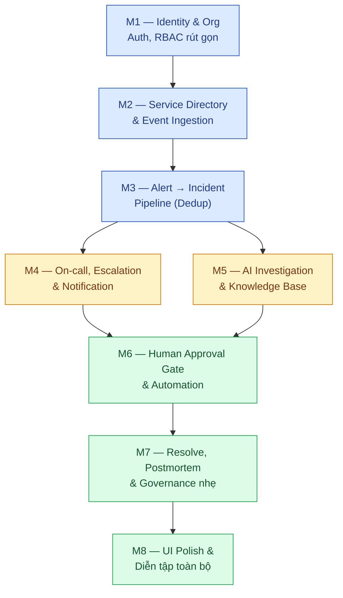
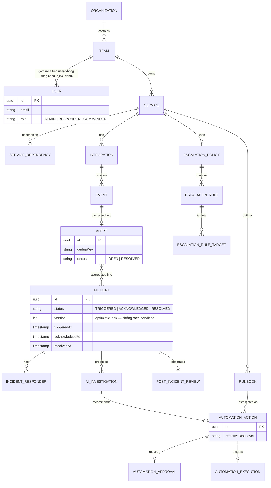

# NexusOps — MVP Scope cho Demo Báo cáo

## Phạm vi triển khai tối thiểu, kèm sơ đồ và code mẫu — đủ để cầm lên code theo

| | |
|---|---|
| **Phiên bản** | v2.0 — bổ sung sơ đồ Mermaid, ERD MVP, SQL DDL và code mẫu Java/Spring Boot cho từng Milestone |
| **Dựa trên** | `NexusOps_Software_Project_Plan_Architecture.md` (Draft v1.2, đã audit đầy đủ) và `NexusOps_Demo_Script.md` |
| **Stack giả định** | Java 21 + Spring Boot 3.x, PostgreSQL 16 (+ pgvector), Lombok — khớp stack đã chọn ở phần trao đổi trước |
| **Nguyên tắc chọn scope** | Cắt **bề rộng** (số lượng tính năng phụ), giữ nguyên **độ sâu đúng đắn** (idempotency, dedup, distributed-safety, audit trail) |
| **Kết quả phân loại** | 26/31 use case được xây (toàn phần hoặc rút gọn), 5/31 hoãn lại — đối chiếu §8.6 Ma trận Ưu tiên tài liệu gốc |

> Code trong tài liệu này là **code minh hoạ đúng pattern**, không phải bản build production hoàn chỉnh (thiếu exception handling đầy đủ, test, validation chi tiết...) — mục đích là để bạn thấy chính xác cơ chế cần cài đặt, không phải để copy-paste chạy thẳng không xem lại.

---

## 0. Lưu ý bắt buộc trước khi dùng kịch bản này

Kịch bản này viết cho **toàn bộ 8 Milestone** như thể mọi thứ đã build xong. Trước khi bắt đầu, hãy tự đánh dấu Milestone nào **đã code thật** và Milestone nào **còn phải làm**. **Tuyệt đối không thuyết trình như thể toàn bộ kiến trúc 31 use case đã chạy production** nếu MVP thực tế chưa tới đó — trả lời thẳng "phần này em mới thiết kế, chưa kịp code" khi giáo viên hỏi luôn tốt hơn bị phát hiện đang giả vờ.

---

## 1. Nguyên tắc chọn Scope

MVP không có nghĩa là "làm giả cho có". Ba quy tắc áp dụng xuyên suốt tài liệu này:

1. **Không bao giờ hạ thấp correctness của một cơ chế đã chọn làm.** Nếu một tính năng được đưa vào MVP, nó phải đúng như tài liệu kiến trúc đã audit — ví dụ dedup vẫn phải theo đúng `uniq_open_dedup` (chỉ alert đang mở), escalation vẫn phải re-validate trạng thái trước khi fire. Cái được phép cắt là **cơ chế hạ tầng** (Kafka → DB polling), không phải **tính đúng đắn nghiệp vụ**.
2. **Cắt được là những tính năng có thể bổ sung sau mà không phải thiết kế lại.** Ví dụ RBAC đầy đủ (Role/Permission động) có thể thay bằng một cột `role` cố định trên `users` — nâng cấp lên bảng động sau này không phá vỡ gì đã có.
3. **Mọi thứ giữ lại phải phục vụ trực tiếp một Act trong kịch bản demo, hoặc là điều kiện tiên quyết bắt buộc của một Act khác.**

---

## 2. Sơ đồ tổng quan 8 Milestone



**Điểm quan trọng cho việc chia việc trong team:** M4 (Escalation) và M5 (AI Investigation) **không phụ thuộc lẫn nhau** — cả hai chỉ cần M3 xong. Nếu team có ≥2 người, đây là điểm tách việc tự nhiên nhất: một người làm M4, một người làm M5 song song, gặp nhau ở M6. Đừng làm tuần tự M4 rồi mới M5 nếu có đủ người — phí thời gian.

---

## 3. Bảng Use Case MVP — đầy đủ / rút gọn / hoãn

### Nhóm A — Identity, Access & Organization

| UC | Tên | MVP | Ghi chú |
|---|---|---|---|
| UC-01 | Đăng ký / Đăng nhập | **Đầy đủ** | Bắt buộc cho mọi Act |
| UC-02 | Quản lý Role & Permission | **Rút gọn** | Thay `ROLE`/`PERMISSION`/`ROLE_PERMISSION` động bằng cột `role` cố định trên `users` (`ADMIN`, `RESPONDER`, `COMMANDER`) |
| UC-03 | Quản lý Organization & Team | **Rút gọn** | Seed sẵn 1 organization + 1 team qua migration |

### Nhóm B — Service Directory & Integration Layer

| UC | Tên | MVP | Ghi chú |
|---|---|---|---|
| UC-04 | Quản lý Service Directory | **Đầy đủ** | Cần CRUD thật |
| UC-05 | Định nghĩa Service Dependency | **Đầy đủ** | Cần cho blast-radius ở Act 4 |
| UC-06 | Cấu hình Integration & API Key | **Rút gọn** | 1 integration/service là đủ |
| UC-07 | Ingest Monitoring Event | **Đầy đủ, không cắt** | Lõi Act 1-2; idempotency + rate limiting đúng 100% |

### Nhóm C — Incident Response Pipeline

| UC | Tên | MVP | Ghi chú |
|---|---|---|---|
| UC-08 | Cấu hình Orchestration Rule | **Rút gọn** | Rule engine chạy thật (data-driven), UI đơn giản |
| UC-09 | Deduplicate & Group Alerts | **Đầy đủ, không cắt** | Đúng N1 audit fix — trọng tâm Act 2 |
| UC-10 | Tạo Incident | **Đầy đủ** | |
| UC-11 | Acknowledge Incident | **Đầy đủ** | |
| UC-12 | Escalate Incident | **Đầy đủ, cơ chế rút gọn** | DB polling thay Kafka+Redis — đúng Phase 2 đã audit |
| UC-13 | Quản lý Lịch On-call | **Rút gọn** | Gán tĩnh người trực |
| UC-14 | Override Schedule | **Hoãn** | Không nằm trong demo. (§8.6 gốc không nêu riêng mục này — quyết định hoãn là phán đoán mới, không suy ra trực tiếp từ §8.6) |
| UC-15 | Cấu hình Escalation Policy | **Rút gọn** | Form đơn giản: 2 level |
| UC-16 | Nhận Notification | **Rút gọn theo đúng thiết kế gốc** | Chỉ WebSocket/in-app — §3.3 đã ghi rõ đây là kênh MVP |
| UC-17 | Collaborate War Room | **Rút gọn** | Giữ Notes + Timeline, bỏ live chat UI |
| UC-18 | Đăng Status Update | **Hoãn** | Không dùng trong demo |
| UC-19 | Resolve Incident | **Đầy đủ, không cắt** | Cả thủ công lẫn auto-resolve |

### Nhóm D — Automation & AI Operations (không cắt)

| UC | Tên | MVP | Ghi chú |
|---|---|---|---|
| UC-20 | Thực thi Runbook | **Đầy đủ** | |
| UC-21 | Phê duyệt Remediation | **Đầy đủ, không cắt** | Trọng tâm Act 5-6 |
| UC-22 | AI Triage Alert | **Gộp với UC-23** | Gộp thành một lệnh gọi Agent |
| UC-23 | AI Investigate Incident | **Đầy đủ, không cắt** | Gọi tool thật, không mock cứng |
| UC-24 | Truy vấn Knowledge Base | **Rút gọn** | Seed 1-2 tài liệu vào PGVector |
| UC-25 | AI Generate Postmortem | **Đầy đủ** | |

### Nhóm E — Reliability Engineering & Governance

| UC | Tên | MVP | Ghi chú |
|---|---|---|---|
| UC-26 | Review & Approve PIR | **Rút gọn** | Xem + đổi trạng thái |
| UC-27 | Xem Analytics Dashboard | **Rút gọn** | Chỉ MTTA/MTTR |
| UC-28 | Cấu hình SLO | **Hoãn** | §8.6 xếp "Nice to have" |
| UC-29 | Quản lý Maintenance Window | **Hoãn** | Không dùng trong demo |
| UC-30 | Xem Audit Log | **Rút gọn** | List đơn giản theo `resourceId` |
| UC-31 | Quản lý Status Page | **Hoãn** | §8.6 xếp "Nice to have" |

**Tổng kết (đếm chính xác từ bảng trên):** 7 "Đầy đủ" + 5 "Đầy đủ, không cắt" + 1 "Đầy đủ, cơ chế rút gọn" + 11 "Rút gọn" + 1 "Rút gọn theo đúng thiết kế gốc" + 1 "Gộp với UC-23" + 5 "Hoãn" = **31/31**.

---

## 4. Data Model MVP

### 4.1 ERD rút gọn cho MVP



### 4.2 Đơn giản hoá (giữ ý nghĩa, giảm cấu trúc)

| Thay vì | MVP dùng | Vì sao vẫn đúng |
|---|---|---|
| `roles`, `permissions`, `user_roles`, `role_permissions` | Cột `role` trực tiếp trên `users` | Authorization vẫn enforce đúng ở middleware, chỉ không cấu hình động |
| `schedule_members`, `schedule_overrides` | Gán tĩnh 1-2 user vào `schedule_layers` | Đủ cho demo, override không dùng tới |
| Kafka + Redis distributed lock | DB polling + optimistic lock cột `version` | Đúng cơ chế Phase 2 đã audit, vẫn chống race condition đầy đủ |

### 4.3 Hoãn lại (không tạo bảng)

```
maintenance_windows, slo_configs, service_metrics
workflows, workflow_steps, workflow_executions
incident_subscribers
```

---

## 5. Giao diện (UI) cần đảm bảo — 11 màn hình

| # | Màn hình | Chức năng bắt buộc | Phục vụ Act |
|---|---|---|---|
| 1 | Đăng nhập | Form email/password, chuyển hướng theo role | Chuẩn bị |
| 2 | Service Directory | List + form tạo/sửa service, form thêm dependency | Chuẩn bị, Q&A |
| 3 | Escalation Policy config | Form 2 level, mỗi level chọn target + timeout | Chuẩn bị |
| 4 | On-call Schedule | Gán người trực (tĩnh là đủ) | Chuẩn bị |
| 5 | Incident List | Danh sách, lọc theo status/service, sắp theo severity | Act 2 |
| 6 | **Incident Detail** | Xem wireframe ở Mục 5.1 bên dưới | Act 2–7 |
| 7 | Notification Inbox (Responder) | List thông báo realtime qua WebSocket | Act 3 |
| 8 | Runbook management | List + form tạo (tên, riskLevel, requiresApproval, service) | Chuẩn bị, Act 6 |
| 9 | PIR Review | Xem bản draft, sửa nội dung, đổi trạng thái | Act 8 |
| 10 | Analytics mini | MTTA/MTTR cho incident/service đang chọn | Act 8 |
| 11 | Audit Log viewer | List theo `resourceId`, hiển thị actor/action/timestamp | Act 8 |

### 5.1 Wireframe — Incident Detail (màn hình quan trọng nhất)

```
┌─────────────────────────────────────────────────────────────────┐
│ INC-1001 · payment-service · P1              [TRIGGERED ▾]      │
│ Escalation: Level 1 (Responder A)   ⏱ 00:42 tới Level 2         │
├───────────────────────────────┬───────────────────────────────────┤
│ TIMELINE / NOTES               │  🤖 AI INVESTIGATION                │
│ ─────────────────────────────  │  ─────────────────────────────────  │
│ 10:00  Event received          │  Hypothesis:                        │
│ 10:00  Alert created           │  "Connection pool exhausted,        │
│ 10:00  Incident triggered      │   tương quan deploy v1.42"          │
│ 10:00  → Responder A notified  │  Confidence: 0.82                   │
│                                 │  Evidence: [deploy v1.42, 10' trước]│
│ [+ Thêm note...............]   │  Similar: INC-884 (RAG)             │
│                                 │                                      │
│                                 │  📋 ĐỀ XUẤT: Rollback v1.42→v1.41    │
│                                 │      Risk: 🔴 HIGH                   │
│                                 │  ┌─────────────┐ ┌────────────────┐ │
│                                 │  │ ✅ Approve  │ │ ❌ Reject      │ │
│                                 │  └─────────────┘ └────────────────┘ │
├───────────────────────────────┴───────────────────────────────────┤
│ Responders: Responder A          [ Acknowledge ]  [ Resolve ]      │
└─────────────────────────────────────────────────────────────────┘
```

Ba khối bắt buộc: **đồng hồ escalation** (chứng minh Act 3), **panel AI kèm nút Approve/Reject** (chứng minh Act 4-5, nút chỉ hiện khi `effectiveRiskLevel = HIGH` và user có quyền `AUTOMATION_EXECUTE`), **nút Acknowledge/Resolve** (chứng minh Act 3, 7).

---

## 6. Lộ trình xây dựng — 8 Milestone kèm SQL & Code mẫu

Mỗi milestone: **SQL DDL** → **Code mẫu Java/Spring Boot minh hoạ đúng pattern** → **Checkpoint kiểm chứng được**.

### Milestone 1 — Nền tảng danh tính & tổ chức

**UC:** 01, 02 (rút gọn), 03 (rút gọn)

```sql
CREATE TABLE organizations (
    id UUID PRIMARY KEY DEFAULT gen_random_uuid(),
    name VARCHAR(255) NOT NULL
);

CREATE TABLE teams (
    id UUID PRIMARY KEY DEFAULT gen_random_uuid(),
    organization_id UUID NOT NULL REFERENCES organizations(id),
    name VARCHAR(255) NOT NULL
);

CREATE TABLE users (
    id UUID PRIMARY KEY DEFAULT gen_random_uuid(),
    team_id UUID REFERENCES teams(id),
    email VARCHAR(255) UNIQUE NOT NULL,
    password_hash VARCHAR(255) NOT NULL,
    display_name VARCHAR(255),
    role VARCHAR(20) NOT NULL CHECK (role IN ('ADMIN','RESPONDER','COMMANDER')),
    created_at TIMESTAMPTZ NOT NULL DEFAULT now()
);
```

```java
// SecurityConfig.java — enforce theo permission code (§6.1), rút gọn còn 3 role cố định
@Configuration
@EnableMethodSecurity
public class SecurityConfig {

    @Bean
    SecurityFilterChain filterChain(HttpSecurity http) throws Exception {
        http.authorizeHttpRequests(auth -> auth
                .requestMatchers("/auth/**").permitAll()
                .requestMatchers("/api/v1/events").permitAll() // xác thực riêng bằng integration key
                .requestMatchers(HttpMethod.POST, "/automation/*/approve")
                    .hasAnyRole("RESPONDER", "COMMANDER")
                .anyRequest().authenticated())
            .oauth2ResourceServer(oauth -> oauth.jwt(Customizer.withDefaults()));
        return http.build();
    }
}

// User.java (entity)
@Entity @Table(name = "users")
@Getter @Setter
public class User {
    @Id @GeneratedValue
    private UUID id;

    @ManyToOne
    @JoinColumn(name = "team_id")
    private Team team;

    private String email;
    private String passwordHash;
    private String displayName;

    @Enumerated(EnumType.STRING)
    private Role role; // ADMIN, RESPONDER, COMMANDER — rút gọn từ RBAC động
}
```

**Checkpoint:** Đăng nhập được cả 2 tài khoản demo; gọi `POST /automation/{id}/approve` bằng token role `RESPONDER` thành công, bằng token không có role phù hợp bị từ chối `403`.

---

### Milestone 2 — Service Directory & Event Ingestion

**UC:** 04, 05, 06, 07

```sql
CREATE TABLE services (
    id UUID PRIMARY KEY DEFAULT gen_random_uuid(),
    team_id UUID NOT NULL REFERENCES teams(id),
    name VARCHAR(255) NOT NULL,
    criticality VARCHAR(30) NOT NULL DEFAULT 'OPERATIONAL',
    status VARCHAR(30) NOT NULL DEFAULT 'OPERATIONAL'
);

CREATE TABLE service_dependencies (
    id UUID PRIMARY KEY DEFAULT gen_random_uuid(),
    service_id UUID NOT NULL REFERENCES services(id),
    depends_on_service_id UUID NOT NULL REFERENCES services(id)
);

CREATE TABLE integrations (
    id UUID PRIMARY KEY DEFAULT gen_random_uuid(),
    service_id UUID NOT NULL REFERENCES services(id),
    api_key VARCHAR(255) UNIQUE NOT NULL
);

CREATE TABLE idempotency_keys (
    key VARCHAR(255) PRIMARY KEY,
    request_hash VARCHAR(64) NOT NULL,
    response_body JSONB NOT NULL,
    created_at TIMESTAMPTZ NOT NULL DEFAULT now()
);

CREATE TABLE events (
    id UUID PRIMARY KEY DEFAULT gen_random_uuid(),
    integration_id UUID NOT NULL REFERENCES integrations(id),
    event_type VARCHAR(30) NOT NULL,
    dedup_key VARCHAR(255) NOT NULL,
    severity VARCHAR(20),
    received_at TIMESTAMPTZ NOT NULL DEFAULT now()
);
```

```java
// EventIngestionController.java — đúng cơ chế idempotency đã audit ở §2.6/4.7.5
@RestController
@RequestMapping("/api/v1")
@RequiredArgsConstructor
public class EventIngestionController {

    private final IntegrationService integrationService;
    private final IdempotencyKeyRepository idempotencyRepo;
    private final RateLimiterService rateLimiter;
    private final EventService eventService;

    @PostMapping("/events")
    public ResponseEntity<?> ingest(
            @RequestHeader("Authorization") String apiKey,
            @RequestHeader("Idempotency-Key") String idempotencyKey,
            @RequestBody EventRequest request) {

        Integration integration = integrationService.resolveByApiKey(apiKey);

        if (!rateLimiter.tryAcquire(integration.getId())) {
            return ResponseEntity.status(429)
                .body(ErrorResponse.of("RATE_LIMIT_EXCEEDED", "Vượt quá 100 request/giây"));
        }

        String requestHash = DigestUtils.sha256Hex(request.toString());
        Optional<IdempotencyKeyEntity> existing = idempotencyRepo.findById(idempotencyKey);

        if (existing.isPresent()) {
            if (!existing.get().getRequestHash().equals(requestHash)) {
                return ResponseEntity.status(409).body(ErrorResponse.of(
                    "IDEMPOTENCY_KEY_REUSED_WITH_DIFFERENT_BODY",
                    "Idempotency-Key đã dùng với body khác"));
            }
            return ResponseEntity.ok(existing.get().getResponseBody()); // trả kết quả cũ, không xử lý lại
        }

        EventResponse response = eventService.process(integration, request);

        // INSERT ... ON CONFLICT DO NOTHING ở tầng repository — an toàn cả khi 2 request đua nhau
        idempotencyRepo.insertIfAbsent(idempotencyKey, requestHash, response);

        return ResponseEntity.ok(response);
    }
}
```

**Ví dụ gọi thử:**
```bash
curl -X POST http://localhost:8080/api/v1/events \
  -H "Authorization: Bearer <integration-key>" \
  -H "Idempotency-Key: payment-cpu-high-001" \
  -H "Content-Type: application/json" \
  -d '{"service":"payment-service","eventType":"CPU_HIGH","severity":"critical","dedupKey":"payment-cpu-high"}'
```

**Checkpoint:** Gửi 3 lần cùng `Idempotency-Key` → chỉ 1 hiệu ứng phụ xảy ra; gửi vượt rate limit → `429`.

---

### Milestone 3 — Alert → Incident Pipeline

**UC:** 08, 09, 10

```sql
CREATE TABLE orchestration_rules (
    id UUID PRIMARY KEY DEFAULT gen_random_uuid(),
    service_id UUID REFERENCES services(id),
    condition_field VARCHAR(50),
    condition_operator VARCHAR(20),
    condition_value VARCHAR(255),
    action VARCHAR(30) -- ROUTE | SUPPRESS | CREATE_INCIDENT
);

CREATE TABLE alerts (
    id UUID PRIMARY KEY DEFAULT gen_random_uuid(),
    service_id UUID NOT NULL REFERENCES services(id),
    dedup_key VARCHAR(255) NOT NULL,
    severity VARCHAR(20),
    status VARCHAR(20) NOT NULL DEFAULT 'OPEN',
    created_at TIMESTAMPTZ NOT NULL DEFAULT now(),
    resolved_at TIMESTAMPTZ
);

-- Đúng fix N1: dedup chỉ áp dụng cho alert ĐANG MỞ
CREATE UNIQUE INDEX uniq_open_dedup
  ON alerts (service_id, dedup_key)
  WHERE status <> 'RESOLVED';

CREATE TABLE incidents (
    id UUID PRIMARY KEY DEFAULT gen_random_uuid(),
    service_id UUID NOT NULL REFERENCES services(id),
    incident_number VARCHAR(20) UNIQUE,
    status VARCHAR(20) NOT NULL DEFAULT 'TRIGGERED',
    priority VARCHAR(10),
    escalation_level INT NOT NULL DEFAULT 1,
    version INT NOT NULL DEFAULT 0,  -- optimistic lock
    escalate_at TIMESTAMPTZ,
    triggered_at TIMESTAMPTZ NOT NULL DEFAULT now(),
    acknowledged_at TIMESTAMPTZ,
    resolved_at TIMESTAMPTZ
);
```

```java
// DedupService.java — đây là đoạn code dễ viết sai nhất trong toàn bộ MVP, viết cẩn thận
@Service
@RequiredArgsConstructor
public class DedupService {

    private final AlertRepository alertRepo;

    @Transactional
    public Alert processEvent(Event event) {
        // Chỉ tìm alert CÙNG dedupKey và ĐANG MỞ — đúng fix N1
        Optional<Alert> openAlert = alertRepo
            .findByServiceIdAndDedupKeyAndStatusNot(event.getServiceId(), event.getDedupKey(), "RESOLVED");

        if (openAlert.isPresent()) {
            Alert alert = openAlert.get();
            alert.setOccurrenceCount(alert.getOccurrenceCount() + 1);
            return alertRepo.save(alert); // -> publish AlertDeduplicated
        }

        // KHÔNG có alert mở — kể cả khi có alert CŨ đã RESOLVED cùng key,
        // vẫn phải tạo alert MỚI. Đây chính là nhánh hay bị code sai nếu
        // lỡ check "đã từng tồn tại dedupKey chưa" thay vì "đang mở hay không".
        Alert newAlert = new Alert();
        newAlert.setServiceId(event.getServiceId());
        newAlert.setDedupKey(event.getDedupKey());
        newAlert.setSeverity(event.getSeverity());
        newAlert.setStatus("OPEN");
        return alertRepo.save(newAlert); // -> publish AlertCreated, unique index tự bảo vệ khỏi race
    }
}
```

**Checkpoint:** Gửi event trùng `dedupKey` khi alert đang mở → gộp vào alert cũ; gửi lại sau khi alert đã `RESOLVED` → tạo alert mới (test cả 2 nhánh, đừng chỉ test 1).

---

### Milestone 4 — On-call, Escalation, Notification

**UC:** 13, 15, 11, 12, 16 *(thứ tự đã sửa: cấu hình schedule/policy phải có trước khi escalate dùng tới)*

```sql
CREATE TABLE schedules (
    id UUID PRIMARY KEY DEFAULT gen_random_uuid(),
    team_id UUID NOT NULL REFERENCES teams(id)
);

CREATE TABLE schedule_layers (
    id UUID PRIMARY KEY DEFAULT gen_random_uuid(),
    schedule_id UUID NOT NULL REFERENCES schedules(id),
    user_id UUID NOT NULL REFERENCES users(id) -- gán tĩnh cho MVP, không cần rotation
);

CREATE TABLE escalation_policies (
    id UUID PRIMARY KEY DEFAULT gen_random_uuid(),
    service_id UUID NOT NULL REFERENCES services(id)
);

CREATE TABLE escalation_rules (
    id UUID PRIMARY KEY DEFAULT gen_random_uuid(),
    escalation_policy_id UUID NOT NULL REFERENCES escalation_policies(id),
    level_order INT NOT NULL,
    timeout_minutes INT NOT NULL
);

CREATE TABLE escalation_rule_targets (
    id UUID PRIMARY KEY DEFAULT gen_random_uuid(),
    escalation_rule_id UUID NOT NULL REFERENCES escalation_rules(id),
    target_type VARCHAR(20) NOT NULL, -- USER | SCHEDULE | TEAM
    target_id UUID NOT NULL
);

CREATE TABLE notification_deliveries (
    id UUID PRIMARY KEY DEFAULT gen_random_uuid(),
    incident_id UUID NOT NULL REFERENCES incidents(id),
    target_user_id UUID NOT NULL REFERENCES users(id),
    channel VARCHAR(20) NOT NULL DEFAULT 'WEBSOCKET',
    status VARCHAR(20) NOT NULL DEFAULT 'SENT',
    sent_at TIMESTAMPTZ NOT NULL DEFAULT now()
);

-- Phát hiện lúc tự kiểm tra: bảng này có trong ERD (Mục 4.1) nhưng thiếu ở bản nháp
-- đầu — cần cho UC-11 (ai đang xử lý incident) và khối "Responders" ở wireframe 5.1
CREATE TABLE incident_responders (
    id UUID PRIMARY KEY DEFAULT gen_random_uuid(),
    incident_id UUID NOT NULL REFERENCES incidents(id),
    user_id UUID NOT NULL REFERENCES users(id),
    assigned_at TIMESTAMPTZ NOT NULL DEFAULT now()
);
```

```java
// EscalationScheduler.java — đúng cơ chế Phase 1-2 (DB polling), kèm fencing token N2/N3
@Component
@RequiredArgsConstructor
@Slf4j
public class EscalationScheduler {

    private final IncidentRepository incidentRepo;
    private final NotificationService notificationService;

    @Scheduled(fixedDelay = 5000) // Phase 1-2: chưa cần Kafka/Redis
    @Transactional
    public void checkDueEscalations() {
        List<Incident> due = incidentRepo.findDueForEscalationSkipLocked(Instant.now());
        due.forEach(this::escalateOne);
    }

    private void escalateOne(Incident incident) {
        // Optimistic lock — nếu responder vừa ACK, version đã đổi, update ảnh hưởng 0 dòng
        int updated = incidentRepo.escalateIfStillTriggered(incident.getId(), incident.getVersion());

        if (updated == 0) {
            log.info("Incident {} đã được ACK trước khi escalate kịp chạy — bỏ qua (tránh phantom escalation)",
                incident.getId());
            return;
        }
        notificationService.notifyLevel(incident.getId(), incident.getEscalationLevel() + 1);
    }
}

// IncidentRepository.java (trích đoạn liên quan)
public interface IncidentRepository extends JpaRepository<Incident, UUID> {

    @Query(value = """
        SELECT * FROM incidents
        WHERE status = 'TRIGGERED' AND escalate_at <= :now
        FOR UPDATE SKIP LOCKED
        LIMIT 100
        """, nativeQuery = true)
    List<Incident> findDueForEscalationSkipLocked(@Param("now") Instant now);

    @Modifying
    @Query(value = """
        UPDATE incidents
        SET escalation_level = escalation_level + 1, version = version + 1
        WHERE id = :id AND version = :expectedVersion AND status = 'TRIGGERED'
        """, nativeQuery = true)
    int escalateIfStillTriggered(@Param("id") UUID id, @Param("expectedVersion") int expectedVersion);
}
```

**Checkpoint:** Tạo incident không ACK → sau timeout tự escalate lên Level 2; tạo incident khác và ACK ngay trước timeout → escalation dừng đúng lúc, không page thừa (test race condition thủ công ít nhất 1 lần — dựng 2 request gần như đồng thời).

---

### Milestone 5 — AI Investigation & Knowledge Base

**UC:** 24, 22+23 (gộp) *(Knowledge Base phải seed/query được trước vì UC-23 gọi UC-24 như một bước con)*

```sql
CREATE EXTENSION IF NOT EXISTS vector;

CREATE TABLE knowledge_chunks (
    id UUID PRIMARY KEY DEFAULT gen_random_uuid(),
    content TEXT NOT NULL,
    embedding VECTOR(1536)
);

CREATE TABLE ai_investigations (
    id UUID PRIMARY KEY DEFAULT gen_random_uuid(),
    incident_id UUID NOT NULL REFERENCES incidents(id),
    hypothesis TEXT,
    confidence_score FLOAT,
    created_at TIMESTAMPTZ NOT NULL DEFAULT now()
);

CREATE TABLE ai_tool_calls (
    id UUID PRIMARY KEY DEFAULT gen_random_uuid(),
    ai_investigation_id UUID NOT NULL REFERENCES ai_investigations(id),
    tool_name VARCHAR(100),
    input JSONB,
    output JSONB,
    called_at TIMESTAMPTZ NOT NULL DEFAULT now()
);
```

```java
// AIInvestigationService.java — vòng lặp tool-calling thật, đúng sequence diagram 4.7.7
@Service
@RequiredArgsConstructor
public class AIInvestigationService {

    private static final int MAX_TOOL_ROUNDS = 6;

    private final ChatClient chatClient; // ví dụ Spring AI ChatClient
    private final ToolRegistry toolRegistry;
    private final AiToolCallRepository toolCallRepo;

    public AiInvestigation investigate(Incident incident) {
        List<Message> conversation = new ArrayList<>();
        conversation.add(new SystemMessage("Bạn là AI Investigation Agent cho NexusOps..."));
        conversation.add(new UserMessage("Điều tra incident: " + incident.getSummary()));

        for (int round = 0; round < MAX_TOOL_ROUNDS; round++) {
            ChatResponse response = chatClient.call(conversation, toolRegistry.getToolSpecs());

            if (!response.hasToolCalls()) {
                return saveResult(incident, response.getText());
            }
            for (ToolCall call : response.getToolCalls()) {
                Object result = toolRegistry.execute(call.getName(), call.getArguments());
                toolCallRepo.log(incident.getId(), call.getName(), call.getArguments(), result);
                conversation.add(new ToolResultMessage(call.getId(), result));
            }
        }
        throw new IllegalStateException("Vượt quá số vòng lặp tool-calling cho phép");
    }
}

// ToolRegistry.java (trích đoạn — chỉ 3 tool tối thiểu cho demo)
@Component
@RequiredArgsConstructor
public class ToolRegistry {

    private final DeploymentRepository deploymentRepo;
    private final KnowledgeSearchService ragService;

    public Object execute(String toolName, Map<String, Object> args) {
        return switch (toolName) {
            case "getRecentDeployments" -> deploymentRepo.findRecent((UUID) args.get("serviceId"));
            case "searchPastIncidents" -> ragService.search((String) args.get("query"));
            default -> throw new IllegalArgumentException("Tool không tồn tại: " + toolName);
        };
    }
}
```

**Truy vấn RAG (pgvector):**
```sql
SELECT id, content, 1 - (embedding <=> :queryEmbedding) AS similarity
FROM knowledge_chunks
ORDER BY embedding <=> :queryEmbedding
LIMIT 5;
```

**Checkpoint:** Với incident demo đã seed deployment + knowledge base, AI trả về đúng root-cause tương quan với deploy giả lập và tìm ra đúng incident cũ đã seed — không phải câu trả lời chung chung không có căn cứ.

---

### Milestone 6 — Human Approval Gate & Automation

**UC:** 20, 21 + `automation_rate_limits`

```sql
CREATE TABLE runbooks (
    id UUID PRIMARY KEY DEFAULT gen_random_uuid(),
    service_id UUID NOT NULL REFERENCES services(id),
    name VARCHAR(255),
    risk_level VARCHAR(10),       -- LOW | HIGH (tĩnh)
    requires_approval BOOLEAN NOT NULL DEFAULT false
);

CREATE TABLE automation_actions (
    id UUID PRIMARY KEY DEFAULT gen_random_uuid(),
    runbook_id UUID NOT NULL REFERENCES runbooks(id),
    incident_id UUID NOT NULL REFERENCES incidents(id),
    effective_risk_level VARCHAR(10)
);

CREATE TABLE automation_approvals (
    id UUID PRIMARY KEY DEFAULT gen_random_uuid(),
    automation_action_id UUID NOT NULL REFERENCES automation_actions(id),
    approved_by UUID REFERENCES users(id),
    decision VARCHAR(10),         -- APPROVED | REJECTED
    evidence_snapshot_ref TEXT,
    decided_at TIMESTAMPTZ
);

CREATE TABLE automation_executions (
    id UUID PRIMARY KEY DEFAULT gen_random_uuid(),
    automation_action_id UUID NOT NULL REFERENCES automation_actions(id),
    status VARCHAR(10),
    executed_at TIMESTAMPTZ
);

CREATE TABLE automation_rate_limits (
    service_id UUID NOT NULL,
    runbook_id UUID NOT NULL,
    window_start TIMESTAMPTZ NOT NULL,
    execution_count INT NOT NULL DEFAULT 0,
    PRIMARY KEY (service_id, runbook_id, window_start)
);
```

```java
// AutomationService.java — đúng công thức effectiveRiskLevel đã audit ở §3.4
@Service
@RequiredArgsConstructor
public class AutomationService {

    private final AutomationRateLimitRepository rateLimitRepo;
    private final AutomationActionRepository actionRepo;
    private final ApprovalService approvalService;

    public String computeEffectiveRiskLevel(Runbook runbook, Service service, int recentExecutions) {
        if (recentExecutions >= 2) return "HIGH";                      // circuit breaker override
        if ("MAJOR_INCIDENT".equals(service.getCriticality())) return "HIGH"; // service criticality
        return runbook.getRiskLevel();                                 // giữ nguyên nếu không bị nâng
    }

    @Transactional
    public void requestExecution(Incident incident, Runbook runbook) {
        int recentCount = rateLimitRepo.countRecentExecutions(
            runbook.getServiceId(), runbook.getId(), Instant.now().minus(15, ChronoUnit.MINUTES));

        String effectiveRisk = computeEffectiveRiskLevel(runbook, incident.getService(), recentCount);
        AutomationAction action = actionRepo.save(AutomationAction.of(runbook, incident, effectiveRisk));

        if (runbook.isRequiresApproval() || "HIGH".equals(effectiveRisk)) {
            approvalService.requestApproval(action); // chờ người duyệt — không tự chạy
        } else {
            execute(action); // LOW risk, đã pre-authorize
        }
    }

    private void execute(AutomationAction action) {
        // TODO: gọi hành động thật (ví dụ rollback) — với demo có thể chỉ update 1 field giả lập
        rateLimitRepo.incrementCurrentWindow(action.getRunbook().getServiceId(), action.getRunbook().getId());
    }
}
```

**Test nhanh circuit breaker (dùng lại đúng ở Act 6 của Demo Script):**
```bash
for i in 1 2 3; do
  curl -X POST http://localhost:8080/runbooks/<id>/execute -H "Authorization: Bearer <commander-token>"
done
# Lần 3 phải bị chặn / yêu cầu approval bổ sung
```

**Checkpoint:** Risk HIGH bị chặn đúng, chỉ chạy sau khi approve; gọi thực thi runbook 3 lần liên tiếp trong 15 phút → lần thứ 3 bị chặn bởi circuit breaker.

---

### Milestone 7 — Resolve, Postmortem, Governance nhẹ

**UC:** 19, 25, 26 (rút gọn), 27 (rút gọn), 30 (rút gọn)

```sql
CREATE TABLE post_incident_reviews (
    id UUID PRIMARY KEY DEFAULT gen_random_uuid(),
    incident_id UUID NOT NULL REFERENCES incidents(id),
    summary TEXT,
    root_cause TEXT,
    status VARCHAR(20) NOT NULL DEFAULT 'DRAFT'
);

CREATE TABLE audit_logs (
    id UUID PRIMARY KEY DEFAULT gen_random_uuid(),
    actor_id UUID REFERENCES users(id),
    action VARCHAR(100),
    resource_type VARCHAR(50),
    resource_id UUID,
    created_at TIMESTAMPTZ NOT NULL DEFAULT now()
);
```

```java
// ResolveService.java — cả 2 nhánh resolve, đúng fix §3.3
@Service
@RequiredArgsConstructor
public class ResolveService {

    private final AlertRepository alertRepo;
    private final IncidentService incidentService;

    // Nhánh 1 — thủ công
    public void resolveManually(UUID incidentId) {
        incidentService.markResolved(incidentId);
    }

    // Nhánh 2 — auto-resolve, gọi từ EventIngestionController khi eventType = RESOLVE
    public void handleResolveEvent(Event event) {
        alertRepo.findByServiceIdAndDedupKeyAndStatusNot(
            event.getServiceId(), event.getDedupKey(), "RESOLVED"
        ).ifPresent(alert -> {
            alert.setStatus("RESOLVED");
            alert.setResolvedAt(Instant.now());
            alertRepo.save(alert);
            incidentService.autoResolveByAlert(alert.getId());
        });
    }
}
```

**Truy vấn MTTA/MTTR (dùng thẳng cho màn Analytics mini):**
```sql
SELECT
    AVG(EXTRACT(EPOCH FROM (acknowledged_at - triggered_at))) AS mtta_seconds,
    AVG(EXTRACT(EPOCH FROM (resolved_at - triggered_at))) AS mttr_seconds
FROM incidents
WHERE service_id = :serviceId AND resolved_at IS NOT NULL;
```

**Checkpoint:** Gửi event `RESOLVE` cùng `dedupKey` → incident tự `RESOLVED` không cần bấm nút; MTTA/MTTR hiển thị đúng số; tra được audit log của đúng incident vừa demo.

---

### Milestone 8 — War Room nhẹ & UI Polish

**UC:** 17 (rút gọn)

```sql
-- Phát hiện lúc tự kiểm tra: bảng này cũng có trong ERD nhưng thiếu ở bản nháp đầu —
-- cần cho khối "TIMELINE / NOTES" ở wireframe 5.1
CREATE TABLE incident_notes (
    id UUID PRIMARY KEY DEFAULT gen_random_uuid(),
    incident_id UUID NOT NULL REFERENCES incidents(id),
    author_id UUID NOT NULL REFERENCES users(id),
    content TEXT NOT NULL,
    created_at TIMESTAMPTZ NOT NULL DEFAULT now()
);
```

**Việc làm:** Hoàn thiện Incident Notes/Timeline trên UI theo đúng wireframe ở Mục 5.1, rà soát lại toàn bộ 11 màn hình cho mượt, nhất quán màu sắc/trạng thái (ví dụ: `TRIGGERED` = đỏ, `ACKNOWLEDGED` = vàng, `RESOLVED` = xanh — dùng nhất quán trên mọi màn, không đổi màu tuỳ ý giữa Incident List và Incident Detail).

**Checkpoint:** Chạy thử trọn vẹn cả 9 Act của Demo Script không bị lỗi UI, không có màn nào thiếu dữ liệu hiển thị.

---

## 7. Đối chiếu Milestone ↔ Act trong Demo Script

| Milestone | Mở khoá Act nào |
|---|---|
| 1–2 | Chuẩn bị (đăng nhập, seed dữ liệu) |
| 3 | Act 1–2 |
| 4 | Act 3 |
| 5 | Act 4 |
| 6 | Act 5–6 |
| 7 | Act 7–8 |
| 8 | Toàn bộ — polish cuối |

Nếu team hết thời gian giữa chừng, **dừng đúng sau một Milestone hoàn chỉnh**, không dừng giữa milestone — một Milestone dở dang nghĩa là một Act demo sẽ gãy hoàn toàn.

---

## 8. Tự kiểm tra sau khi viết

- Đối chiếu toàn bộ 31 use case: đã phân loại đủ 31/31 (đếm trực tiếp bằng script: 7 "Đầy đủ" + 5 "Đầy đủ, không cắt" + 1 "Đầy đủ, cơ chế rút gọn" + 11 "Rút gọn" + 1 "Rút gọn theo đúng thiết kế gốc" + 1 "Gộp với UC-23" + 5 "Hoãn" = 31/31, khớp đúng — không lặp lại lỗi số học của bản trước).
- Mọi UC "hoãn" đã grep xác nhận không xuất hiện trong 9 Act của Demo Script (5/5, đếm = 0 cho cả UC-14/18/28/29/31). Về căn cứ: chỉ 2/5 (UC-28, UC-31) truy được trực tiếp từ dòng "Nice to have" ở §8.6 gốc; 3/5 còn lại là phán đoán mới, đã ghi rõ trong bảng ở Mục 3.
- Thứ tự UC trong Milestone 4 và 5 đã sửa lại đúng theo phụ thuộc dữ liệu thật.
- **Đối chiếu chéo ERD (Mục 4.1) với toàn bộ `CREATE TABLE` trong 8 Milestone — tìm ra 2 bảng có trong ERD nhưng chưa từng được tạo:**
  - `incident_responders` — dùng trong wireframe 5.1 (khối "Responders") và cần cho UC-11, nhưng bản nháp đầu không có `CREATE TABLE` nào cho nó. Đã bổ sung vào Milestone 4.
  - `incident_notes` — dùng trong wireframe 5.1 (khối "TIMELINE / NOTES") và UC-17, cũng thiếu tương tự. Đã bổ sung vào Milestone 8.
  Đây là lỗi thật, tìm được bằng cách chạy script đối chiếu tên bảng, không phải chỉ đọc lại bằng mắt — nêu ra để minh bạch, không che giấu.
- Toàn bộ tên bảng/field còn lại trong SQL DDL (`uniq_open_dedup`, `effective_risk_level`, `automation_rate_limits`, `evidence_snapshot_ref`, `triggered_at`/`acknowledged_at`/`resolved_at`, `version`) đối chiếu khớp chính xác tên đã dùng trong tài liệu kiến trúc gốc §5.3 và §2.6.
- Code Java kiểm tra logic từng đoạn: `DedupService` đúng nhánh N1 (alert cũ RESOLVED vẫn tạo mới); `EscalationScheduler` đúng nhánh N2/N3 (update ảnh hưởng 0 dòng → bỏ qua, không throw lỗi); `AutomationService.computeEffectiveRiskLevel` đúng thứ tự ưu tiên circuit breaker → service criticality → risk tĩnh runbook, khớp công thức `max(...)` đã mô tả ở §3.4.
- Sơ đồ Mermaid (milestone dependency, ERD) đã kiểm tra cú pháp và số lượng block (2/2 hợp lệ: 1 flowchart, 1 erDiagram).
- Wireframe Incident Detail đối chiếu đủ 3 khối bắt buộc (đồng hồ escalation, panel AI + nút Approve/Reject, nút Acknowledge/Resolve) — và giờ cả 2 khối dữ liệu nó cần (`incident_responders`, `incident_notes`) đều có bảng thật đứng sau.
