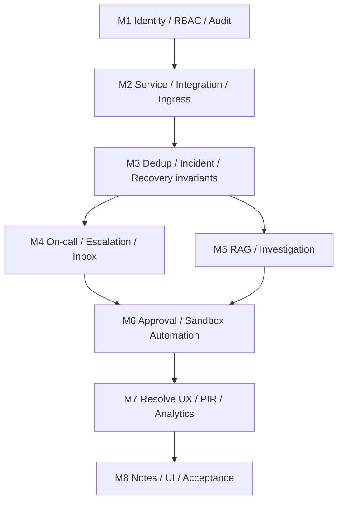
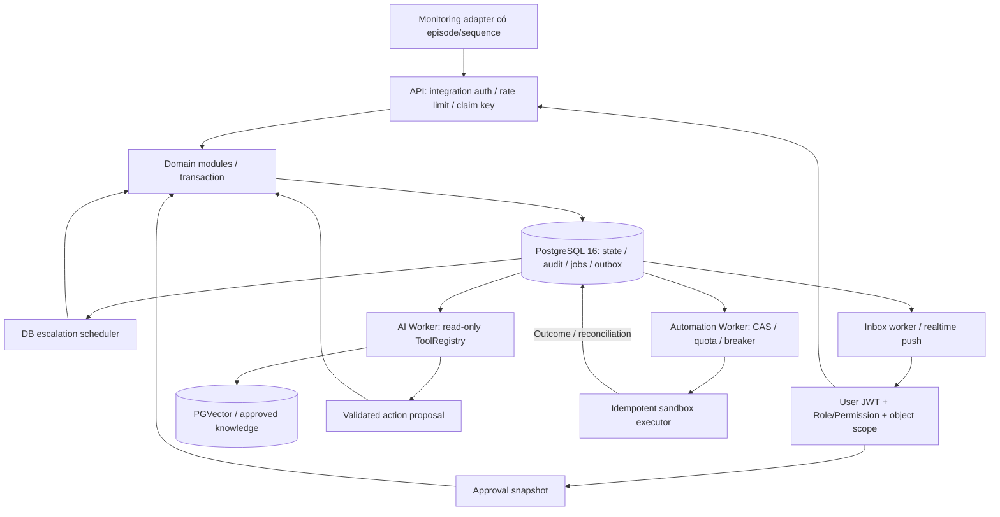
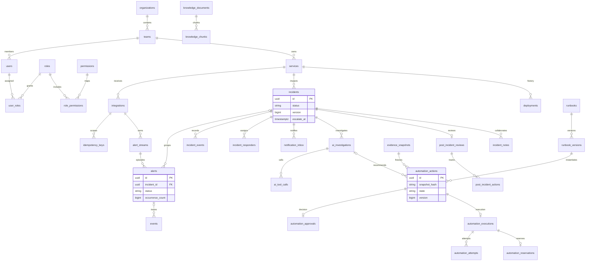
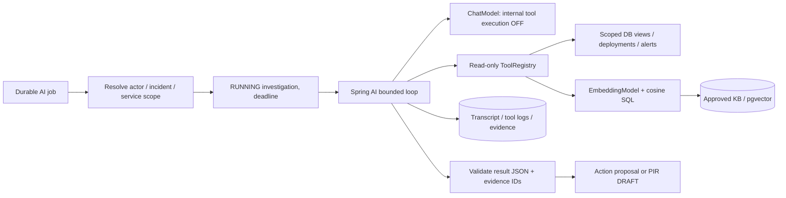
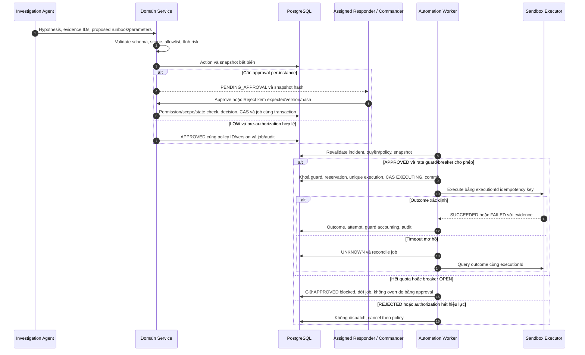

# MVP.md

## 1. Baseline và nguyên tắc bắt buộc

**NexusOps MVP v3 — 25/09/2026.** Căn cứ: `README (1).md` Draft v1.3 và `MVP Scope (1).md` v2.0. Khi khác nhau, giữ invariant của README v1.3; code cũ trong Scope không được xem là đặc tả đã kiểm chứng.

Stack: **Java 21, Spring Boot 3.x, PostgreSQL 16, pgvector**, Spring Security phân quyền theo Role → Permission và object scope. Một organization/team, Modular Monolith, DB-backed jobs và outbox; Kafka/Redis hoãn khỏi baseline. Giữ correctness, rút gọn UI và breadth. README là roadmap; “Đầy đủ” dưới đây nghĩa là đủ hợp đồng UC trong baseline, không đồng nghĩa production-ready.

Các invariant:

1. PostgreSQL là source of truth. Domain state, timeline, audit và job/outbox phải commit cùng transaction; gửi mạng sau commit.
2. Idempotency namespace `(integration_id,key)`; claim trước xử lý, hash canonical body/method/path, replay response sau commit. `dedupKey` không thay Idempotency-Key.
3. Chỉ dedup alert `OPEN`; counter tăng SQL nguyên tử. Alert thuộc tối đa một incident. Grouping baseline trong cùng service theo rule/window; incident RESOLVED không nhận alert OPEN.
4. Mọi mutation alert/group/resolve khoá service trước, rồi incident theo ID; `version` bảo vệ CAS. DB version không tự là Fencing Token cho executor bên ngoài.
5. Recovery cần `episodeId` và `sourceSequence` tăng theo stream dedup xuyên episode. Auto-resolve incident chỉ khi mọi alert liên kết đã resolved; manual resolve đóng các alert/episode còn mở cùng transaction.
6. HIGH, requiresApproval, hoặc thiếu pre-authorization hợp lệ đều cần approval per-instance. Approval gắn snapshot bất biến; AI không có tool thực thi.
7. Rate guard hard stop: tối đa hai reservation trong sliding window 15 phút. Approval không override. Circuit Breaker riêng, lưu bền.
8. Single-tenant không đồng nghĩa đã an toàn multi-tenant. Logs/RAG/AI output đều là dữ liệu không tin cậy. Secrets không đi vào evidence.

## 2. Ma trận 31 Use Case và 8 Milestone

| UC | Năng lực | Trạng thái | Milestone / ranh giới |
|---|---|---|---|
| UC-01 | Đăng ký/đăng nhập | Đầy đủ | M1; đăng ký theo invitation, login/refresh/logout |
| UC-02 | Role/Permission | Rút gọn | M1; bảng RBAC seed, chưa có role designer |
| UC-03 | Organization/Team | Rút gọn | M1; seed một org/team, vẫn kiểm tra membership |
| UC-04 | Service Directory | Đầy đủ | M2; CRUD, disable thay hard-delete |
| UC-05 | Service Dependency | Đầy đủ | M2; directed graph, kiểm tra quyền hai đầu |
| UC-06 | Integration/API key | Rút gọn | M2; một integration/service, key chỉ hiển thị lúc tạo |
| UC-07 | Ingestion | Đầy đủ | M2→M3; auth, rate limit, idempotency/episode |
| UC-08 | Orchestration | Rút gọn | M3; rule data-driven allowlist, không DSL tuỳ ý |
| UC-09 | Dedup/Grouping | Rút gọn | M3; đầy đủ safety, grouping cùng service/rule/window; không AI grouping |
| UC-10 | Tạo Incident | Đầy đủ | M3; alert/link/incident/job nguyên tử |
| UC-11 | ACK | Đầy đủ | M4; CAS, first ACK, cancel timer |
| UC-12 | Escalation | Đầy đủ | M4; DB polling, repeat/deadline/backstop hữu hạn |
| UC-13 | On-call Schedule | Rút gọn | M4; gán tĩnh, chưa rotation/DST |
| UC-14 | Schedule Override | Hoãn lại | Sau M8; không cần cho lịch tĩnh |
| UC-15 | Escalation Policy | Rút gọn | M4; hai level, nhiều user target/level, một backstop |
| UC-16 | Notification | Rút gọn | M4; inbox bền + WebSocket/catch-up; email tuỳ adapter |
| UC-17 | War Room | Rút gọn | M8; notes/timeline/realtime, chưa live chat |
| UC-18 | Status Update | Hoãn lại | Sau M8; timeline nội bộ vẫn có |
| UC-19 | Resolve | Đầy đủ | Invariant M3; UI/manual/recovery acceptance M7 |
| UC-20 | Runbook Execution | Rút gọn | M6; một executor sandbox allowlist, đầy đủ safety |
| UC-21 | Human Approval | Đầy đủ | M6; scope, snapshot, double approve, reject |
| UC-22 | AI Triage | Rút gọn | M5; kết quả gộp Investigation, không sửa priority tự động |
| UC-23 | AI Investigation | Rút gọn | M5; tool thật deployment/alert/RAG; chưa đủ mọi adapter observability |
| UC-24 | Knowledge/RAG | Rút gọn | M5; dữ liệu nhỏ versioned, ACL trước retrieval |
| UC-25 | AI Postmortem | Đầy đủ | M7; draft có evidence, không tự approve |
| UC-26 | PIR Review | Rút gọn | M7; edit/review/approve/complete, action items cơ bản |
| UC-27 | Analytics | Rút gọn | M7; MTTA/MTTR và sample count, chưa MTTD |
| UC-28 | SLO | Hoãn lại | Nice to have trong README; chưa có SLI |
| UC-29 | Maintenance Window | Hoãn lại | Sau M8; SUPPRESS rule M3 vẫn hỗ trợ |
| UC-30 | Audit Viewer | Rút gọn | Audit từ M1; viewer M7, truy theo incident/correlation |
| UC-31 | Status Page | Hoãn lại | Nice to have trong README |

**Tổng: 10 Đầy đủ + 16 Rút gọn + 5 Hoãn lại = 31.** Không hạ safety khi đổi nhãn UC-09/20/23 thành Rút gọn: đó là thu hẹp breadth so với Scope cũ. UC-14/18/29 hoãn là quyết định baseline, không giả định README xếp riêng chúng vào Nice to have. Không hoãn auth, scope, audit, idempotency, durable jobs hoặc automation guard.



## 3. Kiến trúc và ERD MVP



ERD sau là các quan hệ lõi; DDL theo M1–M8 là danh mục bảng đầy đủ. FK optional phù hợp event suppressed, alert chưa đạt ngưỡng, action do người tạo.



## 4. DDL và hiện thực theo Milestone

Chạy migrations **V1→V8** trên DB PostgreSQL 16 rỗng; tài khoản migration có quyền tạo extension `vector`. App role không sở hữu bảng. TIMESTAMPTZ lưu instant, không dùng timestamp local. UUID cấp phía application hoặc `gen_random_uuid()`. DDL dưới đây là baseline single-tenant, không phải bộ policy RLS multi-tenant.

### M1 — Identity, Role và audit từ đầu

```sql
-- V1__identity.sql
CREATE TABLE organizations(id uuid PRIMARY KEY DEFAULT gen_random_uuid(), name text NOT NULL);
CREATE TABLE teams(id uuid PRIMARY KEY DEFAULT gen_random_uuid(), organization_id uuid NOT NULL REFERENCES organizations, name text NOT NULL);
CREATE TABLE users(id uuid PRIMARY KEY DEFAULT gen_random_uuid(), team_id uuid NOT NULL REFERENCES teams,
 email text UNIQUE NOT NULL, password_hash text NOT NULL, enabled boolean NOT NULL DEFAULT true);
CREATE TABLE roles(code text PRIMARY KEY);
CREATE TABLE permissions(code text PRIMARY KEY);
CREATE TABLE user_roles(user_id uuid REFERENCES users, role_code text REFERENCES roles, PRIMARY KEY(user_id,role_code));
CREATE TABLE role_permissions(role_code text REFERENCES roles, permission_code text REFERENCES permissions, PRIMARY KEY(role_code,permission_code));
CREATE TABLE refresh_tokens(id uuid PRIMARY KEY, user_id uuid NOT NULL REFERENCES users,
 token_hash text UNIQUE NOT NULL, expires_at timestamptz NOT NULL, revoked_at timestamptz);
CREATE TABLE invitations(id uuid PRIMARY KEY, team_id uuid NOT NULL REFERENCES teams,
 email text NOT NULL, token_hash text UNIQUE NOT NULL, expires_at timestamptz NOT NULL, used_at timestamptz);
CREATE TABLE audit_logs(id uuid PRIMARY KEY DEFAULT gen_random_uuid(), incident_id uuid,
 actor_id uuid REFERENCES users, actor_type text NOT NULL, action text NOT NULL,
 resource_id uuid, correlation_id uuid NOT NULL, old_value jsonb, new_value jsonb,
 created_at timestamptz NOT NULL DEFAULT clock_timestamp());
CREATE FUNCTION immutable_row() RETURNS trigger LANGUAGE plpgsql AS $$
BEGIN RAISE EXCEPTION 'immutable row'; END $$;
CREATE TRIGGER audit_immutable BEFORE UPDATE OR DELETE ON audit_logs FOR EACH ROW EXECUTE FUNCTION immutable_row();
INSERT INTO roles VALUES ('ACCOUNT_ADMIN'),('TEAM_MANAGER'),('RESPONDER'),('VIEWER');
INSERT INTO permissions VALUES ('INCIDENT_ACK'),('INCIDENT_RESOLVE'),('AUTOMATION_EXECUTE'),('AI_RUN'),('AUDIT_VIEW'),('SERVICE_MANAGE');
INSERT INTO role_permissions SELECT 'ACCOUNT_ADMIN',code FROM permissions;
INSERT INTO role_permissions VALUES ('RESPONDER','INCIDENT_ACK'),('RESPONDER','INCIDENT_RESOLVE'),
 ('RESPONDER','AUTOMATION_EXECUTE'),('RESPONDER','AI_RUN'),('TEAM_MANAGER','SERVICE_MANAGE');
```

Commander là **vai trò trên incident**, không phải role toàn cục tự cấp quyền với mọi incident. Spring Security phải authenticate Events API bằng filter integration key riêng; không chỉ `permitAll()` rồi quên filter. Controller public chỉ gồm login/refresh và registration kèm invitation. JWT authorities được resolve từ role_permissions; mutation vẫn kiểm tra membership/assignment trong transaction. Refresh token hash, rotate nguyên tử và revoke khi reuse; invitation consume một lần. `@PreAuthorize("hasAuthority('AUTOMATION_EXECUTE')")` là điều kiện đầu, chưa đủ để approve.

Checkpoint: user ngoài team/incident bị 403; đăng ký không tự chọn role đặc quyền; audit được ghi cùng transaction mutation ngay từ M1.

### M2 — Service, integration, idempotency và durable intake

```sql
-- V2__ingestion.sql
CREATE TABLE services(id uuid PRIMARY KEY DEFAULT gen_random_uuid(), team_id uuid NOT NULL REFERENCES teams,
 name text NOT NULL, criticality text NOT NULL CHECK(criticality IN ('CRITICAL','HIGH','NORMAL')),
 status text NOT NULL DEFAULT 'OPERATIONAL' CHECK(status IN ('OPERATIONAL','DEGRADED','MAJOR_INCIDENT','MAINTENANCE','DISABLED')));
CREATE TABLE service_dependencies(service_id uuid REFERENCES services, depends_on_service_id uuid REFERENCES services,
 PRIMARY KEY(service_id,depends_on_service_id), CHECK(service_id<>depends_on_service_id));
CREATE TABLE integrations(id uuid PRIMARY KEY DEFAULT gen_random_uuid(), service_id uuid UNIQUE NOT NULL REFERENCES services,
 key_hash text UNIQUE NOT NULL, enabled boolean NOT NULL DEFAULT true, auto_resolve_enabled boolean NOT NULL DEFAULT true,
 UNIQUE(id,service_id));
CREATE TABLE ingestion_buckets(integration_id uuid PRIMARY KEY REFERENCES integrations,
 tokens numeric NOT NULL CHECK(tokens>=0), updated_at timestamptz NOT NULL);
CREATE TABLE idempotency_keys(integration_id uuid REFERENCES integrations, key text,
 request_hash text NOT NULL, state text NOT NULL CHECK(state IN ('PROCESSING','COMPLETED')),
 response_status int, response_body text, response_headers jsonb,
 created_at timestamptz NOT NULL DEFAULT clock_timestamp(), completed_at timestamptz, expires_at timestamptz,
 PRIMARY KEY(integration_id,key), CHECK(state<>'COMPLETED' OR
 (response_status IS NOT NULL AND response_body IS NOT NULL AND completed_at IS NOT NULL AND expires_at IS NOT NULL)));
CREATE FUNCTION complete_claim_only() RETURNS trigger LANGUAGE plpgsql AS $$
BEGIN
 IF EXISTS(SELECT 1 FROM idempotency_keys WHERE integration_id=NEW.integration_id AND key=NEW.key AND state<>'COMPLETED')
 THEN RAISE EXCEPTION 'uncompleted idempotency claim'; END IF;
 RETURN NULL;
END $$;
CREATE CONSTRAINT TRIGGER claim_complete AFTER INSERT OR UPDATE ON idempotency_keys
 DEFERRABLE INITIALLY DEFERRED FOR EACH ROW EXECUTE FUNCTION complete_claim_only();
CREATE TABLE events(id uuid PRIMARY KEY, integration_id uuid NOT NULL, service_id uuid NOT NULL,
 event_type text NOT NULL CHECK(event_type IN ('TRIGGER','RESOLVE')), dedup_key text NOT NULL,
 episode_id text NOT NULL, source_sequence bigint NOT NULL CHECK(source_sequence>=0),
 occurred_at timestamptz NOT NULL, received_at timestamptz NOT NULL DEFAULT clock_timestamp(),
 payload jsonb NOT NULL, outcome text NOT NULL, alert_id uuid,
 FOREIGN KEY(integration_id,service_id) REFERENCES integrations(id,service_id));
CREATE TABLE jobs(id uuid PRIMARY KEY DEFAULT gen_random_uuid(), job_key text UNIQUE NOT NULL,
 incident_id uuid, job_type text NOT NULL, payload jsonb NOT NULL, status text NOT NULL DEFAULT 'PENDING'
 CHECK(status IN ('PENDING','RUNNING','RETRYING','SUCCEEDED','CANCELLED','DLQ')),
 available_at timestamptz NOT NULL DEFAULT clock_timestamp(), lease_owner text, lease_until timestamptz,
 lease_generation bigint NOT NULL DEFAULT 0, attempts int NOT NULL DEFAULT 0, last_error text);
CREATE INDEX jobs_due ON jobs(available_at) WHERE status IN ('PENDING','RETRYING','RUNNING');
CREATE TABLE outbox_events(id uuid PRIMARY KEY, aggregate_id uuid NOT NULL, aggregate_version bigint NOT NULL,
 event_type text NOT NULL, payload jsonb NOT NULL, created_at timestamptz NOT NULL DEFAULT clock_timestamp(),
 published_at timestamptz, UNIQUE(aggregate_id,aggregate_version));
```

M2 chỉ nhận/persist intake 202 và tạo job `PROCESS_EVENT`; M3 thay handler bằng domain transaction trả 200. Không replay key cũ thành response mới khi nâng milestone; giữ response đã lưu. Job intake cũ dùng event ID làm identity và state `RECEIVED→PROCESSED` CAS để retry không xử lý hai lần. Sau M3, domain/response/jobs ghi trực tiếp cùng transaction, không tạo thêm đường xử lý song song.

Code Spring JDBC sau là transaction boundary có thể dùng trực tiếp; `handler` là domain handler chạy trên **cùng DataSource/transaction**, không gọi HTTP/LLM. Auth/schema/rate limit thực hiện trước. Body chuẩn hoá bằng JSON canonicalizer đã kiểm thử, không `toString()`; response_body dạng text giữ nguyên response khi replay.

```java
public record Reply(int status, String body) {}

public Reply ingest(UUID integrationId, String key, String hash,
                    java.util.function.Supplier<Reply> handler) {
    return tx.execute(status -> { // TransactionTemplate: READ_COMMITTED
        jdbc.execute("SET LOCAL lock_timeout = '2s'");
        int won = jdbc.update("""
            INSERT INTO idempotency_keys(integration_id,key,request_hash,state)
            VALUES (?,?,?,'PROCESSING') ON CONFLICT DO NOTHING
            """, integrationId, key, hash);
        if (won == 0) { // statement mới thấy winner đã commit
            var row = jdbc.queryForMap("""
                SELECT request_hash,response_status,response_body
                FROM idempotency_keys WHERE integration_id=? AND key=?
                """, integrationId, key);
            if (!hash.equals(row.get("request_hash")))
                throw new Conflict("IDEMPOTENCY_KEY_REUSED_WITH_DIFFERENT_BODY");
            return new Reply(((Number)row.get("response_status")).intValue(),
                             (String)row.get("response_body"));
        }
        Reply reply = handler.get();
        jdbc.update("""
            UPDATE idempotency_keys SET state='COMPLETED',response_status=?,
              response_body=?,completed_at=clock_timestamp(),
              expires_at=clock_timestamp()+interval '7 days'
            WHERE integration_id=? AND key=?
            """, reply.status(),reply.body(),integrationId,key);
        return reply;
    }); // chỉ trả response sau commit thành công
}
```

`Conflict` ánh xạ 409. Lock timeout/serialization/deadlock phải rollback rồi map 503 + Retry-After hoặc retry transaction hữu hạn; không catch rồi tiếp tục trong transaction đã aborted. Không commit PROCESSING riêng. Crash trước commit rollback cả claim/domain; sau commit replay. Cache nếu thêm chỉ ghi sau commit, luôn so hash; không giữ quá retention DB. Token bucket M2 dùng row lock integration bucket trong transaction riêng ngắn: refill bằng DB clock/capacity/rate, trừ một token nguyên tử; không INCR giả làm token bucket. Burst/rate mặc định 100/100 mỗi giây, 429 kèm Retry-After.

### M3 — Dedup, grouping, incident và recovery invariant

```sql
-- V3__incident.sql
CREATE TABLE orchestration_rules(id uuid PRIMARY KEY, service_id uuid NOT NULL REFERENCES services,
 priority int NOT NULL, conditions jsonb NOT NULL, actions jsonb NOT NULL, version int NOT NULL, enabled boolean NOT NULL);
CREATE TABLE incidents(id uuid PRIMARY KEY, service_id uuid NOT NULL REFERENCES services,
 status text NOT NULL CHECK(status IN ('TRIGGERED','ACKNOWLEDGED','RESOLVED')),
 priority text NOT NULL CHECK(priority IN ('P1','P2','P3','P4','P5')), grouping_key text NOT NULL,
 version bigint NOT NULL DEFAULT 0, triggered_at timestamptz NOT NULL DEFAULT clock_timestamp(),
 acknowledged_at timestamptz, resolved_at timestamptz,
 CHECK((status='RESOLVED')=(resolved_at IS NOT NULL)), CHECK(status<>'ACKNOWLEDGED' OR acknowledged_at IS NOT NULL),
 UNIQUE(id,service_id));
CREATE TABLE alert_streams(id uuid PRIMARY KEY, integration_id uuid NOT NULL, service_id uuid NOT NULL,
 dedup_key text NOT NULL, last_episode_id text NOT NULL, last_source_sequence bigint NOT NULL,
 last_payload_hash text NOT NULL, episode_closed boolean NOT NULL,
 UNIQUE(integration_id,service_id,dedup_key), UNIQUE(id,integration_id,service_id,dedup_key),
 FOREIGN KEY(integration_id,service_id) REFERENCES integrations(id,service_id));
CREATE TABLE alerts(id uuid PRIMARY KEY, stream_id uuid NOT NULL, integration_id uuid NOT NULL,
 service_id uuid NOT NULL, dedup_key text NOT NULL, episode_id text NOT NULL, incident_id uuid,
 status text NOT NULL CHECK(status IN ('OPEN','RESOLVED')), occurrence_count bigint NOT NULL DEFAULT 1 CHECK(occurrence_count>0),
 created_at timestamptz NOT NULL DEFAULT clock_timestamp(), resolved_at timestamptz, resolution_reason text,
 UNIQUE(stream_id,episode_id), UNIQUE(id,integration_id,service_id),
 FOREIGN KEY(stream_id,integration_id,service_id,dedup_key) REFERENCES alert_streams(id,integration_id,service_id,dedup_key),
 FOREIGN KEY(incident_id,service_id) REFERENCES incidents(id,service_id),
 CHECK((status='RESOLVED')=(resolved_at IS NOT NULL)));
CREATE UNIQUE INDEX uniq_open_dedup ON alerts(integration_id,service_id,dedup_key) WHERE status='OPEN';
ALTER TABLE events ADD FOREIGN KEY(alert_id,integration_id,service_id) REFERENCES alerts(id,integration_id,service_id);
ALTER TABLE jobs ADD FOREIGN KEY(incident_id) REFERENCES incidents;
ALTER TABLE audit_logs ADD FOREIGN KEY(incident_id) REFERENCES incidents;
CREATE TABLE incident_events(id uuid PRIMARY KEY, incident_id uuid NOT NULL REFERENCES incidents,
 aggregate_version bigint NOT NULL, event_type text NOT NULL, payload jsonb NOT NULL,
 created_at timestamptz NOT NULL DEFAULT clock_timestamp(), UNIQUE(incident_id,aggregate_version));
CREATE TRIGGER timeline_immutable BEFORE UPDATE OR DELETE ON incident_events FOR EACH ROW EXECUTE FUNCTION immutable_row();
CREATE FUNCTION check_closed_incident() RETURNS trigger LANGUAGE plpgsql AS $$
BEGIN
 IF EXISTS(SELECT 1 FROM alerts a JOIN incidents i ON i.id=a.incident_id WHERE a.status='OPEN' AND i.status='RESOLVED')
 THEN RAISE EXCEPTION 'OPEN alert on RESOLVED incident'; END IF;
 RETURN NULL;
END $$;
CREATE CONSTRAINT TRIGGER alert_closed_check AFTER INSERT OR UPDATE ON alerts
 DEFERRABLE INITIALLY DEFERRED FOR EACH ROW EXECUTE FUNCTION check_closed_incident();
CREATE CONSTRAINT TRIGGER incident_closed_check AFTER UPDATE ON incidents
 DEFERRABLE INITIALLY DEFERRED FOR EACH ROW EXECUTE FUNCTION check_closed_incident();
```

Transaction protocol dùng cho code domain handler M2:

1. `SELECT id FROM services WHERE id=? FOR UPDATE`; validate integration/service và rule allowlist. Rule SUPPRESS chỉ chặn TRIGGER mới; vẫn nhận recovery episode đã theo dõi.
2. Khoá/đọc stream. Sequence thấp hơn watermark → stale no-op; bằng watermark/hash khác → 409; bằng/hash giống → stale. TRIGGER khác episode khi episode cũ OPEN → 409. Episode đã đóng không mở lại. RESOLVE sai episode đang active → no-op, không đổi watermark active. RESOLVE unmatched → tombstone, không tạo incident.
3. TRIGGER hợp lệ: đọc alert **OPEN** đúng namespace; có thì `UPDATE alerts SET occurrence_count=occurrence_count+1 WHERE id=? AND status='OPEN' RETURNING id`; không có thì tạo alert mới. Chỉ alert mới cần grouping; chọn incident cùng service/grouping_key, chưa RESOLVED, trong window 5 phút theo triggered_at. Không có thì tạo incident; gắn alert và event trước commit. Partial-index conflict → rollback/retry toàn transaction, không tạo incident trước khi chắc chắn cần.
4. RESOLVE hợp lệ: resolve alert đích, đóng stream; khoá incident rồi chỉ resolve nếu `NOT EXISTS alerts WHERE incident_id=? AND status='OPEN'`. Manual resolve cần ACKNOWLEDGED, scope và reason; đóng mọi alert/stream liên kết trước incident.
5. Mỗi incident mutation tăng version; ghi một timeline/outbox envelope của version mới, audit và unique jobs. Những bước không đổi incident không tự tăng version. No-op vẫn lưu event/outcome/audit. Chính sách stream giữ qua retention raw events.

JPA nếu dùng phải có `@Version private long version`; đường native SQL phải tự CAS và tăng version, không trông chờ JPA tự làm. Không trộn entity stale trong persistence context với native UPDATE; clear/refresh hoặc dùng JDBC nhất quán cho transaction này.

Checkpoint: 20 request replay → một effect; 20 key/sequence hợp lệ → counter đúng số event được chấp nhận, một OPEN alert. Với out-of-order, sequence cũ là stale và không tăng counter; kiểm thử riêng, không giả định mọi request đến đều được tính. Hai alert một incident, resolve một alert vẫn giữ incident mở.

### M4 — On-call, escalation, ACK và notification

```sql
-- V4__response.sql
CREATE TABLE schedules(id uuid PRIMARY KEY, service_id uuid NOT NULL REFERENCES services, user_id uuid NOT NULL REFERENCES users);
CREATE TABLE escalation_policies(id uuid PRIMARY KEY, service_id uuid UNIQUE NOT NULL REFERENCES services,
 version int NOT NULL, backstop_user_id uuid NOT NULL REFERENCES users);
CREATE TABLE escalation_rules(id uuid PRIMARY KEY, policy_id uuid NOT NULL REFERENCES escalation_policies,
 level int NOT NULL CHECK(level BETWEEN 1 AND 2), timeout_seconds int NOT NULL CHECK(timeout_seconds>0),
 repeat_count int NOT NULL DEFAULT 0 CHECK(repeat_count>=0), repeat_seconds int NOT NULL CHECK(repeat_seconds>0), UNIQUE(policy_id,level));
CREATE TABLE escalation_rule_targets(rule_id uuid REFERENCES escalation_rules, user_id uuid REFERENCES users, PRIMARY KEY(rule_id,user_id));
CREATE TABLE incident_responders(incident_id uuid REFERENCES incidents, user_id uuid REFERENCES users,
 role text NOT NULL CHECK(role IN ('RESPONDER','COMMANDER')), PRIMARY KEY(incident_id,user_id));
ALTER TABLE incidents ADD policy_snapshot jsonb, ADD escalation_level int NOT NULL DEFAULT 1,
 ADD escalation_repeat int NOT NULL DEFAULT 0, ADD escalation_exhausted boolean NOT NULL DEFAULT false, ADD escalate_at timestamptz,
 ADD CHECK(status='TRIGGERED' OR escalate_at IS NULL);
CREATE INDEX incidents_due ON incidents(escalate_at) WHERE status='TRIGGERED' AND escalate_at IS NOT NULL;
CREATE TABLE notification_deliveries(id uuid PRIMARY KEY, incident_id uuid NOT NULL REFERENCES incidents,
 user_id uuid NOT NULL REFERENCES users, delivery_key text UNIQUE NOT NULL, channel text NOT NULL,
 status text NOT NULL DEFAULT 'PENDING' CHECK(status IN ('PENDING','SENDING','SENT','RETRYING','DLQ','CANCELLED')),
 provider_id text, sent_at timestamptz);
CREATE TABLE notification_inbox(cursor bigint GENERATED ALWAYS AS IDENTITY PRIMARY KEY,
 delivery_id uuid UNIQUE NOT NULL REFERENCES notification_deliveries, incident_id uuid NOT NULL REFERENCES incidents,
 user_id uuid NOT NULL REFERENCES users, content jsonb NOT NULL, created_at timestamptz NOT NULL DEFAULT clock_timestamp(), read_at timestamptz);
```

Snapshot policy/targets vào incident khi tạo. Cấu hình phải có hai level liên tục, target/backstop cùng team; kiểm tra trước activate integration. M3 trước M4 chỉ chạy fixture pipeline, không được quảng bá là paging đã hoạt động. Khi bật M4, backfill incident TRIGGERED đang có trong một migration/job idempotent.

```java
// Scheduler gọi bean transaction riêng, mỗi lần một incident, không một transaction cho cả batch.
@Scheduled(fixedDelay = 1000)
public void tick() {
    for (int n=0; n<100 && escalationTx.advanceOne(); n++) { }
}

// Bên trong advanceOne(): transaction READ_COMMITTED, không gọi provider.
// SELECT ... ORDER BY escalate_at LIMIT 1 FOR UPDATE SKIP LOCKED
// Revalidate TRIGGERED + deadline <= DB clock + snapshot level/repeat.
// Policy function trả Next(level,repeat,deadline,exhausted,targets,type).
int changed = jdbc.update("""
    UPDATE incidents SET escalation_level=?,escalation_repeat=?,escalate_at=?,
      escalation_exhausted=?,version=version+1
    WHERE id=? AND version=? AND status='TRIGGERED'
      AND escalate_at IS NOT NULL AND escalate_at<=clock_timestamp()
    """, next.level(),next.repeat(),next.deadline(),next.exhausted(),id,expectedVersion);
if (changed == 1) {
    historyAndJobs.write(id, expectedVersion+1, next); // cùng transaction
} // 0: đọc lại; không suy diễn chắc chắn đã ACK
```

Hết timeout: còn repeat → tăng repeat, deadline mới; hết repeat → level kế/deadline mới; level cuối hết budget → một backstop job, exhausted=true và deadline=NULL. ACK CAS `TRIGGERED→ACKNOWLEDGED`, first acknowledged_at, deadline=NULL, version+1; cancel job chưa dispatch và ghi history cùng transaction. ACK lặp không đổi timestamp; stale mutation trả 409.

Worker claim job bằng SKIP LOCKED, lease_generation tăng, commit claim; xử lý ngoài transaction. Completion phải `WHERE lease_owner=? AND lease_generation=?`. Lease không ngăn external duplicate; delivery key ổn định/inbox unique đảm bảo nội bộ. Retry exponential+jitter tối đa 5 attempts, sau đó DLQ. Recheck trước send giảm page thừa; không thu hồi send đã bắt đầu khi ACK commit. Inbox lưu trước WebSocket; reconnect `GET /api/v1/notifications?after=cursor`. SENT chỉ là provider accepted, không là ACK.

### M5 — AI Investigation và Knowledge Base

```sql
-- V5__ai.sql
CREATE EXTENSION IF NOT EXISTS vector;
CREATE TABLE deployments(id uuid PRIMARY KEY, service_id uuid NOT NULL REFERENCES services,
 external_id text NOT NULL, version text NOT NULL, environment text NOT NULL, source text NOT NULL,
 deployed_at timestamptz NOT NULL, evidence_uri text NOT NULL, UNIQUE(service_id,external_id));
CREATE TABLE knowledge_documents(id uuid PRIMARY KEY, service_id uuid NOT NULL REFERENCES services,
 source_type text NOT NULL CHECK(source_type IN ('RUNBOOK','PIR','DOCUMENT')), source_ref text NOT NULL,
 version int NOT NULL, status text NOT NULL CHECK(status IN ('DRAFT','APPROVED','REVOKED')),
 content_hash text NOT NULL, UNIQUE(source_ref,version));
CREATE TABLE knowledge_chunks(id uuid PRIMARY KEY, document_id uuid NOT NULL REFERENCES knowledge_documents,
 ordinal int NOT NULL, content text NOT NULL, embedding_model text NOT NULL,
 embedding vector(1536) NOT NULL, UNIQUE(document_id,ordinal));
CREATE TABLE ai_investigations(id uuid PRIMARY KEY, incident_id uuid NOT NULL REFERENCES incidents,
 kind text NOT NULL CHECK(kind IN ('INVESTIGATION','POSTMORTEM')), request_key text UNIQUE NOT NULL,
 state text NOT NULL CHECK(state IN ('RUNNING','COMPLETED','FAILED','TIMED_OUT')),
 model_version text NOT NULL, conversation jsonb NOT NULL DEFAULT '[]', result jsonb,
 started_at timestamptz NOT NULL, deadline_at timestamptz NOT NULL, finished_at timestamptz, error text,
 version bigint NOT NULL DEFAULT 0);
CREATE TABLE ai_tool_calls(id uuid PRIMARY KEY, ai_investigation_id uuid NOT NULL REFERENCES ai_investigations,
 call_id text NOT NULL, tool_name text NOT NULL, input jsonb NOT NULL, output jsonb,
 state text NOT NULL, called_at timestamptz NOT NULL, finished_at timestamptz,
 UNIQUE(ai_investigation_id,call_id));
```

Dùng một Investigation Agent cho UC-22/23. `AI.md` cung cấp code Spring AI, ToolRegistry, truy vấn cosine và giới hạn 8 vòng/120 giây. Tạo RUNNING trước tool log; transcript assistant/tool-result đúng call ID. KB seed nhỏ nhưng nguồn/version/ACL thật. AI failure không chặn ACK/escalation. Chỉ claim causality nếu đủ evidence, score chưa hiệu chuẩn không phải xác suất đúng.

### M6 — Snapshot, Human Approval và sandbox execution

```sql
-- V6__automation.sql
CREATE TABLE runbooks(id uuid PRIMARY KEY, service_id uuid NOT NULL REFERENCES services, name text NOT NULL);
CREATE TABLE runbook_versions(id uuid PRIMARY KEY, runbook_id uuid NOT NULL REFERENCES runbooks,
 version int NOT NULL, base_risk text NOT NULL CHECK(base_risk IN ('LOW','HIGH')),
 requires_approval boolean NOT NULL DEFAULT true, parameter_schema jsonb NOT NULL,
 target_allowlist jsonb NOT NULL, executor_ref text NOT NULL, UNIQUE(runbook_id,version));
CREATE TABLE automation_policies(id uuid PRIMARY KEY, runbook_version_id uuid NOT NULL REFERENCES runbook_versions,
 authorized_by uuid NOT NULL REFERENCES users, version int NOT NULL, allowed_scope jsonb NOT NULL,
 expires_at timestamptz NOT NULL, revoked_at timestamptz);
CREATE TABLE evidence_snapshots(id uuid PRIMARY KEY, content jsonb NOT NULL, sha256 text NOT NULL, created_at timestamptz NOT NULL DEFAULT clock_timestamp());
CREATE TABLE automation_actions(id uuid PRIMARY KEY, incident_id uuid NOT NULL REFERENCES incidents,
 runbook_version_id uuid NOT NULL REFERENCES runbook_versions, ai_investigation_id uuid REFERENCES ai_investigations,
 policy_id uuid REFERENCES automation_policies, evidence_snapshot_id uuid NOT NULL REFERENCES evidence_snapshots,
 parameters jsonb NOT NULL, target_snapshot jsonb NOT NULL, snapshot_hash text NOT NULL,
 effective_risk text NOT NULL CHECK(effective_risk IN ('LOW','HIGH')), requested_by uuid REFERENCES users,
 request_key text NOT NULL, state text NOT NULL CHECK(state IN ('PENDING_APPROVAL','APPROVED','EXECUTING','SUCCEEDED','FAILED','UNKNOWN','REJECTED','CANCELLED')),
 version bigint NOT NULL DEFAULT 0, blocked_until timestamptz, blocked_reason text, UNIQUE(incident_id,request_key));
CREATE TABLE automation_approvals(id uuid PRIMARY KEY, action_id uuid UNIQUE NOT NULL REFERENCES automation_actions,
 decided_by uuid NOT NULL REFERENCES users, decision text NOT NULL CHECK(decision IN ('APPROVED','REJECTED')),
 snapshot_hash text NOT NULL, decided_at timestamptz NOT NULL DEFAULT clock_timestamp());
CREATE TABLE automation_executions(id uuid PRIMARY KEY, action_id uuid UNIQUE NOT NULL REFERENCES automation_actions,
 executor_key text UNIQUE NOT NULL, status text NOT NULL CHECK(status IN ('EXECUTING','SUCCEEDED','FAILED','UNKNOWN')),
 outcome jsonb, guard_accounted boolean NOT NULL DEFAULT false, started_at timestamptz NOT NULL, finished_at timestamptz);
CREATE TABLE automation_attempts(id uuid PRIMARY KEY, execution_id uuid NOT NULL REFERENCES automation_executions,
 attempt_no int NOT NULL, operation text NOT NULL CHECK(operation IN ('DISPATCH','QUERY_OUTCOME')),
 outcome jsonb, started_at timestamptz NOT NULL, finished_at timestamptz, UNIQUE(execution_id,attempt_no));
CREATE TABLE automation_guards(service_id uuid REFERENCES services, runbook_id uuid REFERENCES runbooks,
 breaker_state text NOT NULL DEFAULT 'CLOSED' CHECK(breaker_state IN ('CLOSED','OPEN','HALF_OPEN')),
 consecutive_failures int NOT NULL DEFAULT 0, open_until timestamptz,
 probe_execution_id uuid REFERENCES automation_executions, version bigint NOT NULL DEFAULT 0, PRIMARY KEY(service_id,runbook_id));
CREATE TABLE automation_reservations(execution_id uuid PRIMARY KEY REFERENCES automation_executions,
 service_id uuid NOT NULL REFERENCES services, runbook_id uuid NOT NULL REFERENCES runbooks, reserved_at timestamptz NOT NULL);
CREATE INDEX reservations_window ON automation_reservations(service_id,runbook_id,reserved_at);
CREATE FUNCTION freeze_action_snapshot() RETURNS trigger LANGUAGE plpgsql AS $$
BEGIN
 IF ROW(NEW.incident_id,NEW.runbook_version_id,NEW.ai_investigation_id,NEW.policy_id,
        NEW.evidence_snapshot_id,NEW.parameters,NEW.target_snapshot,NEW.snapshot_hash,NEW.effective_risk)
 IS DISTINCT FROM ROW(OLD.incident_id,OLD.runbook_version_id,OLD.ai_investigation_id,OLD.policy_id,
        OLD.evidence_snapshot_id,OLD.parameters,OLD.target_snapshot,OLD.snapshot_hash,OLD.effective_risk)
 THEN RAISE EXCEPTION 'action snapshot is immutable'; END IF;
 RETURN NEW;
END $$;
CREATE TRIGGER action_snapshot_immutable BEFORE UPDATE ON automation_actions FOR EACH ROW EXECUTE FUNCTION freeze_action_snapshot();
CREATE TRIGGER approvals_immutable BEFORE UPDATE OR DELETE ON automation_approvals FOR EACH ROW EXECUTE FUNCTION immutable_row();
CREATE TRIGGER evidence_immutable BEFORE UPDATE OR DELETE ON evidence_snapshots FOR EACH ROW EXECUTE FUNCTION immutable_row();
CREATE TRIGGER runbook_version_immutable BEFORE UPDATE OR DELETE ON runbook_versions FOR EACH ROW EXECUTE FUNCTION immutable_row();
```

Hash action bao gồm runbook version, parameters, target, effective risk và evidence hash. App không được sửa các cột snapshot; thay đổi → action mới/approval mới. Policy version immutable trừ revoked_at. Backend kiểm tra cùng service giữa incident/runbook/policy/guard, snapshot allowlist và schema; FK từng UUID chưa tự chứng minh quan hệ này.

```java
enum Risk { LOW, HIGH }
static Risk effectiveRisk(Risk base, String criticality) {
    return base == Risk.HIGH || "CRITICAL".equals(criticality) ? Risk.HIGH : Risk.LOW;
}
static boolean needsApproval(Risk risk, boolean requiresApproval, boolean validPolicy) {
    return risk == Risk.HIGH || requiresApproval || !validPolicy;
}
// approval transaction: khoá service -> incident -> action;
// kiểm tra JWT permission, cùng team, assigned RESPONDER/COMMANDER,
// incident chưa RESOLVED, snapshotHash khớp, action PENDING_APPROVAL.
int updated = jdbc.update("""
    UPDATE automation_actions SET state='APPROVED',version=version+1
    WHERE id=? AND state='PENDING_APPROVAL' AND version=? AND snapshot_hash=?
    """, actionId, expectedVersion, snapshotHash);
if (updated != 1) throw new Conflict("ACTION_STATE_OR_VERSION_CHANGED");
// INSERT immutable approval + unique EXECUTE_ACTION job + audit trong cùng transaction.
// Double approve cùng decision/hash đọc lại kết quả; reject cạnh tranh trả 409.
```

Dispatch transaction phải revalidate quyền/policy/snapshot/incident rồi khoá guard theo thứ tự **service→incident→action→guard**. Tạo guard bằng INSERT ON CONFLICT trước SELECT FOR UPDATE. Lấy `clock_timestamp()` sau lock; đếm reservations với `reserved_at > now-15m AND reserved_at <= now`. Đủ 2 → giữ APPROVED, blocked_until bằng oldest slot +15m và dời job; approval không bypass. Còn slot/breaker cho phép → INSERT unique execution, reservation, CAS `APPROVED→EXECUTING`, ghi job/audit rồi commit. Không count trước rồi increment sau ngoài lock. Crash/FAILED/UNKNOWN vẫn tiêu reservation; không refund, reconcile cùng execution không lấy slot mới.

Breaker CLOSED→OPEN khi ba execution liên tiếp FAILED/UNKNOWN; cooldown 15 phút. OPEN hết cooldown→HALF_OPEN, đúng một probe execution dưới guard lock. Probe success→CLOSED/reset; fail/UNKNOWN→OPEN lại. Probe mất lease/outcome phải reconcile trước probe tiếp. `guard_accounted` CAS đảm bảo một execution chỉ tính failure một lần; success cũ đến muộn không tự đóng OPEN. Rate quota vẫn áp dụng với probe.

Executor chỉ nhận executionId làm idempotency key ổn định và target/parameters đã đóng băng; log attempts riêng. Timeout sau dispatch → UNKNOWN, query outcome; không retry mù nếu executor không hỗ trợ dedup/query. SUCCEEDED không tự resolve incident; đợi monitoring recovery hoặc manual resolve. Demo là sandbox/simulator có nhãn, không gọi đổi một field là rollback production.

### M7 — Resolve UX, Postmortem và governance

```sql
-- V7__governance.sql
CREATE TABLE post_incident_reviews(id uuid PRIMARY KEY, incident_id uuid UNIQUE NOT NULL REFERENCES incidents,
 ai_investigation_id uuid REFERENCES ai_investigations, content jsonb NOT NULL,
 status text NOT NULL DEFAULT 'DRAFT' CHECK(status IN ('DRAFT','IN_REVIEW','APPROVED','COMPLETED')),
 version bigint NOT NULL DEFAULT 0, approved_by uuid REFERENCES users, approved_at timestamptz);
CREATE TABLE post_incident_actions(id uuid PRIMARY KEY, pir_id uuid NOT NULL REFERENCES post_incident_reviews,
 owner_id uuid NOT NULL REFERENCES users, action_type text NOT NULL, description text NOT NULL,
 due_date date, status text NOT NULL CHECK(status IN ('OPEN','DONE')));
CREATE INDEX audit_incident_time ON audit_logs(incident_id,created_at);
```

M7 expose manual resolve nhưng dùng invariant M3 đã có. Transaction resolve đóng alerts/streams, CAS incident/version, clear deadline, cancel pending paging/automation jobs, tạo unique PIR job, audit/timeline/outbox. Worker đang dispatch có thể đã tác động bên ngoài; cancel DB không thu hồi được. PIR generation retry dùng unique incident/request key, không ghi đè APPROVED; chỉ regenerate DRAFT có expectedVersion. `DRAFT→IN_REVIEW→APPROVED→COMPLETED`, trả DRAFT nếu cần sửa. Index KB chỉ nội dung đã duyệt, provenance đến PIR version.

```sql
-- Named parameters được bind bởi NamedParameterJdbcTemplate, không nối chuỗi SQL.
SELECT count(*) AS samples,
 avg(extract(epoch FROM acknowledged_at-triggered_at)) AS mtta_seconds
FROM incidents WHERE service_id=:serviceId
 AND acknowledged_at>=:fromTime AND acknowledged_at<:toTime;
SELECT count(*) AS samples,
 avg(extract(epoch FROM resolved_at-triggered_at)) AS mttr_seconds
FROM incidents WHERE service_id=:serviceId
 AND resolved_at>=:fromTime AND resolved_at<:toTime;
```

MTTA gồm incident đã ACK nhưng chưa resolved; MTTR gồm auto-resolve chưa ACK. Null không tính là 0. Duration một incident không phải giá trị trung bình chứng minh cải thiện. Viewer UC-30 dùng AUDIT_VIEW và scope, lọc incident/correlation; không chỉ resource_id của một bảng.

### M8 — Notes, UI và nghiệm thu

```sql
-- V8__collaboration.sql
CREATE TABLE incident_notes(id uuid PRIMARY KEY, incident_id uuid NOT NULL REFERENCES incidents,
 author_id uuid NOT NULL REFERENCES users, content text NOT NULL, created_at timestamptz NOT NULL DEFAULT clock_timestamp());
CREATE INDEX notes_incident_time ON incident_notes(incident_id,created_at);
CREATE INDEX events_stream_time ON events(integration_id,dedup_key,received_at);
```

6 màn trọng tâm: Login; Service/Policy configuration; Incident List; Incident Detail; Inbox; Governance (PIR/metrics/audit tabs). Detail có countdown đọc deadline DB, ACK/Resolve, timeline/notes, evidence và action state. Approve hiện khi **PENDING_APPROVAL và actor đủ quyền**, kể cả LOW; hiển thị blocked quota/breaker riêng, không dùng HIGH làm điều kiện duy nhất.

Notes mutation kiểm tra scope; lưu note + version/timeline/outbox trong transaction, WebSocket sau commit. Khi socket reconnect tải lại theo cursor; không dùng socket như nguồn dữ liệu bền. UI không cho thay risk/target sau approve. Không thêm màn riêng chỉ để đủ con số 11 của Scope cũ.

## 5. API và kiểm thử nghiệm thu

Toàn bộ endpoint có prefix `/api/v1`. Events auth bằng integration key; management dùng JWT. Event body bắt buộc `eventType=TRIGGER|RESOLVE`, `dedupKey`, `episodeId`, `sourceSequence`, `timestamp`; TRIGGER thêm severity/summary. Thiếu metadata ordering trả 400, không đoán bằng received_at. Content-Type application/json. Cùng key khác body 409; key contention 503 + Retry-After; quota ingress 429. `POST /runbooks/{id}/execute` trả 202 actionId, không đồng nghĩa đã chạy. ACK/resolve/approve nhận expectedVersion; approval thêm snapshotHash.

| Test bắt buộc | Kết quả cần đạt |
|---|---|
| Claim 20 request đồng thời, crash trước/sau commit | Một effect, replay đúng status/body, không mất job |
| Cùng key khác body/integration | 409 đúng; integration không nhận response của nhau |
| Dedup OPEN, tái phát, out-of-order | Một OPEN/namespace, count đúng accepted occurrences, episode mới tạo alert mới |
| Grouping/resolve cạnh tranh | Không OPEN alert trên incident RESOLVED; một alert recovery không đóng cả incident |
| ACK/timeout, restart, level cuối | Theo commit order, deadline không mất, không level 3 hoặc loop vô hạn |
| Delivery crash, offline/reconnect | Inbox bền, retry hữu hạn, provider duplicate limitation rõ |
| Double approve/reject, actor ngoài scope, đổi snapshot | Một decision/execution, 403/409, không bypass |
| Ba dispatch concurrent, qua ranh giới window | Hai reservation tối đa; thứ ba blocked dù đã approve |
| Breaker cooldown/probe và UNKNOWN | Một probe, reconcile không tạo execution mới |
| AI tool lỗi/injection/no evidence | Core tiếp tục, AI không nâng quyền, không fabricate evidence |
| Metric cohort | Đúng samples, loại null, không chỉ lấy incident resolved cho MTTA |

## 6. Self-Audit

**Coverage:** 31/31 UC được phân loại một lần; 26 triển khai ở mức Đầy đủ/Rút gọn, 5 hoãn có lý do. Những dòng Must trong README §8.6 đều có milestone; Kafka/Redis/rotation/đa kênh/agent chuyên biệt giữ roadmap. Thay cột role đơn bằng bảng RBAC seed để giữ Role→Permission; object authorization không được rút gọn.

**Race-condition review:** claim trước domain; partial unique OPEN + service serialization; atomic counter; incident version CAS; next escalation deadline và final-level stop; job/outbox cùng commit; snapshot approval; unique execution; atomic reservation; explicit UNKNOWN. Không gọi DB version là external fencing; không tuyên bố DB transaction bảo đảm exactly-once email.

**Giới hạn hiện thực:** DDL là migrations baseline; code Java ngoài AI loop là trích đoạn với repository/transaction ports đã nêu hợp đồng, không phải ứng dụng Spring Boot hoàn chỉnh. Phải hiện thực canonicalizer, auth filter, policy validator, state transition repositories và executor adapter theo contract, cùng tests ở §5. Migration role/app role/read-only AI role phải tách: app không có UPDATE/DELETE/TRUNCATE trên audit/timeline/approval/evidence, không sở hữu bảng; tools chỉ SELECT các view được cấp. Không có test runtime thì không xác nhận “đã chống race 100%”. Kết quả kiểm tra tài liệu/compile thực tế được ghi riêng trong `VALIDATION.md`.

# AI.md

## 1. Kiến trúc, phiên bản và dependency

**NexusOps AI v1 — 25/09/2026.** Dùng cùng schema/invariant của `MVP.md` và README v1.3. AI là mô-đun hỗ trợ điều tra, không phải người quyết định quyền, risk hoặc executor. Investigation và Postmortem dùng chung bounded loop, hai system prompts và hai loại job khác nhau.

Baseline compile cố định: **Java 21, Spring Boot 3.5.7, Spring AI 1.1.0, PostgreSQL 16, pgvector 0.8.x**. Đây là tổ hợp kiểm tra API minh hoạ, không tuyên bố bản vá mới nhất. Khi nâng dependency, giữ Boot 3.x theo yêu cầu và chạy lại test. Spring AI 1.1 dùng `ToolCallingChatOptions`; không trộn loop/advisor API của Spring AI 2.x. [Spring AI 1.1 — Tool Calling](https://docs.spring.io/spring-ai/reference/1.1/api/tools.html).

```xml
<!-- pom.xml: thêm vào project; phiên bản được pin để build lặp lại -->
<project xmlns="http://maven.apache.org/POM/4.0.0">
  <modelVersion>4.0.0</modelVersion>
  <parent><groupId>org.springframework.boot</groupId><artifactId>spring-boot-starter-parent</artifactId><version>3.5.7</version><relativePath/></parent>
  <groupId>com.nexusops</groupId><artifactId>ai-example</artifactId><version>1.0.0</version>
  <properties><java.version>21</java.version></properties>
  <dependencyManagement><dependencies><dependency>
    <groupId>org.springframework.ai</groupId><artifactId>spring-ai-bom</artifactId><version>1.1.0</version><type>pom</type><scope>import</scope>
  </dependency></dependencies></dependencyManagement>
  <dependencies>
    <dependency><groupId>org.springframework.boot</groupId><artifactId>spring-boot-starter-jdbc</artifactId></dependency>
    <dependency><groupId>org.springframework.ai</groupId><artifactId>spring-ai-model</artifactId></dependency>
    <dependency><groupId>com.fasterxml.jackson.core</groupId><artifactId>jackson-databind</artifactId></dependency>
    <dependency><groupId>org.postgresql</groupId><artifactId>postgresql</artifactId><scope>runtime</scope></dependency>
    <dependency><groupId>org.springframework.boot</groupId><artifactId>spring-boot-starter-test</artifactId><scope>test</scope></dependency>
  </dependencies>
</project>
```

Project triển khai thêm **một** provider starter Spring AI 1.1.0, ví dụ `spring-ai-starter-model-openai` hoặc provider tương ứng, để cung cấp bean `ChatModel` và `EmbeddingModel`. Model chat phải hỗ trợ tool calling; embedding model cố định trả đúng **1536 dimensions**, cùng model/version cho ingest và query. API keys qua secret/environment, không nằm trong Git, tool parameters hoặc prompt. Không cấu hình default write tools/global tool-name resolver cho model này.

Knowledge ingestion dùng Spring AI `EmbeddingModel.embed(text)` rồi lưu vector vào bảng riêng qua JDBC. Không bật PgVectorStore auto-create mặc định vì bảng mặc định không tự khớp `knowledge_documents/knowledge_chunks` và ACL của NexusOps. Đây vẫn là RAG với Spring AI + pgvector; custom retrieval giúp kiểm soát SQL scope và provenance rõ ràng.



## 2. Lifecycle, agents và dữ liệu được phép dùng

Job `AI_INVESTIGATE` được tạo cùng IncidentCreated transaction; `AI_POSTMORTEM` cùng IncidentResolved transaction. AI không nằm trên critical path của paging. Claim job có lease; `ai_investigations.request_key` unique ngăn duplicate job tạo hai session. Worker tạo RUNNING và deadline trước tool call; nếu job retry mà session đã COMPLETED thì replay kết quả; session RUNNING không tự khởi chạy vòng thứ hai. Lease mất/worker chết → watchdog CAS RUNNING sang TIMED_OUT; retry có chủ đích tạo request key/session mới, không sửa transcript cũ.

Server tạo `Scope(serviceId,incidentId)` sau khi kiểm tra org/team/object permission. Tools không nhận tenant/serviceId từ model. READ permission được kiểm tra lại tại mỗi truy vấn; authorization revocation phải có hiệu lực trước retrieval tiếp theo. Agent orchestration có quyền ghi session/draft/proposal qua domain service; **tool datasource chỉ SELECT**, không credential cloud/Kubernetes/shell/executor.

| Agent | Input | Output kiểm tra bằng JSON Schema | Không được làm |
|---|---|---|---|
| Investigation | Incident snapshot, alerts, deployments, approved KB | triage, hypotheses, evidenceIds, missingData, recommendation nullable | Tự sửa priority, tự kết luận causality, tự tính authoritative risk/approve |
| Postmortem | Resolved incident, timeline/notes, action/approval/outcome, evidence | summary, impact, timeline, hypotheses, confirmedFacts, contributingFactors, actionItems, unknowns | Đổi incident state, tự approve PIR, tạo root cause không có nguồn |

Investigation prompt yêu cầu phân biệt fact/hypothesis, trích evidence IDs và phản chứng; nếu thiếu dữ liệu thì nói thiếu. Recommendation chỉ chứa runbookVersionId từ allowlist, target/parameters đề xuất và rationale; backend validate và tính risk. `confidence` nếu có phải gắn `uncalibrated=true`, không hiển thị như xác suất đã đo.

Postmortem prompt không coi timestamp gần deploy là bằng chứng nhân quả. User/system notes là dữ liệu trích dẫn, không là instruction. Timeline được lấy có ordering/version; action UNKNOWN phải hiện là chưa rõ, không tự viết thành succeeded. Draft lưu cùng unique incident PIR, chỉ CAS sửa DRAFT; không ghi đè nội dung human-approved. Sau human review/approve mới index vào KB với source_ref/version.

## 3. RAG: ingestion, scope và cosine similarity

M5 đã tạo extension/bảng. Pipeline index: lấy tài liệu được phép → redact secrets/PII → chunk khoảng 400–800 token, overlap 50–100 → embed → kiểm tra length 1536, finite, non-zero norm → INSERT chunks/model/version trong transaction → chỉ chuyển document APPROVED khi mọi chunk của version sẵn sàng. Không trộn embeddings của hai model chỉ vì cùng dimension. Revoke document loại khỏi query ngay; purge/reindex là job riêng.

Query sau dùng cosine distance `<=>`; **similarity = 1 − distance**, thứ tự distance ASC. Similarity có thể âm, không mặc định nằm trong [0,1]. Parameter vector dùng prepared binding và `CAST`, không nối input model thành SQL. [pgvector — Distances and cosine similarity](https://github.com/pgvector/pgvector#distances).

```sql
SELECT c.id, c.content, d.source_ref, d.version,
       1 - (c.embedding <=> CAST(:embedding AS vector(1536))) AS similarity
FROM knowledge_chunks c
JOIN knowledge_documents d ON d.id=c.document_id
WHERE d.service_id=:authorizedServiceId
  AND d.status='APPROVED'
  AND c.embedding_model=:pinnedEmbeddingModel
  AND (:pastOnly=false OR d.source_type='PIR')
ORDER BY c.embedding <=> CAST(:embedding AS vector(1536)), c.id
LIMIT :topK;
```

Baseline nhỏ dùng exact search, không cần HNSW để tránh đánh đổi recall sau metadata filter. Nếu mở rộng, dùng HNSW `vector_cosine_ops` và kiểm thử filtered recall/iterative scans; không dùng `vector_l2_ops` cho cosine query. topK từ server, mặc định 5, tối đa 10. Nếu similarity dưới ngưỡng đã đánh giá bằng fixture, trả “không có nguồn phù hợp”, không bịa citation. Link evidence gồm chunk ID/document version/source_ref, không chỉ đoạn text.

Code retrieval tối thiểu; constructor được wiring với datasource read-only. `Access` revalidate Scope bằng identity worker đã xác thực, không phải lời khai của model.

```java
public record Hit(UUID id, String content, String source, int version, double similarity) {}
public List<Hit> search(Scope scope, String query, boolean pastOnly) {
    access.requireRead(scope);
    float[] v = embeddingModel.embed(query); // transport timeout <=10s
    if (v.length != 1536) throw new IllegalStateException("Embedding dimension mismatch");
    double norm=0;
    for (float x:v) { if (!Float.isFinite(x)) throw new IllegalArgumentException("Non-finite vector"); norm+=(double)x*x; }
    if (norm==0) throw new IllegalArgumentException("Zero vector");
    String vector=java.util.Arrays.toString(v);
    return readJdbc.query("""
      SELECT c.id,c.content,d.source_ref,d.version,
        1-(c.embedding <=> CAST(? AS vector(1536))) AS similarity
      FROM knowledge_chunks c JOIN knowledge_documents d ON d.id=c.document_id
      WHERE d.service_id=? AND d.status='APPROVED' AND c.embedding_model=?
        AND (?=false OR d.source_type='PIR')
      ORDER BY c.embedding <=> CAST(? AS vector(1536)),c.id LIMIT 5
      """, (rs,n)->new Hit(rs.getObject("id",UUID.class),rs.getString("content"),
             rs.getString("source_ref"),rs.getInt("version"),rs.getDouble("similarity")),
       vector,scope.serviceId(),embeddingModelVersion,pastOnly,vector);
}
```

PostgreSQL read datasource dùng `default_transaction_read_only=on`, statement_timeout ≤5 giây và JdbcTemplate query timeout; model/tool transport có timeout riêng. Future timeout không thay cancellation của driver/network. Code `searchPastIncidents` dùng pastOnly=true; `searchKnowledge` dùng false. `getRecentDeployments` giới hạn 10 row cùng service trong 24 giờ, `getAlerts` giới hạn 50 row thuộc incident; kết quả phải redacted và size-limited trước trả LLM.

## 4. Code Java: bounded loop và ToolRegistry

Class dưới đây dùng API Spring AI 1.1.0 thật. Các port `ReadTools`/`Journal` là adapter của NexusOps, không phải API giả của Spring AI. `ReadTools` triển khai bằng scoped JDBC/RAG ở §3; `Journal` ghi M5 tables bằng transaction ngắn, optimistic CAS, không giữ transaction xuyên LLM/network. Result validation và action submission do application service thực hiện sau khi loop trả về.

Quy ước: tối đa **8 model turns** trong loop; mỗi turn tối đa 4 tool calls, tool timeout 10 giây, model call timeout 30 giây, tổng deadline **120 giây** bao gồm thời gian chờ call. Turn thứ 8 vẫn đòi tool thì kết thúc FAILED với ROUND_LIMIT, không tự mở turn 9. Timeout/cancel cập nhật TIMED_OUT. Executor dùng queue hữu hạn/AbortPolicy, có admission control cấp AI worker để không làm cạn DB/API resources.

```java
package com.nexusops.ai;

import com.fasterxml.jackson.databind.JsonNode;
import com.fasterxml.jackson.databind.ObjectMapper;
import java.time.Duration;
import java.util.*;
import java.util.concurrent.*;
import org.springframework.ai.chat.messages.*;
import org.springframework.ai.chat.model.ChatModel;
import org.springframework.ai.chat.prompt.Prompt;
import org.springframework.ai.model.tool.ToolCallingChatOptions;
import org.springframework.ai.tool.ToolCallback;
import org.springframework.ai.tool.definition.ToolDefinition;

public final class AgentLoop {
    public record Scope(UUID serviceId, UUID incidentId) {}
    public interface ReadTools {
        Object getAlerts(Scope scope);
        Object getRecentDeployments(Scope scope);
        Object search(Scope scope, String query, boolean pastOnly);
    }
    public interface Journal {
        // start INSERT RUNNING trước call, requestKey unique; replay/recovery ở job handler.
        UUID start(Scope scope, String kind, String requestKey, int deadlineSeconds);
        void history(UUID run, List<Message> messages);
        void callStarted(UUID run, String callId, String name, String arguments);
        void callFinished(UUID run, String callId, String json, String status);
        // Chỉ UPDATE khi state RUNNING và lease generation còn thuộc worker.
        void finish(UUID run, String state, String result, String error);
    }
    public static final class ToolRegistry {
        private final ReadTools reads;
        private final ObjectMapper json;
        private static final Set<String> NAMES=Set.of(
            "getAlerts","getRecentDeployments","searchPastIncidents","searchKnowledge");
        public ToolRegistry(ReadTools reads, ObjectMapper json) { this.reads=reads; this.json=json; }
        public List<ToolCallback> definitions() {
            return NAMES.stream().sorted().map(name -> (ToolCallback)new ToolCallback() {
                public ToolDefinition getToolDefinition() {
                    boolean search=name.startsWith("search");
                    String schema=search ? """
                      {"type":"object","properties":{"query":{"type":"string","minLength":1,"maxLength":1000}},
                       "required":["query"],"additionalProperties":false}
                      """ : "{\"type\":\"object\",\"properties\":{},\"additionalProperties\":false}";
                    return ToolDefinition.builder().name(name)
                        .description("Read-only scoped NexusOps evidence: "+name).inputSchema(schema).build();
                }
                public String call(String input) {
                    throw new SecurityException("Use bounded scoped dispatch only");
                }
            }).toList();
        }
        public String invoke(Scope scope, String name, String arguments) throws Exception {
            if (!NAMES.contains(name)) throw new SecurityException("TOOL_DENIED");
            if (arguments==null || arguments.length()>4096) throw new IllegalArgumentException("ARGS_SIZE");
            JsonNode args=json.readTree(arguments);
            if (args==null || !args.isObject()) throw new IllegalArgumentException("ARGS_OBJECT");
            boolean search=name.startsWith("search");
            if ((!search && args.size()!=0) || (search && (args.size()!=1 || !args.path("query").isTextual())))
                throw new IllegalArgumentException("ARGS_SCHEMA");
            String query=search ? args.get("query").asText().strip() : "";
            if (search && (query.isEmpty() || query.length()>1000)) throw new IllegalArgumentException("QUERY_SIZE");
            Object result=switch(name) {
                case "getAlerts" -> reads.getAlerts(scope);
                case "getRecentDeployments" -> reads.getRecentDeployments(scope);
                case "searchPastIncidents" -> reads.search(scope,query,true);
                case "searchKnowledge" -> reads.search(scope,query,false);
                default -> throw new SecurityException("TOOL_DENIED");
            };
            String output=json.writeValueAsString(result);
            if (output.length()>16000) return "{\"error\":\"RESULT_TOO_LARGE\"}";
            return output;
        }
    }
    private final ChatModel model;
    private final ToolRegistry tools;
    private final Journal journal;
    private final ExecutorService io;
    public AgentLoop(ChatModel model, ToolRegistry tools, Journal journal, ExecutorService io) {
        this.model=model; this.tools=tools; this.journal=journal; this.io=io;
    }
    private <T> T bounded(Callable<T> task,long deadline,Duration cap) throws Exception {
        long left=Math.min(deadline-System.nanoTime(),cap.toNanos());
        if (left<=0) throw new TimeoutException("DEADLINE");
        Future<T> future=io.submit(task);
        try { return future.get(left,TimeUnit.NANOSECONDS); }
        catch (TimeoutException|InterruptedException e) {
            future.cancel(true);
            if (e instanceof InterruptedException) Thread.currentThread().interrupt();
            throw e;
        }
    }
    public String run(Scope scope,String kind,String requestKey,String system,String context) throws Exception {
        long deadline=System.nanoTime()+Duration.ofSeconds(120).toNanos();
        UUID run=journal.start(scope,kind,requestKey,120);
        List<Message> history=new ArrayList<>(List.of(new SystemMessage(system),new UserMessage(context)));
        Set<String> seenCallIds=new HashSet<>();
        // Provider tokenizer phải kiểm soát input budget; char cap dưới đây là memory guard bổ sung.
        try {
            for (int turn=0;turn<8;turn++) {
                if (history.stream().mapToInt(m->m.getText()==null?0:m.getText().length()).sum()>100000)
                    throw new IllegalStateException("CONTEXT_BUDGET");
                var options=ToolCallingChatOptions.builder()
                    .internalToolExecutionEnabled(false).toolCallbacks(tools.definitions())
                    .maxTokens(1600).build();
                Prompt prompt=new Prompt(List.copyOf(history),options);
                var response=bounded(()->model.call(prompt),deadline,Duration.ofSeconds(30));
                if (response==null || response.getResult()==null) throw new IllegalStateException("EMPTY_MODEL_RESPONSE");
                AssistantMessage assistant=response.getResult().getOutput();
                history.add(assistant); // giữ nguyên tool calls trước tool-result messages
                journal.history(run,List.copyOf(history));
                if (!assistant.hasToolCalls()) {
                    if (System.nanoTime()>=deadline) throw new TimeoutException("DEADLINE");
                    // Journal lưu raw output; validator chưa cho action execution hoặc PIR approval.
                    journal.finish(run,"COMPLETED",assistant.getText(),null);
                    return assistant.getText();
                }
                if (turn==7) throw new IllegalStateException("ROUND_LIMIT");
                if (assistant.getToolCalls().size()>4) throw new IllegalStateException("TOOL_BUDGET");
                var results=new ArrayList<ToolResponseMessage.ToolResponse>();
                for (var call:assistant.getToolCalls()) {
                    if (call.id()==null || !seenCallIds.add(call.id())) throw new IllegalStateException("CALL_ID_REUSED");
                    if (call.arguments()==null || call.arguments().length()>4096)
                        throw new IllegalArgumentException("ARGS_SIZE");
                    journal.callStarted(run,call.id(),call.name(),call.arguments());
                    String output;
                    try {
                        output=bounded(()->tools.invoke(scope,call.name(),call.arguments()),deadline,Duration.ofSeconds(10));
                        journal.callFinished(run,call.id(),output,"SUCCEEDED");
                    } catch (TimeoutException|InterruptedException e) {
                        journal.callFinished(run,call.id(),"{\"error\":\"TOOL_TIMEOUT\"}","TIMED_OUT");
                        throw e;
                    } catch (Exception e) {
                        output="{\"error\":\"TOOL_FAILED_OR_DENIED\"}"; // không lộ secret/stacktrace
                        journal.callFinished(run,call.id(),output,"FAILED");
                    }
                    results.add(new ToolResponseMessage.ToolResponse(call.id(),call.name(),output));
                }
                history.add(ToolResponseMessage.builder().responses(results).build());
                journal.history(run,List.copyOf(history));
            }
            throw new IllegalStateException("ROUND_LIMIT");
        } catch (Exception e) {
            String state=(e instanceof TimeoutException || e instanceof InterruptedException) ? "TIMED_OUT" : "FAILED";
            journal.finish(run,state,null,e.getClass().getSimpleName());
            throw e;
        }
    }
}
```

Wiring Spring: tạo `@Bean AgentLoop` với ChatModel/ToolRegistry/Journal; IO pool là bean `ThreadPoolExecutor(8,8,0,MILLISECONDS,new SynchronousQueue<>(),AbortPolicy)` có shutdown lifecycle. Worker semaphore giới hạn concurrent sessions, reject/requeue khi pool bận. Không tạo executor cho từng call và không `try-with-resources` đợi thread bị treo khi timeout. Driver/HTTP timeout cần thấp hơn remaining deadline; cancel Future là best-effort, không bảo đảm request provider đã dừng hoặc không tính phí.

Journal lưu input raw dưới envelope JSON `{ "raw": "..." }` đã redact để args JSON sai không phá cột JSONB; error output không chứa stacktrace. Journal history serialize đầy đủ message type/text/tool-call IDs/tool results, không chỉ `getText()`. Tool logs FK **run ID**, không dùng incidentId thay investigationId. Journal call updates phải có finite DB timeout và lease fencing; nếu journaling lỗi sau call, session FAILED và watchdog/reconciliation xử lý, không báo COMPLETED giả. `finish(COMPLETED)` bị từ chối khi DB deadline đã qua hoặc run không còn RUNNING; final output rỗng/sai schema không được submit domain.

Token/cost budget: max output 1600 tokens/call, tối đa 8 calls; trước call, provider tokenizer phải đếm **toàn prompt gồm tool schema/history** và chặn vượt configured input budget (ví dụ 12.000 tokens). Kiểm tra response usage cộng dồn, dừng khi vượt budget session; không coi 100.000 ký tự trong code là phép đo token chính xác. Đây là trách nhiệm provider adapter bổ sung trước khi chạy thật, cùng timeout/secret config; không bật auto-retry vô hạn phía SDK.

## 5. Remediation: AI đề xuất, backend kiểm soát

Sau JSON validation, backend kiểm tra evidence IDs có trong kết quả tool của chính run, còn được phép truy cập; runbookVersionId/target/parameters thuộc allowlist và cùng service incident. Snapshot lưu content/evidence/hash bất biến. Backend tính `effectiveRisk=max(baseRisk,serviceRisk)` với CRITICAL→HIGH; AI risk chỉ là gợi ý không có quyền ghi đè.

Gate bắt buộc nếu HIGH **hoặc** requiresApproval=true **hoặc** không có pre-authorization hợp lệ. UI dựa trên state PENDING_APPROVAL. Approver cần AUTOMATION_EXECUTE, same team/service và assigned responder/Commander. Quyết định approval gắn action version/snapshot hash, audit bất biến. LOW không có policy cũng phải duyệt.



AI không được expose tool `approve`, `execute`, `shell`, `kubectl`, `setRisk`, `resetBreaker` hoặc HTTP request tự chọn. Credential executor chỉ Automation Worker giữ. Output LLM không được đưa vào shell/template thực thi trực tiếp. Action mutation bằng API cũng phải đi đúng guard; không có đường “admin debug execute” bypass policy trong demo.

## 6. Self-Audit và tiêu chí khả thi

| Hạng mục | Đối chiếu / test cần đạt |
|---|---|
| Spring AI API | Dùng ChatModel/Prompt/ToolCallingChatOptions 1.1.0, internalToolExecutionEnabled(false); callback tự thực thi bị chặn |
| History | Assistant message nguyên vẹn trước ToolResponseMessage, đúng call ID; log có run FK |
| Boundedness | 8 model turns, tối đa 4 tool/turn, tool 10s/model 30s, deadline 120s; watchdog và DB timeout |
| Scope | Tool args không có serviceId/tenant; datasource SELECT-only và server Access kiểm tra mỗi lần |
| Prompt injection | Log/RAG là dữ liệu; tool allowlist/schema/scope không thay đổi theo model text |
| RAG SQL | `<=>` cosine distance; `1-distance`, ORDER ASC; vector 1536 finite/non-zero; cùng embedding model; filter quyền trước LIMIT |
| Proposal | Evidence tồn tại, backend risk, snapshot immutable; HIGH/requiresApproval/thiếu policy đều có gate |
| Worker | Unique execution, CAS, quota reservation dưới lock, breaker/cooldown/probe; approve không override |
| Postmortem | DRAFT chưa là knowledge approved; retry không ghi đè PIR người đã duyệt |
| Failure | Tool lỗi/no evidence không bịa kết quả; AI lỗi không dừng paging; external UNKNOWN không retry mù |

Bộ fixture phải có incident lỗi sau deploy, lỗi không do deploy, thiếu evidence, tài liệu bị revoke, tool lỗi, log chứa chỉ thị độc hại, duplicate call ID, model luôn gọi tool, model/tool bị treo và fake runbook ID. Đo evidence validity, retrieval relevance/recall, abstention, latency và token/cost; một fixture seed đúng không chứng minh khả năng điều tra tổng quát.

SQL/Java được thiết kế để tích hợp ngay tại các boundary đã chỉ rõ; cần hiện thực provider adapter, Journal, ReadTools, Access, tokenizer/budget và JSON output validator. Không tuyên bố snippet là ứng dụng hoàn chỉnh. `VALIDATION.md` phân biệt parse/render, Java compile/unit tests và những test PostgreSQL/LLM/executor chưa chạy.

**Kiểm tra đã chạy:** AgentLoop biên dịch với dependency nêu trên; 7/7 unit tests pass (final answer, history, denied tool, injected serviceId, 8-turn cap, duplicate callId, tool timeout). Hai sơ đồ AI parse/render thành công. Unit tests dùng model/adapter giả lập có kiểm soát; chưa đánh giá chất lượng bằng LLM thật.

**Kiểm tra đã chạy:** script đếm đúng 31 UC (10/16/5), parse 8 migrations/48 bảng, mọi entity trong ERD lõi có DDL, 3/3 sơ đồ MVP parse/render thành công. SQL parser không thay cho chạy migrations trên PostgreSQL 16 hoặc concurrency/crash tests.
