# NexusOps — Intelligent Incident & Reliability Operations Platform

## Software Project Plan & Architecture Document

| | |
|---|---|
| **Loại tài liệu** | Software Project Plan & Architecture Document |
| **Kiến trúc** | Event-driven, modular-monolith-first |
| **Stack chính** | Java (Spring Boot), PostgreSQL (+ PGVector); Kafka và Redis ở giai đoạn mở rộng |
| **Trạng thái** | Draft v1.3 — rà soát thiết kế ngày 24/09/2026; chưa xác nhận triển khai/kiểm thử runtime |
| **Đối tượng đọc** | Đội ngũ kỹ thuật, technical stakeholders, ban giám khảo/reviewer |

---

## Mục lục

1. Tóm tắt Điều hành (Executive Summary)
2. Kiến trúc Hệ thống (System Architecture)
3. Các Module & Năng lực Cốt lõi (Core Modules & Capabilities)
4. Mô hình Use Case (Use Case Model)
5. Mô hình Dữ liệu — Database Schema
6. Nguyên tắc Thiết kế API (API Design Guidelines)
7. Kịch bản Tham chiếu — Vòng đời một Sự cố P1
8. Lộ trình Triển khai theo Giai đoạn (Phased Implementation Plan)

---

## 1. Tóm tắt Điều hành (Executive Summary)

### 1.1 Tầm nhìn Sản phẩm

**NexusOps** là một nền tảng tập trung, có nhiệm vụ phát hiện các sự kiện vận hành (operational events), giảm nhiễu alert, định tuyến incident đến đúng người xử lý, điều phối quá trình phản ứng sự cố, tự động hoá remediation, và dùng **AI hỗ trợ** để tăng tốc quá trình điều tra cũng như học hỏi sau sự cố.

Về mặt khái niệm, NexusOps nằm ở giao điểm của bốn nhóm sản phẩm đã được kiểm chứng — **PagerDuty-style incident core**, **AIOps**, **Runbook Automation**, và **AI Agent platforms** — nhưng scope được thu hẹp có chủ đích quanh một identity duy nhất, nhất quán: **Incident Operations**.

### 1.2 Bài toán Cần giải quyết

Các môi trường production hiện đại (cloud infrastructure, Kubernetes, database, backend API, payment service, authentication service...) liên tục sinh ra một luồng lớn tín hiệu giám sát. Nếu xử lý thủ công, luồng này biến thành một chuỗi thao tác rời rạc, chậm và dễ sai sót: kỹ sư phát hiện alert, tự đi tìm người phụ trách, nhắn tin chờ phản hồi, gọi điện escalate thủ công, tìm logs và deployment gần nhất, xử lý sự cố, và — trong nhiều trường hợp — không bao giờ viết postmortem.

NexusOps thay thế chuỗi thao tác tuỳ tiện đó bằng một **pipeline có cấu trúc, có thể audit**:

```
Event → Alert → Incident → On-call Routing → Escalation → AI Investigation → Human/Automated Remediation → Resolution → Post-Incident Review → Knowledge
```

Vòng đời này bám sát cách các nền tảng incident management trưởng thành tổ chức quy trình vận hành: một tín hiệu thô trở thành alert sau khi được platform xử lý, nhiều alert liên quan được gộp vào một incident duy nhất, và incident đó được định tuyến đến đúng on-call responder thông qua escalation policy.

### 1.3 Giá trị Cốt lõi

| Giá trị | Ý nghĩa thực tế |
|---|---|
| **Giảm nhiễu (noise reduction)** | Deduplication, grouping và suppression biến hàng nghìn event thô thành một số lượng nhỏ incident thực sự cần xử lý. |
| **Định tuyến tất định** | Event orchestration rules và escalation policy đặt mục tiêu đưa incident P1 tới người chịu trách nhiệm theo timeout và backstop; phải đo delivery/ACK thực tế để xác nhận. |
| **Chẩn đoán nhanh hơn** | AI agent với **tool calling** và **RAG** trên logs, deployment, dependency và các incident cũ giúp đưa ra giả thuyết root-cause chỉ trong vài phút thay vì vài giờ. |
| **Remediation có kiểm soát** | Automation có thể thực thi runbook, nhưng mọi hành động rủi ro cao đều phải đi qua **human approval gate** — AI đề xuất, con người phê duyệt. |
| **Tri thức tổ chức** | Mỗi incident khi đóng lại đều tạo ra một Post-Incident Review có cấu trúc, nuôi lại knowledge base phục vụ các lần AI investigation sau này. |

### 1.4 Định vị Sản phẩm & Ranh giới Scope

Identity của NexusOps được giữ hẹp có chủ đích, và không được phép trôi dạt thành một công cụ ticketing/quản lý dự án đa năng. Mọi quyết định về tính năng nên được kiểm tra bằng một câu hỏi duy nhất: *tính năng này có làm chuỗi Event → Alert → Incident → On-call → Escalation → Investigation → Remediation → Postmortem mạnh hơn không?*

Để giữ nguồn lực triển khai tập trung vào identity này, nền tảng chủ động **không** xây dựng riêng một hệ thống observability, một mô hình ML tự huấn luyện, một Kubernetes operator đầy đủ, hay khả năng multi-region high availability. Các công cụ như Prometheus, Grafana, Kubernetes, CI/CD được xem là **external integration**, không phải mục tiêu tự xây (xem mục 8.7 — Các Hạng mục Ngoài phạm vi).

---

## 2. Kiến trúc Hệ thống (System Architecture)

### 2.1 Phong cách Kiến trúc

NexusOps theo **event-driven architecture**: các domain transition sinh event/job lưu bền trong cùng transaction; worker xử lý nghĩa vụ sau commit. Baseline dùng PostgreSQL jobs, Kafka mở rộng việc phân phối từ Phase 3. Queue giúp hấp thụ burst trong giới hạn capacity; cần admission control/backpressure và đo backlog, không bảo đảm producer không bao giờ bị nghẽn.

Về mặt triển khai, hệ thống khởi đầu như một **modular monolith** (Spring Boot, một deployable duy nhất, các package tách biệt rõ ràng theo từng bounded module), và chỉ đưa Kafka-based asynchronous processing vào khi vòng đời incident lõi đã ổn định. Việc tách service khỏi monolith chỉ thực hiện khi một module thực sự có scaling/reliability profile khác biệt — không tách theo mặc định.

> **Ranh giới triển khai.** Modular Monolith mô tả cách tổ chức module và một đơn vị ứng dụng ban đầu. Khi tách API/worker thành nhiều runtime, hệ thống tiến tới triển khai phân tán dùng chung codebase/database; cần kiểm soát coupling, không chỉ đổi tên thành microservice. Kể từ Phase 3 (khi Kafka consumer được đưa vào), các worker bất đồng bộ (Escalation Worker, Notification Worker, AI Agent Worker, Automation Worker) được build và triển khai như một **process/deployable riêng** (cùng repository, khác entrypoint/Spring profile — ví dụ `nexusops-api` và `nexusops-worker`) tách khỏi REST API ingestion. Lý do: nếu cả hai chạy chung một JVM, một đợt burst escalation/notification trong lúc xảy ra outage lớn có thể ăn hết resource của chính API ingestion đang nhận event — tức nền tảng incident management "tự làm nghẽn chính mình" đúng lúc cần nó nhất. Các runtime vẫn phải tuân thủ quyền sở hữu bảng theo module, migration tương thích và hợp đồng event versioned.

Về schema migration, mọi thay đổi cấu trúc bảng qua các phase (ví dụ thêm bảng `ai_investigations` ở Phase 4) đều được quản lý bằng **Flyway** (hoặc Liquibase), versioned theo từng migration script, để kiểm soát phiên bản và nhất quán giữa các môi trường. Migration không tự bảo đảm rollback: dùng expand/contract, backup/restore đã diễn tập và forward-fix cho thay đổi phá huỷ dữ liệu.

### 2.2 Sơ đồ Kiến trúc Tổng thể

PostgreSQL là nguồn trạng thái domain. Các đường bất đồng bộ chỉ bắt đầu sau commit; ghi audit/timeline cốt lõi không phụ thuộc một Audit Worker đến sau.

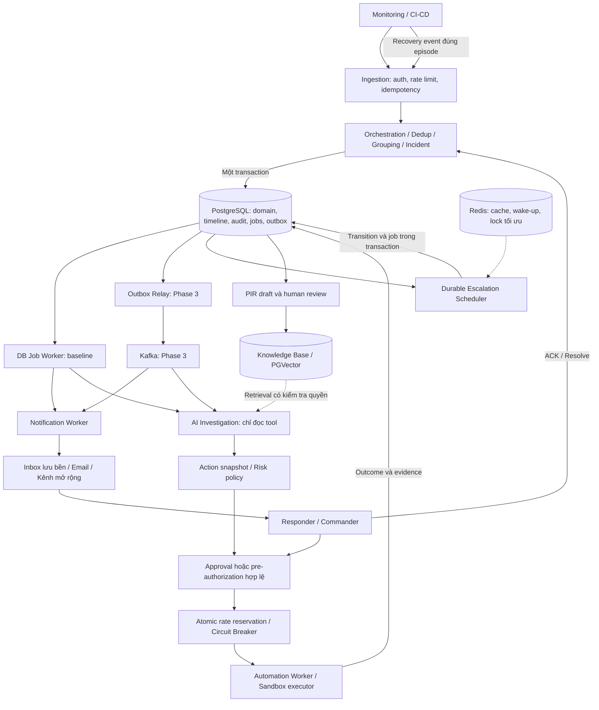
```mermaid
flowchart TB
    MON["Monitoring / CI-CD"] --> ING["Ingestion: auth, rate limit, idempotency"]
    ING --> DOMAIN["Orchestration / Dedup / Grouping / Incident"]
    DOMAIN -->|"Một transaction"| PG[("PostgreSQL: domain, timeline, audit, jobs, outbox")]
    PG --> JOB["DB Job Worker: baseline"]
    PG --> RELAY["Outbox Relay: Phase 3"]
    RELAY --> BUS["Kafka: Phase 3"]
    JOB --> NOTIFY["Notification Worker"]
    BUS --> NOTIFY
    JOB --> AI["AI Investigation: chỉ đọc tool"]
    BUS --> AI
    PG --> TIMER["Durable Escalation Scheduler"]
    TIMER -->|"Transition và job trong transaction"| PG
    REDIS[("Redis: cache, wake-up, lock tối ưu")]
    REDIS -.-> TIMER
    NOTIFY --> INBOX["Inbox lưu bền / Email / Kênh mở rộng"]
    INBOX --> RESP["Responder / Commander"]
    AI --> ACTION["Action snapshot / Risk policy"]
    ACTION --> GATE["Approval hoặc pre-authorization hợp lệ"]
    RESP --> GATE
    GATE --> LIMIT["Atomic rate reservation / Circuit Breaker"]
    LIMIT --> AUTO["Automation Worker / Sandbox executor"]
    AUTO -->|"Outcome và evidence"| PG
    RESP -->|"ACK / Resolve"| DOMAIN
    MON -->|"Recovery event đúng episode"| ING
    PG --> PIR["PIR draft và human review"]
    PIR --> KB[("Knowledge Base / PGVector")]
    KB -.->|"Retrieval có kiểm tra quyền"| AI
```

### 2.3 Luồng Dữ liệu Cốt lõi

Một tín hiệu thô không bao giờ được xử lý trực tiếp như một incident. Nó đi qua ba trạng thái riêng biệt — **Event → Alert → Incident** — mỗi trạng thái mang một ý nghĩa chặt hơn: *Event* là tín hiệu chưa qua xử lý (`CPU = 99%`), *Alert* là tín hiệu đó sau khi platform xử lý (`CPU High on payment-service`), còn *Incident* là đơn vị công việc mà responder thực sự phải xử lý (`Payment Service Production Outage`). Nhiều alert có thể được deduplicate hoặc group vào một incident duy nhất — đây chính là cơ chế giúp responder không bị page 4 lần cho cùng một nguyên nhân gốc.

### 2.4 Messaging Backbone — Kafka

Kafka là message backbone từ Phase 3, **không phải nguồn trạng thái domain** và không thay durable timer. Phase 1–2 dùng DB-backed jobs; không bắt buộc Kafka để gửi thông báo an toàn. Domain mutation, timeline, audit và job/outbox tương ứng được ghi trong cùng transaction. Relay chỉ publish bản ghi đã commit; publish thành công rồi crash trước khi đánh dấu có thể tạo bản sao, nên consumer phải idempotent. Đây là cách áp dụng [Transactional Outbox](https://docs.aws.amazon.com/prescriptive-guidance/latest/cloud-design-patterns/transactional-outbox.html).

| Nhóm | Domain events |
|---|---|
| Ingestion & Alerting | `EventReceived`, `EventSuppressed`, `AlertCreated`, `AlertDeduplicated`, `AlertGrouped`, `AlertResolved` |
| Incident | `IncidentCreated`, `IncidentUpdated`, `IncidentAcknowledged`, `IncidentEscalated`, `IncidentResolved`, `EscalationExhausted` |
| Phản ứng | `ResponderAdded`, `NotificationRequested`, `NotificationSent`, `NotificationFailed` |
| AI | `AIInvestigationStarted`, `AIInvestigationCompleted`, `AIInvestigationFailed` |
| Automation | `AutomationRequested`, `AutomationApproved`, `AutomationExecutionCompleted` |
| Governance | `PIRCreated` |

Envelope gồm `eventId`, `eventType`, `schemaVersion`, `organizationId`, `aggregateType`, `aggregateId`, `aggregateVersion`, `occurredAt`, `correlationId`, `payload`. Các transition lifecycle incident vào **một topic** `incident.lifecycle.v1`, key `incidentId`; mỗi mutation incident có một lifecycle envelope tại version mới (IncidentUpdated cho thay đổi khác), payload có thể chứa các sub-events; relay giữ thứ tự version trong từng aggregate, không publish bản kế tiếp trước bản trước. Consumer không xử lý song song mất thứ tự cùng partition, chỉ commit offset sau DB commit; lưu `consumer_receipts(consumer_name,event_id)` cùng hiệu ứng DB. Stream trước incident có thể key theo `serviceId`.

Kafka chỉ giữ thứ tự trong một partition; cùng key ở các topic khác nhau không tạo thứ tự chung. Với projection cần đủ transition, kiểm tra version/gap và replay hoặc rebuild; với job side effect, dùng identity riêng và revalidate trạng thái hiện tại. Retry/DLQ có thể làm thay đổi thứ tự, không được bỏ qua gap rồi áp dụng mù. Không tuyên bố exactly-once đối với email hoặc executor bên ngoài. Xem [Apache Kafka — Design](https://kafka.apache.org/41/design/design/).

### 2.5 Distributed State — Redis

Redis là thành phần tuỳ chọn từ Phase 3. Khi mất cache, correctness phải dựa vào PostgreSQL.

| Use case | Quy tắc |
|---|---|
| Rate limiting | Token bucket nguyên tử theo integration; nếu Redis lỗi dùng giới hạn bảo thủ tại gateway, không âm thầm bỏ hạn mức |
| Idempotency cache | Key theo org/integration/key, chứa hash và response; chỉ ghi sau commit |
| Dedup cache | `dedup:<org>:<integration>:<service>:<key>`; xác nhận alert còn OPEN ở DB; xoá bằng compare-and-delete theo alertId |
| Distributed lock | TTL + owner token; release chỉ nếu đúng owner; chỉ giảm tranh chấp, không thay DB lock/CAS |
| On-call cache | Có version/expiry; routing lưu snapshot target đã chọn |
| Escalation wake-up | Tăng tốc đánh thức worker; `incidents.escalate_at` trong DB vẫn là deadline bền; quét DB phục hồi sau restart/mất Redis |
| AI context cache | Có thể bỏ; investigation/tool history và evidence cần audit phải lưu DB |

### 2.6 Các Pattern Reliability trong Hệ thống Phân tán

**Idempotency.** `Idempotency-Key` chống retry HTTP; `dedupKey` chống trùng nghiệp vụ; không thay thế nhau. Xác thực integration và quyền service trước lookup. Request identity là `(integration_id, key)`; integration thuộc một organization. SHA-256 trên JSON canonical đã validate (sắp thứ tự object keys, chuẩn hoá số/time, giữ thứ tự array), kèm method/path/API version; không hash `toString()`. Cache hit cũng so hash: khác body trả `409`.

Trong **một transaction READ COMMITTED**, INSERT claim `PROCESSING` với response nullable trước mọi hiệu ứng. Winner mới xử lý event/domain, ghi timeline/audit/job/outbox, lưu status/body/headers response, đổi `COMPLETED`, rồi commit. Không commit claim riêng. Crash trước commit rollback toàn bộ; retry sau commit replay nguyên status/body. Loser `ON CONFLICT DO NOTHING` chờ winner, sau đó **SELECT bằng statement mới** để đọc response đã commit; nếu lock timeout trả `503 IDEMPOTENCY_BUSY` kèm `Retry-After`, client retry cùng key. Không có network I/O trong transaction. Giữ key tối thiểu 7 ngày từ commit; cache không sống lâu hơn retention DB. Sau cửa sổ này không bảo đảm replay HTTP; episode watermark vẫn bảo vệ domain. Cơ chế statement snapshot tham chiếu [PostgreSQL — Transaction Isolation](https://www.postgresql.org/docs/current/transaction-iso.html).

**Dedup, grouping và episode.** Namespace dedup mặc định là `(integration_id, service_id, dedup_key)`; tránh gộp nhầm hai nguồn monitoring. Cross-integration correlation thuộc grouping, không dùng chung key mơ hồ. Baseline serialize mutation alert/group/resolve bằng `SELECT services ... FOR UPDATE`, sau đó khoá incident theo thứ tự ID; tất cả đường ingest/manual resolve tuân cùng lock order. Đổi sang lock hẹp hơn chỉ sau kiểm thử concurrency. Unique partial index OPEN là lớp chặn cuối; conflict phải retry transaction và đọc winner, không trả lỗi trùng như kết quả nghiệp vụ. Counter dùng `occurrence_count = occurrence_count + 1`; một request replay không tăng counter.

Contract yêu cầu `episodeId` ổn định trong một episode và `sourceSequence` tăng đơn điệu theo namespace dedup, xuyên các episode. `alert_streams` giữ last sequence/episode/closed flag bền, kể cả khi event thô hết retention. Sequence thấp hơn hoặc bằng watermark là stale no-op có audit; sequence bằng watermark nhưng khác payload hash là `409 SOURCE_SEQUENCE_CONFLICT`; sequence thấp hơn chỉ được phân loại stale, không cần giữ mọi hash lịch sử. Episode đang mở không nhận TRIGGER khác episode (409); episode đã đóng không mở lại bằng TRIGGER trễ cùng episode. RESOLVE chỉ đóng đúng episode; mismatched episode khi đang có episode active là stale no-op, không đổi watermark/closed flag của episode active. RESOLVE chưa có alert ghi no-op, watermark/tombstone nhưng không tạo incident. Adapter chưa cung cấp được ordering/episode không được bật integration ingestion contract này; chỉ mở chế độ TRIGGER-only/manual resolve sau khi đặc tả adapter riêng, không âm thầm bỏ validation; `receivedAt` không đủ phân biệt tín hiệu cũ.

Mỗi alert thuộc tối đa một incident; grouping baseline chỉ trong cùng service, theo rule/window đã cấu hình và chỉ vào incident chưa RESOLVED. Khi grouping/resolve cạnh tranh, cùng service lock quyết định thứ tự. Auto-resolve incident chỉ khi **mọi alert liên kết đã RESOLVED**. Manual resolve cần quyền và lý do; transaction đóng mọi alert OPEN liên kết, đánh dấu stream episode tương ứng đã đóng, huỷ deadline/job chưa dispatch, ghi audit và outbox. Episode mới tạo vòng đời mới, không gắn alert OPEN vào incident đã đóng. Event bị suppress lưu với `alert_id = NULL`; recovery cho episode đã theo dõi vẫn được xử lý, maintenance không nuốt RESOLVE cần thiết.

**Durable jobs, notifications và handoff.** State + timeline + audit + job/outbox commit nguyên tử. `jobs` có unique job key, `available_at`, lease owner/expiry, attempts và trạng thái. Worker claim bằng `FOR UPDATE SKIP LOCKED`, commit claim, gọi mạng ngoài transaction, rồi cập nhật outcome bằng owner/lease generation còn hợp lệ. Lease hết hạn cho phép reclaim; consumer/executor vẫn phải xử lý trùng an toàn. Backoff exponential + jitter, tối đa 5 attempts mặc định; quá budget vào DLQ lưu DB (Kafka có retry/DLQ tương ứng ở Phase 3). Mỗi delivery có unique key theo incident/transition/recipient/channel. Inbox lưu trước khi push WebSocket; reconnect dùng cursor API catch-up. SENT chỉ có nghĩa provider chấp nhận, không phải người đã đọc/ACK. Nếu provider không hỗ trợ idempotency hoặc query outcome, crash sau send có thể gây gửi lặp; ghi nhận hạn chế này.

**Escalation và ACK.** Snapshot policy version/targets vào incident khi tạo. Level đầu có deadline; transaction timeout recheck `TRIGGERED`, version, level/repeat và deadline còn đúng. Re-notify trong level tối đa `repeatCount`, lần kế cách `repeatIntervalMinutes`; hết repeat mới chuyển level và đặt deadline theo timeout level mới. Level cuối hết budget: tạo một backstop notification cho manager đã cấu hình, ghi `EscalationExhausted`, đặt `escalate_at = NULL`, `escalation_exhausted = true`; không sinh level vượt policy hay loop vô hạn. ACK/RESOLVE cùng khoá/CAS, xoá deadline và cancel notification job chưa dispatch. CAS trả 0 phải đọc lại để phân biệt ACK/RESOLVE với conflict khác; nếu còn hợp lệ thì retry hữu hạn.

Nếu ACK commit trước thì không tạo escalation transition mới. Nếu timeout commit trước, notification có thể đã dispatch; recheck trước send giảm thông báo thừa nhưng không xoá được race giữa DB check và network send. Không giữ DB transaction trong lúc gửi và không hứa thu hồi thông báo đã gửi.

**Optimistic locking và Fencing Token.** `version` bảo vệ cập nhật DB bằng compare-and-swap; **không tự là Fencing Token cho tác động bên ngoài**. Fencing thật cần token đơn điệu theo resource và executor từ chối token cũ. Baseline dùng action identity + executor idempotency/reconciliation; Redis lock không chứng minh exactly-once. Khi executor không có cả dedup lẫn kiểm tra outcome, timeout phải là UNKNOWN và yêu cầu người xử lý, không retry mù.

**Automation rate guard và Circuit Breaker.** Chọn policy **hard stop, không override bằng approval**. Tối đa 2 reservation dispatch trong sliding window `(now - 15 phút, now]` theo `(service_id, runbook_id)`. Khoá row `automation_guards`, lấy DB clock sau khi lấy lock, đếm `automation_reservations`, và INSERT reservation unique action/execution trong cùng transaction claim thực thi. Guard row được tạo khi enable runbook/service hoặc UPSERT trước SELECT FOR UPDATE, không khoá row chưa tồn tại. Đủ 2 suất thì không dispatch, action vẫn APPROVED kèm `blocked_until`; job được dời tới khi suất cũ hết window. Approval đang chờ không chiếm suất. Reservation đã commit vẫn tính kể cả crash/FAILED/UNKNOWN; retry reconcile cùng execution không lấy suất mới. Không refund tự động. Trước dispatch luôn kiểm tra lại policy/quyền/snapshot/incident.

Giới hạn tần suất không phải Circuit Breaker. Breaker riêng theo `(service,runbook)`: CLOSED → OPEN khi 3 execution liên tiếp FAILED/UNKNOWN; OPEN nghỉ 15 phút, rồi HALF_OPEN cho đúng một probe được reserve nguyên tử. Probe SUCCEEDED → CLOSED/reset failure count; FAILED/UNKNOWN → OPEN lại. Probe vẫn cần approval/pre-authorization và rate slot. Lease probe mất phải reconcile outcome, không cấp probe thứ hai trong khi chưa xác định. Mỗi execution chỉ đóng góp một outcome đầu tiên cho failure counter; reconcile UNKNOWN sau đó không tăng lỗi lần hai. Counter và probe state cập nhật dưới cùng guard lock; một success thường reset chuỗi lỗi khi CLOSED, không tự đóng OPEN do execution cũ hoàn tất muộn. State/cooldown lưu bền ở `automation_guards`; UI hiển thị lý do blocked, approval không bypass hai guard.

**Tách trách nhiệm.** Escalation đưa người vào xử lý, AI điều tra song song, approval chỉ kiểm soát remediation. AI lỗi hoặc approval chờ không dừng escalation. Audit/timeline là append-only history bên cạnh CRUD state; thiết kế này **không phải Event Sourcing**.

---

## 3. Các Module & Năng lực Cốt lõi (Core Modules & Capabilities)

Phạm vi chức năng của nền tảng được tổ chức thành **15 bounded module**, được nhóm lại dưới đây thành năm nhóm năng lực mạch lạc.

### 3.1 Identity, Access & Organization

Bao gồm authentication, authorization, và cấu trúc tổ chức mà mọi module khác đều dựa vào.

- **Authentication.** Đăng ký/đăng nhập bằng email-password, xử lý qua Spring Security, phát hành **access token** ngắn hạn và **refresh token** dài hạn (`POST /auth/register`, `/auth/login`, `/auth/refresh`, `/auth/logout`).
- **Role-Based Access Control.** Authorization không chỉ dừng ở `ADMIN`/`USER` phẳng. Role được phân theo hệ thống phân cấp `User → Organization → Team → Role → Permission`:

  | Role | Phạm vi điển hình |
  |---|---|
  | `ACCOUNT_ADMIN` | Toàn quyền trên organization |
  | `TEAM_MANAGER` | Quản lý service, schedule, escalation policy của team |
  | `TEAM_MEMBER` | Thành viên kỹ thuật tiêu chuẩn |
  | `RESPONDER` | Có thể được page và xử lý incident |
  | `STAKEHOLDER` | Chỉ xem, có thể subscribe status update |
  | `VIEWER` | Chỉ xem |

  Các permission chi tiết (`INCIDENT_ACK`, `INCIDENT_RESOLVE`, `ESCALATION_MANAGE`, `AI_RUN`, `AUTOMATION_EXECUTE`, `AUDIT_VIEW`,...) được gắn vào role thay vì hard-code trong business logic (baseline có thể seed bộ role/permission cố định), tương tự cách các nền tảng incident management trưởng thành tách quyền theo account/team/object.

- **Organization & Teams.** Một organization chứa nhiều team (ví dụ: Backend, Frontend, DevOps, Security, Data), mỗi team có membership và invitation riêng, tạo thành ranh giới sở hữu mà Service Directory và Escalation Policy dựa vào.

### 3.2 Service Directory & Integration Layer

Điểm vào nơi tín hiệu bên ngoài trở thành dữ liệu native của platform.

- **Service Directory.** Service là đơn vị chức năng mà một incident thực sự *nói về* — thuộc sở hữu một team, có `criticality = CRITICAL/HIGH/NORMAL` thể hiện tầm quan trọng kinh doanh, tách khỏi `status = OPERATIONAL/DEGRADED/MAJOR_INCIDENT/MAINTENANCE/DISABLED` và priority P1–P5 của incident, và liên kết tới repository, runbook, escalation policy tương ứng.
- **Service Dependency Graph.** Các service khai báo dependency lẫn nhau và với hạ tầng (ví dụ `Checkout → Payment → PostgreSQL → AWS RDS`). Graph này là thứ cho phép AI Investigation Agent suy luận về blast radius — nếu PostgreSQL down, mọi service phụ thuộc đều là ứng viên cho root-cause path, không phải trùng hợp ngẫu nhiên.
- **Integration & Event Ingestion.** Các hệ thống bên ngoài (Prometheus, Grafana, CloudWatch, GitHub Actions, Kubernetes, custom application) gửi tín hiệu machine-generated qua một **Events API** riêng (`POST /api/v1/events`), xác thực bằng API key theo từng integration thay vì user session. Đây là sự tách biệt có chủ đích khỏi **REST API** hướng resource dùng cho cấu hình, phản ánh đúng quy ước ngành: tách "ingest ở quy mô lớn" khỏi "quản lý cấu hình".

### 3.3 Incident Response Pipeline

Phần lõi vận hành: biến noise thành một incident đã được định tuyến, có thể hành động, và được phối hợp xử lý.

- **Alert Management.** Dedup theo integration/service/key và episode (§2.6), grouping baseline trong cùng service theo rule tất định; AI chỉ gợi ý correlation. Suppression lưu event không tạo alert/incident. Recovery đúng episode resolve alert; chỉ đóng incident khi mọi alert liên kết đã resolved. Manual resolve đóng các alert còn mở trong cùng transaction và ghi lý do.
- **Event Orchestration / Rule Engine.** Một engine `IF condition THEN action` có thể cấu hình, đánh giá trên mỗi event đầu vào. Condition kết hợp các field (`service`, `severity`, `environment`, `event.count`) với operator (`EQUALS`, `CONTAINS`, `GREATER_THAN`, `IN`,...); action gồm `ROUTE`, `SUPPRESS`, `SET_PRIORITY`, `CREATE_INCIDENT`, `TRIGGER_WORKFLOW` (roadmap, không expose trước khi có workflow engine). Đây là cơ chế chính chuyển noise từ monitoring thành quyết định định tuyến nhất quán, có thể audit.
- **Incident Management.** Bản ghi Incident (`TRIGGERED → ACKNOWLEDGED → RESOLVED`) theo dõi assignee, priority, severity, và toàn bộ timeline dạng `IncidentEvent`. Acknowledge một incident sẽ dừng escalation nhưng không đóng incident — resolve là một hành động riêng, tường minh.
- **On-Call Scheduling.** Schedule hỗ trợ các loại rotation (`DAILY`, `WEEKLY`, `CUSTOM`), nhiều layer coverage (Primary/Secondary), và override có giới hạn thời gian cho các trường hợp vắng mặt đã lên kế hoạch — được resolve tại thời điểm truy vấn qua `GET /schedules/{id}/on-call`. Baseline dùng lịch tĩnh; roadmap rotation lưu timezone IANA, wall-clock rule và quy tắc DST (giờ trùng chọn offset sớm, giờ thiếu dịch tới instant hợp lệ đầu tiên); override lưu instant UTC.
- **Escalation Management.** Policy versioned có nhiều level, nhiều target/level, timeout, repeat count/interval và backstop. Phase 1–2 dùng DB polling theo `escalate_at`; Phase 3 có thể dùng Redis wake-up nhưng vẫn quét DB phục hồi. Mỗi timeout cập nhật level/repeat/deadline và notification job nguyên tử. Hết level cuối dừng tự động sau backstop; ACK/RESOLVE huỷ timer (§2.6).
- **Notification.** Baseline dùng inbox lưu bền, WebSocket push và email khi adapter sẵn sàng; Slack/Telegram/Discord/SMS ở roadmap. `NotificationRule` quyết định channel/delay. Domain transaction tạo job/outbox; worker gửi sau commit, có lease/retry/DLQ và API catch-up cho người offline. Provider delivery không đồng nghĩa ACK.
- **Incident Response & Collaboration.** Với các incident lớn, NexusOps hỗ trợ các role tường minh (Incident Commander, Technical Lead, Communications Lead, Scribe, Responder), một **Incident War Room** thời gian thực (chat, timeline, AI panel, service graph chạy trên WebSocket/SSE), và các status update hướng tới stakeholder mà họ có thể subscribe độc lập với nhóm responder.

### 3.4 Automation & AI Operations

- **Runbook và risk.** Runbook version bất biến lưu base risk LOW/HIGH, schema parameters, target allowlist, `requiresApproval` mặc định true. Backend tính `effectiveRisk = max(baseRisk, serviceRisk)`; CRITICAL service nâng HIGH, HIGH/NORMAL không tự hạ base risk. AI không quyết định risk/quyền. Gate per-instance bắt buộc khi HIGH, requiresApproval=true, hoặc không có pre-authorization policy đang hiệu lực đúng runbook version/service/environment/parameters. LOW + requiresApproval=false chỉ chạy tự động nếu có policy hợp lệ do Team Manager có quyền tạo, với actor/version/expiry/revocation rõ ràng. Rate guard và breaker không thay đổi risk, không được bypass bằng approve (§2.6).
- **Action và approval.** `automation_actions` lưu incident, investigation nullable, runbook version, parameters, target snapshot, evidence snapshot bất biến, SHA-256 snapshot và effective risk. Thay đổi nội dung phải tạo action mới và xin duyệt lại; không sửa bản đã duyệt. UI dùng `state=PENDING_APPROVAL`, không chỉ kiểm tra HIGH. Backend kiểm tra permission `AUTOMATION_EXECUTE`, phạm vi org/team/service và membership responder được assign hoặc Commander của incident. Quyết định immutable gắn snapshot hash; reject → REJECTED. Pre-authorized action lưu policy ID/version và chuyển APPROVED bởi policy engine có audit.
- **Execution.** State machine `PENDING_APPROVAL → APPROVED → EXECUTING → SUCCEEDED/FAILED/UNKNOWN`, thêm REJECTED/CANCELLED. CAS APPROVED → EXECUTING cùng reservation/job, unique execution/action, ngăn double approve/worker. Worker revalidate quyền/policy, snapshot và incident chưa resolved trước dispatch; policy không còn hợp lệ thì cancel và yêu cầu action mới. Gửi executor key ổn định bằng execution ID. Retry transport ghi attempt riêng, không tạo execution/action mới. UNKNOWN chỉ reconcile bằng query outcome hoặc bằng chứng do người xác minh; không tự chạy lại. Tác động thực đã xảy ra trước khi incident resolve không thể rollback bằng việc cancel DB job.
- **Knowledge Base & RAG.** Tài liệu/runbook/PIR được version, chunk, embed vào PGVector; lưu model/dimension/version, nguồn và ACL để retrieval lọc quyền **trước** đưa vào LLM. Xoá/thu hồi quyền nguồn phải invalidation index; approved PIR mới được index. Log/RAG là dữ liệu không tin cậy, không được nâng quyền hoặc điều khiển executor.
- **AI investigation.** Tạo `ai_investigations=RUNNING` trước mọi tool call; log luôn FK investigation ID. Conversation history phải lưu assistant tool-call message trước các tool-result message khớp call ID. Pin Spring AI/SDK/model versions trong build khi triển khai, dùng API theo đúng phiên bản và integration test history; không coi pseudocode là code chạy được. Tool calling tham chiếu [Spring AI Reference](https://docs.spring.io/spring-ai/reference/api/tools.html).
- **Tool boundary.** Allowlist các read-only tool; validate JSON Schema, UUID và output; scope lấy từ server context, không tin serviceId do LLM truyền. Baseline `getIncident`, `getAlerts`, `getRecentDeployments`, `searchKnowledge`; `getLogs/getMetrics` qua observability adapter và `getDependencies` qua bảng dependency khi đã có integration. Không giả lập như dữ liệu thật. Timeout mỗi tool 10 giây, tối đa 8 vòng và tổng deadline 120 giây, có token/cost budget cấu hình; hết budget → TIMED_OUT, lỗi → FAILED, giữ evidence đã thu thập. Secrets/PII được redact. AI thất bại không ảnh hưởng paging/ACK.

| Agent trong roadmap | Trách nhiệm | Quyền thực thi |
|---|---|---|
| Triage | Gợi ý priority/service/correlation | Chỉ đọc và đề xuất |
| Investigation | Giả thuyết root cause + evidence refs + dữ kiện còn thiếu | Chỉ đọc |
| Remediation | Đề xuất runbook/parameters từ allowlist | Không gọi executor |
| Postmortem / Scribe | Soạn PIR draft từ timeline/evidence | Chỉ tạo bản nháp |
| Knowledge | Trả lời kèm nguồn được phép truy cập | Chỉ đọc |
| On-call Assistant | Tra cứu schedule/policy | Chỉ đọc |

Baseline chỉ cần một Investigation Agent và PIR draft, không cần sáu runtime riêng. Confidence là score tự báo cáo chưa hiệu chuẩn, không phải xác suất root cause đúng. Deployment gần thời điểm lỗi là tương quan; cần bằng chứng bổ sung. Chỉ Automation Worker có credential executor giới hạn sandbox/service/action.

### 3.5 Reliability Engineering & Governance

Khép lại vòng lặp từ resolution đến việc học hỏi của tổ chức, đồng thời cung cấp tầng quan sát vận hành cho cả kỹ sư lẫn stakeholder.

- **Post-Incident Review.** Mỗi incident đã resolve tạo ra một `PostIncidentReview` (summary, root cause, impact, timeline, các yếu tố góp phần, và action item được phân loại — `BUG_FIX`, `INFRASTRUCTURE`, `MONITORING`, `PROCESS`, `DOCUMENTATION`, `SECURITY`), đi qua các trạng thái `DRAFT → IN_REVIEW → APPROVED → COMPLETED`.
- **Analytics & Reliability Metrics.** Per-incident time-to-ack = first `acknowledged_at - triggered_at`; time-to-resolve = `resolved_at - triggered_at`. MTTA là trung bình của incident có first ACK trong `[from,to)` (kể cả chưa resolve); MTTR là trung bình của incident resolve trong kỳ (kể cả chưa ACK). Bản ghi thiếu mốc không tính, không coi bằng 0; hiển thị sample count, cohort, timezone, median/p95 khi đủ mẫu. `actual_failure_at` và `detected_at` nullable trên incident, được Commander nhập/xác minh qua PIR kèm nguồn: MTTD = detected − actual failure, chỉ lấy cặp hợp lệ đã xác minh và hiển thị là ước lượng. Một incident chỉ cho duration, không chứng minh cải thiện trung bình. Funnel tách số request replay, accepted events, suppressed/stale events, trigger occurrences, alerts mới và incidents mới; không trộn đơn vị event với alert.
- **SLA / SLO.** Roadmap yêu cầu SLI từ monitoring, cửa sổ và định nghĩa good/total rõ ràng. Với time-based availability: error budget = `(1 − SLO) × eligible duration`, downtime là hợp các khoảng không khả dụng, không cộng trùng incident. Request-based SLI dùng bad/total requests. Burn rate = bad fraction / `(1 − SLO)`, tính multi-window từ SLI; không suy ra trực tiếp từ số incident. Chưa có nguồn SLI và kiểm thử thì chỉ là cấu hình/định hướng, chưa phải năng lực đo reliability đã chứng minh.
- **Status Page.** Một trang public hoặc giới hạn theo đối tượng, phản ánh trạng thái vận hành theo từng service, được cập nhật tự động từ trạng thái incident (có human approval cho các nội dung hướng tới công chúng khi cần).
- **Maintenance Window.** Một rule suppression có giới hạn thời gian cho một service cụ thể — TRIGGER mới khớp bị suppress; RESOLVE cho episode đã theo dõi vẫn cập nhật recovery (§2.6).
- **Audit Log.** Mọi hành động có quyền hạn cao (ai, làm gì, khi nào, trên đối tượng nào, giá trị cũ → giá trị mới) đều được ghi lại bất biến — một yêu cầu nền tảng cho bất kỳ hệ thống nào quản lý quyền truy cập production và remediation tự động.

---

## 4. Mô hình Use Case (Use Case Model)

Mục này mô tả roadmap các **tác nhân (actor)** và **use case** của NexusOps, tổ chức theo cùng năm nhóm năng lực đã trình bày ở Mục 3, để mỗi use case có thể truy vết trực tiếp về module tương ứng.

Các sơ đồ flowchart biểu diễn quan hệ chức năng, không phải UML Use Case chuẩn đầy đủ. Cạnh nét đứt biểu diễn phụ thuộc/tham chiếu; AI là nhánh tuỳ chọn khi đã bật, không phải điều kiện để tạo incident. Trong mục này và bảng §6.2, path viết gọn đều có prefix `/api/v1`.

### 4.1 Danh sách Tác nhân (Actors)

| Tác nhân | Loại | Mô tả |
|---|---|---|
| **Monitoring System** | External system | Hệ thống giám sát bên ngoài (Prometheus, Grafana, CloudWatch, CI/CD, Kubernetes) gửi event vào NexusOps qua Events API. |
| **Account Admin** | Con người | Toàn quyền trên organization: quản lý user, role/permission, audit log. |
| **Team Manager** | Con người | Quản lý service, schedule, escalation policy, integration trong phạm vi team mình sở hữu. |
| **On-call Responder** | Con người | Được page khi có incident; thực hiện acknowledge, resolve, escalate, phê duyệt remediation. |
| **Incident Commander** | Con người | Vai trò được một Responder đảm nhận khi điều phối một major incident (P1/P2); phê duyệt automation, đăng status update, duyệt PIR. |
| **Stakeholder** | Con người | Theo dõi trạng thái incident/service qua subscription và dashboard; không thao tác trực tiếp trên incident. |
| **AI Agent** | Hệ thống (tác nhân tự động) | Thực hiện triage, investigation, truy vấn knowledge base, và soạn thảo postmortem; không tự thực thi hành động thay đổi hệ thống. |
| **Automation Worker** | Hệ thống (tác nhân tự động) | Thực thi runbook/remediation sau khi đã có human approval (hoặc pre-authorization hợp lệ; còn phải qua rate guard/breaker). |

### 4.2 Use Case: Identity, Access & Organization

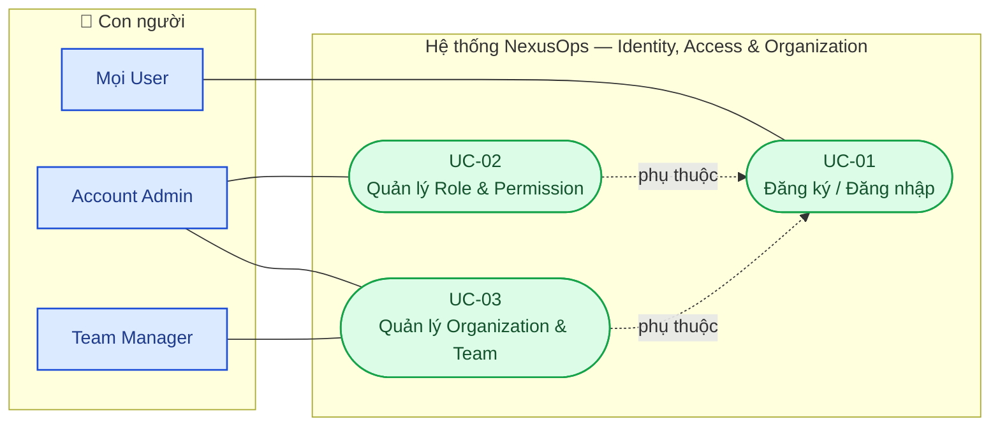
```mermaid
flowchart LR
    subgraph ACTORS_A["👤 Con người"]
        AllUsers[Mọi User]
        AccountAdmin[Account Admin]
        TeamManager[Team Manager]
    end

    subgraph SYS_A["Hệ thống NexusOps — Identity, Access & Organization"]
        UC01(["UC-01<br/>Đăng ký / Đăng nhập"])
        UC02(["UC-02<br/>Quản lý Role & Permission"])
        UC03(["UC-03<br/>Quản lý Organization & Team"])
    end

    AllUsers --- UC01
    AccountAdmin --- UC02
    AccountAdmin --- UC03
    TeamManager --- UC03

    UC02 -.->|"phụ thuộc"| UC01
    UC03 -.->|"phụ thuộc"| UC01

    classDef actorHuman fill:#dbeafe,stroke:#1d4ed8,stroke-width:1.5px,color:#1e3a8a
    classDef usecase fill:#dcfce7,stroke:#16a34a,stroke-width:1.5px,color:#14532d
    class AllUsers,AccountAdmin,TeamManager actorHuman
    class UC01,UC02,UC03 usecase
```

**UC-01 — Đăng ký & Đăng nhập**
- **Tác nhân:** Mọi user (Account Admin, Team Manager, Responder, Stakeholder)
- **Mô tả:** Người dùng tạo tài khoản hoặc đăng nhập để nhận access token/refresh token.
- **Điều kiện tiên quyết:** Có email hợp lệ (đăng ký) hoặc tài khoản đã tồn tại (đăng nhập).
- **Luồng sự kiện chính:**
  1. Người dùng gửi `POST /auth/register` hoặc `/auth/login` kèm email/password.
  2. Hệ thống xác thực thông tin qua Spring Security.
  3. Hệ thống phát hành access token và refresh token.
  4. Người dùng dùng access token cho các request tiếp theo.
- **Luồng ngoại lệ:** Sai email/password → lỗi 401; email đã tồn tại khi đăng ký → lỗi 409.
- **Điều kiện sau:** Người dùng có một phiên đăng nhập hợp lệ.

**UC-02 — Quản lý Role & Permission**
- **Tác nhân:** Account Admin
- **Mô tả:** Gán role và permission chi tiết cho user trong phạm vi organization/team.
- **Điều kiện tiên quyết:** Actor có quyền `ACCOUNT_ADMIN`.
- **Luồng sự kiện chính:**
  1. Admin chọn user cần cấp quyền.
  2. Admin gán role (`RESPONDER`, `TEAM_MANAGER`,...) hoặc permission cụ thể (`AUTOMATION_EXECUTE`,...).
  3. Hệ thống ghi nhận thay đổi và tạo bản ghi `AuditLog`.
- **Luồng ngoại lệ:** Actor không đủ quyền → hệ thống từ chối (403).
- **Điều kiện sau:** User có quyền hạn mới; thay đổi được ghi vào audit log.

**UC-03 — Quản lý Organization & Team**
- **Tác nhân:** Account Admin, Team Manager
- **Mô tả:** Tạo/chỉnh sửa organization, team, và quản lý thành viên team.
- **Điều kiện tiên quyết:** Actor có quyền `ACCOUNT_ADMIN` (tạo organization) hoặc `TEAM_MANAGER` (quản lý team của mình).
- **Luồng sự kiện chính:**
  1. Actor tạo/cập nhật organization hoặc team qua `POST /organizations`, `POST /teams`.
  2. Actor thêm/xoá thành viên qua `POST`/`DELETE /teams/{id}/members`.
  3. Hệ thống cập nhật cấu trúc sở hữu, ảnh hưởng tới Service Directory và Escalation Policy liên quan.
- **Điều kiện sau:** Cấu trúc organization/team được cập nhật.

### 4.3 Use Case: Service Directory & Integration Layer

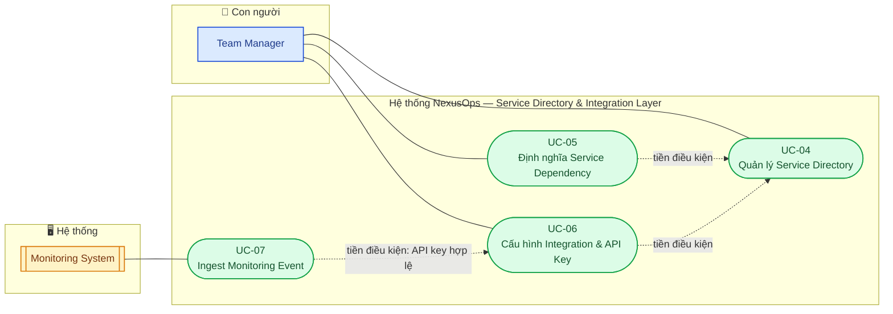
```mermaid
flowchart LR
    subgraph ACTORS_B_H["👤 Con người"]
        TeamManagerB[Team Manager]
    end
    subgraph ACTORS_B_S["🖥️ Hệ thống"]
        MonitoringSystem[[Monitoring System]]
    end

    subgraph SYS_B["Hệ thống NexusOps — Service Directory & Integration Layer"]
        UC04(["UC-04<br/>Quản lý Service Directory"])
        UC05(["UC-05<br/>Định nghĩa Service Dependency"])
        UC06(["UC-06<br/>Cấu hình Integration & API Key"])
        UC07(["UC-07<br/>Ingest Monitoring Event"])
    end

    TeamManagerB --- UC04
    TeamManagerB --- UC05
    TeamManagerB --- UC06
    MonitoringSystem --- UC07

    UC05 -.->|"tiền điều kiện"| UC04
    UC06 -.->|"tiền điều kiện"| UC04
    UC07 -.->|"tiền điều kiện: API key hợp lệ"| UC06

    classDef actorHuman fill:#dbeafe,stroke:#1d4ed8,stroke-width:1.5px,color:#1e3a8a
    classDef actorSystem fill:#fef3c7,stroke:#d97706,stroke-width:1.5px,color:#78350f
    classDef usecase fill:#dcfce7,stroke:#16a34a,stroke-width:1.5px,color:#14532d
    class TeamManagerB actorHuman
    class MonitoringSystem actorSystem
    class UC04,UC05,UC06,UC07 usecase
```

**UC-04 — Quản lý Service Directory**
- **Tác nhân:** Team Manager
- **Mô tả:** Tạo, cập nhật thông tin service (criticality, environment, runbook URL, escalation policy liên kết).
- **Điều kiện tiên quyết:** Actor có quyền `SERVICE_MANAGE` trên team sở hữu.
- **Luồng sự kiện chính:**
  1. Team Manager tạo service qua `POST /services` với các trường name, criticality, escalationPolicyId.
  2. Hệ thống lưu bản ghi Service với status mặc định `OPERATIONAL`.
  3. Team Manager cập nhật qua `PATCH /services/{id}` khi cần.
- **Điều kiện sau:** Service tồn tại trong Service Directory, sẵn sàng nhận integration/event.

**UC-05 — Định nghĩa Service Dependency**
- **Tác nhân:** Team Manager
- **Mô tả:** Khai báo quan hệ phụ thuộc giữa các service (và với hạ tầng) để phục vụ blast-radius reasoning của AI.
- **Điều kiện tiên quyết:** Cả hai service liên quan đã tồn tại trong Service Directory.
- **Luồng sự kiện chính:**
  1. Team Manager chọn service nguồn và service/hạ tầng đích.
  2. Hệ thống lưu bản ghi `service_dependencies`.
  3. Dependency graph được cập nhật, sẵn sàng cho AI Investigation Agent truy vấn.
- **Điều kiện sau:** Dependency graph phản ánh đúng quan hệ mới.

**UC-06 — Cấu hình Integration & API Key**
- **Tác nhân:** Team Manager
- **Mô tả:** Kết nối một service với một nguồn monitoring bên ngoài, sinh integration key.
- **Điều kiện tiên quyết:** Service đã tồn tại.
- **Luồng sự kiện chính:**
  1. Team Manager tạo integration cho service, chọn provider (Prometheus, GitHub Actions,...).
  2. Hệ thống sinh một API key riêng cho integration.
  3. Team Manager cấu hình API key này trên hệ thống monitoring bên ngoài.
- **Điều kiện sau:** Integration ở trạng thái active, sẵn sàng nhận event.

**UC-07 — Nhận Event từ Monitoring System**
- **Tác nhân:** Monitoring System.
- **Tiên quyết:** Integration active, có quyền trên service; JSON đúng schema; đủ Idempotency-Key/dedupKey và episode contract (§6.3).
- **Luồng chính:** Xác thực và rate limit; claim key trước xử lý; winner thực hiện orchestration/dedup/grouping hoặc recovery, ghi event/domain/timeline/audit/job/outbox và response trong một transaction (§2.6). Sau commit trả 200 cùng eventId/outcome/alertId/incidentId nullable; side effect chạy bất đồng bộ.
- **Ngoại lệ:** Retry cùng key/body replay nguyên response; khác body 409; key contention timeout 503 + Retry-After; thiếu dữ liệu 400; rate limit 429. Suppressed/stale/unmatched recovery trả outcome rõ, không tạo incident.
- **Điều kiện sau:** Accepted event và mọi nghĩa vụ xử lý tiếp theo đã lưu bền, không khẳng định notification đã đến người nhận.

### 4.4 Use Case: Incident Response Pipeline

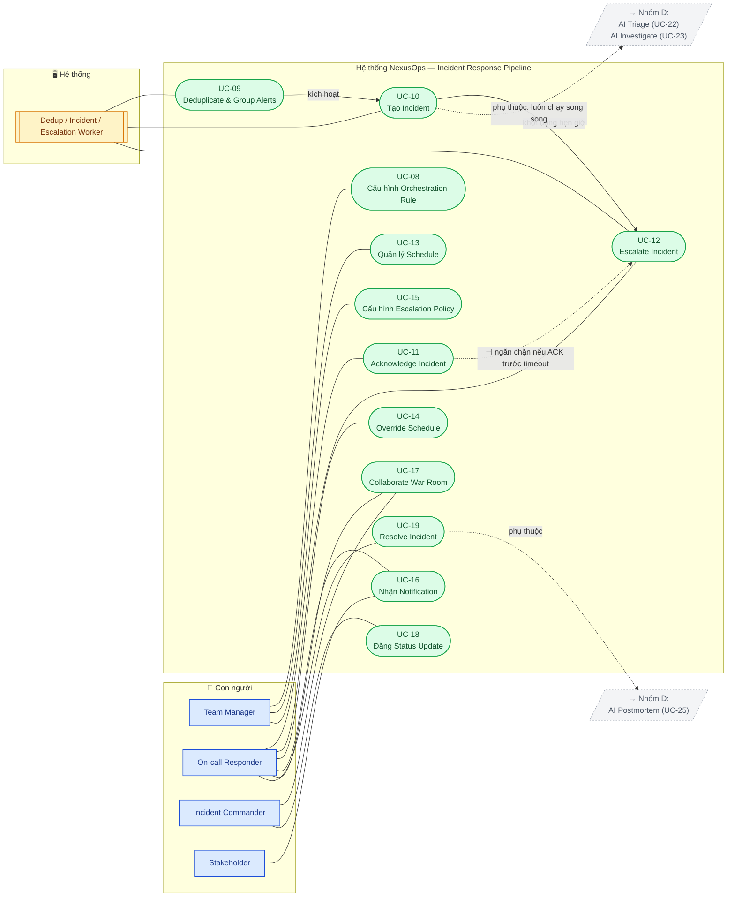
```mermaid
flowchart LR
    subgraph ACTORS_C_H["👤 Con người"]
        TeamManagerC[Team Manager]
        Responder[On-call Responder]
        Commander[Incident Commander]
        Stakeholder[Stakeholder]
    end
    subgraph ACTORS_C_S["🖥️ Hệ thống"]
        SystemWorker[[Dedup / Incident / Escalation Worker]]
    end

    subgraph SYS_C["Hệ thống NexusOps — Incident Response Pipeline"]
        UC08(["UC-08<br/>Cấu hình Orchestration Rule"])
        UC09(["UC-09<br/>Deduplicate & Group Alerts"])
        UC10(["UC-10<br/>Tạo Incident"])
        UC11(["UC-11<br/>Acknowledge Incident"])
        UC12(["UC-12<br/>Escalate Incident"])
        UC13(["UC-13<br/>Quản lý Schedule"])
        UC14(["UC-14<br/>Override Schedule"])
        UC15(["UC-15<br/>Cấu hình Escalation Policy"])
        UC16(["UC-16<br/>Nhận Notification"])
        UC17(["UC-17<br/>Collaborate War Room"])
        UC18(["UC-18<br/>Đăng Status Update"])
        UC19(["UC-19<br/>Resolve Incident"])
    end

    REF_AI[/"→ Nhóm D:<br/>AI Triage (UC-22)<br/>AI Investigate (UC-23)"/]
    REF_PM[/"→ Nhóm D:<br/>AI Postmortem (UC-25)"/]

    TeamManagerC --- UC08
    TeamManagerC --- UC13
    TeamManagerC --- UC15
    SystemWorker --- UC09
    SystemWorker --- UC10
    SystemWorker --- UC12
    Responder --- UC11
    Responder --- UC12
    Responder --- UC14
    Responder --- UC16
    Responder --- UC17
    Responder --- UC19
    Stakeholder --- UC16
    Commander --- UC17
    Commander --- UC18

    UC09 -->|"kích hoạt"| UC10
    UC10 -->|"khởi động hẹn giờ"| UC12
    UC10 -.->|"phụ thuộc: luôn chạy song song"| REF_AI
    UC11 -.->|"⊣ ngăn chặn nếu ACK trước timeout"| UC12
    UC19 -.->|"phụ thuộc"| REF_PM

    classDef actorHuman fill:#dbeafe,stroke:#1d4ed8,stroke-width:1.5px,color:#1e3a8a
    classDef actorSystem fill:#fef3c7,stroke:#d97706,stroke-width:1.5px,color:#78350f
    classDef usecase fill:#dcfce7,stroke:#16a34a,stroke-width:1.5px,color:#14532d
    classDef refNode fill:#f3f4f6,stroke:#9ca3af,stroke-width:1px,stroke-dasharray: 3 3,color:#4b5563
    class TeamManagerC,Responder,Commander,Stakeholder actorHuman
    class SystemWorker actorSystem
    class UC08,UC09,UC10,UC11,UC12,UC13,UC14,UC15,UC16,UC17,UC18,UC19 usecase
    class REF_AI,REF_PM refNode
```

**UC-08 — Cấu hình Event Orchestration Rule**
- **Tác nhân:** Team Manager
- **Mô tả:** Định nghĩa rule `IF condition THEN action` cho việc routing/suppress/set priority.
- **Điều kiện tiên quyết:** Actor có quyền cấu hình trên service/organization liên quan.
- **Luồng sự kiện chính:**
  1. Team Manager định nghĩa condition (field, operator, value) và action tương ứng.
  2. Hệ thống lưu rule, sắp xếp theo priority.
  3. Rule được áp dụng cho mọi event tiếp theo khớp điều kiện.
- **Điều kiện sau:** Rule mới có hiệu lực trong Event Orchestration Engine.

**UC-09 — Deduplicate & Group Alerts** *(hệ thống)*
- **Tác nhân:** Dedup & Grouping Engine.
- **Tiên quyết:** TRIGGER hợp lệ, không suppress/stale.
- **Luồng chính:** Khoá service và validate `alert_streams`; tìm alert OPEN đúng namespace/episode; nếu có, tăng occurrence nguyên tử; nếu chưa có thì tạo alert. Gắn `events.alert_id` cho mọi trigger occurrence; chỉ alert mới cần chọn incident theo grouping rule/window. Liên kết alert/incident, timeline và job cùng transaction UC-07/UC-10.
- **Ngoại lệ:** Partial unique conflict → rollback/retry rồi đọc winner; stream conflict → 409; không tạo incident rỗng. Episode đã đóng không được mở lại.
- **Điều kiện sau:** Một alert OPEN/namespace, count chính xác, một liên kết incident/alert. Episode mới sau resolve có alert mới.

**UC-10 — Tạo Incident** *(hệ thống)*
- **Tác nhân:** Incident Management.
- **Tiên quyết:** Alert mới đủ ngưỡng; chưa có incident đang mở phù hợp grouping.
- **Luồng chính:** Trong transaction ingest, tạo TRIGGERED với incidentNumber, priority, timestamps, policy version/target snapshot, level đầu và deadline; gắn alert; tạo timeline, audit, notification job/outbox. Sau commit notification/escalation hoạt động độc lập với AI job khi đã bật AI.
- **Điều kiện sau:** Incident và nghĩa vụ paging tồn tại cùng nhau; Kafka chỉ được dùng từ Phase 3.

**UC-11 — Acknowledge Incident**
- **Tác nhân:** On-call Responder.
- **Tiên quyết:** Permission INCIDENT_ACK và quyền trên incident/service; incident TRIGGERED.
- **Luồng chính:** POST `/incidents/{id}/acknowledge` kèm expectedVersion. Transaction khoá incident/CAS, chuyển ACKNOWLEDGED, lưu first acknowledged_at, xoá escalate_at và cancel notification job chưa dispatch; ghi timeline/audit/outbox.
- **Ngoại lệ:** ACK lặp của incident đã ACK trả trạng thái hiện tại không đổi timestamp; stale version/state conflict trả 409 sau kiểm tra quyền. Không thu hồi được page đã dispatch.
- **Điều kiện sau:** Timer dừng, AI vẫn tiếp tục; ACK không phải approval automation.

**UC-12 — Escalate Incident** *(tự động hoặc thủ công)*
- **Tác nhân:** Escalation Worker; responder có quyền trong scope.
- **Tiên quyết:** TRIGGERED, chưa exhausted; timeout đúng deadline hoặc explicit manual escalation với expectedVersion.
- **Luồng chính:** Claim incident đến hạn; transaction revalidate version/level/repeat/deadline. Nếu còn repeat thì re-notify và dời deadline; nếu hết repeat thì chuyển level có trong policy, reset repeat, đặt deadline mới. Ghi timeline/audit/job có unique transition key rồi commit; worker gửi sau commit.
- **Ngoại lệ:** ACK/RESOLVE thắng → bỏ timeout; CAS conflict khác → đọc lại/retry hữu hạn. Level cuối hết budget → một backstop job, exhausted=true, deadline=NULL. Manual escalate bỏ repeat hiện tại nhưng không vượt level cuối.
- **Điều kiện sau:** Không tăng level vô hạn, restart không mất deadline; giới hạn race send/ACK theo §2.6.

**UC-13 — Quản lý Lịch On-call (Schedule)**
- **Tác nhân:** Team Manager
- **Mô tả:** Tạo và cấu hình schedule, rotation, layer coverage cho team.
- **Điều kiện tiên quyết:** Team đã tồn tại.
- **Luồng sự kiện chính:**
  1. Team Manager tạo Schedule (`DAILY`/`WEEKLY`/`CUSTOM`), thêm thành viên vào layer Primary/Secondary.
  2. Hệ thống lưu schedule, có thể truy vấn qua `GET /schedules/{id}/on-call`.
- **Điều kiện sau:** Schedule sẵn sàng để Escalation Policy tham chiếu.

**UC-14 — Override Schedule**
- **Tác nhân:** On-call Responder, Team Manager
- **Mô tả:** Thay thế tạm thời người trực on-call (nghỉ phép, đổi ca).
- **Điều kiện tiên quyết:** Schedule đã tồn tại.
- **Luồng sự kiện chính:**
  1. Actor tạo override qua `POST /schedules/{id}/overrides` kèm khoảng thời gian và người thay thế.
  2. Hệ thống ưu tiên override khi resolve on-call trong khoảng thời gian đó.
- **Điều kiện sau:** On-call hiện tại phản ánh đúng người được override.

**UC-15 — Cấu hình Escalation Policy**
- **Tác nhân:** Team Manager
- **Mô tả:** Định nghĩa các level escalation, target và timeout cho một service.
- **Điều kiện tiên quyết:** Service và Schedule liên quan đã tồn tại.
- **Luồng sự kiện chính:**
  1. Team Manager tạo `EscalationPolicy` qua `POST /escalation-policies`, thêm các level với target (`USER`/`SCHEDULE`/`TEAM`) và `timeoutMinutes`.
  2. Hệ thống liên kết policy với service tương ứng.
- **Điều kiện sau:** Mọi incident phát sinh từ service này tuân theo policy mới.

**UC-16 — Nhận Notification**
- **Tác nhân:** Responder, Stakeholder.
- **Tiên quyết:** Target/channel snapshot và notification rule hợp lệ.
- **Luồng chính:** Domain transaction tạo job; notification worker tạo delivery PENDING và inbox trong transaction idempotent theo delivery key; sau commit push WebSocket/gửi provider. Cập nhật SENT khi provider chấp nhận; retry có budget, DLQ có lý do. Người dùng offline lấy lại inbox qua GET `/notifications?after=cursor`.
- **Ngoại lệ:** Recheck incident trước paging; job chưa dispatch có thể CANCELLED khi ACK/RESOLVE. Provider không idempotent có thể gửi lặp nếu outcome bị mất.
- **Điều kiện sau:** Inbox/delivery truy vết được. SENT/DELIVERED/READ không tự chuyển incident thành ACKNOWLEDGED.

**UC-17 — Collaborate trong Incident War Room**
- **Tác nhân:** On-call Responder, Incident Commander
- **Mô tả:** Nhiều responder cùng phối hợp xử lý một incident lớn theo thời gian thực.
- **Điều kiện tiên quyết:** Incident đang ở trạng thái `TRIGGERED` hoặc `ACKNOWLEDGED`, thường là P1/P2.
- **Luồng sự kiện chính:**
  1. Responder được thêm làm `responder` của incident qua `POST /incidents/{id}/responders`.
  2. Các bên trao đổi qua chat/timeline realtime (WebSocket/SSE) trong War Room.
  3. Responder ghi Incident Notes qua `POST /incidents/{id}/notes`, làm context cho AI.
- **Điều kiện sau:** Toàn bộ hoạt động phối hợp được ghi lại trong timeline của incident.

**UC-18 — Đăng Status Update**
- **Tác nhân:** Incident Commander (hoặc Communications Lead)
- **Mô tả:** Công bố tiến độ xử lý incident cho stakeholder.
- **Điều kiện tiên quyết:** Incident đang active.
- **Luồng sự kiện chính:**
  1. Actor gọi `POST /incidents/{id}/status-updates` với nội dung cập nhật (ví dụ "Investigating", "Mitigation in progress").
  2. Hệ thống gửi update tới các stakeholder đã subscribe.
- **Điều kiện sau:** Stakeholder nắm được tiến độ mới nhất mà không cần hỏi trực tiếp responder.

**UC-19 — Resolve Incident**
- **Tác nhân:** Responder có INCIDENT_RESOLVE trong scope; hệ thống cho auto-resolve.
- **Tiên quyết:** Manual resolve khi ACKNOWLEDGED, có lý do; auto-resolve cho cả TRIGGERED/ACKNOWLEDGED khi mọi alert đã recovery.
- **Luồng chính:** POST `/incidents/{id}/resolve` với expectedVersion/reason; khoá service rồi incident, đóng mọi alert OPEN liên kết và stream episode, resolve incident, lưu resolved_at, huỷ timer/job chưa dispatch; timeline/audit/outbox và PIR job commit cùng transaction. Cache invalidation compare-and-delete sau commit.
- **Luồng thay thế:** RESOLVE đúng episode chỉ resolve alert mục tiêu; incident vẫn mở nếu còn alert OPEN. RESOLVE cũ/unmatched là no-op có audit. Khi alert cuối resolved mới đóng incident và tạo PIR draft job.
- **Điều kiện sau:** Không còn alert OPEN thuộc incident RESOLVED; episode mới tạo vòng đời mới. PIR draft không tự chứng minh remediation thành công.

### 4.5 Use Case: Automation & AI Operations

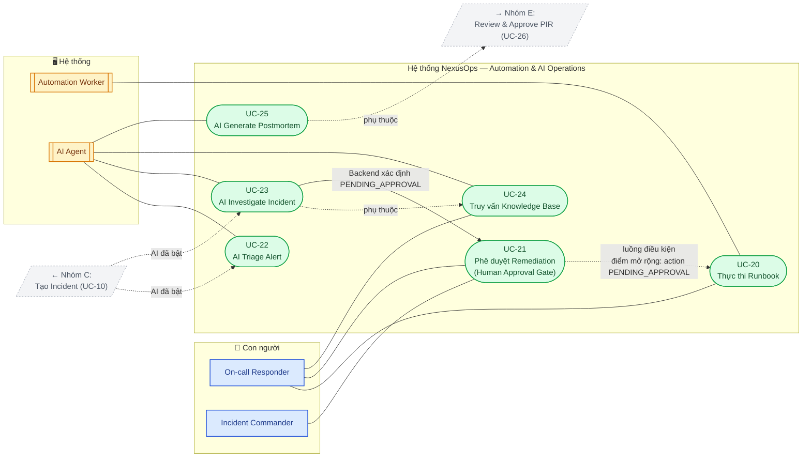
```mermaid
flowchart LR
    subgraph ACTORS_D_H["👤 Con người"]
        Responder2[On-call Responder]
        Commander2[Incident Commander]
    end
    subgraph ACTORS_D_S["🖥️ Hệ thống"]
        AutomationWorker[[Automation Worker]]
        AIAgent[[AI Agent]]
    end

    subgraph SYS_D["Hệ thống NexusOps — Automation & AI Operations"]
        UC20(["UC-20<br/>Thực thi Runbook"])
        UC21(["UC-21<br/>Phê duyệt Remediation<br/>(Human Approval Gate)"])
        UC22(["UC-22<br/>AI Triage Alert"])
        UC23(["UC-23<br/>AI Investigate Incident"])
        UC24(["UC-24<br/>Truy vấn Knowledge Base"])
        UC25(["UC-25<br/>AI Generate Postmortem"])
    end

    REF_INC[/"← Nhóm C:<br/>Tạo Incident (UC-10)"/]
    REF_PIR[/"→ Nhóm E:<br/>Review & Approve PIR (UC-26)"/]

    AutomationWorker --- UC20
    Responder2 --- UC20
    Responder2 --- UC21
    Commander2 --- UC21
    AIAgent --- UC22
    AIAgent --- UC23
    AIAgent --- UC24
    AIAgent --- UC25
    Responder2 --- UC24

    REF_INC -.->|"AI đã bật"| UC22
    REF_INC -.->|"AI đã bật"| UC23
    UC23 -.->|"phụ thuộc"| UC24
    UC23 -->|"Backend xác định PENDING_APPROVAL"| UC21
    UC21 -.->|"luồng điều kiện<br/>điểm mở rộng: action PENDING_APPROVAL"| UC20
    UC25 -.->|"phụ thuộc"| REF_PIR

    classDef actorHuman fill:#dbeafe,stroke:#1d4ed8,stroke-width:1.5px,color:#1e3a8a
    classDef actorSystem fill:#fef3c7,stroke:#d97706,stroke-width:1.5px,color:#78350f
    classDef usecase fill:#dcfce7,stroke:#16a34a,stroke-width:1.5px,color:#14532d
    classDef refNode fill:#f3f4f6,stroke:#9ca3af,stroke-width:1px,stroke-dasharray: 3 3,color:#4b5563
    class Responder2,Commander2 actorHuman
    class AutomationWorker,AIAgent actorSystem
    class UC20,UC21,UC22,UC23,UC24,UC25 usecase
    class REF_INC,REF_PIR refNode
```

**UC-20 — Thực thi Runbook (Trigger/Execute)**
- **Tác nhân:** Responder trong scope; Automation Worker.
- **Tiên quyết:** Action snapshot hợp lệ, incident chưa RESOLVED, approval/pre-authorization thoả §3.4.
- **Luồng chính:** POST `/runbooks/{id}/execute` tạo action bằng request key (không thực thi ngay); state PENDING_APPROVAL hoặc APPROVED theo backend policy. Worker khoá guard, kiểm tra rate slot/breaker/quyền/snapshot; reservation + unique execution + CAS EXECUTING + job trong cùng transaction. Sau commit gọi executor bằng executionId, ghi attempts/outcome/evidence.
- **Ngoại lệ:** Hết rate/breaker OPEN → action APPROVED bị blocked, dời job; approval không override. Policy/quyền hết hiệu lực → CANCELLED. Timeout mơ hồ → UNKNOWN, reconcile; không retry mù. POST replay cùng key không tạo action mới.
- **Điều kiện sau:** SUCCEEDED/FAILED/UNKNOWN có audit; SUCCEEDED của executor không tự resolve incident, cần recovery hoặc UC-19.

**UC-21 — Phê duyệt Automated Remediation (Human Approval Gate)**
- **Tác nhân:** Assigned Responder hoặc Incident Commander, có AUTOMATION_EXECUTE đúng scope.
- **Tiên quyết:** Action PENDING_APPROVAL (HIGH, requiresApproval hoặc thiếu pre-authorization hợp lệ).
- **Luồng chính:** UI hiển thị target/parameters/runbook version/risk/evidence từ snapshot bất biến. Actor POST `/automation/{id}/approve` hoặc `/reject` kèm expectedVersion và snapshotHash. Transaction recheck permission/scope/hash/state, lưu decision bất biến, CAS APPROVED/REJECTED và job/outbox. Approve lặp cùng quyết định replay; quyết định xung đột trả 409.
- **Ngoại lệ:** Snapshot thay đổi → tạo action mới; người ngoài incident/service 403; incident đã resolved → cancel. Approval không bypass hard stop.
- **Điều kiện sau:** Chuỗi incident → investigation → action → snapshot → approval → execution truy được; action chỉ chạy một logical execution.

**UC-22 — AI Triage Alert**
- **Tác nhân:** AI Agent (Triage Agent)
- **Mô tả:** Phân loại nhanh một alert/incident mới: mức độ nghiêm trọng, trùng lặp, service ảnh hưởng.
- **Điều kiện tiên quyết:** Incident vừa được tạo (UC-10).
- **Luồng sự kiện chính:**
  1. AI Agent nhận sự kiện `IncidentCreated`.
  2. Agent gọi các tool (`getAlerts`, `searchPastIncidents`,...) để thu thập context.
  3. Agent trả về kết quả triage (severity, likely service, related incidents, confidence) qua `POST /ai/incidents/{id}/triage`.
- **Điều kiện sau:** Kết quả triage hiển thị trên Incident Detail, hỗ trợ responder ra quyết định nhanh hơn.

**UC-23 — AI Investigate Incident**
- **Tác nhân:** Investigation Agent; responder có AI_RUN khởi tạo.
- **Tiên quyết:** Incident tồn tại, server xác định scope và read-only tool allowlist.
- **Luồng chính:** Tạo investigation RUNNING; thu thập alert/deployment/RAG cùng optional logs/metrics/dependencies từ adapter thực. Lưu assistant tool calls và tool results theo call ID, evidence refs và tool logs. Trong deadline/budget, tổng hợp hypothesis và dữ kiện thiếu; cập nhật COMPLETED, tạo action đề xuất theo backend risk/gate (§3.4).
- **Ngoại lệ:** Tool error/timeout/budget → FAILED/TIMED_OUT, giữ log/evidence; không fabricate nguồn, không ảnh hưởng escalation. Confidence chưa hiệu chuẩn phải ghi rõ.
- **Điều kiện sau:** Kết quả trên incident detail có nguồn kiểm tra; không khẳng định causal root cause chỉ vì deploy gần thời gian lỗi.

**UC-24 — Truy vấn Knowledge Base**
- **Tác nhân:** On-call Responder; AI Agent
- **Mô tả:** Tìm kiếm runbook, tài liệu, hoặc incident cũ liên quan bằng RAG.
- **Điều kiện tiên quyết:** Knowledge Base đã có dữ liệu được embed vào PGVector.
- **Luồng sự kiện chính:**
  1. Actor đặt câu hỏi (ví dụ "làm sao khôi phục Redis failure?").
  2. Hệ thống embed câu hỏi, truy vấn PGVector để lấy các document/chunk liên quan nhất.
  3. Kết quả được trả về kèm nguồn trích dẫn (runbook, incident cũ).
- **Điều kiện sau:** Actor nhận được câu trả lời có căn cứ từ knowledge base.

**UC-25 — AI Generate Postmortem Draft**
- **Tác nhân:** AI Agent (Postmortem/Scribe Agent)
- **Mô tả:** Tự động soạn thảo bản nháp Post-Incident Review sau khi incident resolve.
- **Điều kiện tiên quyết:** Incident ở trạng thái `RESOLVED` (UC-19).
- **Luồng sự kiện chính:**
  1. Agent thu thập timeline, notes, chat, kết quả investigation của incident.
  2. Agent tổng hợp thành bản nháp PIR (summary, root cause, impact, timeline, action items) ở trạng thái `DRAFT`.
  3. Bản nháp được gửi tới Incident Commander/Team Manager để review (UC-26).
- **Điều kiện sau:** Một `PostIncidentReview` ở trạng thái `DRAFT` được tạo, sẵn sàng cho con người chỉnh sửa.

### 4.6 Use Case: Reliability Engineering & Governance

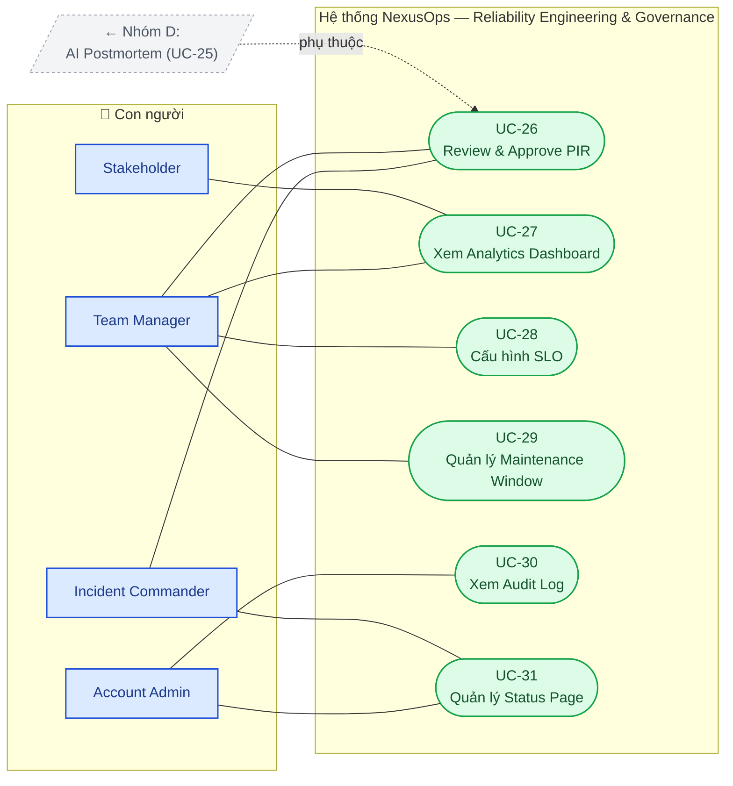
```mermaid
flowchart LR
    subgraph ACTORS_E["👤 Con người"]
        Commander3[Incident Commander]
        TeamManagerE[Team Manager]
        AccountAdmin2[Account Admin]
        Stakeholder2[Stakeholder]
    end

    subgraph SYS_E["Hệ thống NexusOps — Reliability Engineering & Governance"]
        UC26(["UC-26<br/>Review & Approve PIR"])
        UC27(["UC-27<br/>Xem Analytics Dashboard"])
        UC28(["UC-28<br/>Cấu hình SLO"])
        UC29(["UC-29<br/>Quản lý Maintenance Window"])
        UC30(["UC-30<br/>Xem Audit Log"])
        UC31(["UC-31<br/>Quản lý Status Page"])
    end

    REF_PM2[/"← Nhóm D:<br/>AI Postmortem (UC-25)"/]

    Commander3 --- UC26
    TeamManagerE --- UC26
    TeamManagerE --- UC27
    Stakeholder2 --- UC27
    TeamManagerE --- UC28
    TeamManagerE --- UC29
    AccountAdmin2 --- UC30
    AccountAdmin2 --- UC31
    Commander3 --- UC31

    REF_PM2 -.->|"phụ thuộc"| UC26

    classDef actorHuman fill:#dbeafe,stroke:#1d4ed8,stroke-width:1.5px,color:#1e3a8a
    classDef usecase fill:#dcfce7,stroke:#16a34a,stroke-width:1.5px,color:#14532d
    classDef refNode fill:#f3f4f6,stroke:#9ca3af,stroke-width:1px,stroke-dasharray: 3 3,color:#4b5563
    class Commander3,TeamManagerE,AccountAdmin2,Stakeholder2 actorHuman
    class UC26,UC27,UC28,UC29,UC30,UC31 usecase
    class REF_PM2 refNode
```

**UC-26 — Review & Approve Post-Incident Review**
- **Tác nhân:** Incident Commander, Team Manager
- **Mô tả:** Xem xét, chỉnh sửa và phê duyệt bản PIR do AI soạn thảo.
- **Điều kiện tiên quyết:** PIR ở trạng thái `DRAFT` (UC-25).
- **Luồng sự kiện chính:**
  1. Actor xem xét bản nháp, chỉnh sửa nội dung, gán owner/due date cho action item.
  2. Actor chuyển trạng thái `IN_REVIEW` → `APPROVED` → `COMPLETED` khi action item hoàn tất.
- **Điều kiện sau:** PIR chính thức được lưu vào Knowledge Base, phục vụ các lần AI investigation sau này.

**UC-27 — Xem Analytics Dashboard**
- **Tác nhân:** Team Manager, Stakeholder
- **Mô tả:** Xem các chỉ số reliability (MTTA, MTTR, MTTD, alert-noise funnel, escalation rate).
- **Điều kiện tiên quyết:** Có đủ dữ liệu incident lịch sử.
- **Luồng sự kiện chính:**
  1. Actor mở Dashboard.
  2. Hệ thống tính toán các metric trực tiếp từ timestamp của incident.
  3. Dashboard hiển thị biểu đồ theo service/team/khoảng thời gian.
- **Điều kiện sau:** Actor có cái nhìn tổng quan về reliability để ra quyết định cải tiến.

**UC-28 — Cấu hình SLO**
- **Tác nhân:** Team Manager
- **Mô tả:** Khai báo SLO và error budget cho một service.
- **Điều kiện tiên quyết:** Service đã tồn tại.
- **Luồng sự kiện chính:**
  1. Team Manager nhập mục tiêu SLO (ví dụ 99.9%) cho service.
  2. Hệ thống lấy SLI từ monitoring adapter, tính good/total hoặc hợp các khoảng unavailable theo §3.5; thiếu nguồn thì báo chưa có dữ liệu.
- **Điều kiện sau:** Service có SLO versioned; chỉ công bố burn rate khi có SLI/cửa sổ hợp lệ, incident dùng để liên kết giải thích.

**UC-29 — Quản lý Maintenance Window**
- **Tác nhân:** Team Manager
- **Mô tả:** Đặt lịch bảo trì cho một service, trong đó event không được tạo thành incident.
- **Điều kiện tiên quyết:** Service đã tồn tại.
- **Luồng sự kiện chính:**
  1. Team Manager tạo maintenance window qua khoảng thời gian bắt đầu/kết thúc.
  2. Trong khoảng thời gian đó, TRIGGER mới khớp bị suppress; RESOLVE đúng episode đã theo dõi vẫn được xử lý.
- **Điều kiện sau:** Việc bảo trì không gây nhiễu alert giả cho on-call responder.

**UC-30 — Xem Audit Log**
- **Tác nhân:** Account Admin
- **Mô tả:** Tra cứu lịch sử các hành động có quyền hạn cao trong hệ thống.
- **Điều kiện tiên quyết:** Actor có quyền `AUDIT_VIEW`.
- **Luồng sự kiện chính:**
  1. Admin truy vấn audit log theo actor, resource, khoảng thời gian.
  2. Hệ thống trả về danh sách bản ghi (ai, làm gì, khi nào, giá trị cũ → mới).
- **Điều kiện sau:** Admin có đầy đủ thông tin để phục vụ điều tra nội bộ hoặc tuân thủ.

**UC-31 — Quản lý Status Page**
- **Tác nhân:** Account Admin, Incident Commander, Communications Lead
- **Mô tả:** Cập nhật trang trạng thái công khai/nội bộ phản ánh tình trạng vận hành của các service.
- **Điều kiện tiên quyết:** Service đã tồn tại trong Service Directory.
- **Luồng sự kiện chính:**
  1. Hệ thống tự động đề xuất cập nhật status page dựa trên trạng thái incident hiện tại.
  2. Actor xem xét, chỉnh sửa nội dung hướng tới công chúng (nếu cần), phê duyệt trước khi công bố.
- **Điều kiện sau:** Status Page phản ánh đúng và kịp thời tình trạng vận hành các service.

### 4.7 Sơ đồ Bổ sung — Sequence & State Diagram cho các Luồng Phức tạp

**4.7.1 Sequence Diagram — Xử lý Automation & AI Operations**

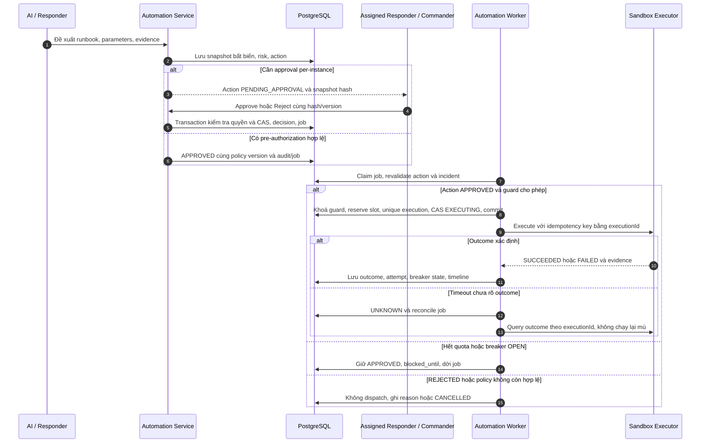
```mermaid
sequenceDiagram
    autonumber
    participant AI as AI / Responder
    participant API as Automation Service
    participant DB as PostgreSQL
    participant HUM as Assigned Responder / Commander
    participant W as Automation Worker
    participant EX as Sandbox Executor
    AI->>API: Đề xuất runbook, parameters, evidence
    API->>DB: Lưu snapshot bất biến, risk, action
    alt Cần approval per-instance
        API-->>HUM: Action PENDING_APPROVAL và snapshot hash
        HUM->>API: Approve hoặc Reject cùng hash/version
        API->>DB: Transaction kiểm tra quyền và CAS, decision, job
    else Có pre-authorization hợp lệ
        API->>DB: APPROVED cùng policy version và audit/job
    end
    W->>DB: Claim job, revalidate action và incident
    alt Action APPROVED và guard cho phép
        W->>DB: Khoá guard, reserve slot, unique execution, CAS EXECUTING, commit
        W->>EX: Execute với idempotency key bằng executionId
        alt Outcome xác định
            EX-->>W: SUCCEEDED hoặc FAILED và evidence
            W->>DB: Lưu outcome, attempt, breaker state, timeline
        else Timeout chưa rõ outcome
            W->>DB: UNKNOWN và reconcile job
            W->>EX: Query outcome theo executionId, không chạy lại mù
        end
    else Hết quota hoặc breaker OPEN
        W->>DB: Giữ APPROVED, blocked_until, dời job
    else REJECTED hoặc policy không còn hợp lệ
        W->>DB: Không dispatch, ghi reason hoặc CANCELLED
    end
```

**4.7.2 Sequence Diagram — Escalation & Notification**

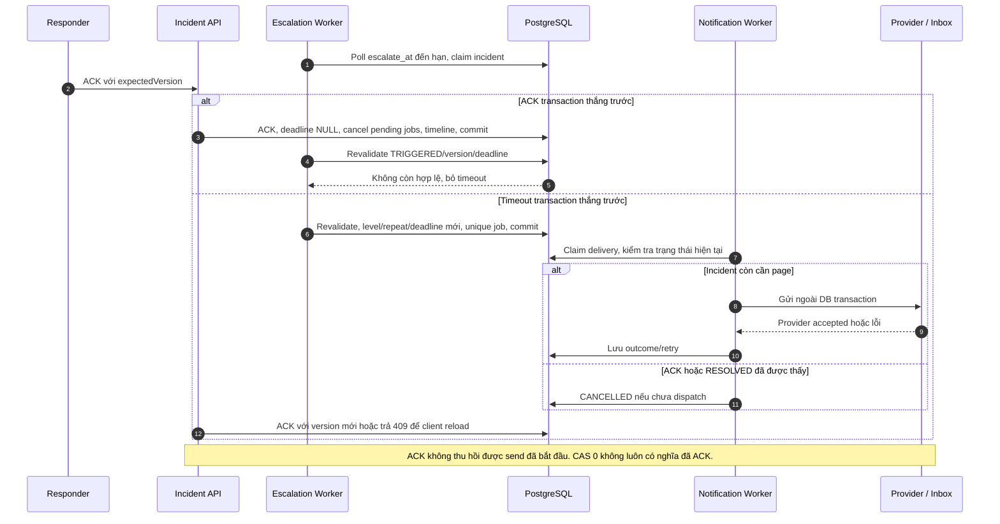
```mermaid
sequenceDiagram
    autonumber
    participant R as Responder
    participant API as Incident API
    participant E as Escalation Worker
    participant DB as PostgreSQL
    participant N as Notification Worker
    participant P as Provider / Inbox
    E->>DB: Poll escalate_at đến hạn, claim incident
    R->>API: ACK với expectedVersion
    alt ACK transaction thắng trước
        API->>DB: ACK, deadline NULL, cancel pending jobs, timeline, commit
        E->>DB: Revalidate TRIGGERED/version/deadline
        DB-->>E: Không còn hợp lệ, bỏ timeout
    else Timeout transaction thắng trước
        E->>DB: Revalidate, level/repeat/deadline mới, unique job, commit
        N->>DB: Claim delivery, kiểm tra trạng thái hiện tại
        alt Incident còn cần page
            N->>P: Gửi ngoài DB transaction
            P-->>N: Provider accepted hoặc lỗi
            N->>DB: Lưu outcome/retry
        else ACK hoặc RESOLVED đã được thấy
            N->>DB: CANCELLED nếu chưa dispatch
        end
        API->>DB: ACK với version mới hoặc trả 409 để client reload
    end
    Note over API,P: ACK không thu hồi được send đã bắt đầu. CAS 0 không luôn có nghĩa đã ACK.
```

**4.7.3 State Diagram — Vòng đời Incident**

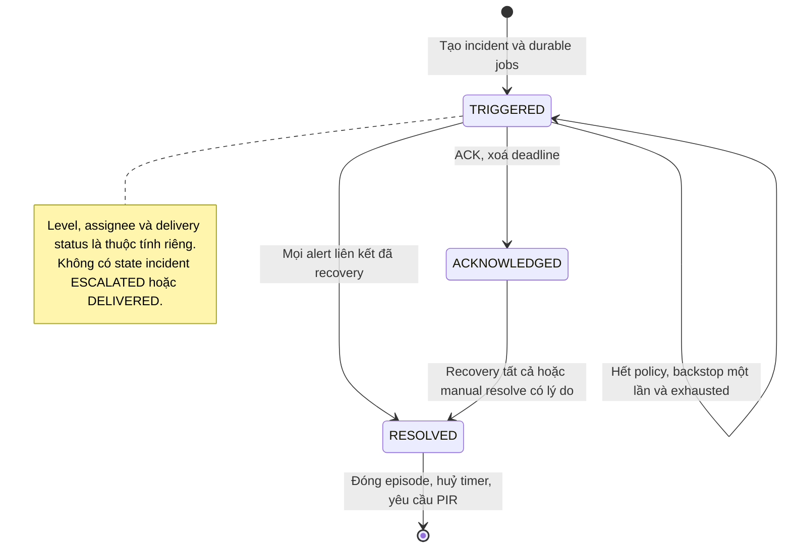
```mermaid
stateDiagram-v2
    [*] --> TRIGGERED : Tạo incident và durable jobs
    TRIGGERED --> TRIGGERED : Repeat hoặc level hợp lệ, deadline mới
    TRIGGERED --> TRIGGERED : Hết policy, backstop một lần và exhausted
    TRIGGERED --> ACKNOWLEDGED : ACK, xoá deadline
    TRIGGERED --> RESOLVED : Mọi alert liên kết đã recovery
    ACKNOWLEDGED --> RESOLVED : Recovery tất cả hoặc manual resolve có lý do
    RESOLVED --> [*] : Đóng episode, huỷ timer, yêu cầu PIR
    note right of TRIGGERED
        Level, assignee và delivery status là thuộc tính riêng.
        Không có state incident ESCALATED hoặc DELIVERED.
    end note
```

**4.7.4 State Diagram — Vòng đời Post-Incident Review (PIR)**

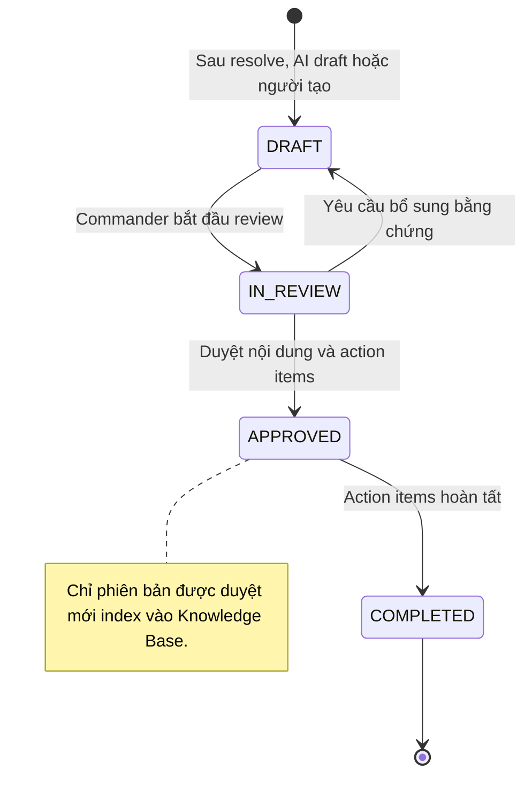
```mermaid
stateDiagram-v2
    [*] --> DRAFT : Sau resolve, AI draft hoặc người tạo
    DRAFT --> IN_REVIEW : Commander bắt đầu review
    IN_REVIEW --> DRAFT : Yêu cầu bổ sung bằng chứng
    IN_REVIEW --> APPROVED : Duyệt nội dung và action items
    APPROVED --> COMPLETED : Action items hoàn tất
    COMPLETED --> [*]
    note right of APPROVED
        Chỉ phiên bản được duyệt mới index vào Knowledge Base.
    end note
```

**4.7.5 Sequence Diagram — Event Ingestion: Idempotency & Atomic Handoff**

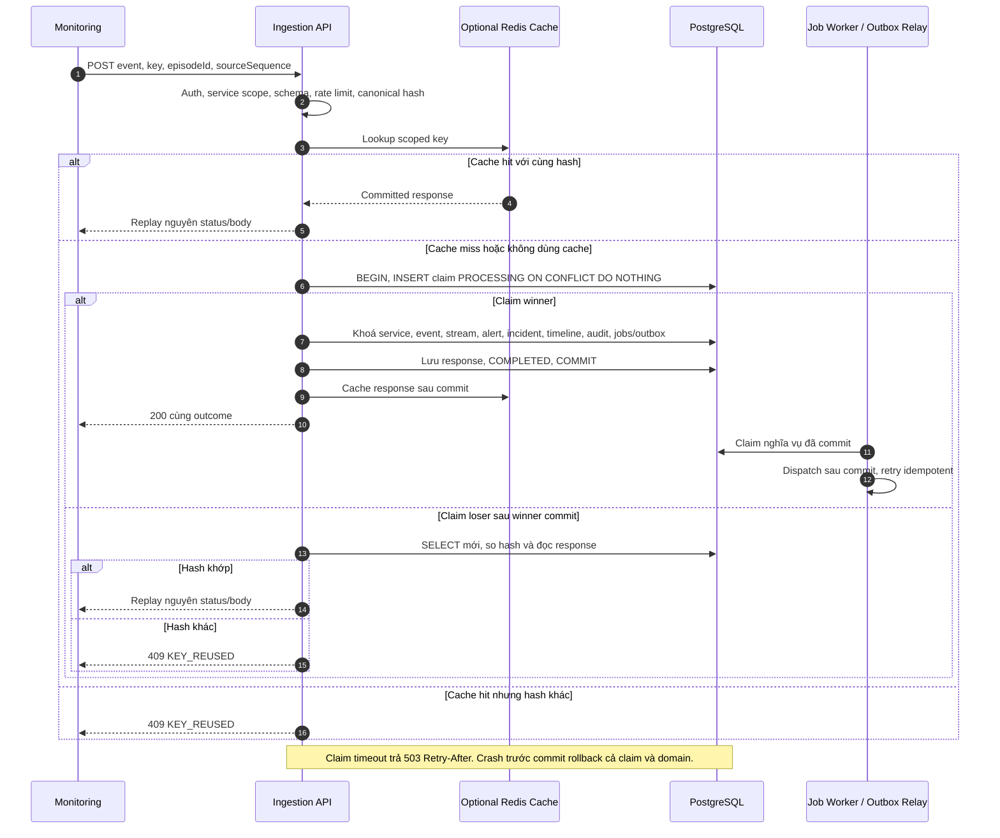
```mermaid
sequenceDiagram
    autonumber
    participant M as Monitoring
    participant API as Ingestion API
    participant C as Optional Redis Cache
    participant DB as PostgreSQL
    participant W as Job Worker / Outbox Relay
    M->>API: POST event, key, episodeId, sourceSequence
    API->>API: Auth, service scope, schema, rate limit, canonical hash
    API->>C: Lookup scoped key
    alt Cache hit với cùng hash
        C-->>API: Committed response
        API-->>M: Replay nguyên status/body
    else Cache miss hoặc không dùng cache
        API->>DB: BEGIN, INSERT claim PROCESSING ON CONFLICT DO NOTHING
        alt Claim winner
            API->>DB: Khoá service, event, stream, alert, incident, timeline, audit, jobs/outbox
            API->>DB: Lưu response, COMPLETED, COMMIT
            API->>C: Cache response sau commit
            API-->>M: 200 cùng outcome
            W->>DB: Claim nghĩa vụ đã commit
            W->>W: Dispatch sau commit, retry idempotent
        else Claim loser sau winner commit
            API->>DB: SELECT mới, so hash và đọc response
            alt Hash khớp
                API-->>M: Replay nguyên status/body
            else Hash khác
                API-->>M: 409 KEY_REUSED
            end
        end
    else Cache hit nhưng hash khác
        API-->>M: 409 KEY_REUSED
    end
    Note over API,DB: Claim timeout trả 503 Retry-After. Crash trước commit rollback cả claim và domain.
```

**4.7.6 Decision Flow — Dedup & Recovery theo Episode**

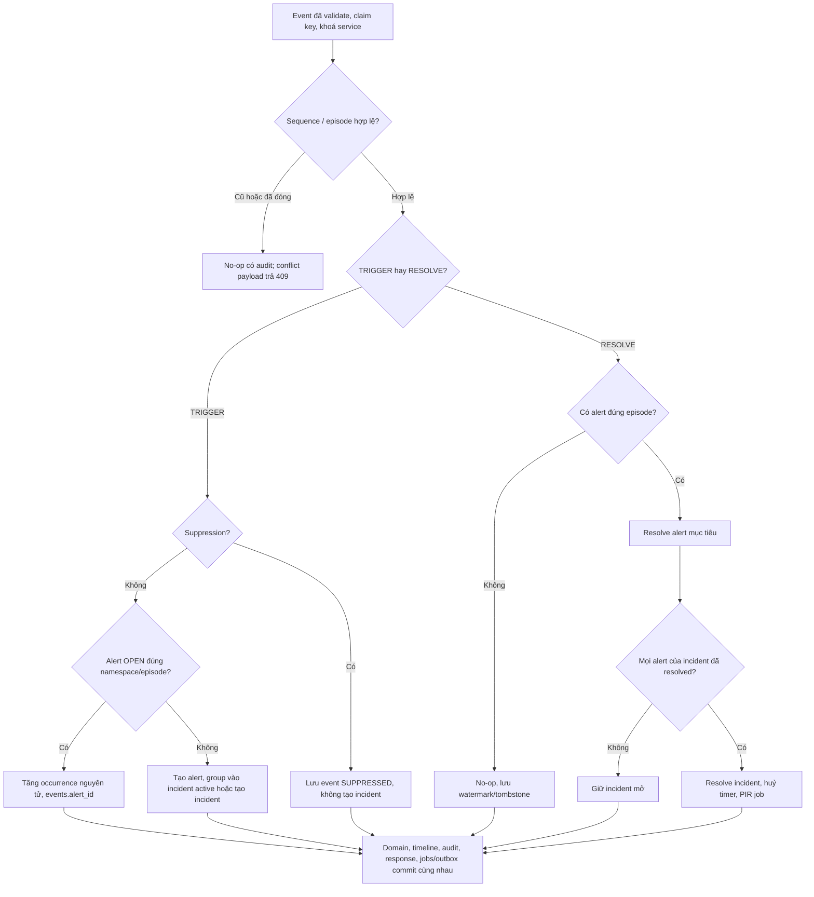
```mermaid
flowchart TD
    S["Event đã validate, claim key, khoá service"] --> O{"Sequence / episode hợp lệ?"}
    O -->|"Cũ hoặc đã đóng"| NO["No-op có audit; conflict payload trả 409"]
    O -->|"Hợp lệ"| TYPE{"TRIGGER hay RESOLVE?"}
    TYPE -->|"TRIGGER"| SUP{"Suppression?"}
    SUP -->|"Có"| STORE["Lưu event SUPPRESSED, không tạo incident"]
    SUP -->|"Không"| OPEN{"Alert OPEN đúng namespace/episode?"}
    OPEN -->|"Có"| COUNT["Tăng occurrence nguyên tử, events.alert_id"]
    OPEN -->|"Không"| NEW["Tạo alert, group vào incident active hoặc tạo incident"]
    TYPE -->|"RESOLVE"| MATCH{"Có alert đúng episode?"}
    MATCH -->|"Không"| TOMB["No-op, lưu watermark/tombstone"]
    MATCH -->|"Có"| AR["Resolve alert mục tiêu"]
    AR --> ALL{"Mọi alert của incident đã resolved?"}
    ALL -->|"Không"| KEEP["Giữ incident mở"]
    ALL -->|"Có"| IR["Resolve incident, huỷ timer, PIR job"]
    COUNT --> COM["Domain, timeline, audit, response, jobs/outbox commit cùng nhau"]
    NEW --> COM
    STORE --> COM
    TOMB --> COM
    KEEP --> COM
    IR --> COM
```

**4.7.7 Sequence Diagram — AI Tool-Calling Loop**

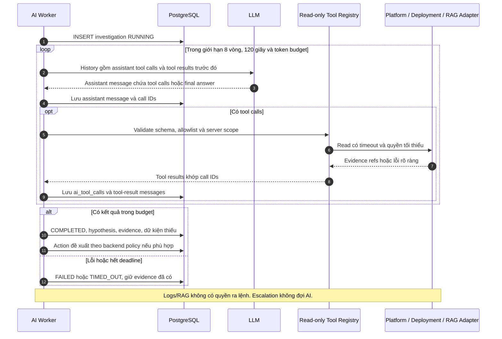
```mermaid
sequenceDiagram
    autonumber
    participant W as AI Worker
    participant DB as PostgreSQL
    participant L as LLM
    participant T as Read-only Tool Registry
    participant D as Platform / Deployment / RAG Adapter
    W->>DB: INSERT investigation RUNNING
    loop Trong giới hạn 8 vòng, 120 giây và token budget
        W->>L: History gồm assistant tool calls và tool results trước đó
        L-->>W: Assistant message chứa tool calls hoặc final answer
        W->>DB: Lưu assistant message và call IDs
        opt Có tool calls
            W->>T: Validate schema, allowlist và server scope
            T->>D: Read có timeout và quyền tối thiểu
            D-->>T: Evidence refs hoặc lỗi rõ ràng
            T-->>W: Tool results khớp call IDs
            W->>DB: Lưu ai_tool_calls và tool-result messages
        end
    end
    alt Có kết quả trong budget
        W->>DB: COMPLETED, hypothesis, evidence, dữ kiện thiếu
        W->>DB: Action đề xuất theo backend policy nếu phù hợp
    else Lỗi hoặc hết deadline
        W->>DB: FAILED hoặc TIMED_OUT, giữ evidence đã có
    end
    Note over W,D: Logs/RAG không có quyền ra lệnh. Escalation không đợi AI.
```

**4.7.8 State Diagram — Automation Action**

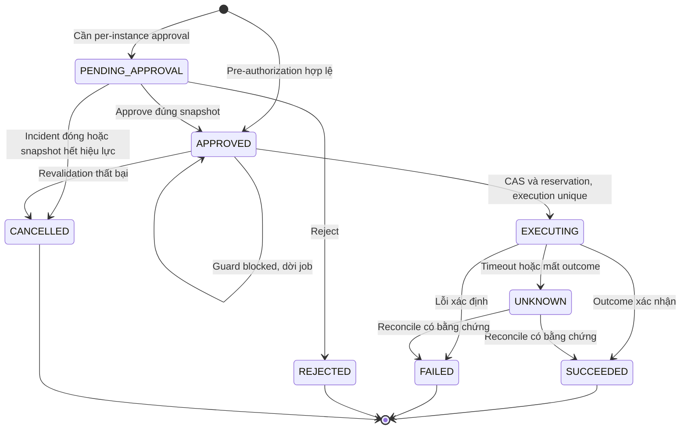
```mermaid
stateDiagram-v2
    [*] --> PENDING_APPROVAL : Cần per-instance approval
    [*] --> APPROVED : Pre-authorization hợp lệ
    PENDING_APPROVAL --> APPROVED : Approve đúng snapshot
    PENDING_APPROVAL --> REJECTED : Reject
    PENDING_APPROVAL --> CANCELLED : Incident đóng hoặc snapshot hết hiệu lực
    APPROVED --> APPROVED : Guard blocked, dời job
    APPROVED --> EXECUTING : CAS và reservation, execution unique
    APPROVED --> CANCELLED : Revalidation thất bại
    EXECUTING --> SUCCEEDED : Outcome xác nhận
    EXECUTING --> FAILED : Lỗi xác định
    EXECUTING --> UNKNOWN : Timeout hoặc mất outcome
    UNKNOWN --> SUCCEEDED : Reconcile có bằng chứng
    UNKNOWN --> FAILED : Reconcile có bằng chứng
    SUCCEEDED --> [*]
    FAILED --> [*]
    REJECTED --> [*]
    CANCELLED --> [*]
```

---

## 5. Mô hình Dữ liệu (Database Schema)

### 5.1 Tổng quan Entity theo Domain

Tên snake_case dưới đây dùng thống nhất cho bảng vật lý và ERD; DTO có thể dùng camelCase. Schema là đặc tả thiết kế, chưa thay cho migration đã chạy. Cột thời gian là TIMESTAMPTZ (instant UTC); cột nullable được giải thích trong §5.2. Các FK phải có index theo đường query.

| Domain | Bảng |
|---|---|
| Identity | `organizations`, `users`, `teams`, `team_members`, `roles`, `permissions`, `user_roles`, `role_permissions` |
| Service | `services`, `integrations`, `service_dependencies`, `deployments`, `maintenance_windows` |
| Event/Alert | `idempotency_keys`, `alert_streams`, `events`, `alerts`, `orchestration_rules` |
| Incident | `incidents`, `incident_events`, `incident_responders`, `incident_notes`, `incident_status_updates`, `incident_subscribers` |
| On-call | `schedules`, `schedule_layers`, `schedule_members`, `schedule_overrides`, `escalation_policies`, `escalation_rules`, `escalation_rule_targets` |
| Delivery | `jobs`, `outbox_events`, `consumer_receipts`, `notification_rules`, `notification_deliveries`, `notification_inbox` |
| AI/Knowledge | `ai_investigations`, `ai_tool_calls`, `knowledge_documents`, `knowledge_chunks` (embedding PGVector trực tiếp) |
| Automation | `runbooks`, `runbook_versions`, `automation_policies`, `evidence_snapshots`, `automation_actions`, `automation_approvals`, `automation_executions`, `automation_attempts`, `automation_guards`, `automation_reservations` |
| Governance | `post_incident_reviews`, `post_incident_actions`, `audit_logs`, `slo_configs`, `service_metrics`, `status_page_entries` |

Không dùng `incident_alerts` many-to-many song song với `alerts.incident_id`; grouping là quan hệ này, chưa cần `alert_groups` riêng. Không dùng bảng bucket `automation_rate_limits` cũ vì policy đã chọn sliding reservation + guard. Agent configuration là cấu hình ứng dụng versioned; chưa cần ai_agents/ai_sessions riêng. Workflow engine tổng quát là roadmap, không phải prerequisite của runbook đơn.

### 5.2 Quan hệ Entity Cốt lõi

- Organization chứa users/teams; service thuộc team, có nhiều integrations. Integration key bị giới hạn service; client không được tự chọn tenant. Policy có thể phục vụ nhiều service trong cùng team; schedule chỉ là một loại escalation target, không bắt buộc gắn trực tiếp service.
- Event có alert FK nullable cho suppressed/stale/unmatched recovery; nhiều event có thể trỏ cùng alert. Alert có một stream episode, tối đa một incident qua nullable `incident_id` (alert chưa đạt ngưỡng có thể chưa tạo incident). Alert đã gắn incident không chuyển sang incident khác trong baseline. Incident có ít nhất một alert sau transaction tạo bằng monitoring.
- Idempotency claim `response_*` nullable khi PROCESSING nhưng chỉ commit COMPLETED; transaction failure rollback cả claim. Integration FK là namespace nên bảng này có mặt trong ERD.
- `incidents.escalation_policy_snapshot` chứa ID/version, rules/targets, backstop đã validate; cấu hình thay đổi không âm thầm đổi incident đang xử lý. `escalate_at` nullable khi ACK/RESOLVED/exhausted. First ACK, resolved, actual failure và detected timestamp nullable theo lifecycle. `version` tăng với mỗi mutation; `incident_events` unique `(incident_id,aggregate_version)` cho một payload transition tổng hợp.
- `automation_actions.ai_investigation_id` nullable với action do người tạo, `policy_id` nullable với approval per-instance; `requested_by` nullable với SYSTEM/AI có actor type trong audit. Mỗi action có evidence snapshot tồn tại trong DB, runbook version bất biến; action hash bao trùm runbook version, parameters, target, effective risk và evidence hash. Các state/time tương ứng được CHECK. Một decision/action, một logical execution/action; nhiều transport attempts/execution. UNKNOWN không được tạo execution mới.
- `audit_logs.actor_id` nullable cho SYSTEM/INTEGRATION/AI; `actor_type` và payload xác định chủ thể thực, incident_id nullable cho thao tác cấu hình. Outbox resource/event identifiers không dùng FK đa hình giả; consumer_receipts là identity xử lý message.

Các bảng hỗ trợ/roadmap không mở rộng chi tiết trong ERD lõi có contract tối thiểu sau (UUID id PK trừ khi ghi khác; FK thể hiện bằng mũi tên):

| Bảng | Cột và ràng buộc tối thiểu |
|---|---|
| `maintenance_windows` | service_id → services, starts_at, ends_at, created_by → users; starts_at < ends_at |
| `orchestration_rules` | service_id → services, version, priority, conditions JSONB, actions JSONB, enabled; validation allowlist |
| `incident_notes` | incident_id → incidents, author_id → users, body, created_at |
| `incident_status_updates` | incident_id → incidents, author_id → users, body, audience, approved_at nullable, created_at |
| `incident_subscribers` | PK(incident_id → incidents, user_id → users) |
| `schedule_layers` | schedule_id → schedules, name, precedence, starts_at, rotation_rule JSONB |
| `schedule_members` | PK(layer_id → schedule_layers, user_id → users), position |
| `schedule_overrides` | schedule_id → schedules, user_id → users, starts_at, ends_at, priority; deterministic conflict rejection |
| `notification_rules` | user_id → users, priority, channel, delay_seconds, enabled |
| `knowledge_documents` | organization_id → organizations, service_id → services nullable, source_type/id, version, source_uri, ACL JSONB, content_hash, status |
| `knowledge_chunks` | document_id → knowledge_documents, ordinal, text, embedding VECTOR(d), embedding_model/version, UNIQUE(document_id,ordinal); dimension d pinned theo model |
| `slo_configs` | service_id → services, version, sli_type, target, window, query_ref, active; target trong (0,1) |
| `service_metrics` | service_id → services, slo_config_id → slo_configs, interval_start/end, good, total, source, quality; UNIQUE(slo_config_id,interval_start,interval_end) |
| `status_page_entries` | service_id → services, incident_id → incidents nullable, state, message, audience, approved_by → users nullable, published_at |

**State/ownership contract bổ sung.** jobs: PENDING/RUNNING/RETRYING/SUCCEEDED/FAILED/DLQ/CANCELLED; notification_deliveries: PENDING/SENDING/SENT/RETRYING/FAILED/DLQ/CANCELLED (DELIVERED là provider receipt tuỳ adapter, không phải ACK). Inbox unique(delivery_id,user_id), cursor tăng ổn định. Relay outbox cũng có lease/generation/backoff; không publish incident version sau khi version trước chưa được xác nhận. Domain-to-job dispatch không đồng thời xử lý hai lần qua DB worker và Kafka: cấu hình một đường delivery cho từng job type; message ID giữ nguyên nếu chuyển đường.

`user_roles.team_id` nullable cho role cấp organization; tenant suy ra từ users, role scoped assignment không vượt organization của user. `services.escalation_policy_id` nullable khi chưa active; service phải có policy/target/backstop hợp lệ trước khi nhận TRIGGER tạo incident. `incidents.assignee_id` nullable khi chưa resolve được target; backstop vẫn bắt buộc. Provider/deployment demo có `source=SIMULATOR` để phân biệt evidence thật. PIR job unique theo incident, retry không tạo PIR thứ hai; regenerate chỉ sửa DRAFT có version, không ghi đè bản đã APPROVED.

**Indexes và constraints bắt buộc.** SQL dưới đây áp dụng sau khi migrations đã tạo các bảng/cột ở ERD; đây không phải script bootstrap độc lập.

```sql
CREATE UNIQUE INDEX uq_idempotency_scope ON idempotency_keys (integration_id, key);
CREATE UNIQUE INDEX uq_alert_stream ON alert_streams (integration_id, service_id, dedup_key);
CREATE UNIQUE INDEX uq_alert_episode ON alerts (stream_id, episode_id);
CREATE UNIQUE INDEX uniq_open_dedup ON alerts (integration_id, service_id, dedup_key)
  WHERE status = 'OPEN';
CREATE INDEX ix_due_incident ON incidents (escalate_at)
  WHERE status = 'TRIGGERED' AND escalate_at IS NOT NULL;
CREATE UNIQUE INDEX uq_incident_number ON incidents (organization_id, incident_number);
CREATE UNIQUE INDEX uq_incident_transition ON incident_events (incident_id, aggregate_version);
CREATE UNIQUE INDEX uq_tool_call ON ai_tool_calls (ai_investigation_id, call_id);
CREATE UNIQUE INDEX uq_runbook_version ON runbook_versions (runbook_id, version);
CREATE UNIQUE INDEX uq_action_request ON automation_actions (incident_id, request_key);
CREATE INDEX ix_reservation_window ON automation_reservations (service_id, runbook_id, reserved_at);
CREATE INDEX ix_due_job ON jobs (available_at, lease_until)
  WHERE status IN ('PENDING', 'RETRYING', 'RUNNING');
ALTER TABLE alerts ADD CONSTRAINT ck_alert_count CHECK (occurrence_count > 0);
ALTER TABLE alerts ADD CONSTRAINT ck_alert_state CHECK (
  (status = 'OPEN' AND resolved_at IS NULL) OR
  (status = 'RESOLVED' AND resolved_at IS NOT NULL));
ALTER TABLE escalation_rule_targets ADD CONSTRAINT ck_one_target CHECK (
  num_nonnulls(user_id, schedule_id, team_id) = 1);
ALTER TABLE idempotency_keys ADD CONSTRAINT ck_idempotency_response CHECK (
  state IN ('PROCESSING', 'COMPLETED') AND
  (state <> 'COMPLETED' OR (response_status IS NOT NULL AND response_body IS NOT NULL)));
```

Các unique PK/UK còn lại thể hiện trong ERD; `(policy_id,level)`, `(execution_id,attempt_no)` và `(service_id,external_id)` của deployment cũng unique. Counter tăng bằng SQL nguyên tử, không read/increment/save. `event_type` CHECK TRIGGER/RESOLVE, incident state CHECK TRIGGERED/ACKNOWLEDGED/RESOLVED, criticality CHECK CRITICAL/HIGH/NORMAL. Incident resolved phải có resolved_at và escalate_at NULL; ACK phải có acknowledged_at và escalate_at NULL. Notification/automation terminal outcomes phải có timestamp tương ứng; window/repeat/attempt không âm. Response claim không được commit PROCESSING: service transaction và deferred constraint trigger trong migration kiểm tra final row state tại commit. Invariant không có OPEN alert trên RESOLVED incident được kiểm tra trong cùng service lock; deferred constraint trigger là lớp chặn cho mọi mutation alert/incident. Cross-service/integration FK phải kiểm tra bằng composite FK hoặc trigger theo tổ hợp ownership, không chỉ kiểm tra từng UUID tồn tại.

### 5.3 Sơ đồ Quan hệ Thực thể (ERD)

ERD tập trung đường đi dữ liệu lõi và correctness. Các thuộc tính bổ sung cấu hình/roadmap nằm ở §5.2; `PK`, `FK`, `UK` là ràng buộc thiết kế cần hiện thực bằng migration, không tự phát sinh từ Mermaid.


```mermaid
erDiagram
    organizations ||--o{ users : contains
    organizations ||--o{ teams : contains
    teams ||--o{ team_members : has
    users ||--o{ team_members : joins
    users ||--o{ user_roles : assigned
    roles ||--o{ user_roles : grants
    roles ||--o{ role_permissions : has
    permissions ||--o{ role_permissions : maps
    teams ||--o{ services : owns
    services ||--o{ service_dependencies : source
    services ||--o{ service_dependencies : target
    services ||--o{ integrations : has
    integrations ||--o{ idempotency_keys : scopes
    integrations ||--o{ events : receives
    integrations ||--o{ alert_streams : scopes
    alert_streams ||--o{ alerts : episodes
    alerts |o--o{ events : traces
    services ||--o{ alerts : owns
    incidents |o--o{ alerts : groups
    services ||--o{ incidents : impacts
    incidents ||--o{ incident_events : records
    incidents ||--o{ incident_responders : assigns
    users ||--o{ incident_responders : responds
    incidents |o--o{ audit_logs : correlates
    users |o--o{ audit_logs : acts
    escalation_policies |o--o{ services : selected
    escalation_policies ||--o{ escalation_rules : contains
    escalation_rules ||--o{ escalation_rule_targets : targets
    schedules |o--o{ escalation_rule_targets : resolves
    incidents |o--o{ jobs : schedules
    incidents ||--o{ notification_deliveries : triggers
    users ||--o{ notification_deliveries : receives
    notification_deliveries ||--o| notification_inbox : persists
    services ||--o{ deployments : history
    incidents ||--o{ ai_investigations : investigates
    ai_investigations ||--o{ ai_tool_calls : calls
    services ||--o{ runbooks : allows
    runbooks ||--o{ runbook_versions : versions
    runbook_versions ||--o{ automation_policies : authorizes
    runbook_versions ||--o{ automation_actions : instantiates
    incidents ||--o{ automation_actions : proposes
    ai_investigations |o--o{ automation_actions : recommends
    automation_policies |o--o{ automation_actions : preauthorizes
    evidence_snapshots ||--o{ automation_actions : freezes
    automation_actions ||--o| automation_approvals : decision
    users ||--o{ automation_approvals : decides
    automation_actions ||--o| automation_executions : executes
    automation_executions ||--o{ automation_attempts : attempts
    automation_executions ||--o| automation_reservations : reserves
    services ||--o{ automation_guards : protects
    runbooks ||--o{ automation_guards : limits
    services ||--o{ automation_reservations : scope
    runbooks ||--o{ automation_reservations : counts
    incidents ||--o| post_incident_reviews : reviews
    post_incident_reviews ||--o{ post_incident_actions : follows
    users ||--o{ post_incident_actions : owns
    organizations {
        uuid id PK
        string name
    }
    users {
        uuid id PK
        uuid organization_id FK
        string email
        string timezone
    }
    teams {
        uuid id PK
        uuid organization_id FK
        string name
    }
    team_members {
        uuid team_id PK,FK
        uuid user_id PK,FK
    }
    roles {
        uuid id PK
        string name
    }
    permissions {
        string code PK
    }
    user_roles {
        uuid id PK
        uuid user_id FK
        uuid role_id FK
        uuid team_id FK
    }
    role_permissions {
        uuid role_id PK,FK
        string permission_code PK,FK
    }
    services {
        string name
        string environment
        string repository_url
        string runbook_url
        uuid id PK
        uuid organization_id FK
        uuid team_id FK
        uuid escalation_policy_id FK
        string criticality
        string status
    }
    service_dependencies {
        uuid service_id PK,FK
        uuid depends_on_service_id PK,FK
    }
    integrations {
        string name
        string provider
        string status
        uuid id PK
        uuid service_id FK
        string key_hash
        boolean auto_resolve_enabled
    }
    idempotency_keys {
        timestamptz created_at
        timestamptz completed_at
        uuid integration_id PK,FK
        string key PK
        string request_hash
        string state
        int response_status
        jsonb response_body
        jsonb response_headers
        timestamptz expires_at
    }
    alert_streams {
        uuid id PK
        uuid integration_id FK
        uuid service_id FK
        string dedup_key
        string last_episode_id
        bigint last_source_sequence
        string last_payload_hash
        boolean episode_closed
    }
    events {
        uuid id PK
        uuid organization_id FK
        uuid integration_id FK
        uuid service_id FK
        uuid alert_id FK
        string event_type
        string signal_type
        string dedup_key
        string episode_id
        bigint source_sequence
        string outcome
        jsonb payload
        timestamptz occurred_at
        timestamptz received_at
    }
    alerts {
        string severity
        uuid id PK
        uuid organization_id FK
        uuid integration_id FK
        uuid service_id FK
        uuid stream_id FK
        uuid incident_id FK
        string dedup_key
        string episode_id
        string status
        bigint occurrence_count
        timestamptz created_at
        timestamptz resolved_at
        string resolution_reason
    }
    incidents {
        string severity
        uuid assignee_id FK
        uuid id PK
        uuid organization_id FK
        uuid service_id FK
        string incident_number
        string grouping_key
        string status
        string priority
        bigint version
        jsonb escalation_policy_snapshot
        int escalation_level
        int escalation_repeat
        boolean escalation_exhausted
        timestamptz escalate_at
        timestamptz triggered_at
        timestamptz acknowledged_at
        timestamptz resolved_at
        timestamptz actual_failure_at
        timestamptz detected_at
        jsonb detection_evidence
    }
    incident_responders {
        uuid incident_id PK,FK
        uuid user_id PK,FK
        string role
    }
    incident_events {
        uuid id PK
        uuid incident_id FK
        bigint aggregate_version
        string event_type
        jsonb payload
        timestamptz created_at
    }
    audit_logs {
        uuid id PK
        uuid organization_id FK
        uuid incident_id FK
        uuid actor_id FK
        string actor_type
        string action
        string resource_type
        uuid resource_id
        uuid correlation_id
        jsonb old_value
        jsonb new_value
        timestamptz created_at
    }
    escalation_policies {
        uuid id PK
        uuid team_id FK
        int version
        uuid backstop_user_id FK
    }
    escalation_rules {
        uuid id PK
        uuid policy_id FK
        int level
        int timeout_minutes
        int repeat_count
        int repeat_interval_minutes
    }
    escalation_rule_targets {
        uuid id PK
        uuid rule_id FK
        uuid user_id FK
        uuid schedule_id FK
        uuid team_id FK
    }
    schedules {
        uuid id PK
        uuid team_id FK
        string timezone
        jsonb rotation_rule
        string dst_policy
    }
    jobs {
        uuid id PK
        uuid incident_id FK
        string job_key UK
        string job_type
        jsonb payload
        string status
        timestamptz available_at
        string lease_owner
        timestamptz lease_until
        bigint lease_generation
        int attempts
        string last_error
    }
    outbox_events {
        string lease_owner
        timestamptz lease_until
        bigint lease_generation
        int attempts
        timestamptz available_at
        uuid id PK
        uuid organization_id FK
        string aggregate_type
        uuid aggregate_id
        bigint aggregate_version
        string event_type
        int schema_version
        uuid correlation_id
        jsonb payload
        timestamptz created_at
        timestamptz published_at
    }
    consumer_receipts {
        string consumer_name PK
        uuid event_id PK
        timestamptz processed_at
    }
    notification_deliveries {
        uuid id PK
        uuid incident_id FK
        uuid target_user_id FK
        string delivery_key UK
        string channel
        string status
        string provider_message_id
        int retry_count
        timestamptz sent_at
    }
    notification_inbox {
        uuid id PK
        uuid delivery_id FK
        uuid user_id FK
        bigint cursor UK
        jsonb content
        timestamptz created_at
        timestamptz read_at
    }
    deployments {
        uuid id PK
        uuid service_id FK
        string external_id
        string version
        string environment
        string source
        string evidence_uri
        timestamptz deployed_at
    }
    ai_investigations {
        uuid id PK
        uuid incident_id FK
        string state
        string model_version
        jsonb conversation
        string hypothesis
        float confidence_score
        jsonb evidence_refs
        timestamptz started_at
        timestamptz deadline_at
        timestamptz finished_at
        string error
    }
    ai_tool_calls {
        uuid id PK
        uuid ai_investigation_id FK
        string call_id
        string tool_name
        jsonb input
        jsonb output
        jsonb evidence_refs
        string status
        timestamptz called_at
        timestamptz finished_at
    }
    runbooks {
        uuid id PK
        uuid service_id FK
        string name
    }
    runbook_versions {
        uuid id PK
        uuid runbook_id FK
        int version
        string base_risk
        boolean requires_approval
        jsonb parameter_schema
        jsonb target_allowlist
        string executor_ref
    }
    automation_policies {
        uuid id PK
        uuid runbook_version_id FK
        uuid service_id FK
        uuid authorized_by FK
        int version
        jsonb allowed_scope
        timestamptz expires_at
        timestamptz revoked_at
    }
    evidence_snapshots {
        uuid id PK
        jsonb content
        string sha256
        timestamptz created_at
    }
    automation_actions {
        uuid id PK
        uuid incident_id FK
        uuid runbook_version_id FK
        uuid ai_investigation_id FK
        uuid policy_id FK
        uuid evidence_snapshot_id FK
        jsonb parameters
        jsonb target_snapshot
        string snapshot_hash
        string effective_risk
        string state
        bigint version
        uuid requested_by FK
        string request_key
        string blocked_reason
        timestamptz blocked_until
    }
    automation_approvals {
        uuid id PK
        uuid action_id FK,UK
        uuid decided_by FK
        string snapshot_hash
        string decision
        timestamptz decided_at
    }
    automation_executions {
        uuid id PK
        uuid action_id FK,UK
        string executor_key UK
        string status
        jsonb outcome
        timestamptz started_at
        timestamptz finished_at
    }
    automation_attempts {
        uuid id PK
        uuid execution_id FK
        int attempt_no
        string operation
        string outcome
        timestamptz started_at
        timestamptz finished_at
    }
    automation_guards {
        uuid service_id PK,FK
        uuid runbook_id PK,FK
        string breaker_state
        int consecutive_failures
        timestamptz open_until
        uuid probe_execution_id
        bigint version
    }
    automation_reservations {
        uuid execution_id PK,FK
        uuid service_id FK
        uuid runbook_id FK
        timestamptz reserved_at
    }
    post_incident_reviews {
        uuid id PK
        uuid incident_id FK,UK
        string status
        int version
        jsonb content
    }
    post_incident_actions {
        uuid id PK
        uuid post_incident_review_id FK
        uuid owner_id FK
        string action_type
        date due_date
        string status
    }
```

### 5.4 Vận hành & An toàn Dữ liệu

**Tenant boundary.** Baseline một organization, single-tenant; không tuyên bố đã có multi-tenant chỉ vì tồn tại organization_id. Khi mở rộng: thêm organization_id và composite FK/unique theo tenant trên toàn bộ dữ liệu tenant-owned; kiểm tra API, jobs, outbox, retrieval, cache, WebSocket và object authorization. Worker lấy tenant từ envelope đã xác thực và DB ownership, không tin payload khách hàng.

RLS dùng application role không owner/superuser/BYPASSRLS; tenant context phải transaction-local và fail closed khi thiếu. `FORCE ROW LEVEL SECURITY` cần cho owner nhưng không loại bỏ đặc quyền superuser/BYPASSRLS. Ví dụ dưới đây chỉ minh hoạ cho incidents, không chứng minh đủ policy toàn hệ thống. Tham chiếu [PostgreSQL — Row Security](https://www.postgresql.org/docs/current/ddl-rowsecurity.html).

```sql
ALTER TABLE incidents ENABLE ROW LEVEL SECURITY;
ALTER TABLE incidents FORCE ROW LEVEL SECURITY;
CREATE POLICY incident_tenant_policy ON incidents
  USING (organization_id = nullif(current_setting('app.current_org_id', true), '')::uuid)
  WITH CHECK (organization_id = nullif(current_setting('app.current_org_id', true), '')::uuid);
-- Trong BEGIN/COMMIT, bind :org_id từ identity đã xác thực:
SELECT set_config('app.current_org_id', :org_id, true);
```

**Retention, partition và restore.** Baseline chưa partition. Retention mặc định dự kiến: raw events 90 ngày; tool payload và delivery detail 180 ngày; idempotency tối thiểu 7 ngày; timeline/PIR/approval/evidence theo vòng đời incident và chính sách lưu trữ tổ chức. Audit không có API sửa/xoá; không hứa lưu vĩnh viễn hoặc compliance pháp lý chưa đánh giá. Evidence snapshot dùng cho approval phải được giữ cùng decision/execution, dù log nguồn hết hạn. `alert_streams` watermark/tombstone giữ lâu hơn cửa sổ replay nguồn; nếu không có giới hạn late arrival thì không tự xoá.

Partitioning chỉ đưa vào sau đo tải. Với PostgreSQL partition theo received_at, PK/unique cấp parent cần chứa partition key: không giữ PK(id) đơn như bảng chưa partition; phải thiết kế lại FK/identity tương ứng trước migration. Không partition bảng idempotency theo cách phá uniqueness integration/key. Có archive/purge job kiểm tra FK/evidence và backup restore/PITR diễn tập; không drop partition đang được evidence bắt buộc tham chiếu.

**Append-only và master data.** Application role không có UPDATE/DELETE/TRUNCATE trên audit_logs, incident_events, automation_approvals và evidence_snapshots; không sở hữu bảng. Runbook/policy version đã được action tham chiếu không sửa nội dung; thu hồi qua trạng thái riêng có audit. DBA đặc quyền vẫn có thể đổi dữ liệu: cần external audit/backup để phát hiện, không tuyên bố chống sửa tuyệt đối. Service/user đã có lịch sử dùng disable/deactivate hoặc anonymization được thiết kế, FK ON DELETE RESTRICT giữ chuỗi truy vết. Secrets không được lưu trong snapshot/log; chỉ lưu secret reference.

---

## 6. Nguyên tắc Thiết kế API (API Design Guidelines)

### 6.1 Nguyên tắc Thiết kế

- **Hai bề mặt API riêng biệt.** Một **Events API** machine-generated (`POST /api/v1/events`) tối ưu cho throughput ingestion cao, xác thực bằng API key theo integration, tách biệt khỏi **Management API** hướng resource dùng cho cấu hình và thao tác do con người thực hiện, xác thực bằng **JWT** (cặp access + refresh token).
- **Versioning.** Toàn bộ endpoint nằm dưới namespace `/api/v1/`; breaking change yêu cầu thêm version segment mới thay vì sửa trực tiếp một contract đang tồn tại. Version cũ được giữ tối thiểu 6 tháng sau khi version mới phát hành, kèm header `Sunset` báo ngày ngừng hỗ trợ.
- **Đặt tên hướng resource.** Endpoint dùng danh từ số nhiều và các HTTP verb chuẩn (`GET`, `POST`, `PATCH`, `DELETE`); các hành động thay đổi trạng thái không thuần CRUD được biểu diễn dưới dạng sub-resource hoặc verb (`POST /incidents/{id}/acknowledge`, `POST /incidents/{id}/escalate`).
- **Idempotency-Key và dedupKey — hai lớp bảo vệ khác nhau, không thay thế nhau.** `Idempotency-Key` (HTTP header, bắt buộc trên mọi `POST /api/v1/events`) chống trùng lặp do **retry mạng** ở tầng vận chuyển — cùng key trả về đúng response đã lưu (xem `idempotency_keys`, §2.6). `dedupKey` (trường ở tầng domain, bắt buộc trong body) chống trùng lặp **nghiệp vụ** theo thời gian — nhiều request khác nhau, hợp lệ, nhưng cùng phản ánh một sự cố đang mở thì gộp thành một alert (xem `uniq_open_dedup`, §2.6). Request thiếu một trong hai bị từ chối 400 trước claim; namespace/hash/retention/replay theo §2.6.
- **Authorization theo permission code.** Mỗi endpoint của Management API được gắn với một hoặc nhiều permission code cụ thể (`INCIDENT_ACK`, `ESCALATION_MANAGE`, `AUTOMATION_EXECUTE`, `AUDIT_VIEW`,...) kiểm tra qua middleware trước khi vào business logic, resolve từ `users → user_roles → roles → role_permissions → permissions` (xem ERD §5.3). Luôn kiểm tra object scope; approval còn yêu cầu assigned responder/Commander (§3.4). Thiếu permission trả về `403` kèm `code: PERMISSION_DENIED`, không phải `401` (vốn dành riêng cho thiếu/hết hạn xác thực).
- **Định dạng lỗi nhất quán.** Lỗi trả về dưới dạng body có cấu trúc (`code`, `message`, `details`) thay vì một chuỗi text thuần, để cả UI và các integration đều có thể xử lý rẽ nhánh theo `code` (ví dụ minh hoạ ở §6.3).
- **Quy ước HTTP status code.** `200` cho GET/action thành công; `201` cho tạo mới resource; `202` cho request được nhận nhưng xử lý bất đồng bộ (ví dụ AI investigation); `204` cho action thành công không có response body; `4xx` cho lỗi phía client (`400` sai định dạng, `401` chưa xác thực, `403` thiếu quyền, `404` không tồn tại, `409` xung đột — ví dụ `Idempotency-Key` trùng nhưng request body khác hash, `429` vượt rate limit); `5xx` cho lỗi phía server.
- **Pagination.** Các endpoint dạng list chấp nhận tham số `page`/`size` (hoặc cursor-based `after`) và trả về một envelope nhất quán với page metadata khi dùng offset hoặc nextCursor khi dùng cursor; cursor API không bắt buộc đếm tổng số bản ghi.
- **Rate limiting.** Áp dụng theo từng integration key tại biên Events API; hạn mức và phần còn lại được trả về qua header `X-RateLimit-*`, 429 có Retry-After. Token bucket cần phép toán nguyên tử, không đồng nhất với INCR đơn lẻ.

### 6.2 Tổng quan Resource API

Các path viết gọn trong bảng đều thêm `/api/v1`; Events API đã viết đầy đủ. Endpoint roadmap chỉ được công bố khi capability đã triển khai.

| Domain | Endpoint chính | Use Case |
|---|---|---|
| Auth | `POST /auth/register`, `POST /auth/login`, `POST /auth/refresh`, `POST /auth/logout`, `GET /users/me` | UC-01 |
| RBAC | `GET /roles`, `POST /users/{id}/roles`, `GET /permissions` | UC-02 |
| Organizations & Teams | `POST /organizations`, `POST /teams`, `POST /teams/{id}/members` | UC-03 |
| Services | `POST /services`, `GET /services`, `GET /services/{id}`, `PATCH /services/{id}` | UC-04 |
| Service Dependencies | `POST /services/{id}/dependencies`, `GET /services/{id}/dependencies` | UC-05 |
| Integrations | `POST /services/{id}/integrations` | UC-06 |
| Events (ingestion) | `POST /api/v1/events` | UC-07 |
| Orchestration Rules | `POST /orchestration-rules`, `GET /orchestration-rules` | UC-08 |
| Alerts | `GET /alerts`, `GET /alerts/{id}`, `POST /alerts/{id}/resolve` | UC-09 |
| Incidents | `GET /incidents`, `GET /incidents/{id}`, `POST /incidents/{id}/acknowledge`, `POST /incidents/{id}/resolve`, `POST /incidents/{id}/escalate`, `POST /incidents/{id}/responders`, `POST /incidents/{id}/notes`, `POST /incidents/{id}/status-updates` | UC-10, 11, 12, 17, 18, 19 |
| Schedules | `POST /schedules`, `GET /schedules/{id}/on-call`, `POST /schedules/{id}/overrides` | UC-13, 14 |
| Escalation Policies | `POST /escalation-policies`, `GET /escalation-policies` | UC-15 |
| Notifications | `GET /notifications`, `PATCH /notification-rules/{id}` | UC-16 |
| AI | `POST /ai/incidents/{id}/triage`, `POST /ai/incidents/{id}/investigate`, `POST /ai/incidents/{id}/summarize`, `GET /knowledge/search` | UC-22, 23, 24, 25 |
| Automation | `GET /runbooks`, `POST /runbooks/{id}/execute`, `POST /automation/{id}/approve`, `POST /automation/{id}/reject`, `GET /automation/{id}` | UC-20, 21 |
| Post-Incident Review | `GET /incidents/{id}/pir`, `PATCH /pir/{id}`, `POST /pir/{id}/approve` | UC-26 |
| Analytics | `GET /analytics/metrics` (MTTA/MTTR/MTTD), `GET /analytics/alert-funnel` | UC-27 |
| SLO | `POST /services/{id}/slo`, `GET /services/{id}/slo/burn-rate` | UC-28 |
| Maintenance Windows | `POST /services/{id}/maintenance-windows` | UC-29 |
| Audit Log | `GET /audit-logs` | UC-30 |
| Status Page | `GET /status-page`, `PATCH /status-page` | UC-31 |

**Kênh realtime (ngoài REST).** WebSocket/SSE chỉ push sau khi message/inbox/timeline đã lưu bền. Handshake xác thực và kiểm tra quyền incident, revalidate khi membership/token thay đổi; không log credential hoặc truyền token dài hạn trong URL. Browser dùng cookie session an toàn hoặc short-lived WebSocket ticket qua API có auth. Mọi mutation qua REST; reconnect dùng cursor inbox/timeline để catch-up, xử lý eventId trùng. Không hứa online delivery chỉ từ việc socket mở.

**Concurrency API.** ACK/resolve/escalate/approve nhận expectedVersion và trả 409 khi stale; retry phải đọc state mới. Runbook execute là yêu cầu tạo action bất đồng bộ (202), nhận Idempotency-Key ánh xạ request_key trong scope incident; cùng key khác snapshot hash trả 409, cùng key/hash replay actionId. Không dùng POST create-incident từ client để đi vòng pipeline; manual incident creation nếu bổ sung phải có contract riêng.

### 6.3 Event Ingestion Contract

`eventType` thống nhất `TRIGGER | RESOLVE`; loại tín hiệu nằm ở `signalType`. Integration key xác định organization/service; trường service trong payload chỉ để đối chiếu và phải khớp. `timestamp` là thời gian nguồn, `received_at` do server cấp. `episodeId` giữ nguyên trong một episode; `sourceSequence` tăng đơn điệu theo stream dedup qua các episode. Thiếu episode/sequence trả 400. Adapter không đáp ứng contract ordering chưa được bật ingestion contract này; chế độ TRIGGER-only/manual resolve là mở rộng phải có đặc tả riêng. `auto_resolve_enabled=false` có thể dùng để chặn recovery tự động ngay cả khi adapter có đủ metadata, không cho phép bỏ validation. RESOLVE khi cờ này false trả 409 AUTO_RESOLVE_DISABLED.

```http
POST /api/v1/events
Authorization: Bearer <integration-key>
Content-Type: application/json
Idempotency-Key: payment-db-episode-42-trigger-101

{
  "source": "prometheus",
  "service": "payment-service",
  "eventType": "TRIGGER",
  "signalType": "DB_CONNECTION_FAILURE",
  "severity": "critical",
  "summary": "DB connection failures above threshold",
  "timestamp": "2026-09-24T03:00:00Z",
  "dedupKey": "payment-db-connection",
  "episodeId": "payment-db-episode-42",
  "sourceSequence": 101
}
```

Recovery dùng **key mới**, cùng episode; retry một request phải giữ nguyên key và body:

```http
POST /api/v1/events
Authorization: Bearer <integration-key>
Content-Type: application/json
Idempotency-Key: payment-db-episode-42-resolve-102

{
  "source": "prometheus",
  "service": "payment-service",
  "eventType": "RESOLVE",
  "timestamp": "2026-09-24T03:12:00Z",
  "dedupKey": "payment-db-connection",
  "episodeId": "payment-db-episode-42",
  "sourceSequence": 102
}
```

Accepted response 200 lưu và replay nguyên status/body:

```json
{
  "eventId": "3cab919e-f57a-40ad-a1b9-a26b34302650",
  "outcome": "INCIDENT_CREATED",
  "alertId": "930d74f2-9602-44e7-b744-8a0cd577ad8c",
  "incidentId": "14ea0bc8-c683-47ca-9bfa-18d0e948086d"
}
```

Outcome gồm `INCIDENT_CREATED`, `ALERT_CREATED`, `DEDUPLICATED`, `GROUPED`, `SUPPRESSED`, `STALE_IGNORED`, `RECOVERY_UNMATCHED`, `ALERT_RESOLVED`, `INCIDENT_RESOLVED`; alertId/incidentId nullable theo kết quả. `SOURCE_SEQUENCE_CONFLICT`/`EPISODE_CONFLICT` trả 409 và không mutate domain. Hash conflict:

```http
HTTP/1.1 409 Conflict
Content-Type: application/json

{
  "code": "IDEMPOTENCY_KEY_REUSED_WITH_DIFFERENT_BODY",
  "message": "Key đã được dùng với nội dung khác trong integration này",
  "details": { "idempotencyKey": "payment-db-episode-42-trigger-101" }
}
```

---

## 7. Kịch bản Tham chiếu — Vòng đời một Sự cố P1

Kịch bản payment-service trong sandbox minh hoạ pipeline; không xây phần mềm ngân hàng và không coi giả thuyết deploy lỗi là root cause đã chứng minh. Fixture có deployment record, logs/alert context, tài liệu RAG và một executor rollback sandbox. Nếu chỉ đổi field giả lập phải ghi rõ **simulator**, không gọi đó là rollback production.

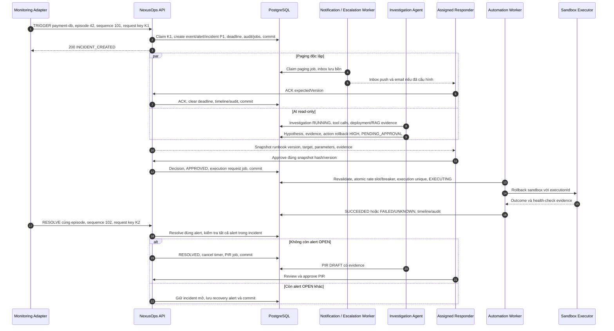
```mermaid
sequenceDiagram
    autonumber
    participant M as Monitoring Adapter
    participant API as NexusOps API
    participant DB as PostgreSQL
    participant N as Notification / Escalation Worker
    participant AI as Investigation Agent
    participant R as Assigned Responder
    participant W as Automation Worker
    participant EX as Sandbox Executor
    M->>API: TRIGGER payment-db, episode 42, sequence 101, request key K1
    API->>DB: Claim K1, create event/alert/incident P1, deadline, audit/jobs, commit
    API-->>M: 200 INCIDENT_CREATED
    par Paging độc lập
        N->>DB: Claim paging job, inbox lưu bền
        N-->>R: Inbox push và email nếu đã cấu hình
        R->>API: ACK expectedVersion
        API->>DB: ACK, clear deadline, timeline/audit, commit
    and AI read-only
        AI->>DB: Investigation RUNNING, tool calls, deployment/RAG evidence
        AI->>DB: Hypothesis, evidence, action rollback HIGH, PENDING_APPROVAL
    end
    API-->>R: Snapshot runbook version, target, parameters, evidence
    R->>API: Approve đúng snapshot hash/version
    API->>DB: Decision, APPROVED, execution request job, commit
    W->>DB: Revalidate, atomic rate slot/breaker, execution unique, EXECUTING
    W->>EX: Rollback sandbox với executionId
    EX-->>W: Outcome và health-check evidence
    W->>DB: SUCCEEDED hoặc FAILED/UNKNOWN, timeline/audit
    M->>API: RESOLVE cùng episode, sequence 102, request key K2
    API->>DB: Resolve đúng alert, kiểm tra tất cả alert trong incident
    alt Không còn alert OPEN
        API->>DB: RESOLVED, cancel timer, PIR job, commit
        AI->>DB: PIR DRAFT có evidence
        R->>API: Review và approve PIR
    else Còn alert OPEN khác
        API->>DB: Giữ incident mở, lưu recovery alert và commit
    end
```

ACK và approval là hai hành động riêng; escalation không chờ AI. Nếu responder chưa ACK, timer vẫn chạy dù action đang chờ duyệt. Recovery phải đến từ monitoring sandbox/health check thực nếu demo muốn chứng minh rollback giúp khôi phục; gửi RESOLVE thủ công chỉ kiểm tra recovery pipeline.

**Bộ ca nghiệm thu bắt buộc** (đặc tả test cần triển khai/chạy; không tuyên bố đã pass runtime):

| Nhóm | Ca kiểm chứng | Điều kiện đạt |
|---|---|---|
| Idempotency | 20 request đồng thời cùng key/body; khác body; hai integration cùng key; crash trước/sau commit | Một domain effect, replay đúng, 409 đúng, không lẫn scope; response sau commit không mất nghĩa vụ |
| Dedup | 20 key khác, cùng namespace/episode, sequence hợp lệ | Một OPEN alert, count bằng số occurrence được chấp nhận; sequence đến muộn theo contract là stale, không cộng count |
| Dedup concurrency | Barrier test nhiều worker xử lý cùng episode với sequence tăng theo thứ tự commit được kiểm soát | Counter không lost update, một incident; kiểm thử riêng out-of-order để xác nhận stale policy |
| Resolve/grouping | Hai alert một incident, resolve một alert; grouping cạnh tranh manual resolve | Incident còn mở nếu alert khác OPEN; không OPEN alert gắn incident đã đóng |
| Episode | RESOLVE cũ tới sau TRIGGER episode mới; recovery unmatched | Không đóng episode mới, không tạo incident từ unmatched recovery |
| Escalation | ACK/timeout cùng lúc, restart/mất Redis, policy hai level | Theo commit order, deadline bền, không level 3, backstop chỉ một lần |
| Delivery | Crash trước/sau send/commit; disconnect/reconnect | Job/inbox không mất, retry hữu hạn, duplicate risk provider được nhận diện; SENT không tự ACK |
| Approval | LOW requiresApproval; không policy; người ngoài scope; double approve; sửa parameters | Không bypass gate, 403/409 đúng, decision đúng snapshot, execution unique |
| Executor | Timeout sau external success, lease hết hạn | UNKNOWN và reconcile cùng executionId, không tác động lặp mù |
| Rate guard | Ba action đồng thời; sát ranh giới 15 phút; approval chờ lâu | Chỉ hai reservation/window, action thứ ba blocked kể cả đã duyệt; kiểm tra lại trước dispatch |
| Breaker | Ba execution lỗi liên tiếp theo thời gian, cooldown và probe | OPEN được lưu bền, một HALF_OPEN probe, success reset, fail reopen |
| AI | Có/không evidence, tool lỗi, prompt injection trong log, lỗi không do deploy | Evidence refs đúng, nêu thiếu dữ kiện, không nâng quyền, paging không bị chặn; đo latency/budget |
| Audit | Truy từ incident tới tool/approval/execution | Actor, snapshot, timeline, outcome và correlation truy được; SYSTEM actor không cần user giả |
| Metrics | ACK chưa resolve; auto-resolve chưa ACK; ngoài kỳ | Đúng cohort, mẫu số, first timestamp, không coi null bằng 0 |

Demo tách ba trường hợp: cùng request key/body là HTTP replay; key khác + cùng dedup/episode/sequence mới là occurrence; dedup khác áp dụng grouping rule. Demo quota dùng LOW + pre-authorization hợp lệ trên service NORMAL, guard sạch và các action khác nhau; lần thứ ba **blocked**, không nâng HIGH. Demo HIGH approval là ca độc lập. Báo cáo số mẫu, dữ liệu fixture và outcome thực; không dùng score 0.82 làm xác suất đúng đã hiệu chuẩn.

---

## 8. Lộ trình Triển khai theo Giai đoạn (Phased Implementation Plan)

Giữ modular-monolith-first và roadmap 15 bounded module, không triển khai 15 microservice. README là đặc tả định hướng, không phải bằng chứng ứng dụng đã chạy. Các phase giữ thứ tự trình bày; baseline có AI có thể lấy lát cắt 4a/4b tối thiểu trước các hạng mục mở rộng Phase 3 như Kafka/Redis, miễn có đủ correctness prerequisites từ Phase 1–2. Chưa cam kết số tuần khi thiếu nhân lực/deadline và đo thử tích hợp.

### 8.1 Phase 1 — Foundation

**Mục tiêu:** một luồng dọc event → alert → incident lưu bền.

| Hạng mục | Ghi chú |
|---|---|
| Auth, RBAC, object authorization | JWT; một organization/team; role seed, kiểm tra scope từ đầu |
| Service/Integration | Service criticality tách status, integration key theo service |
| Database/migrations | Domain FKs, idempotency claim, stream watermark, timeline/audit, jobs/outbox schema |
| Incident/Alert core | Lifecycle, grouping/resolve invariant; không network I/O trong transaction |
| Kiểm chứng lát cắt | Crash tại commit boundary, request concurrency; chưa cần Kafka/Redis |

### 8.2 Phase 2 — PagerDuty Core

**Mục tiêu:** baseline vận hành nhỏ có paging bền, không hứa tương đương toàn bộ sản phẩm PagerDuty.

| Hạng mục | Ghi chú |
|---|---|
| Ingestion | Canonical request hash, replay retention, episode adapter |
| Dedup, grouping, routing | Rule tất định tối thiểu, mutation lock, counters nguyên tử |
| On-call | Tĩnh, hai level và backstop; rotation/DST/override đầy đủ thuộc roadmap |
| Escalation | DB polling/claim, repeat/next deadline/exhausted, ACK race tests |
| Notification | Inbox lưu bền + catch-up; WebSocket là push; email adapter khi sẵn sàng |
| Retry/DLQ | DB jobs có lease, attempts, backoff và công cụ xem/replay có quyền |
| Tiêu chí kết thúc | Passing evidence của các ca ingestion/resolve/escalation/delivery ở §7 |

### 8.3 Phase 3 — Advanced Reliability

**Mục tiêu:** mở rộng khi workload và vận hành yêu cầu; không thay semantics đã chốt.

| Hạng mục | Ghi chú |
|---|---|
| Kafka | Relay outbox + consumer receipts; lifecycle topic/partition/version; không thay durable timer |
| Redis | Cache/rate limiter/wake-up/lock tối ưu; DB fallback/rebuild |
| API và worker runtime | Resource pool/DB connections giới hạn riêng; shared schema phải tương thích phiên bản |
| Scheduling/notification mở rộng | Rotation, IANA/DST, override; multi-target/re-notify/đa kênh |
| Runbook safety | Snapshot, approval, pre-authorization, executor idempotency/reconcile, rate reservation và breaker **trước action đầu tiên** |
| Collaboration | Notes/timeline/status update, War Room realtime; cấu hình ít đổi có thể seed |
| Load/chaos | Mất Redis, relay crash, consumer retry/gap, worker lease mất |

### 8.4 Phase 4 — AI Operations

**Phase 4a — AI Read-Only:** một Investigation Agent, PGVector RAG, alert/deployment context. Pin SDK/model/embedding versions; tạo investigation trước log; đúng tool history, permission filter, evidence refs, deadline/budget. Deployment adapter và LLM/embedding environment là dependency cần chuẩn bị. Logs/metrics/dependency tool chỉ được quảng bá khi adapter có thật.

**Phase 4b — AI Recommendation + Controlled Automation + Governance:** một runbook sandbox, action snapshot/approval/executor safety theo §3.4 và §2.6; PIR draft do người review. AI không có credential thực thi. Guard không thể bị bỏ qua vì chưa dùng Kafka/Redis. Đánh giá bằng fixture có lỗi sau deploy lẫn lỗi không liên quan deploy, có/thiếu evidence và tool lỗi; đo evidence validity, retrieval, abstention, latency và chi phí.

Triage, Remediation, Knowledge và On-call Assistant riêng là roadmap; không cần sáu agent để đạt baseline. UI ưu tiên khoảng 4–6 màn phục vụ pipeline thay vì đặt số màn CRUD như tiêu chí thành công. Simulator/demo app phải được ghi rõ và có evidence về tác động thực nếu muốn chứng minh remediation.

### 8.5 Phase 5 — Production Engineering

| Hạng mục | Điều kiện nghiệm thu |
|---|---|
| CI/CD, container, deployment | Build repeatable, config/secrets, migration expand/contract |
| Self-observability | Metrics/logs/traces cho lag, backlog, DLQ, deadlines trễ, UNKNOWN actions; cảnh báo ngoài NexusOps cho chính NexusOps |
| Security | Least privilege, secret redaction, object authorization, audit coverage |
| Backup/restore | Diễn tập restore/PITR, định nghĩa và đo RPO/RTO |
| Multi-tenant khi cần | RLS toàn bộ tenant data, transaction-local context, connection pool/worker/retrieval/socket isolation tests |
| Load/chaos mở rộng | Đo ingestion latency, dispatch latency, recovery time; không tự nhận production-ready từ tài liệu |

### 8.6 Ma trận Ưu tiên

| Tính năng | Ưu tiên baseline |
|---|---|
| Auth, RBAC/object scope, một org/team, service/integration | Must |
| Idempotency, dedup/episode, grouping/resolve, domain constraints | Must |
| Incident, on-call tĩnh, escalation, inbox/jobs, timeline/audit | Must |
| RAG + một AI investigation có evidence | Must cho bản có AI |
| Một runbook sandbox + approval + rate guard/breaker + reconcile | Must cho bản có remediation |
| PIR draft và human review | Must cho vòng đời demo đầy đủ |
| Kafka/Redis, rotation/đa kênh, rule builder, agent chuyên biệt | Should — roadmap theo nhu cầu |
| SLO/Status Page đầy đủ | Nice to have; chưa có SLI không tuyên bố đo reliability đầy đủ |
| Mobile native, multi-region HA | Ngoài phạm vi |

**Kết quả chọn lọc Audit F01–F12:**

| Finding | Quyết định và vị trí tích hợp |
|---|---|
| F01 | Áp dụng claim trước domain, namespace/hash/replay; §2.6, UC-07, §4.7.5, §5–6 |
| F02 | Áp dụng deadline/repeat/level cuối/backstop; §2.6, UC-12, §4.7.2–3, incidents schema |
| F03 | Áp dụng atomic job/outbox, inbox/consumer idempotency, giới hạn ordering; §2.2–2.6, UC-10/16 |
| F04 | Áp dụng liên kết event-alert-incident, counters, timeline, deployment, investigation/action và audit; §5 |
| F05 | Áp dụng serialize/retry conflict/counter nguyên tử và cache compare-delete; §2.6, UC-09 |
| F06 | Áp dụng all-alert recovery, manual close policy và episode ordering; §2.6, UC-19, §6.3 |
| F07 | Áp dụng snapshot, object permission, execution identity/UNKNOWN; §3.4, UC-20/21, §4.7.1/8, §5 |
| F08 | Áp dụng với điều chỉnh: hard stop sliding reservation và breaker riêng; bỏ phương án nâng HIGH rồi cho override vì khó giữ hạn mức nhất quán |
| F09 | Áp dụng hợp đồng history/tool IDs, investigation trước log, timeout/permissions/evidence; §3.4, UC-23, §4.7.7. Không sửa code Spring AI ở file MVP chưa được cung cấp |
| F10 | Áp dụng tiêu chí demo và giới hạn bằng chứng vào §7; không khẳng định đã sửa Summary.md/MVP Scope.md không có trong đầu vào |
| F11 | Áp dụng criticality/state/metrics/timezone, không gọi timeline là Event Sourcing; §2.6, §3, §5 |
| F12 | Áp dụng single-tenant baseline, điều kiện RLS, DB deadline và vận hành; §2.5, §5.4, §8.5 |

Không loại Kafka/Redis, sáu vai trò agent, rotation, SLO hay status page khỏi roadmap: đây là đề xuất thu hẹp **baseline**, không phải bằng chứng các năng lực đó sai scope Incident Operations. Không áp dụng các chỉnh sửa tên file, claim thị trường, pháp lý hoặc số liệu 70%/3× thuộc Document/Summary chưa cung cấp; README không thêm các claim đó. Chưa chọn số tuần khi thiếu dữ liệu năng lực/tiến độ. Không xem khuyến nghị trong Audit là chỉ thị tự động thực thi: từng điểm được đối chiếu với mục tiêu và invariant thiết kế.

**Tự audit tài liệu:** giữ mục lục và mục chính 1–8, giữ 31 use case; đối chiếu text ↔ diagrams ↔ field/constraint ↔ API ↔ reference scenario. Mermaid cần parse/render toàn bộ bằng renderer version ghi trong báo cáo kiểm tra đi kèm. Rà soát tài liệu và parse diagram không thay integration/concurrency/crash/security tests; trạng thái reviewed/implemented/tested phải tách biệt và chỉ nâng khi có bằng chứng. README này không xác nhận code ứng dụng hoặc migration đã pass các ca §7.

### 8.7 Các Hạng mục Ngoài phạm vi

Không tự xây observability platform/log collector, mô hình ML huấn luyện riêng, Kubernetes operator đầy đủ, Terraform provisioning platform, mobile native hay multi-region HA. Prometheus/Grafana/CloudWatch/Kubernetes/CI-CD là integration. Demo payment/bank app là đối tượng giám sát sandbox, không mở scope sang nghiệp vụ ngân hàng. NexusOps tiếp nhận tín hiệu, điều phối incident và hỗ trợ điều tra/remediation có kiểm soát; không cam kết tự phát hiện mọi lỗi hoặc chứng minh root cause chỉ bằng AI.
