# NexusOps — Intelligent Incident & Reliability Operations Platform

## Software Project Plan & Architecture Document

| | |
|---|---|
| **Loại tài liệu** | Software Project Plan & Architecture Document |
| **Kiến trúc** | Event-driven, modular-monolith-first |
| **Stack chính** | Java (Spring Boot), Apache **Kafka**, PostgreSQL (+ PGVector), Redis |
| **Trạng thái** | Draft v1.2 — đã áp dụng kết quả kiểm toán kỹ thuật (technical audit) |
| **Đối tượng đọc** | Đội ngũ kỹ thuật, technical stakeholders, ban giám khảo/reviewer |

---

## Mục lục

1. Tóm tắt Điều hành (Executive Summary)
2. Kiến trúc Hệ thống (System Architecture)
3. Các Module & Năng lực Cốt lõi (Core Modules & Capabilities)
4. Mô hình Use Case (Use Case Model)
5. Mô hình Dữ liệu — Database Schema
6. Nguyên tắc Thiết kế API (API Design Guidelines)
7. Kịch bản Tham chiếu — Vòng đời một Sự cố P1
8. Lộ trình Triển khai theo Giai đoạn (Phased Implementation Plan)

---

## 1. Tóm tắt Điều hành (Executive Summary)

### 1.1 Tầm nhìn Sản phẩm

**NexusOps** là một nền tảng tập trung, có nhiệm vụ phát hiện các sự kiện vận hành (operational events), giảm nhiễu alert, định tuyến incident đến đúng người xử lý, điều phối quá trình phản ứng sự cố, tự động hoá remediation, và dùng **AI** để tăng tốc quá trình điều tra cũng như học hỏi sau sự cố.

Về mặt khái niệm, NexusOps nằm ở giao điểm của bốn nhóm sản phẩm đã được kiểm chứng — **PagerDuty-style incident core**, **AIOps**, **Runbook Automation**, và **AI Agent platforms** — nhưng scope được thu hẹp có chủ đích quanh một identity duy nhất, nhất quán: **Incident Operations**.

### 1.2 Bài toán Cần giải quyết

Các môi trường production hiện đại (cloud infrastructure, Kubernetes, database, backend API, payment service, authentication service...) liên tục sinh ra một luồng lớn tín hiệu giám sát. Nếu xử lý thủ công, luồng này biến thành một chuỗi thao tác rời rạc, chậm và dễ sai sót: kỹ sư phát hiện alert, tự đi tìm người phụ trách, nhắn tin chờ phản hồi, gọi điện escalate thủ công, tìm logs và deployment gần nhất, xử lý sự cố, và — trong nhiều trường hợp — không bao giờ viết postmortem.

NexusOps thay thế chuỗi thao tác tuỳ tiện đó bằng một **pipeline có cấu trúc, có thể audit**:

```
Event → Alert → Incident → On-call Routing → Escalation → AI Investigation → Human/Automated Remediation → Resolution → Post-Incident Review → Knowledge
```

Vòng đời này bám sát cách các nền tảng incident management trưởng thành tổ chức quy trình vận hành: một tín hiệu thô trở thành alert sau khi được platform xử lý, nhiều alert liên quan được gộp vào một incident duy nhất, và incident đó được định tuyến đến đúng on-call responder thông qua escalation policy.

### 1.3 Giá trị Cốt lõi

| Giá trị | Ý nghĩa thực tế |
|---|---|
| **Giảm nhiễu (noise reduction)** | Deduplication, grouping và suppression biến hàng nghìn event thô thành một số lượng nhỏ incident thực sự cần xử lý. |
| **Định tuyến tất định** | Event orchestration rules và escalation policy đảm bảo mọi incident P1 đều tới được một người chịu trách nhiệm trong một khoảng thời gian giới hạn. |
| **Chẩn đoán nhanh hơn** | AI agent với **tool calling** và **RAG** trên logs, deployment, dependency và các incident cũ giúp đưa ra giả thuyết root-cause chỉ trong vài phút thay vì vài giờ. |
| **Remediation có kiểm soát** | Automation có thể thực thi runbook, nhưng mọi hành động rủi ro cao đều phải đi qua **human approval gate** — AI đề xuất, con người phê duyệt. |
| **Tri thức tổ chức** | Mỗi incident khi đóng lại đều tạo ra một Post-Incident Review có cấu trúc, nuôi lại knowledge base phục vụ các lần AI investigation sau này. |

### 1.4 Định vị Sản phẩm & Ranh giới Scope

Identity của NexusOps được giữ hẹp có chủ đích, và không được phép trôi dạt thành một công cụ ticketing/quản lý dự án đa năng. Mọi quyết định về tính năng nên được kiểm tra bằng một câu hỏi duy nhất: *tính năng này có làm chuỗi Event → Alert → Incident → On-call → Escalation → Investigation → Remediation → Postmortem mạnh hơn không?*

Để giữ nguồn lực triển khai tập trung vào identity này, nền tảng chủ động **không** xây dựng riêng một hệ thống observability, một mô hình ML tự huấn luyện, một Kubernetes operator đầy đủ, hay khả năng multi-region high availability. Các công cụ như Prometheus, Grafana, Kubernetes, CI/CD được xem là **external integration**, không phải mục tiêu tự xây (xem mục 8.7 — Các Hạng mục Ngoài phạm vi).

---

## 2. Kiến trúc Hệ thống (System Architecture)

### 2.1 Phong cách Kiến trúc

NexusOps được xây dựng theo **event-driven architecture**: mọi thay đổi trạng thái được publish thành domain event trên một message bus trung tâm, và các worker độc lập subscribe vào những event liên quan đến trách nhiệm của mình. Cách tiếp cận này tách rời (decouple) ingestion, orchestration, notification, escalation và AI processing, giúp hệ thống hấp thụ các đợt burst traffic từ monitoring mà không làm nghẽn phía producer.

Về mặt triển khai, hệ thống khởi đầu như một **modular monolith** (Spring Boot, một deployable duy nhất, các package tách biệt rõ ràng theo từng bounded module), và chỉ đưa Kafka-based asynchronous processing vào khi vòng đời incident lõi đã ổn định. Việc tách service khỏi monolith chỉ thực hiện khi một module thực sự có scaling/reliability profile khác biệt — không tách theo mặc định.

> **Lưu ý kiến trúc (audit finding).** "Modular monolith" chỉ mô tả ranh giới **codebase**, không có nghĩa toàn bộ hệ thống phải chạy trong **một process** duy nhất. Kể từ Phase 3 (khi Kafka consumer được đưa vào), các worker bất đồng bộ (Escalation Worker, Notification Worker, AI Agent Worker, Automation Worker) được build và triển khai như một **process/deployable riêng** (cùng repository, khác entrypoint/Spring profile — ví dụ `nexusops-api` và `nexusops-worker`) tách khỏi REST API ingestion. Lý do: nếu cả hai chạy chung một JVM, một đợt burst escalation/notification trong lúc xảy ra outage lớn có thể ăn hết resource của chính API ingestion đang nhận event — tức nền tảng incident management "tự làm nghẽn chính mình" đúng lúc cần nó nhất. Tách process không vi phạm nguyên tắc modular-monolith (không tách *service*, không tách *database*), chỉ tách *runtime*.

Về schema migration, mọi thay đổi cấu trúc bảng qua các phase (ví dụ thêm bảng `ai_investigations` ở Phase 4) đều được quản lý bằng **Flyway** (hoặc Liquibase), versioned theo từng migration script, để đảm bảo khả năng rollback và nhất quán giữa các môi trường.

### 2.2 Sơ đồ Kiến trúc Tổng thể

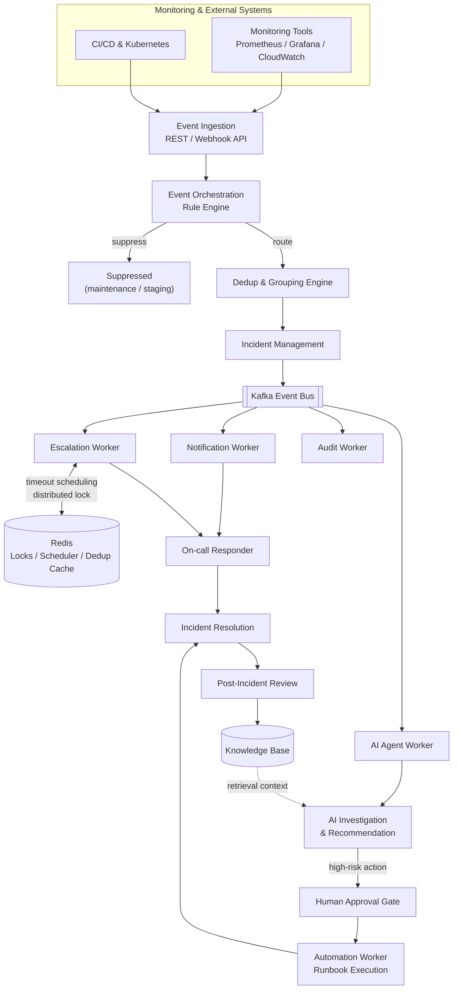

### 2.3 Luồng Dữ liệu Cốt lõi

Một tín hiệu thô không bao giờ được xử lý trực tiếp như một incident. Nó đi qua ba trạng thái riêng biệt — **Event → Alert → Incident** — mỗi trạng thái mang một ý nghĩa chặt hơn: *Event* là tín hiệu chưa qua xử lý (`CPU = 99%`), *Alert* là tín hiệu đó sau khi platform xử lý (`CPU High on payment-service`), còn *Incident* là đơn vị công việc mà responder thực sự phải xử lý (`Payment Service Production Outage`). Nhiều alert có thể được deduplicate hoặc group vào một incident duy nhất — đây chính là cơ chế giúp responder không bị page 4 lần cho cùng một nguyên nhân gốc.

### 2.4 Messaging Backbone — Kafka

Kafka là system of record cho việc phối hợp giữa các module. Các domain event chính được publish lên bus:

| Nhóm | Domain events |
|---|---|
| Ingestion & Alerting | `EventReceived`, `AlertCreated`, `AlertDeduplicated`, `AlertGrouped` |
| Vòng đời Incident | `IncidentCreated`, `IncidentAcknowledged`, `IncidentEscalated`, `IncidentResolved` |
| Điều phối phản ứng | `ResponderAdded`, `NotificationRequested`, `NotificationSent` |
| AI processing | `AIInvestigationStarted`, `AIInvestigationCompleted` |
| Automation | `AutomationRequested`, `AutomationApproved`, `AutomationExecuted` |
| Governance | `PIRCreated` |

**Partitioning strategy.** Mọi topic liên quan tới một incident cụ thể (`IncidentCreated`, `IncidentEscalated`, `IncidentResolved`, `AutomationRequested`,...) được partition theo key `incidentId`. Điều này đảm bảo **ordering** trong phạm vi một incident (event của cùng một incident luôn được một consumer xử lý tuần tự, đúng thứ tự) trong khi vẫn scale ngang được giữa các incident khác nhau. Topic `EventReceived` (trước khi có incident) được partition theo `serviceId`.

### 2.5 Distributed State — Redis

Redis phục vụ mọi loại trạng thái cần được chia sẻ, truy xuất nhanh và tồn tại ngắn hạn giữa các worker instance chạy song song:

| Use case | Mục đích |
|---|---|
| Rate limiting | Bộ đếm token-bucket theo từng integration/service |
| Idempotency cache | Fast-path cache cho kết quả của một `Idempotency-Key` đã xử lý trước đó (nguồn chân lý thực sự là unique constraint ở PostgreSQL — xem §2.6) |
| Dedup keys | Tra cứu nhanh `dedup:<key>` để xác định event có map vào alert đang mở hay không; key được `DEL` ngay khi alert `RESOLVED` (không chỉ dựa TTL — xem §2.6) |
| Distributed locks | Ngăn hai worker cùng thao tác trên một incident đồng thời; TTL ngắn (≤5s) kèm fencing token, không dùng làm nguồn đúng-sai duy nhất (xem §2.6) |
| On-call cache | Tra cứu responder hiện tại mà không cần gọi lại schedule engine mỗi lần page |
| Escalation scheduler | Theo dõi các escalation timeout đang chờ mà không giữ một HTTP connection mở |
| AI session state | Context ngắn hạn cho một phiên investigation của agent đang chạy |

### 2.6 Các Pattern Reliability trong Hệ thống Phân tán

Các pattern dưới đây được xem là yêu cầu kiến trúc bắt buộc, không phải phần "hardening thêm nếu còn thời gian". Đây cũng là phần được cập nhật trực tiếp từ kết quả kiểm toán kỹ thuật (technical audit) — mỗi mục đều nêu rõ **nguồn chân lý (source of truth)** thay vì chỉ dựa vào Redis như một lớp cache có thể mất dữ liệu.

**Idempotency.** Hệ thống monitoring thường xuyên gửi lại cùng một event (do retry mạng, at-least-once delivery). Mọi lời gọi `POST /api/v1/events` đều chấp nhận header `Idempotency-Key` (hoặc trường `dedupKey` ở tầng domain). Redis chỉ đóng vai trò **fast-path cache**; nguồn chân lý thực sự là một unique constraint ở PostgreSQL, để tránh trường hợp Redis evict key (do memory pressure) trước khi client retry, dẫn tới tạo alert trùng:

```sql
CREATE TABLE idempotency_keys (
  key             VARCHAR(255) PRIMARY KEY,
  request_hash    VARCHAR(64) NOT NULL,   -- SHA-256 của body, phát hiện key bị tái sử dụng sai
  response_body   JSONB NOT NULL,
  created_at      TIMESTAMP NOT NULL DEFAULT now()
);
```
Luồng xử lý: `INSERT ... ON CONFLICT (key) DO NOTHING` → nếu conflict, đọc lại `response_body` đã lưu và trả về nguyên vẹn (không xử lý lại). Redis chỉ cache kết quả của bảng này để giảm round-trip tới DB ở tải cao.

**Vòng đời Dedup Key.** Vấn đề: nếu `dedupKey` không bao giờ hết hiệu lực, một sự cố lặp lại **sau khi alert cũ đã `RESOLVED`** sẽ bị gộp nhầm vào alert cũ — không tạo incident mới, không ai được page. Ràng buộc uniqueness cho dedup **chỉ áp dụng cho alert đang mở**, không áp dụng vĩnh viễn:

```sql
CREATE UNIQUE INDEX uniq_open_dedup
  ON alerts (service_id, dedup_key)
  WHERE status <> 'RESOLVED';
```
Ở tầng Redis: `SET dedup:<key> <alertId>` khi tạo alert; `DEL dedup:<key>` ngay khi alert chuyển `RESOLVED` (consumer riêng lắng nghe `AlertResolved`); TTL 72h chỉ để dọn rác, **không phải cơ chế reset chính**.

**Distributed Locking & Fencing Token.** Redis lock kiểu `SETNX`/Redlock có lỗ hổng đã biết: nếu một worker bị GC-pause hoặc network delay vượt quá TTL của lock, lock tự hết hạn và một worker khác chiếm lock trong khi worker cũ vẫn tưởng mình còn giữ quyền ghi — dẫn tới hai worker cùng ghi đè. Vì vậy Redis lock **chỉ dùng để giảm tranh chấp** (tối ưu hiệu năng), còn **nguồn đúng-sai bắt buộc là optimistic locking bằng cột `version` ở PostgreSQL** (đóng vai trò fencing token thật sự):

```sql
UPDATE incidents
SET escalation_level = escalation_level + 1, version = version + 1
WHERE id = :incidentId AND version = :expectedVersion AND status = 'TRIGGERED';
-- affected rows = 0  =>  một worker/hành động khác đã xử lý trước, tự bỏ qua (không throw lỗi)
```

**An toàn giữa Escalation (hệ thống) và Acknowledge (con người).** Đây là race condition dễ bị bỏ sót nhất: responder ACK đúng lúc Escalation Worker đang fire timeout cho cùng incident. Nếu worker chỉ kiểm tra trạng thái *tại thời điểm lên lịch* mà không re-check *tại thời điểm gửi*, incident vẫn bị escalate/page thêm dù vừa được ACK. Escalation Worker **luôn phải re-fetch và re-validate trạng thái ngay trước khi gửi notification**, trong cùng transaction với câu `UPDATE ... WHERE version = :expectedVersion` ở trên — không escalate dựa trên trạng thái đã đọc từ lúc lên lịch job.

**Automation Circuit Breaker & Rate Limiting.** Một action tự động (kể cả `LOW`-risk đã pre-authorize) có thể bị trigger lặp lại liên tục nếu điều kiện gây lỗi cứ tái diễn — đây là nguyên nhân đã gây ra nhiều outage lớn trên thực tế do automation tự khuếch đại sự cố (flapping loop). Mọi lần thực thi được đếm theo cửa sổ thời gian trượt:

```sql
CREATE TABLE automation_rate_limits (
  service_id       UUID,
  runbook_id       UUID,
  window_start     TIMESTAMP,
  execution_count  INT NOT NULL DEFAULT 0,
  PRIMARY KEY (service_id, runbook_id, window_start)
);
```
Nếu `execution_count` trong 15 phút gần nhất vượt ngưỡng (mặc định: 2 lần) → hệ thống **buộc chuyển sang Human Approval Gate bất kể `riskLevel` gốc**, kể cả với action đã được pre-authorize.

**Retry & Dead Letter Queue (Kafka).** Việc gửi tới một kênh bên ngoài (email, SMS, chat) có thể thất bại tạm thời. Notification thất bại được retry qua topic `notification.retry` với cơ chế backoff; sau khi hết retry budget, message được chuyển sang `notification.dlq` để kiểm tra thủ công thay vì bị âm thầm loại bỏ.

**Rate Limiting (Ingestion).** Một integration hoạt động sai (gửi hàng nghìn event/giây) không được phép làm suy giảm hiệu năng toàn hệ thống. Một Redis token-bucket limiter áp mức trần theo từng integration/service (ví dụ 100 request/giây) ngay tại biên ingestion.

> **Ghi chú thiết kế — không có mâu thuẫn giữa Escalation, AI và Human Approval.** Escalation chỉ có một mục tiêu duy nhất: *đưa được một con người vào xử lý* trong một khoảng thời gian giới hạn (chuỗi paging, độc lập với AI). AI Triage và AI Investigation chạy **song song** với escalation, không thay thế escalation — chúng tăng tốc chẩn đoán trong khi đồng hồ timeout của paging vẫn chạy độc lập (và luôn được re-validate ngay trước khi fire, như mô tả ở trên). **Human Approval Gate** chỉ áp dụng cho các *hành động remediation* do AI đề xuất và được phân loại rủi ro cao (bao gồm cả trường hợp bị nâng risk do vi phạm circuit breaker ở trên); nó không thay thế cho escalation, và không tạm dừng hay chặn escalation timer. Người phê duyệt là responder đang được assign hoặc Incident Commander, được xác định qua cùng một permission RBAC (`AUTOMATION_EXECUTE`) dùng xuyên suốt nền tảng. Với action `LOW`-risk, "đã có sự cho phép của con người" nghĩa là một **chính sách được con người cấu hình từ trước** (pre-authorization ở cấp runbook), không phải approval per-instance — hai hình thức phê duyệt này được phân biệt rõ ở §3.4.

---

## 3. Các Module & Năng lực Cốt lõi (Core Modules & Capabilities)

Phạm vi chức năng của nền tảng được tổ chức thành **15 bounded module**, được nhóm lại dưới đây thành năm nhóm năng lực mạch lạc.

### 3.1 Identity, Access & Organization

Bao gồm authentication, authorization, và cấu trúc tổ chức mà mọi module khác đều dựa vào.

- **Authentication.** Đăng ký/đăng nhập bằng email-password, xử lý qua Spring Security, phát hành **access token** ngắn hạn và **refresh token** dài hạn (`POST /auth/register`, `/auth/login`, `/auth/refresh`, `/auth/logout`).
- **Role-Based Access Control.** Authorization không chỉ dừng ở `ADMIN`/`USER` phẳng. Role được phân theo hệ thống phân cấp `User → Organization → Team → Role → Permission`:

  | Role | Phạm vi điển hình |
  |---|---|
  | `ACCOUNT_ADMIN` | Toàn quyền trên organization |
  | `TEAM_MANAGER` | Quản lý service, schedule, escalation policy của team |
  | `TEAM_MEMBER` | Thành viên kỹ thuật tiêu chuẩn |
  | `RESPONDER` | Có thể được page và xử lý incident |
  | `STAKEHOLDER` | Chỉ xem, có thể subscribe status update |
  | `VIEWER` | Chỉ xem |

  Các permission chi tiết (`INCIDENT_ACK`, `INCIDENT_RESOLVE`, `ESCALATION_MANAGE`, `AI_RUN`, `AUTOMATION_EXECUTE`, `AUDIT_VIEW`,...) được gắn vào role thay vì hard-code, tương tự cách các nền tảng incident management trưởng thành tách quyền theo account/team/object.

- **Organization & Teams.** Một organization chứa nhiều team (ví dụ: Backend, Frontend, DevOps, Security, Data), mỗi team có membership và invitation riêng, tạo thành ranh giới sở hữu mà Service Directory và Escalation Policy dựa vào.

### 3.2 Service Directory & Integration Layer

Điểm vào nơi tín hiệu bên ngoài trở thành dữ liệu native của platform.

- **Service Directory.** Service là đơn vị chức năng mà một incident thực sự *nói về* — thuộc sở hữu một team, gắn nhãn mức độ nghiêm trọng (`OPERATIONAL`, `DEGRADED`, `MAJOR_INCIDENT`, `MAINTENANCE`, `DISABLED`), và liên kết tới repository, runbook, escalation policy tương ứng.
- **Service Dependency Graph.** Các service khai báo dependency lẫn nhau và với hạ tầng (ví dụ `Checkout → Payment → PostgreSQL → AWS RDS`). Graph này là thứ cho phép AI Investigation Agent suy luận về blast radius — nếu PostgreSQL down, mọi service phụ thuộc đều là ứng viên cho root-cause path, không phải trùng hợp ngẫu nhiên.
- **Integration & Event Ingestion.** Các hệ thống bên ngoài (Prometheus, Grafana, CloudWatch, GitHub Actions, Kubernetes, custom application) gửi tín hiệu machine-generated qua một **Events API** riêng (`POST /api/v1/events`), xác thực bằng API key theo từng integration thay vì user session. Đây là sự tách biệt có chủ đích khỏi **REST API** hướng resource dùng cho cấu hình, phản ánh đúng quy ước ngành: tách "ingest ở quy mô lớn" khỏi "quản lý cấu hình".

### 3.3 Incident Response Pipeline

Phần lõi vận hành: biến noise thành một incident đã được định tuyến, có thể hành động, và được phối hợp xử lý.

- **Alert Management.** Bao gồm **deduplication** (các tín hiệu lặp lại cùng `dedupKey` gộp vào một alert đang mở — xem vòng đời dedup key ở §2.6), **grouping** (rule engine hoặc AI heuristic gom các alert liên quan nhưng khác nhau — ví dụ lỗi database, API latency cao, payment timeout — vào cùng một incident), **suppression** (alert phát sinh trong lúc deploy hoặc trong maintenance window vẫn được lưu lại phục vụ forensic nhưng không tạo incident hay notification), và **auto-resolve** (một event loại `RESOLVE` mang cùng `dedupKey` — ví dụ CPU quay về ngưỡng bình thường — tự động chuyển alert đang mở sang `RESOLVED`, không cần responder thao tác thủ công; đây là bổ sung so với luồng resolve thủ công mô tả ở UC-19).
- **Event Orchestration / Rule Engine.** Một engine `IF condition THEN action` có thể cấu hình, đánh giá trên mỗi event đầu vào. Condition kết hợp các field (`service`, `severity`, `environment`, `event.count`) với operator (`EQUALS`, `CONTAINS`, `GREATER_THAN`, `IN`,...); action gồm `ROUTE`, `SUPPRESS`, `SET_PRIORITY`, `CREATE_INCIDENT`, `TRIGGER_WORKFLOW`. Đây là cơ chế chính chuyển noise từ monitoring thành quyết định định tuyến nhất quán, có thể audit.
- **Incident Management.** Bản ghi Incident (`TRIGGERED → ACKNOWLEDGED → RESOLVED`) theo dõi assignee, priority, severity, và toàn bộ timeline dạng `IncidentEvent`. Acknowledge một incident sẽ dừng escalation nhưng không đóng incident — resolve là một hành động riêng, tường minh.
- **On-Call Scheduling.** Schedule hỗ trợ các loại rotation (`DAILY`, `WEEKLY`, `CUSTOM`), nhiều layer coverage (Primary/Secondary), và override có giới hạn thời gian cho các trường hợp vắng mặt đã lên kế hoạch — được resolve tại thời điểm truy vấn qua `GET /schedules/{id}/on-call`.
- **Escalation Management.** Một `EscalationPolicy` là một danh sách level có thứ tự; mỗi level có thể nhắm tới **nhiều target song song** (ví dụ page cả Primary lẫn Secondary cùng lúc ở Level 1, không giới hạn một target/level), và hỗ trợ **re-notify** (gửi lại thông báo 1-2 lần trong cùng level trước khi thật sự escalate sang level kế tiếp, theo `repeatCount`/`repeatIntervalMinutes`) — tương đương chuẩn PagerDuty/Opsgenie. Nếu một level không acknowledge trong thời gian timeout, incident tự động escalate sang level tiếp theo. Vì giữ một HTTP request mở trong 10 phút là không khả thi, việc theo dõi thời gian escalation cần một cơ chế lên lịch bất đồng bộ: ở **Phase 1–2** (chưa có Kafka/Redis), dùng DB polling đơn giản (`SELECT ... FOR UPDATE SKIP LOCKED` theo cột `escalate_at`, chạy bởi `@Scheduled` job); từ **Phase 3** trở đi, nâng cấp sang **Kafka event + scheduled job trên Redis** để chịu tải cao hơn (xem §2.6 và §8.2–8.3). Dù dùng cơ chế nào, escalation luôn phải re-validate trạng thái incident ngay trước khi fire (xem §2.6) để tránh escalate một incident vừa được acknowledge.
- **Notification.** Gửi đa kênh (email, in-app, WebSocket cho MVP; Slack/Telegram/Discord/SMS cho các tier nâng cao), được điều khiển bởi `NotificationRule` theo từng user (ví dụ: *P1 → email ngay lập tức, +1 phút Telegram, +3 phút SMS*). Việc gửi luôn bất đồng bộ — request tạo incident chỉ publish lên Kafka; một Notification Consumer riêng thực hiện việc gửi thực sự, kèm retry/DLQ như mô tả ở §2.6.
- **Incident Response & Collaboration.** Với các incident lớn, NexusOps hỗ trợ các role tường minh (Incident Commander, Technical Lead, Communications Lead, Scribe, Responder), một **Incident War Room** thời gian thực (chat, timeline, AI panel, service graph chạy trên WebSocket/SSE), và các status update hướng tới stakeholder mà họ có thể subscribe độc lập với nhóm responder.

### 3.4 Automation & AI Operations

Điểm khác biệt cốt lõi của nền tảng: AI agent vận hành có quyền dùng tool, được kiểm soát bởi con người.

- **Automation / Runbooks.** Một `Runbook` là một hành động vận hành có tên, có version (restart service, clear cache, scale deployment, rollback), được gắn nhãn `riskLevel` **tĩnh** (base risk của loại hành động) và cờ `requiresApproval` (override thủ công do Team Manager đặt — ví dụ "runbook này luôn cần approval vì đụng tới payment ledger", bất kể risk tính toán được). Runbook có thể được kích hoạt thủ công, từ rule của event orchestration, hoặc từ đề xuất của AI — nhưng luôn đi qua bộ đếm Automation Circuit Breaker ở §2.6 trước khi thực thi. Điều kiện bắt buộc approval per-instance là: **`runbook.requiresApproval = true` HOẶC `effectiveRiskLevel = HIGH`** (hai điều kiện độc lập, chỉ cần một đúng).
- **Human Approval Gate.** Không một hành động nào do AI khởi xướng và có ảnh hưởng tới production được thực thi mà không có sự cho phép của con người — dưới một trong hai hình thức: **(a)** approval per-instance, tường minh, do responder/Incident Commander xác nhận tại thời điểm xảy ra (bắt buộc với action `HIGH`-risk); hoặc **(b)** pre-authorization theo chính sách, do Team Manager cấu hình từ trước ở cấp runbook (chỉ áp dụng cho action `LOW`-risk, đã hiểu rõ hệ quả). Risk mức **hiệu lực** (`effectiveRiskLevel`) không chỉ lấy từ `riskLevel` tĩnh của runbook mà còn được nâng cấp động theo ngữ cảnh:
  ```
  effectiveRiskLevel = max(
    runbook.riskLevel,                                  // rủi ro tĩnh của loại hành động
    riskFromServiceCriticality(service.criticality),     // MAJOR_INCIDENT-tier service -> nâng risk
    circuitBreakerPenalty(service, runbook, window=15m)   // lặp lại nhiều lần -> ép về HIGH
  )
  ```
  Bất kỳ yếu tố nào nâng `effectiveRiskLevel` lên `HIGH` đều bắt buộc chuyển sang approval per-instance (a), kể cả khi runbook gốc đã được pre-authorize.
- **Knowledge Base & RAG.** Runbook, tài liệu kiến trúc, hướng dẫn troubleshooting, và các incident cũ được chunk, embed và lưu trong **PGVector**, cho phép retrieval-augmented generation: một truy vấn investigation sẽ kéo về các tài liệu và incident lịch sử liên quan nhất làm context nền trước khi LLM suy luận.
- **AI Agent Platform.** Thay vì một chat assistant đa năng duy nhất, NexusOps triển khai một tập hợp **agent chuyên biệt**, mỗi agent gắn với một giai đoạn của vòng đời incident và được trang bị **tool calling** trên dữ liệu của chính platform (`getIncident`, `getAlerts`, `getDependencies`, `getRecentDeployments`, `getLogs`, `getMetrics`, `searchKnowledge`, `searchPastIncidents`, `runDiagnostic`,...), để LLM tự quyết định cần gọi tool nào thay vì phụ thuộc vào một prompt cố định duy nhất.

  | Agent | Trách nhiệm | Có tự thực thi hành động? |
  |---|---|---|
  | Triage Agent | Phân loại mức độ nghiêm trọng, kiểm tra trùng lặp/alert liên quan, xác định service bị ảnh hưởng | Không |
  | Investigation Agent | Thu thập logs, metrics, deployment, dependency và các incident tương tự trong quá khứ; đưa ra giả thuyết root-cause kèm độ tin cậy và bằng chứng | Không |
  | Remediation Agent | Đề xuất một hành động remediation cụ thể kèm mức độ rủi ro | Không — bắt buộc qua Human Approval Gate |
  | Postmortem / Scribe Agent | Tổng hợp timeline, notes, chat và kết quả investigation thành bản nháp Post-Incident Review có cấu trúc | Không |
  | Knowledge Agent | Trả lời câu hỏi "làm sao để khôi phục X?" bằng RAG trên runbook và incident cũ | Không |
  | On-call Assistant | Trả lời câu hỏi "ai đang on-call cho X?" bằng cách resolve service → escalation policy → schedule đang active | Không |

  Chỉ **Automation Worker** — hoạt động sau khi điều kiện approval ở §3.4 (per-instance hoặc pre-authorization theo chính sách) đã được thoả mãn — mới được phép thực thi một hành động làm thay đổi trạng thái hệ thống production.

### 3.5 Reliability Engineering & Governance

Khép lại vòng lặp từ resolution đến việc học hỏi của tổ chức, đồng thời cung cấp tầng quan sát vận hành cho cả kỹ sư lẫn stakeholder.

- **Post-Incident Review.** Mỗi incident đã resolve tạo ra một `PostIncidentReview` (summary, root cause, impact, timeline, các yếu tố góp phần, và action item được phân loại — `BUG_FIX`, `INFRASTRUCTURE`, `MONITORING`, `PROCESS`, `DOCUMENTATION`, `SECURITY`), đi qua các trạng thái `DRAFT → IN_REVIEW → APPROVED → COMPLETED`.
- **Analytics & Reliability Metrics.** Các KPI reliability tiêu chuẩn được tính trực tiếp từ timestamp của incident: **MTTA** (`acknowledgedAt − triggeredAt`) và **MTTR** (`resolvedAt − triggeredAt`) được tính **tự động, real-time** vì cả hai mốc thời gian đều do chính hệ thống ghi nhận. **MTTD** (`detectedAt − actualFailureAt`) thì khác về bản chất: `actualFailureAt` (thời điểm sự cố *thực sự* bắt đầu) không thể biết được tại thời điểm phát hiện — đó chính là khoảng trống mà MTTD đo lường. Vì vậy `actualFailureAt` là một trường **nullable, nhập tay** trong Post-Incident Review (UC-26), do Incident Commander ước lượng hồi cứu (dựa trên log/metric); MTTD do đó là một chỉ số **best-effort/ước lượng**, không phải real-time metric như MTTA/MTTR — đúng tinh thần Google SRE Book, nơi MTTD thường được tính hồi cứu trong postmortem chứ không đo được tức thời. Alert-noise analytics theo dõi toàn bộ funnel event → alert → incident (ví dụ 100.000 event → 15.000 alert → 9.000 deduplicated → 800 incident) để định lượng hiệu quả giảm nhiễu của pipeline.
- **SLA / SLO.** Service có thể khai báo SLO (ví dụ 99.9% availability) kèm error budget tương ứng (`errorBudget = (1 − SLO) × thời gian trong cửa sổ đo`). Mức tiêu hao được tính từ thời lượng downtime/degradation thực tế (không chỉ đếm số incident), và hệ thống hỗ trợ **multi-window burn-rate alerting** theo mô hình Google SRE Workbook — ví dụ cảnh báo "fast burn" khi tốc độ tiêu hao trong cửa sổ 1 giờ/5 phút vượt ngưỡng, và "slow burn" khi cửa sổ 6 giờ vượt ngưỡng — để phát hiện sớm nguy cơ vi phạm SLO trước khi error budget cạn hoàn toàn, thay vì chỉ báo cáo sau khi đã tiêu hết.
- **Status Page.** Một trang public hoặc giới hạn theo đối tượng, phản ánh trạng thái vận hành theo từng service, được cập nhật tự động từ trạng thái incident (có human approval cho các nội dung hướng tới công chúng khi cần).
- **Maintenance Window.** Một rule suppression có giới hạn thời gian cho một service cụ thể — các event khớp trong khoảng thời gian này được ghi nhận nhưng không bao giờ escalate thành incident.
- **Audit Log.** Mọi hành động có quyền hạn cao (ai, làm gì, khi nào, trên đối tượng nào, giá trị cũ → giá trị mới) đều được ghi lại bất biến — một yêu cầu nền tảng cho bất kỳ hệ thống nào quản lý quyền truy cập production và remediation tự động.

---

## 4. Mô hình Use Case (Use Case Model)

Mục này đặc tả đầy đủ các **tác nhân (actor)** và **use case** của NexusOps, tổ chức theo cùng năm nhóm năng lực đã trình bày ở Mục 3, để mỗi use case có thể truy vết trực tiếp về module tương ứng.

### 4.1 Danh sách Tác nhân (Actors)

| Tác nhân | Loại | Mô tả |
|---|---|---|
| **Monitoring System** | External system | Hệ thống giám sát bên ngoài (Prometheus, Grafana, CloudWatch, CI/CD, Kubernetes) gửi event vào NexusOps qua Events API. |
| **Account Admin** | Con người | Toàn quyền trên organization: quản lý user, role/permission, audit log. |
| **Team Manager** | Con người | Quản lý service, schedule, escalation policy, integration trong phạm vi team mình sở hữu. |
| **On-call Responder** | Con người | Được page khi có incident; thực hiện acknowledge, resolve, escalate, phê duyệt remediation. |
| **Incident Commander** | Con người | Vai trò được một Responder đảm nhận khi điều phối một major incident (P1/P2); phê duyệt automation, đăng status update, duyệt PIR. |
| **Stakeholder** | Con người | Theo dõi trạng thái incident/service qua subscription và dashboard; không thao tác trực tiếp trên incident. |
| **AI Agent** | Hệ thống (tác nhân tự động) | Thực hiện triage, investigation, truy vấn knowledge base, và soạn thảo postmortem; không tự thực thi hành động thay đổi hệ thống. |
| **Automation Worker** | Hệ thống (tác nhân tự động) | Thực thi runbook/remediation sau khi đã có human approval (đối với hành động rủi ro cao). |

### 4.2 Use Case: Identity, Access & Organization


**UC-01 — Đăng ký & Đăng nhập**
- **Tác nhân:** Mọi user (Account Admin, Team Manager, Responder, Stakeholder)
- **Mô tả:** Người dùng tạo tài khoản hoặc đăng nhập để nhận access token/refresh token.
- **Điều kiện tiên quyết:** Có email hợp lệ (đăng ký) hoặc tài khoản đã tồn tại (đăng nhập).
- **Luồng sự kiện chính:**
  1. Người dùng gửi `POST /auth/register` hoặc `/auth/login` kèm email/password.
  2. Hệ thống xác thực thông tin qua Spring Security.
  3. Hệ thống phát hành access token và refresh token.
  4. Người dùng dùng access token cho các request tiếp theo.
- **Luồng ngoại lệ:** Sai email/password → lỗi 401; email đã tồn tại khi đăng ký → lỗi 409.
- **Điều kiện sau:** Người dùng có một phiên đăng nhập hợp lệ.

**UC-02 — Quản lý Role & Permission**
- **Tác nhân:** Account Admin
- **Mô tả:** Gán role và permission chi tiết cho user trong phạm vi organization/team.
- **Điều kiện tiên quyết:** Actor có quyền `ACCOUNT_ADMIN`.
- **Luồng sự kiện chính:**
  1. Admin chọn user cần cấp quyền.
  2. Admin gán role (`RESPONDER`, `TEAM_MANAGER`,...) hoặc permission cụ thể (`AUTOMATION_EXECUTE`,...).
  3. Hệ thống ghi nhận thay đổi và tạo bản ghi `AuditLog`.
- **Luồng ngoại lệ:** Actor không đủ quyền → hệ thống từ chối (403).
- **Điều kiện sau:** User có quyền hạn mới; thay đổi được ghi vào audit log.

**UC-03 — Quản lý Organization & Team**
- **Tác nhân:** Account Admin, Team Manager
- **Mô tả:** Tạo/chỉnh sửa organization, team, và quản lý thành viên team.
- **Điều kiện tiên quyết:** Actor có quyền `ACCOUNT_ADMIN` (tạo organization) hoặc `TEAM_MANAGER` (quản lý team của mình).
- **Luồng sự kiện chính:**
  1. Actor tạo/cập nhật organization hoặc team qua `POST /organizations`, `POST /teams`.
  2. Actor thêm/xoá thành viên qua `POST`/`DELETE /teams/{id}/members`.
  3. Hệ thống cập nhật cấu trúc sở hữu, ảnh hưởng tới Service Directory và Escalation Policy liên quan.
- **Điều kiện sau:** Cấu trúc organization/team được cập nhật.

### 4.3 Use Case: Service Directory & Integration Layer


**UC-04 — Quản lý Service Directory**
- **Tác nhân:** Team Manager
- **Mô tả:** Tạo, cập nhật thông tin service (criticality, environment, runbook URL, escalation policy liên kết).
- **Điều kiện tiên quyết:** Actor có quyền `SERVICE_MANAGE` trên team sở hữu.
- **Luồng sự kiện chính:**
  1. Team Manager tạo service qua `POST /services` với các trường name, criticality, escalationPolicyId.
  2. Hệ thống lưu bản ghi Service với status mặc định `OPERATIONAL`.
  3. Team Manager cập nhật qua `PATCH /services/{id}` khi cần.
- **Điều kiện sau:** Service tồn tại trong Service Directory, sẵn sàng nhận integration/event.

**UC-05 — Định nghĩa Service Dependency**
- **Tác nhân:** Team Manager
- **Mô tả:** Khai báo quan hệ phụ thuộc giữa các service (và với hạ tầng) để phục vụ blast-radius reasoning của AI.
- **Điều kiện tiên quyết:** Cả hai service liên quan đã tồn tại trong Service Directory.
- **Luồng sự kiện chính:**
  1. Team Manager chọn service nguồn và service/hạ tầng đích.
  2. Hệ thống lưu bản ghi `service_dependencies`.
  3. Dependency graph được cập nhật, sẵn sàng cho AI Investigation Agent truy vấn.
- **Điều kiện sau:** Dependency graph phản ánh đúng quan hệ mới.

**UC-06 — Cấu hình Integration & API Key**
- **Tác nhân:** Team Manager
- **Mô tả:** Kết nối một service với một nguồn monitoring bên ngoài, sinh integration key.
- **Điều kiện tiên quyết:** Service đã tồn tại.
- **Luồng sự kiện chính:**
  1. Team Manager tạo integration cho service, chọn provider (Prometheus, GitHub Actions,...).
  2. Hệ thống sinh một API key riêng cho integration.
  3. Team Manager cấu hình API key này trên hệ thống monitoring bên ngoài.
- **Điều kiện sau:** Integration ở trạng thái active, sẵn sàng nhận event.

**UC-07 — Ingest Monitoring Event**
- **Tác nhân:** Monitoring System
- **Mô tả:** Hệ thống giám sát bên ngoài gửi tín hiệu thô vào NexusOps.
- **Điều kiện tiên quyết:** Integration key hợp lệ đã được cấu hình (UC-06).
- **Luồng sự kiện chính:**
  1. Monitoring System gửi `POST /api/v1/events` kèm `Idempotency-Key`/`dedupKey`.
  2. Hệ thống xác thực integration key, áp rate limit theo Redis token-bucket.
  3. Event được publish `EventReceived` lên Kafka.
- **Luồng ngoại lệ:** Key trùng đã xử lý trước đó → trả kết quả cũ (idempotent); vượt rate limit → trả 429.
- **Điều kiện sau:** Event tồn tại trong hệ thống, sẵn sàng cho Event Orchestration xử lý.

### 4.4 Use Case: Incident Response Pipeline


**UC-08 — Cấu hình Event Orchestration Rule**
- **Tác nhân:** Team Manager
- **Mô tả:** Định nghĩa rule `IF condition THEN action` cho việc routing/suppress/set priority.
- **Điều kiện tiên quyết:** Actor có quyền cấu hình trên service/organization liên quan.
- **Luồng sự kiện chính:**
  1. Team Manager định nghĩa condition (field, operator, value) và action tương ứng.
  2. Hệ thống lưu rule, sắp xếp theo priority.
  3. Rule được áp dụng cho mọi event tiếp theo khớp điều kiện.
- **Điều kiện sau:** Rule mới có hiệu lực trong Event Orchestration Engine.

**UC-09 — Deduplicate & Group Alerts** *(use case hệ thống, tự động)*
- **Tác nhân:** System (Dedup & Grouping Engine), kích hoạt từ UC-07
- **Mô tả:** Gộp các event/alert trùng lặp hoặc liên quan thành một alert/nhóm.
- **Điều kiện tiên quyết:** Event đã qua Event Orchestration và không bị suppress.
- **Luồng sự kiện chính:**
  1. Engine kiểm tra `dedupKey` của alert **đang mở** trong Redis cache (fast-path; nguồn chân lý là `uniq_open_dedup` ở DB — xem §2.6).
  2. Nếu đã tồn tại → gộp vào alert hiện có, publish `AlertDeduplicated`.
  3. Nếu chưa tồn tại (hoặc alert cũ cùng key đã `RESOLVED`) → tạo alert mới, publish `AlertCreated`.
  4. Nếu alert liên quan tới các alert khác cùng thời điểm → gộp nhóm, publish `AlertGrouped`.
- **Điều kiện sau:** Alert (mới hoặc đã gộp) sẵn sàng cho Incident Management xử lý.

**UC-10 — Tạo Incident** *(use case hệ thống, tự động)*
- **Tác nhân:** System (Incident Management), kích hoạt từ UC-09
- **Mô tả:** Chuyển một alert (hoặc nhóm alert) đủ điều kiện thành một Incident chính thức.
- **Điều kiện tiên quyết:** Alert có severity/priority đạt ngưỡng tạo incident (theo rule orchestration).
- **Luồng sự kiện chính:**
  1. Hệ thống tạo bản ghi Incident (`TRIGGERED`), gán `incidentNumber`, liên kết các alert liên quan.
  2. Hệ thống publish `IncidentCreated` lên Kafka.
  3. Escalation Worker và AI Agent Worker đồng thời subscribe sự kiện này (xem UC-12, UC-23).
- **Điều kiện sau:** Incident tồn tại ở trạng thái `TRIGGERED`; escalation và AI investigation bắt đầu song song.

**UC-11 — Acknowledge Incident**
- **Tác nhân:** On-call Responder
- **Mô tả:** Responder xác nhận đã tiếp nhận và đang xử lý incident.
- **Điều kiện tiên quyết:** Incident đang ở trạng thái `TRIGGERED`; responder là người được page hoặc có quyền `INCIDENT_ACK`.
- **Luồng sự kiện chính:**
  1. Responder gọi `POST /incidents/{id}/acknowledge`.
  2. Hệ thống chuyển trạng thái sang `ACKNOWLEDGED`, publish `IncidentAcknowledged`.
  3. Escalation timer cho incident này dừng lại.
- **Điều kiện sau:** Incident ở trạng thái `ACKNOWLEDGED`; AI investigation (nếu đang chạy) tiếp tục không bị ảnh hưởng.

**UC-12 — Escalate Incident** *(tự động, hoặc thủ công)*
- **Tác nhân:** System (Escalation Worker); On-call Responder (escalate thủ công)
- **Mô tả:** Đưa incident lên level tiếp theo của escalation policy khi hết timeout mà chưa được acknowledge.
- **Điều kiện tiên quyết:** Incident ở trạng thái `TRIGGERED` và đã hết `timeoutMinutes` của level hiện tại; hoặc responder chủ động escalate.
- **Luồng sự kiện chính:**
  1. Escalation Worker (dùng Redis-scheduled job, hoặc DB polling ở Phase 1–2 — xem §3.3) phát hiện timeout của level hiện tại.
  2. Worker lấy Redis distributed lock trên incident để giảm tranh chấp (không phải nguồn đúng-sai duy nhất).
  3. Worker **re-fetch và re-validate trạng thái incident** ngay trước khi hành động — chỉ escalate nếu vẫn còn `TRIGGERED` đúng `escalation_level` mong đợi, thực hiện qua `UPDATE ... WHERE version = :expectedVersion` (fencing token — xem §2.6). Nếu incident đã được acknowledge trong lúc chờ → bỏ qua, không escalate.
  4. Hệ thống chuyển sang level tiếp theo trong `EscalationPolicy`, publish `IncidentEscalated`.
  5. Notification Worker gửi thông báo tới (các) target của level mới, có thể **re-notify** nhiều lần trong cùng level trước khi escalate tiếp (UC-16, §3.3).
- **Luồng ngoại lệ:** Đã ở level cuối cùng → thông báo tới toàn bộ team/manager.
- **Điều kiện sau:** Incident được gán trách nhiệm cho level mới; đồng hồ timeout của level mới bắt đầu chạy.

**UC-13 — Quản lý Lịch On-call (Schedule)**
- **Tác nhân:** Team Manager
- **Mô tả:** Tạo và cấu hình schedule, rotation, layer coverage cho team.
- **Điều kiện tiên quyết:** Team đã tồn tại.
- **Luồng sự kiện chính:**
  1. Team Manager tạo Schedule (`DAILY`/`WEEKLY`/`CUSTOM`), thêm thành viên vào layer Primary/Secondary.
  2. Hệ thống lưu schedule, có thể truy vấn qua `GET /schedules/{id}/on-call`.
- **Điều kiện sau:** Schedule sẵn sàng để Escalation Policy tham chiếu.

**UC-14 — Override Schedule**
- **Tác nhân:** On-call Responder, Team Manager
- **Mô tả:** Thay thế tạm thời người trực on-call (nghỉ phép, đổi ca).
- **Điều kiện tiên quyết:** Schedule đã tồn tại.
- **Luồng sự kiện chính:**
  1. Actor tạo override qua `POST /schedules/{id}/overrides` kèm khoảng thời gian và người thay thế.
  2. Hệ thống ưu tiên override khi resolve on-call trong khoảng thời gian đó.
- **Điều kiện sau:** On-call hiện tại phản ánh đúng người được override.

**UC-15 — Cấu hình Escalation Policy**
- **Tác nhân:** Team Manager
- **Mô tả:** Định nghĩa các level escalation, target và timeout cho một service.
- **Điều kiện tiên quyết:** Service và Schedule liên quan đã tồn tại.
- **Luồng sự kiện chính:**
  1. Team Manager tạo `EscalationPolicy` qua `POST /escalation-policies`, thêm các level với target (`USER`/`SCHEDULE`/`TEAM`) và `timeoutMinutes`.
  2. Hệ thống liên kết policy với service tương ứng.
- **Điều kiện sau:** Mọi incident phát sinh từ service này tuân theo policy mới.

**UC-16 — Nhận Notification**
- **Tác nhân:** On-call Responder, Stakeholder
- **Mô tả:** Nhận thông báo qua kênh đã cấu hình khi có sự kiện liên quan tới incident.
- **Điều kiện tiên quyết:** `NotificationRule` đã được cấu hình cho user/priority tương ứng.
- **Luồng sự kiện chính:**
  1. Hệ thống publish `NotificationRequested` (từ UC-10, UC-12,...).
  2. Notification Worker resolve kênh và độ trễ theo `NotificationRule`.
  3. Notification được gửi (email/WebSocket/Slack/SMS); nếu thất bại → retry, cuối cùng vào DLQ (xem §2.6).
- **Điều kiện sau:** Responder/stakeholder nhận được thông báo, hoặc thông báo nằm trong DLQ chờ xử lý thủ công.

**UC-17 — Collaborate trong Incident War Room**
- **Tác nhân:** On-call Responder, Incident Commander
- **Mô tả:** Nhiều responder cùng phối hợp xử lý một incident lớn theo thời gian thực.
- **Điều kiện tiên quyết:** Incident đang ở trạng thái `TRIGGERED` hoặc `ACKNOWLEDGED`, thường là P1/P2.
- **Luồng sự kiện chính:**
  1. Responder được thêm làm `responder` của incident qua `POST /incidents/{id}/responders`.
  2. Các bên trao đổi qua chat/timeline realtime (WebSocket/SSE) trong War Room.
  3. Responder ghi Incident Notes qua `POST /incidents/{id}/notes`, làm context cho AI.
- **Điều kiện sau:** Toàn bộ hoạt động phối hợp được ghi lại trong timeline của incident.

**UC-18 — Đăng Status Update**
- **Tác nhân:** Incident Commander (hoặc Communications Lead)
- **Mô tả:** Công bố tiến độ xử lý incident cho stakeholder.
- **Điều kiện tiên quyết:** Incident đang active.
- **Luồng sự kiện chính:**
  1. Actor gọi `POST /incidents/{id}/status-updates` với nội dung cập nhật (ví dụ "Investigating", "Mitigation in progress").
  2. Hệ thống gửi update tới các stakeholder đã subscribe.
- **Điều kiện sau:** Stakeholder nắm được tiến độ mới nhất mà không cần hỏi trực tiếp responder.

**UC-19 — Resolve Incident**
- **Tác nhân:** On-call Responder (thủ công); System (tự động, xem luồng thay thế)
- **Mô tả:** Đóng một incident sau khi vấn đề đã được khắc phục.
- **Điều kiện tiên quyết:** Incident ở trạng thái `ACKNOWLEDGED` (thường sau khi remediation đã có hiệu lực).
- **Luồng sự kiện chính:**
  1. Responder gọi `POST /incidents/{id}/resolve`.
  2. Hệ thống chuyển trạng thái sang `RESOLVED`, publish `IncidentResolved`, ghi `resolvedAt`, giải phóng dedup key (`DEL dedup:<key>` — xem §2.6).
  3. Hệ thống tự động yêu cầu AI Postmortem Agent soạn thảo PIR (UC-25).
- **Luồng thay thế — Auto-resolve:** Nếu Monitoring System gửi một event loại `RESOLVE` mang cùng `dedupKey` của alert đang mở (ví dụ CPU quay về ngưỡng bình thường), hệ thống tự resolve alert/incident tương ứng mà không cần responder thao tác (xem §3.3).
- **Điều kiện sau:** Incident đóng; MTTR được tính; quy trình Post-Incident Review bắt đầu (bao gồm việc Incident Commander nhập `actualFailureAt` để tính MTTD — xem §3.5).

### 4.5 Use Case: Automation & AI Operations

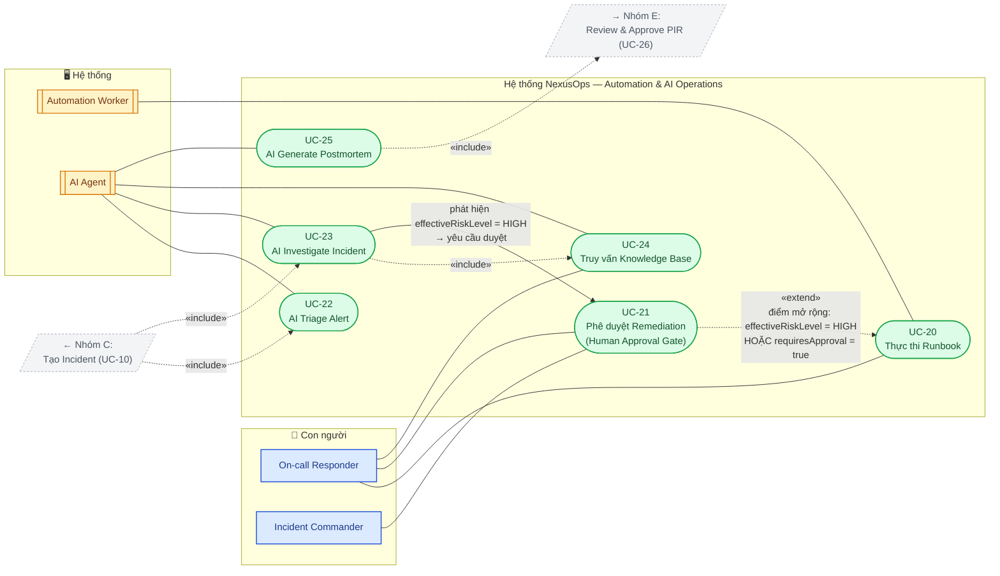

**UC-20 — Thực thi Runbook (Trigger/Execute)**
- **Tác nhân:** Automation Worker (tự động); On-call Responder (thủ công)
- **Mô tả:** Thực thi một hành động vận hành đã định nghĩa trước (runbook) trên một service.
- **Điều kiện tiên quyết:** Runbook tồn tại; nếu `runbook.requiresApproval = true` HOẶC `effectiveRiskLevel = HIGH` (xem §3.4) thì UC-21 phải hoàn tất trước.
- **Luồng sự kiện chính:**
  1. Runbook được kích hoạt (thủ công qua `POST /runbooks/{id}/execute`, hoặc tự động từ AI recommendation đã approve).
  2. Hệ thống kiểm tra `automation_rate_limits`: nếu vượt ngưỡng lặp lại trong 15 phút gần nhất → nâng `effectiveRiskLevel` lên `HIGH` và chuyển sang UC-21 bất kể trạng thái pre-authorize (Automation Circuit Breaker — xem §2.6).
  3. Automation Worker thực thi hành động (restart, rollback, scale,...).
  4. Hệ thống ghi lại `automation_executions`, tăng bộ đếm `automation_rate_limits`, publish `AutomationExecuted`.
- **Luồng ngoại lệ:** Thực thi thất bại → ghi log lỗi, thông báo cho responder.
- **Điều kiện sau:** Hành động vận hành đã được thực thi (hoặc ghi nhận thất bại) trên service mục tiêu.

**UC-21 — Phê duyệt Automated Remediation (Human Approval Gate)**
- **Tác nhân:** On-call Responder, Incident Commander
- **Mô tả:** Con người xem xét và phê duyệt (hoặc từ chối) một hành động remediation rủi ro cao do AI đề xuất.
- **Điều kiện tiên quyết:** `runbook.requiresApproval = true` HOẶC `effectiveRiskLevel = HIGH` cho action tương ứng (từ `riskLevel` tĩnh của runbook, service criticality, hoặc circuit breaker — xem §3.4).
- **Luồng sự kiện chính:**
  1. Hệ thống hiển thị đề xuất remediation kèm bằng chứng (evidence từ `AI_INVESTIGATION`/`AI_TOOL_CALL`) và mức rủi ro cho actor có quyền `AUTOMATION_EXECUTE`.
  2. Actor xem xét, gọi `POST /automation/{id}/approve` (hoặc từ chối).
  3. Hệ thống ghi bản `automation_approvals` bất biến (`approvedBy`, `decision`, `decidedAt`, `evidenceSnapshotRef` — snapshot đúng bằng chứng đã hiển thị tại bước 1, phục vụ audit sau này).
  4. Nếu approve → publish `AutomationApproved`, chuyển sang UC-20.
- **Luồng ngoại lệ:** Actor từ chối → đề xuất bị huỷ (vẫn ghi `automation_approvals` với `decision = REJECTED`), responder xử lý thủ công.
- **Điều kiện sau:** Quyết định phê duyệt/từ chối được ghi bất biến vào `automation_approvals` và `audit_logs`; automation chỉ chạy khi đã approve; quyết định có thể truy vết lại chính xác bằng chứng đã dùng tại thời điểm phê duyệt.

**UC-22 — AI Triage Alert**
- **Tác nhân:** AI Agent (Triage Agent)
- **Mô tả:** Phân loại nhanh một alert/incident mới: mức độ nghiêm trọng, trùng lặp, service ảnh hưởng.
- **Điều kiện tiên quyết:** Incident vừa được tạo (UC-10).
- **Luồng sự kiện chính:**
  1. AI Agent nhận sự kiện `IncidentCreated`.
  2. Agent gọi các tool (`getAlerts`, `searchPastIncidents`,...) để thu thập context.
  3. Agent trả về kết quả triage (severity, likely service, related incidents, confidence) qua `POST /ai/incidents/{id}/triage`.
- **Điều kiện sau:** Kết quả triage hiển thị trên Incident Detail, hỗ trợ responder ra quyết định nhanh hơn.

**UC-23 — AI Investigate Incident**
- **Tác nhân:** AI Agent (Investigation Agent)
- **Mô tả:** Điều tra sâu để tìm giả thuyết root-cause, chạy song song với escalation.
- **Điều kiện tiên quyết:** Incident đã được tạo; agent có quyền truy cập tool platform.
- **Luồng sự kiện chính:**
  1. Agent thu thập logs, metrics, recent deployments, dependencies (qua tool calling).
  2. Agent truy vấn Knowledge Base (RAG) để tìm incident/runbook tương tự (UC-24).
  3. Agent tổng hợp giả thuyết root-cause kèm độ tin cậy, đề xuất remediation và risk rating.
  4. Nếu `effectiveRiskLevel = HIGH` → chuyển sang UC-21 (Human Approval); nếu `LOW` và không bị `requiresApproval` ép buộc (§3.4) → có thể tự động thực thi theo policy.
- **Điều kiện sau:** Kết quả investigation (root cause, bằng chứng, đề xuất) được gắn vào Incident Detail.

**UC-24 — Truy vấn Knowledge Base**
- **Tác nhân:** On-call Responder; AI Agent
- **Mô tả:** Tìm kiếm runbook, tài liệu, hoặc incident cũ liên quan bằng RAG.
- **Điều kiện tiên quyết:** Knowledge Base đã có dữ liệu được embed vào PGVector.
- **Luồng sự kiện chính:**
  1. Actor đặt câu hỏi (ví dụ "làm sao khôi phục Redis failure?").
  2. Hệ thống embed câu hỏi, truy vấn PGVector để lấy các document/chunk liên quan nhất.
  3. Kết quả được trả về kèm nguồn trích dẫn (runbook, incident cũ).
- **Điều kiện sau:** Actor nhận được câu trả lời có căn cứ từ knowledge base.

**UC-25 — AI Generate Postmortem Draft**
- **Tác nhân:** AI Agent (Postmortem/Scribe Agent)
- **Mô tả:** Tự động soạn thảo bản nháp Post-Incident Review sau khi incident resolve.
- **Điều kiện tiên quyết:** Incident ở trạng thái `RESOLVED` (UC-19).
- **Luồng sự kiện chính:**
  1. Agent thu thập timeline, notes, chat, kết quả investigation của incident.
  2. Agent tổng hợp thành bản nháp PIR (summary, root cause, impact, timeline, action items) ở trạng thái `DRAFT`.
  3. Bản nháp được gửi tới Incident Commander/Team Manager để review (UC-26).
- **Điều kiện sau:** Một `PostIncidentReview` ở trạng thái `DRAFT` được tạo, sẵn sàng cho con người chỉnh sửa.

### 4.6 Use Case: Reliability Engineering & Governance

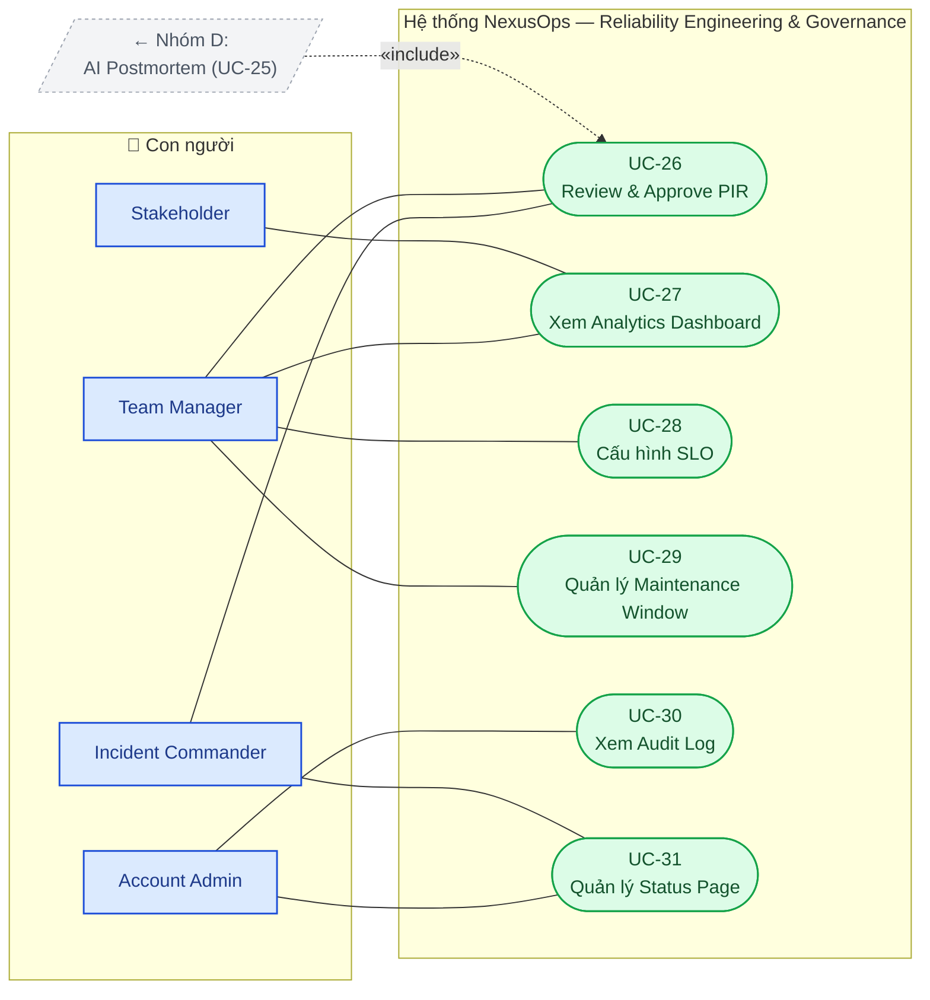

**UC-26 — Review & Approve Post-Incident Review**
- **Tác nhân:** Incident Commander, Team Manager
- **Mô tả:** Xem xét, chỉnh sửa và phê duyệt bản PIR do AI soạn thảo.
- **Điều kiện tiên quyết:** PIR ở trạng thái `DRAFT` (UC-25).
- **Luồng sự kiện chính:**
  1. Actor xem xét bản nháp, chỉnh sửa nội dung, gán owner/due date cho action item.
  2. Actor chuyển trạng thái `IN_REVIEW` → `APPROVED` → `COMPLETED` khi action item hoàn tất.
- **Điều kiện sau:** PIR chính thức được lưu vào Knowledge Base, phục vụ các lần AI investigation sau này.

**UC-27 — Xem Analytics Dashboard**
- **Tác nhân:** Team Manager, Stakeholder
- **Mô tả:** Xem các chỉ số reliability (MTTA, MTTR, MTTD, alert-noise funnel, escalation rate).
- **Điều kiện tiên quyết:** Có đủ dữ liệu incident lịch sử.
- **Luồng sự kiện chính:**
  1. Actor mở Dashboard.
  2. Hệ thống tính toán các metric trực tiếp từ timestamp của incident.
  3. Dashboard hiển thị biểu đồ theo service/team/khoảng thời gian.
- **Điều kiện sau:** Actor có cái nhìn tổng quan về reliability để ra quyết định cải tiến.

**UC-28 — Cấu hình SLO**
- **Tác nhân:** Team Manager
- **Mô tả:** Khai báo SLO và error budget cho một service.
- **Điều kiện tiên quyết:** Service đã tồn tại.
- **Luồng sự kiện chính:**
  1. Team Manager nhập mục tiêu SLO (ví dụ 99.9%) cho service.
  2. Hệ thống theo dõi mức tiêu hao error budget dựa trên incident ảnh hưởng tới service đó.
- **Điều kiện sau:** Service có SLO được giám sát; incident mới được quy về tiêu hao error budget.

**UC-29 — Quản lý Maintenance Window**
- **Tác nhân:** Team Manager
- **Mô tả:** Đặt lịch bảo trì cho một service, trong đó event không được tạo thành incident.
- **Điều kiện tiên quyết:** Service đã tồn tại.
- **Luồng sự kiện chính:**
  1. Team Manager tạo maintenance window qua khoảng thời gian bắt đầu/kết thúc.
  2. Trong khoảng thời gian đó, event khớp service này bị suppress tự động (không tạo incident/notification).
- **Điều kiện sau:** Việc bảo trì không gây nhiễu alert giả cho on-call responder.

**UC-30 — Xem Audit Log**
- **Tác nhân:** Account Admin
- **Mô tả:** Tra cứu lịch sử các hành động có quyền hạn cao trong hệ thống.
- **Điều kiện tiên quyết:** Actor có quyền `AUDIT_VIEW`.
- **Luồng sự kiện chính:**
  1. Admin truy vấn audit log theo actor, resource, khoảng thời gian.
  2. Hệ thống trả về danh sách bản ghi (ai, làm gì, khi nào, giá trị cũ → mới).
- **Điều kiện sau:** Admin có đầy đủ thông tin để phục vụ điều tra nội bộ hoặc tuân thủ.

**UC-31 — Quản lý Status Page**
- **Tác nhân:** Account Admin, Incident Commander, Communications Lead
- **Mô tả:** Cập nhật trang trạng thái công khai/nội bộ phản ánh tình trạng vận hành của các service.
- **Điều kiện tiên quyết:** Service đã tồn tại trong Service Directory.
- **Luồng sự kiện chính:**
  1. Hệ thống tự động đề xuất cập nhật status page dựa trên trạng thái incident hiện tại.
  2. Actor xem xét, chỉnh sửa nội dung hướng tới công chúng (nếu cần), phê duyệt trước khi công bố.
- **Điều kiện sau:** Status Page phản ánh đúng và kịp thời tình trạng vận hành các service.

### 4.7 Sơ đồ Bổ sung — Sequence & State Diagram cho các Luồng Phức tạp

Use Case Diagram ở trên trả lời câu hỏi "hệ thống có những gì và ai dùng" nhưng không thể hiện thứ tự thời gian hay vòng đời trạng thái. Bốn sơ đồ dưới đây bổ sung chiều thời gian cho hai luồng phức tạp nhất của nền tảng (Automation & AI Operations, Escalation & Notification) và vòng đời trạng thái của hai entity trung tâm (`Incident`, `PostIncidentReview`), khớp với các fix đã áp dụng ở §2.6 và §3.4.

**4.7.1 Sequence Diagram — Xử lý Automation & AI Operations**

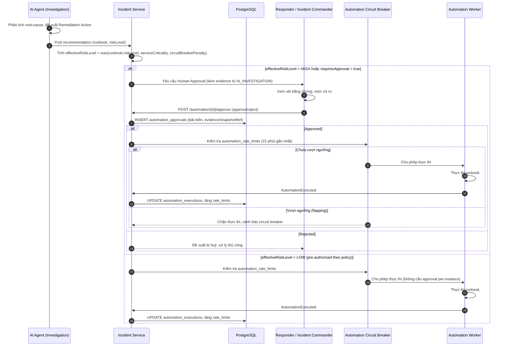

**4.7.2 Sequence Diagram — Escalation & Notification (an toàn với race condition)**

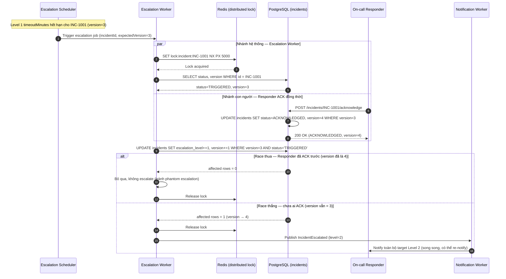

**4.7.3 State Diagram — Vòng đời Incident**

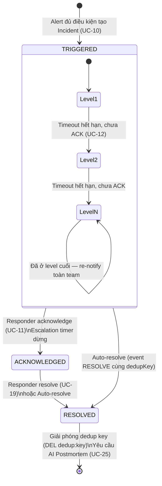

**4.7.4 State Diagram — Vòng đời Post-Incident Review (PIR)**

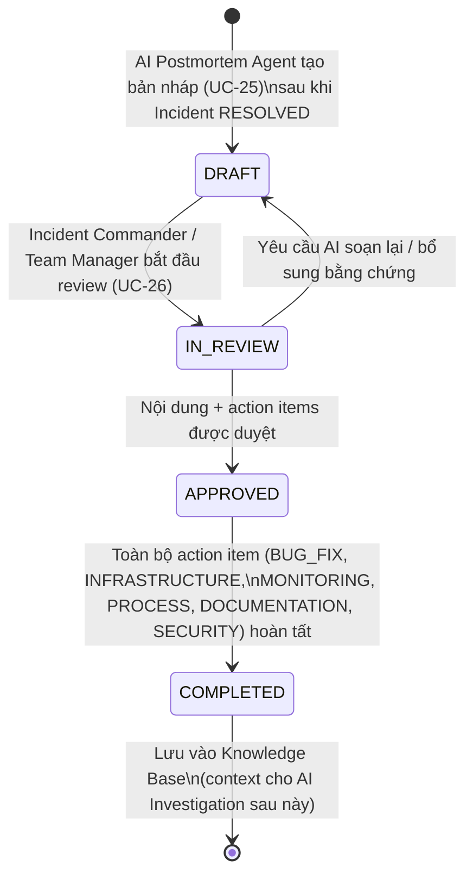

> **Lưu ý:** cạnh `IN_REVIEW → DRAFT` ở sơ đồ PIR là bổ sung hợp lý ngoài mô tả gốc ở §3.5 (vốn chỉ liệt kê chuỗi trạng thái tiến thẳng `DRAFT → IN_REVIEW → APPROVED → COMPLETED`), phản ánh thực tế review thường yêu cầu chỉnh sửa lại bản nháp trước khi duyệt.

**4.7.5 Sequence Diagram — Event Ingestion (UC-07): Rate Limiting & Idempotency**

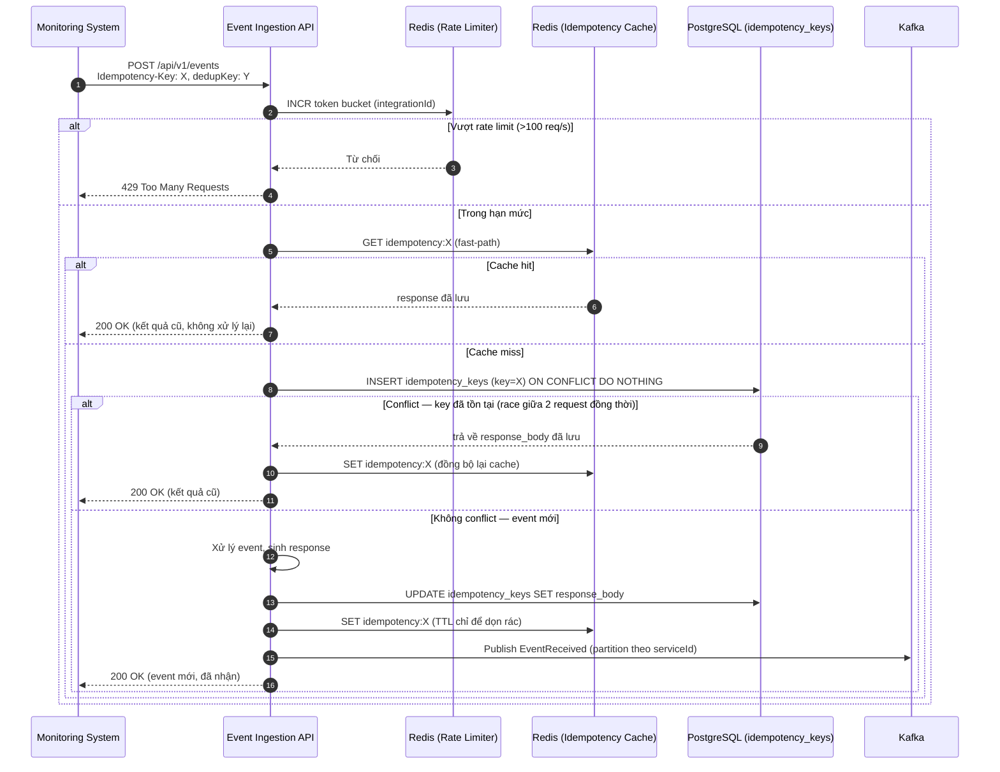
*Ý nghĩa:* đây là con đường lưu lượng cao nhất hệ thống — mọi bug ở đây nhân lên theo throughput ingestion. Sơ đồ dựng đúng nguyên tắc "Redis là fast-path, PostgreSQL là nguồn chân lý" đã fix ở §2.6: `ON CONFLICT DO NOTHING` xử lý đúng cả trường hợp hai request trùng `Idempotency-Key` đến gần như đồng thời (race condition ở chính bước ghi DB, không chỉ ở bước đọc cache).

**4.7.6 Decision Flow — Dedup Key Lifecycle (UC-09)**

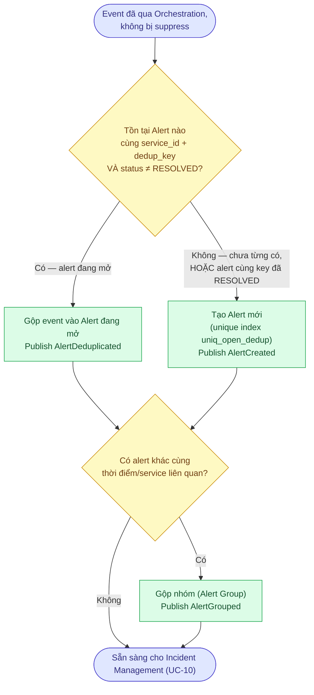
*Ý nghĩa:* trực quan hoá đúng fix N1 (đợt audit) — nhánh "chưa từng có" và nhánh "cũ đã RESOLVED" trông khác nhau về mặt dữ liệu nhưng phải dẫn tới **cùng một hành động** (tạo alert mới). Đây chính là lỗi logic ban đầu tài liệu mắc phải (coi 2 trường hợp này khác nhau, dẫn tới sự cố lặp lại bị gộp nhầm vào alert cũ).

**4.7.7 Sequence Diagram — AI Tool-Calling Loop (UC-22/UC-23, mô hình ReAct)**

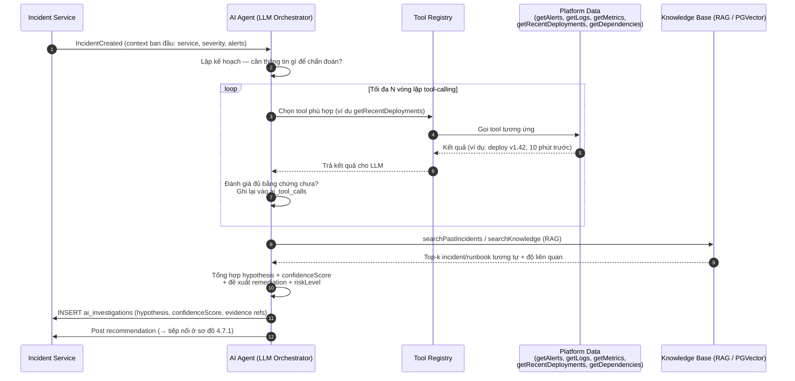
*Ý nghĩa:* thể hiện đúng bản chất "AI Agent Platform" như §1.1 mô tả — không phải một lệnh gọi LLM đơn lẻ, mà một vòng lặp tool-calling nhiều bước, mỗi bước được ghi vào `ai_tool_calls` để phục vụ audit trail (khớp entity đã thêm ở ERD §5.3 sau fix N6). Sơ đồ này là tiền đề của sơ đồ 4.7.1 — điểm nối là bước cuối "Post recommendation".

---

## 5. Mô hình Dữ liệu (Database Schema)

### 5.1 Tổng quan Entity theo Domain

| Domain | Bảng chính |
|---|---|
| Identity & Access | `users`, `roles`, `permissions`, `user_roles`, `role_permissions`, `organizations`, `teams`, `team_members` |
| Service & Integration | `services`, `service_dependencies`, `integrations`, `maintenance_windows` |
| Event & Alert Processing | `events`, `alerts`, `alert_groups`, `routing_rules`, `orchestration_rules`, `idempotency_keys` |
| Incident Management | `incidents` (kèm cột `version` cho optimistic locking), `incident_alerts`, `incident_events`, `incident_notes`, `incident_responders` (kèm cột `role`: Incident Commander/Technical Lead/Communications Lead/Scribe/Responder), `incident_subscribers` |
| On-call & Escalation | `schedules`, `schedule_layers`, `schedule_members`, `schedule_overrides`, `escalation_policies`, `escalation_rules` (kèm `repeatCount`/`repeatIntervalMinutes`), `escalation_rule_targets` (junction — mỗi rule có thể có **nhiều target song song**: nhiều `USER`/`SCHEDULE`/`TEAM` trong cùng một level) |
| Notification | `notification_rules`, `notification_deliveries` |
| Automation & Workflow | `workflows`, `workflow_steps`, `workflow_executions`, `runbooks`, `automation_actions`, `automation_approvals`, `automation_executions`, `automation_rate_limits` |
| Knowledge & AI | `knowledge_documents`, `knowledge_chunks`, `embeddings`, `ai_agents`, `ai_sessions`, `ai_tool_calls`, `ai_investigations` |
| Governance & Analytics | `post_incident_reviews`, `post_incident_actions`, `audit_logs`, `slo_configs`, `service_metrics` |

> **Sửa sau audit:** đổi tên `service_integrations` → `integrations` cho khớp entity `INTEGRATION` ở ERD §5.3 (trước đây hai nơi dùng hai tên khác nhau cho cùng một bảng); bổ sung `role_permissions` (đã có trong ERD nhưng thiếu ở bảng này) và `escalation_rule_targets` (bảng thực sự hiện thực tính năng multi-target/level đã mô tả ở §3.3 nhưng trước đây chỉ có ghi chú, chưa có bảng).

### 5.2 Quan hệ Entity Cốt lõi

Một `Organization` sở hữu `Users` và `Teams`; mỗi `Team` sở hữu một hoặc nhiều `Services`. Mỗi `Service` liên kết với một `Integration` (cho event ingestion), một `EscalationPolicy` (cho routing), một `Schedule` (để resolve on-call), và tập hợp `Dependencies` với các service khác. `Events` đầu vào được chuyển thành `Alerts` gắn với một `Service`; các `Alerts` liên quan được gộp vào một `Incident`, incident này tích luỹ `Responders` (mỗi responder có một `role` — Incident Commander, Technical Lead, Communications Lead, Scribe, hoặc Responder), một `Timeline`, `Notes`, `Status Updates`, một hoặc nhiều `AI Investigation`, các lần thực thi `Automation` kèm `Approval` tương ứng, và cuối cùng là một `Postmortem`.

**Bổ sung sau kiểm toán (audit fix N6).** Chuỗi truy vết `Incident → AI Investigation → Automation Action → Approval → Execution` trước đây không có trong ERD dù là trụ cột của cơ chế Human Approval Gate (§2.6) — nếu không có bản ghi bất biến "AI đã trình bày bằng chứng gì tại thời điểm approve", hệ thống không thể audit lại quyết định approve sau này. ERD dưới đây bổ sung đầy đủ chuỗi này, cùng với RBAC (`Role`/`Permission`) và `AuditLog` — trước đó chỉ xuất hiện ở bảng tổng quan §5.1 chứ chưa có trong sơ đồ quan hệ.

**Sửa sau audit (vòng 2).** Ba khoảng trống được phát hiện và vá ở ERD dưới đây: **(1)** `SERVICE_DEPENDENCY` trước đây chỉ có một cạnh quan hệ dù bản chất là self-referencing many-to-many (Service phụ thuộc Service khác) — nay thêm cạnh thứ hai; **(2)** `ESCALATION_RULE` trước đây trỏ thẳng tới `SCHEDULE` (target đơn), không khớp với tính năng multi-target/level đã mô tả ở §3.3 — nay thay bằng junction `ESCALATION_RULE_TARGET` (polymorphic `targetType`/`targetId`); **(3)** `automation_rate_limits` đã có ở bảng tổng quan §5.1 nhưng chưa từng xuất hiện trong ERD dù là trụ cột của Automation Circuit Breaker (§2.6) — nay bổ sung đầy đủ. `idempotency_keys` **chủ động không đưa vào ERD**: bảng này không có quan hệ FK với entity nào khác (khoá bằng chuỗi `key`, không phải quan hệ), nên không thuộc phạm vi "core relationships" của sơ đồ này.

### 5.3 Sơ đồ Quan hệ Thực thể (ERD)

```mermaid
erDiagram
    ORGANIZATION ||--o{ TEAM : contains
    ORGANIZATION ||--o{ USER : employs
    TEAM ||--o{ TEAM_MEMBER : has
    USER ||--o{ TEAM_MEMBER : "belongs to"
    TEAM ||--o{ SERVICE : owns
    SERVICE ||--o{ SERVICE_DEPENDENCY : "depends on (serviceId)"
    SERVICE_DEPENDENCY }o--|| SERVICE : "points to (dependsOnServiceId)"
    SERVICE ||--o{ INTEGRATION : has
    SERVICE ||--o| ESCALATION_POLICY : uses
    ESCALATION_POLICY ||--o{ ESCALATION_RULE : contains
    ESCALATION_RULE ||--o{ ESCALATION_RULE_TARGET : "có nhiều target song song"
    SCHEDULE ||--o{ SCHEDULE_LAYER : contains
    INTEGRATION ||--o{ EVENT : receives
    EVENT ||--o| ALERT : "processed into"
    ALERT }o--|| SERVICE : "scoped to"
    ALERT }o--o{ INCIDENT : "aggregated into"
    INCIDENT }o--|| SERVICE : impacts
    INCIDENT ||--o{ INCIDENT_RESPONDER : has
    USER ||--o{ INCIDENT_RESPONDER : "assigned as"
    INCIDENT ||--o{ INCIDENT_EVENT : logs
    INCIDENT ||--o| POST_INCIDENT_REVIEW : generates

    USER ||--o{ USER_ROLE : has
    ROLE ||--o{ USER_ROLE : "granted via"
    ROLE ||--o{ ROLE_PERMISSION : includes
    PERMISSION ||--o{ ROLE_PERMISSION : "granted by"
    USER ||--o{ AUDIT_LOG : performs

    INCIDENT ||--o{ AI_INVESTIGATION : produces
    AI_INVESTIGATION ||--o{ AI_TOOL_CALL : uses
    AI_INVESTIGATION ||--o| AUTOMATION_ACTION : recommends
    SERVICE ||--o{ RUNBOOK : defines
    RUNBOOK ||--o{ AUTOMATION_ACTION : "instantiated as"
    AUTOMATION_ACTION ||--o| AUTOMATION_APPROVAL : requires
    AUTOMATION_APPROVAL }o--|| USER : "decided by"
    AUTOMATION_ACTION ||--o| AUTOMATION_EXECUTION : triggers
    SERVICE ||--o{ AUTOMATION_RATE_LIMIT : "đếm theo cửa sổ thời gian"
    RUNBOOK ||--o{ AUTOMATION_RATE_LIMIT : "đếm theo cửa sổ thời gian"

    ORGANIZATION {
        uuid id PK
        string name
    }
    USER {
        uuid id PK
        string email
        string displayName
        string timezone
    }
    SERVICE {
        uuid id PK
        string name
        string criticality
        string status
    }
    SERVICE_DEPENDENCY {
        uuid id PK
        uuid serviceId FK
        uuid dependsOnServiceId FK
    }
    EVENT {
        uuid id PK
        uuid integrationId FK
        string eventType "ALERT | RESOLVE"
        string dedupKey
        string severity
        timestamp receivedAt
    }
    ALERT {
        uuid id PK
        string dedupKey
        string severity
        string status "OPEN | RESOLVED"
    }
    INCIDENT {
        uuid id PK
        string incidentNumber
        string status "TRIGGERED | ACKNOWLEDGED | RESOLVED"
        string priority
        int version
    }
    INCIDENT_RESPONDER {
        uuid id PK
        uuid incidentId FK
        uuid userId FK
        string role
    }
    ESCALATION_RULE_TARGET {
        uuid id PK
        uuid escalationRuleId FK
        string targetType "USER | SCHEDULE | TEAM"
        uuid targetId
    }
    ROLE {
        uuid id PK
        string name
    }
    PERMISSION {
        uuid id PK
        string code
    }
    AUDIT_LOG {
        uuid id PK
        uuid actorId FK
        string action
        string resourceType
        uuid resourceId
        jsonb oldValue
        jsonb newValue
        timestamp createdAt
    }
    AI_INVESTIGATION {
        uuid id PK
        uuid incidentId FK
        string hypothesis
        float confidenceScore
        timestamp createdAt
    }
    AI_TOOL_CALL {
        uuid id PK
        uuid aiInvestigationId FK
        string toolName
        jsonb input
        jsonb output
        timestamp calledAt
    }
    RUNBOOK {
        uuid id PK
        uuid serviceId FK
        string name
        string riskLevel
        boolean requiresApproval
    }
    AUTOMATION_ACTION {
        uuid id PK
        uuid runbookId FK
        uuid incidentId FK
        string effectiveRiskLevel
    }
    AUTOMATION_APPROVAL {
        uuid id PK
        uuid automationActionId FK
        uuid approvedBy FK
        string decision "APPROVED | REJECTED"
        timestamp decidedAt
        string evidenceSnapshotRef
    }
    AUTOMATION_EXECUTION {
        uuid id PK
        uuid automationActionId FK
        string status "SUCCESS | FAILED"
        timestamp executedAt
    }
    AUTOMATION_RATE_LIMIT {
        uuid serviceId PK
        uuid runbookId PK
        timestamp windowStart PK
        int executionCount
    }
```

---

## 6. Nguyên tắc Thiết kế API (API Design Guidelines)

### 6.1 Nguyên tắc Thiết kế

- **Hai bề mặt API riêng biệt.** Một **Events API** machine-generated (`POST /api/v1/events`) tối ưu cho throughput ingestion cao, xác thực bằng API key theo integration, tách biệt khỏi **Management API** hướng resource dùng cho cấu hình và thao tác do con người thực hiện, xác thực bằng **JWT** (cặp access + refresh token).
- **Versioning.** Toàn bộ endpoint nằm dưới namespace `/api/v1/`; breaking change yêu cầu thêm version segment mới thay vì sửa trực tiếp một contract đang tồn tại. Version cũ được giữ tối thiểu 6 tháng sau khi version mới phát hành, kèm header `Sunset` báo ngày ngừng hỗ trợ.
- **Đặt tên hướng resource.** Endpoint dùng danh từ số nhiều và các HTTP verb chuẩn (`GET`, `POST`, `PATCH`, `DELETE`); các hành động thay đổi trạng thái không thuần CRUD được biểu diễn dưới dạng sub-resource hoặc verb (`POST /incidents/{id}/acknowledge`, `POST /incidents/{id}/escalate`).
- **Idempotency-Key và dedupKey — hai lớp bảo vệ khác nhau, không thay thế nhau.** `Idempotency-Key` (HTTP header, bắt buộc trên mọi `POST /api/v1/events`) chống trùng lặp do **retry mạng** ở tầng vận chuyển — cùng key trả về đúng response đã lưu (xem `idempotency_keys`, §2.6). `dedupKey` (trường ở tầng domain, bắt buộc trong body) chống trùng lặp **nghiệp vụ** theo thời gian — nhiều request khác nhau, hợp lệ, nhưng cùng phản ánh một sự cố đang mở thì gộp thành một alert (xem `uniq_open_dedup`, §2.6). Một request thiếu `dedupKey` vẫn được `Idempotency-Key` bảo vệ khỏi trùng do retry, nhưng **không** được bảo vệ khỏi tạo alert trùng về mặt nghiệp vụ — do đó `dedupKey` là bắt buộc, không phải lựa chọn thay thế cho `Idempotency-Key`.
- **Authorization theo permission code.** Mỗi endpoint của Management API được gắn với một hoặc nhiều permission code cụ thể (`INCIDENT_ACK`, `ESCALATION_MANAGE`, `AUTOMATION_EXECUTE`, `AUDIT_VIEW`,...) kiểm tra qua middleware trước khi vào business logic, resolve từ `USER → USER_ROLE → ROLE → ROLE_PERMISSION → PERMISSION` (xem ERD §5.3). Thiếu permission trả về `403` kèm `code: PERMISSION_DENIED`, không phải `401` (vốn dành riêng cho thiếu/hết hạn xác thực).
- **Định dạng lỗi nhất quán.** Lỗi trả về dưới dạng body có cấu trúc (`code`, `message`, `details`) thay vì một chuỗi text thuần, để cả UI và các integration đều có thể xử lý rẽ nhánh theo `code` (ví dụ minh hoạ ở §6.3).
- **Quy ước HTTP status code.** `200` cho GET/action thành công; `201` cho tạo mới resource; `202` cho request được nhận nhưng xử lý bất đồng bộ (ví dụ AI investigation); `204` cho action thành công không có response body; `4xx` cho lỗi phía client (`400` sai định dạng, `401` chưa xác thực, `403` thiếu quyền, `404` không tồn tại, `409` xung đột — ví dụ `Idempotency-Key` trùng nhưng request body khác hash, `429` vượt rate limit); `5xx` cho lỗi phía server.
- **Pagination.** Các endpoint dạng list chấp nhận tham số `page`/`size` (hoặc cursor-based `after`) và trả về một envelope nhất quán kèm tổng số bản ghi và cursor cho trang tiếp theo.
- **Rate limiting.** Áp dụng theo từng integration key tại biên Events API; hạn mức và phần còn lại được trả về qua header `X-RateLimit-*`.

### 6.2 Tổng quan Resource API

> **Sửa sau audit:** bảng dưới đây trước đây chỉ phủ khoảng 23/31 use case ở Mục 4. Bổ sung các domain còn thiếu: RBAC (UC-02), Service Dependency (UC-05), Maintenance Window (UC-29), SLO (UC-28), Post-Incident Review (UC-26), Analytics (UC-27), Status Page (UC-31), Audit Log (UC-30).

| Domain | Endpoint chính | Use Case |
|---|---|---|
| Auth | `POST /auth/login`, `POST /auth/refresh`, `GET /users/me` | UC-01 |
| RBAC | `GET /roles`, `POST /users/{id}/roles`, `GET /permissions` | UC-02 |
| Organizations & Teams | `POST /organizations`, `POST /teams`, `POST /teams/{id}/members` | UC-03 |
| Services | `POST /services`, `GET /services`, `GET /services/{id}`, `PATCH /services/{id}` | UC-04 |
| Service Dependencies | `POST /services/{id}/dependencies`, `GET /services/{id}/dependencies` | UC-05 |
| Integrations | `POST /services/{id}/integrations` | UC-06 |
| Events (ingestion) | `POST /api/v1/events` | UC-07 |
| Orchestration Rules | `POST /orchestration-rules`, `GET /orchestration-rules` | UC-08 |
| Alerts | `GET /alerts`, `GET /alerts/{id}`, `POST /alerts/{id}/resolve` | UC-09 |
| Incidents | `POST /incidents`, `GET /incidents/{id}`, `POST /incidents/{id}/acknowledge`, `POST /incidents/{id}/resolve`, `POST /incidents/{id}/escalate`, `POST /incidents/{id}/responders`, `POST /incidents/{id}/notes`, `POST /incidents/{id}/status-updates` | UC-10, 11, 12, 17, 18, 19 |
| Schedules | `POST /schedules`, `GET /schedules/{id}/on-call`, `POST /schedules/{id}/overrides` | UC-13, 14 |
| Escalation Policies | `POST /escalation-policies`, `GET /escalation-policies` | UC-15 |
| Notifications | `GET /notifications`, `PATCH /notification-rules/{id}` | UC-16 |
| AI | `POST /ai/incidents/{id}/triage`, `POST /ai/incidents/{id}/investigate`, `POST /ai/incidents/{id}/summarize`, `GET /knowledge/search` | UC-22, 23, 24, 25 |
| Automation | `GET /runbooks`, `POST /runbooks/{id}/execute`, `POST /automation/{id}/approve` | UC-20, 21 |
| Post-Incident Review | `GET /incidents/{id}/pir`, `PATCH /pir/{id}`, `POST /pir/{id}/approve` | UC-26 |
| Analytics | `GET /analytics/metrics` (MTTA/MTTR/MTTD), `GET /analytics/alert-funnel` | UC-27 |
| SLO | `POST /services/{id}/slo`, `GET /services/{id}/slo/burn-rate` | UC-28 |
| Maintenance Windows | `POST /services/{id}/maintenance-windows` | UC-29 |
| Audit Log | `GET /audit-logs` | UC-30 |
| Status Page | `GET /status-page`, `PATCH /status-page` | UC-31 |

**Kênh realtime (ngoài REST).** UC-17 (Incident War Room) dùng WebSocket, không phải REST: `wss://api.nexusops.io/v1/incidents/{id}/live`, xác thực bằng access token JWT hiện có (truyền qua subprotocol header, không truyền qua query string để tránh lộ token trong access log). Kênh này chỉ dùng để đẩy realtime (timeline, chat, trạng thái AI đang investigate); mọi hành động ghi dữ liệu (thêm note, đổi trạng thái) vẫn đi qua REST endpoint tương ứng ở trên, WebSocket không nhận ghi trực tiếp.

### 6.3 Event Ingestion Contract

```json
POST /api/v1/events
Authorization: Bearer <integration-key>
Idempotency-Key: payment-cpu-high-2026-09-16T10:00:00Z

{
  "source": "prometheus",
  "service": "payment-service",
  "eventType": "CPU_HIGH",
  "severity": "critical",
  "summary": "CPU > 95%",
  "timestamp": "2026-09-16T10:00:00Z",
  "dedupKey": "payment-cpu-high"
}
```

Auto-resolve (khớp `dedupKey` của alert đang mở, xem §3.3) dùng cùng endpoint với `eventType: "RESOLVE"`:

```json
{
  "source": "prometheus",
  "service": "payment-service",
  "eventType": "RESOLVE",
  "timestamp": "2026-09-16T10:12:00Z",
  "dedupKey": "payment-cpu-high"
}
```

Ví dụ response lỗi, đúng định dạng nhất quán đã nêu ở §6.1 (`code`/`message`/`details`):

```json
HTTP/1.1 409 Conflict
{
  "code": "IDEMPOTENCY_KEY_REUSED_WITH_DIFFERENT_BODY",
  "message": "Idempotency-Key đã được dùng với một request body khác",
  "details": { "idempotencyKey": "payment-cpu-high-2026-09-16T10:00:00Z" }
}
```

---

## 7. Kịch bản Tham chiếu — Vòng đời một Sự cố P1

Kịch bản dưới đây theo dõi một **incident P1 (payment-service database outage)** từ đầu đến cuối, và là luồng tham chiếu nên dùng để kiểm chứng rằng ingestion, orchestration, escalation, AI investigation, và automation có human-gate được nối với nhau đúng đắn.

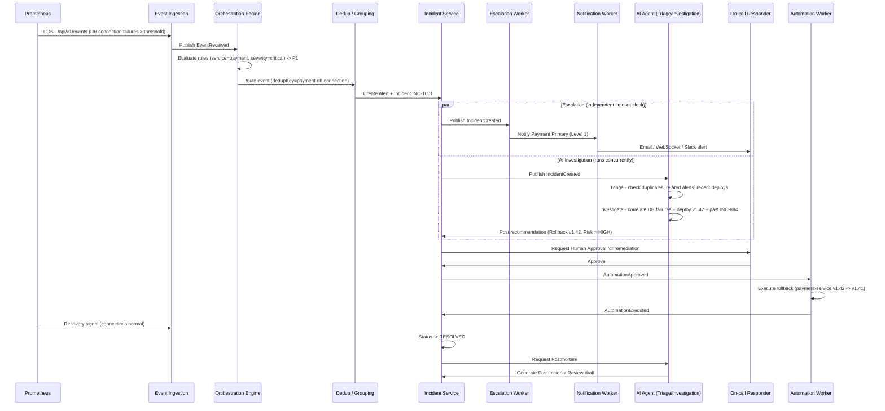

Nếu responder acknowledge trước khi Level 1 escalation timeout, nhánh escalation tự dừng lại — nó không hề phụ thuộc vào việc nhánh AI đã hoàn tất hay chưa, và nhánh AI cũng không phụ thuộc vào việc escalation đã hoàn tất. Hai nhánh chỉ hội tụ tại **Human Approval Gate**, nơi responder đang acknowledge sẽ phê duyệt hành động remediation do AI đề xuất.

---

## 8. Lộ trình Triển khai theo Giai đoạn (Phased Implementation Plan)

Nền tảng chủ động **không** được xây dựng thành 15 microservice ngay từ đầu. Nó được triển khai như một modular monolith, "kiếm" được các tầng event-driven và AI theo từng giai đoạn.

### 8.1 Phase 1 — Foundation

**Mục tiêu:** thiết lập chuỗi tối thiểu `event → alert → incident` chạy được đầu-cuối.

| Hạng mục | Ghi chú |
|---|---|
| Auth & RBAC | JWT-based auth, phân cấp role |
| Organization & Team | Cấu trúc sở hữu |
| Service Directory | Bản ghi service cơ bản |
| Incident & Alert core | CRUD + lifecycle, chưa có async processing |

### 8.2 Phase 2 — PagerDuty Core

**Mục tiêu:** đạt được sự tương đương chức năng với một sản phẩm incident management cơ bản.

| Hạng mục | Ghi chú |
|---|---|
| Integration & Event Ingestion | Events API, integration key, `idempotency_keys` (unique constraint ở DB — xem §2.6) |
| Dedup, Grouping, Routing | Rule engine v1; dedup theo `uniq_open_dedup` (chỉ alert đang mở — xem §2.6) |
| On-call Scheduling | Rotation, override |
| Escalation & Notification | Policy nhiều level (đa target/level, re-notify); **timeout scheduling dùng DB polling** (`SELECT ... FOR UPDATE SKIP LOCKED` + `@Scheduled`), chưa cần Kafka/Redis — xem §3.3 |

> **Audit fix (N4):** bản trước đây yêu cầu Phase 2 có escalation hoạt động nhưng cơ chế mô tả ở §3.3 (Kafka + Redis) chỉ có từ Phase 3 — tự mâu thuẫn. Phase 2 nay dùng DB polling làm cơ chế escalation timeout tạm thời, đủ dùng ở quy mô nhỏ/vừa; Phase 3 nâng cấp sang Kafka + Redis khi cần scale (không đổi hành vi nghiệp vụ, chỉ đổi cơ chế thực thi bên dưới).

### 8.3 Phase 3 — Advanced Reliability

**Mục tiêu:** đưa vào xương sống distributed-systems và chiều sâu vận hành.

| Hạng mục | Ghi chú |
|---|---|
| Kafka event bus | Thay thế DB polling cho escalation scheduling; partition theo `incidentId`/`serviceId` (xem §2.4) |
| Tách process API ↔ Worker | Escalation/Notification/AI/Automation Worker chạy process riêng, tách khỏi REST API (xem §2.1) |
| Redis reliability patterns | Fencing token cho distributed lock, rate limiting (Redis chỉ là fast-path cache — DB vẫn là nguồn chân lý) |
| Retry / DLQ | Tăng độ tin cậy cho notification delivery |
| Automation Circuit Breaker | `automation_rate_limits`, ép về Human Approval khi lặp lại (xem §2.6) |
| Maintenance windows, Runbooks | Suppression + các automation action đầu tiên |
| Incident collaboration | War room, status update |
| **Load & chaos testing (baseline)** | Kiểm chứng sớm idempotency/dedup/rate-limiting dưới tải burst — không đợi tới Phase 5 |

### 8.4 Phase 4 — AI Operations

**Mục tiêu:** đưa ra điểm khác biệt cốt lõi của nền tảng, chia hai giai đoạn con để tách rủi ro "hạ tầng AI" khỏi rủi ro "AI được phép ghi/thực thi".

**Phase 4a — AI Read-Only** (rủi ro thấp, không cần Human Approval Gate):

| Hạng mục | Ghi chú |
|---|---|
| Knowledge base & RAG | Retrieval dựa trên PGVector |
| Triage & Investigation Agents | Tool-calling trên dữ liệu platform (chỉ đọc); `ai_investigations`, `ai_tool_calls` |
| Knowledge Agent, On-call Assistant | Trả lời câu hỏi, không thay đổi trạng thái hệ thống |

**Phase 4b — AI Write-Capable + Governance** (chỉ bắt đầu sau khi 4a đã ổn định về chất lượng câu trả lời):

| Hạng mục | Ghi chú |
|---|---|
| Remediation Agent | Đề xuất hành động kèm `riskLevel` |
| Human Approval Gate | `automation_approvals`, `effectiveRiskLevel` động (xem §3.4) |
| Postmortem / Scribe Agent | Tự động soạn thảo PIR |

### 8.5 Phase 5 — Production Engineering

**Mục tiêu:** đảm bảo nền tảng vận hành được và đáng tin cậy ở chính bản thân nó.

| Hạng mục | Ghi chú |
|---|---|
| CI/CD, Docker, AWS deployment | |
| Observability (self-observability) | Prometheus, Grafana, OpenTelemetry — NexusOps **tự giám sát chính nó** (dogfooding chuẩn SRE); đây không phải sản phẩm observability bán cho khách hàng, không mâu thuẫn với ranh giới scope ở §1.4 |
| Security hardening | Rate limiting, phủ audit log đầy đủ |
| Load & chaos testing (mở rộng) | Mở rộng bộ test đã có từ Phase 3 lên quy mô production-like |

### 8.6 Ma trận Ưu tiên

| Tính năng | Ưu tiên |
|---|---|
| Auth / JWT, RBAC, Organization/Team | Must |
| Service Directory, Event Ingestion, Alerting, Dedup | Must |
| Incident, On-call, Escalation, Notification | Must |
| Kafka, Redis, Rule Engine, Runbooks | Should |
| Idempotency store (DB), Audit Log, RBAC entities | Must — điều kiện tiên quyết cho compliance/audit, không được lùi lại |
| RAG, AI Investigation | Must (đối với bản phát hành có AI) |
| AI Triage, AI Postmortem, Automation | Should |
| Automation Circuit Breaker (rate limit + dynamic risk) | Must — bắt buộc trước khi Automation Worker được phép thực thi bất kỳ action nào |
| Status Page, SLO | Nice to have |
| Mobile app, Multi-region HA | Ngoài phạm vi |

### 8.7 Các Hạng mục Ngoài phạm vi

Để giữ nguồn lực triển khai tập trung vào điểm khác biệt cốt lõi của NexusOps, các hạng mục sau được xem là **external integration, không phải mục tiêu tự xây**: một hệ thống observability đầy đủ (tự xây Prometheus/log collector riêng), một mô hình ML tự huấn luyện, một Kubernetes operator đầy đủ, một nền tảng provisioning dựa trên Terraform đầy đủ, một ứng dụng mobile native, và khả năng multi-region high availability. Prometheus, Grafana, Kubernetes, AWS và GitHub Actions được sử dụng như các hệ thống bên ngoài mà nền tảng tích hợp vào, không phải các hệ thống cần xây lại.
