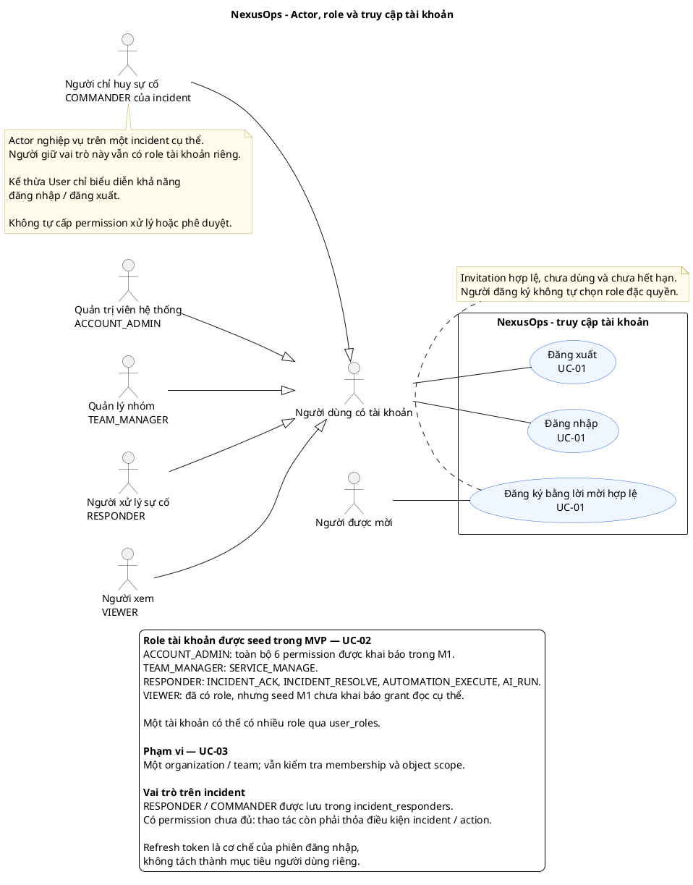

## Giải thích dễ hiểu: NexusOps làm gì?

Nói đơn giản nhất: **NexusOps là một "tổng đài cấp cứu" cho hệ thống phần mềm.** Khi có gì đó hỏng trong lúc nửa đêm, nó tự động phát hiện, gọi đúng người, và giúp người đó sửa lỗi nhanh nhất có thể — giống hệt cách tổng đài 115 nhận tin báo, điều xe cứu thương đến đúng địa chỉ, và ghi lại hồ sơ sau khi xử lý xong.

### Một câu chuyện cụ thể để hình dung

Hãy tưởng tượng bạn đang điều hành một ứng dụng thanh toán, và **3 giờ sáng, database bị lỗi**:

1. **Phát hiện** — Công cụ giám sát (giống như cảm biến nhiệt độ trong nhà) nhận thấy database đang trả lỗi liên tục, và gửi tín hiệu này cho NexusOps.

2. **Lọc nhiễu** — Trong 2 giây, database này có thể sinh ra 50 tín hiệu lỗi giống nhau (mỗi lần một request thất bại). Thay vì gửi 50 tin nhắn dồn dập làm kỹ sư hoảng loạn, NexusOps **gộp lại thành 1 sự cố duy nhất**: "Payment Service đang gặp sự cố database".

3. **Tìm đúng người** — Hệ thống tự tra: ai đang trực ca đêm nay cho team Payment? Tìm ra kỹ sư A, gửi thông báo qua app, tin nhắn, và nếu 5 phút không phản hồi thì **tự động gọi điện thoại** luôn — không cần ai phải ngồi canh.

4. **Không ai trả lời thì báo tiếp** — Nếu kỹ sư A đang ngủ say không nghe máy, sau khoảng thời gian quy định, hệ thống **tự động báo tiếp cho người khác** (leader của team), rồi cấp cao hơn nữa nếu vẫn im lặng — đảm bảo sự cố không bao giờ "rơi vào quên lãng".

5. **AI hỗ trợ điều tra song song** — Trong lúc chờ người phản hồi, một "trợ lý AI" đã tự động lục lại: gần đây có ai vừa deploy code mới không? Log lỗi trông giống lần nào trước đây? Nó đưa ra gợi ý: *"Có khả năng do bản deploy 10 phút trước — đề xuất rollback"*.

6. **Con người quyết định, AI không tự ý làm** — Kỹ sư thức dậy, xem gợi ý của AI, thấy hợp lý thì bấm **duyệt** — lúc đó hệ thống mới tự động rollback giúp. AI không bao giờ tự ý sửa hệ thống production mà không hỏi qua con người trước, để tránh AI đoán sai rồi làm hỏng thêm.

7. **Xong việc, tự viết báo cáo** — Sau khi sự cố được xử lý xong, AI tự soạn sẵn một bản báo cáo: chuyện gì xảy ra, ai xử lý, mất bao lâu, nguyên nhân là gì — kỹ sư chỉ cần đọc lại và chỉnh sửa thay vì phải nhớ lại và gõ từ đầu (việc mà bình thường hay bị... quên làm).

### Vì sao cần một hệ thống như vậy?

Không có NexusOps, ba thứ tệ hại xảy ra:
- **Chậm** — con người phải tự dò tìm ai chịu trách nhiệm, tự gọi điện, tự tìm log.
- **Dễ sót** — nếu người trực ca ngủ quên, không ai biết sự cố đang bị bỏ mặc.
- **Không học được gì** — sự cố qua rồi thì thôi, ít ai chịu ngồi viết lại để lần sau không lặp lại.

NexusOps giải quyết cả ba: nhanh hơn (tự động hoá phần lặp lại), chắc chắn hơn (không bao giờ "quên" báo ai đó), và có trí nhớ tổ chức (mọi sự cố đều để lại tri thức cho lần sau).

### Ai dùng hệ thống này, dùng để làm gì

| Vai trò | Họ cần gì | NexusOps cho họ gì |
|---|---|---|
| Kỹ sư trực ca (Responder) | Biết ngay khi có sự cố, không bỏ lỡ | Thông báo đa kênh, tự động gọi lại nếu im lặng |
| Trưởng nhóm kỹ thuật | Sắp xếp lịch trực, chính sách báo động hợp lý | Công cụ cấu hình schedule/escalation, không phải code tay |
| Người chỉ huy sự cố lớn | Điều phối nhiều người cùng xử lý một sự cố nghiêm trọng | "Phòng họp khẩn cấp" ảo (War Room) với timeline, chat, gợi ý AI |
| Quản lý cấp cao | Biết hệ thống đang ổn định hay không, đội ngũ có đang hoạt động tốt không | Bảng số liệu: tốc độ phát hiện, tốc độ xử lý, xu hướng sự cố theo thời gian |

# NexusOps — Kịch bản Demo Báo cáo Giáo viên

## Tài liệu hướng dẫn trình diễn (Demo Script)

| | |
|---|---|
| **Mục đích** | Kịch bản trình diễn trực tiếp NexusOps trước giáo viên/hội đồng |
| **Thời lượng đề xuất** | 12–15 phút demo + 5–10 phút Q&A |
| **Kịch bản gốc** | Đúng luồng "P1 Incident" đã đặc tả ở §7 và §4.7.1/§4.7.2 của tài liệu kiến trúc |
| **Yêu cầu tài liệu đi kèm** | `NexusOps_Software_Project_Plan_Architecture.md` (mở song song để trỏ tới khi giáo viên hỏi sâu) |

---

## 0. Lưu ý bắt buộc trước khi dùng kịch bản này

Kịch bản này viết cho **toàn bộ 9 Act** như thể mọi thứ đã build xong. Trên thực tế, trước khi tập demo, hãy tự đánh dấu Act nào **đã code thật** và Act nào **còn phải mock/giả lập** (ví dụ: nếu Kafka/Redis chưa kịp ở Phase 3, hay AI Agent chỉ gọi được 1-2 tool thay vì đầy đủ vòng lặp). **Tuyệt đối không thuyết trình như thể toàn bộ kiến trúc 31 use case đã chạy production** nếu MVP thực tế chưa tới đó — giáo viên CNPM thường hỏi xoáy đúng vào phần "cái này có thật không hay chỉ là thiết kế", trả lời thẳng "phần này em mới thiết kế, chưa kịp code" luôn tốt hơn bị phát hiện đang giả vờ.

---

## 1. Mục tiêu Demo — chứng minh điều gì

Đừng demo để "cho xem nó chạy" — demo để **chứng minh từng quyết định kiến trúc trong tài liệu là có thật, không phải mô tả suông**. Bốn điều bắt buộc phải lộ ra trong 12 phút:

1. **Pipeline Event → Alert → Incident hoạt động đúng, có dedup** (không phải chỉ là CRUD tạo incident thủ công).
2. **Escalation và AI Investigation chạy song song, độc lập** (đúng ghi chú thiết kế ở §2.6) — không phải AI chạy xong rồi mới escalate.
3. **Human Approval Gate chặn được hành động rủi ro cao, có audit trail** (evidence, ai duyệt, lúc nào) — không phải AI tự làm mọi thứ.
4. **Có số liệu đo được** (MTTA/MTTR) và **audit log tra được** — chứng minh đây là hệ thống vận hành thật, không phải demo giả.

Nếu thời gian gấp, ưu tiên giữ (2) và (3) — đây là hai điểm khác biệt lớn nhất so với một hệ thống ticket thông thường, cũng là hai điểm giáo viên môn CNPM có khả năng hỏi sâu nhất.

### 1.1 Ngân sách thời gian theo từng Act (tổng 12 phút — canh theo bảng này, không canh cảm tính)

| Act | Nội dung | Thời gian | Cộng dồn |
|---|---|---|---|
| 0 | Mở đầu | 0:30 | 0:30 |
| 1 | Fault injection | 0:20 | 0:50 |
| 2 | Event → Alert → Incident (dedup) | 1:00 | 1:50 |
| 3 | Escalation ‖ AI Investigation | 1:30 | 3:20 |
| 4 | AI trình bày kết quả | 1:00 | 4:20 |
| 5 | Human Approval Gate | 1:00 | 5:20 |
| 6 | Automation thực thi (bản rút gọn — xem sửa ở dưới) | 1:30 | 6:50 |
| 7 | Resolve | 0:40 | 7:30 |
| 8 | Postmortem + số liệu + audit log | 1:30 | 9:00 |
| — | Lời kết + chuyển sang Q&A | 0:30 | 9:30 |

**Còn dư ~2:30 phút làm đệm** cho độ trễ thật của AI (tool-calling loop không tức thời) và cho việc giáo viên có thể ngắt lời hỏi ngay giữa demo — đừng lên kế hoạch sát 12 phút tuyệt đối, luôn cần buffer.

---

## 2. Chuẩn bị trước Demo (làm trước tối thiểu 1 ngày, không làm ngay trước giờ báo cáo)

### 2.1 Seed dữ liệu bắt buộc

| Dữ liệu cần seed | Giá trị cụ thể | Vì sao cần |
|---|---|---|
| Organization + Team | `Demo Bank`, team `Payments` | Bối cảnh tổ chức |
| Service | `payment-service`, `criticality = MAJOR_INCIDENT` | Đúng ví dụ xuyên suốt tài liệu (§7, §6.3) |
| Service Dependency | `payment-service → postgresql-primary` | Để AI Investigation có blast-radius thật để phân tích |
| Escalation Policy | Level 1: Responder A (timeout 2 phút) → Level 2: Team Payments (toàn team) | Đủ ngắn để demo không phải chờ lâu — **rút timeout xuống 1–2 phút cho demo**, đừng để mặc định 10-15 phút như production |
| On-call Schedule | Responder A đang trực | Escalation có người nhận |
| **Deployment giả** | `payment-service v1.42`, deploy cách đây ~10 phút | Nếu thiếu, AI Investigation sẽ không có gì để "tương quan" — phần AI sẽ trông giả tạo. Đây là chi tiết dễ bị bỏ quên nhất |
| Knowledge Base | 1 incident cũ tương tự (`INC-884`, "payment-service DB connection pool exhausted") + 1 runbook `rollback-payment-service` | Để RAG (UC-24) có kết quả thật khi AI tra cứu, không trả về rỗng |
| Tài khoản demo | 1 tài khoản Responder, 1 tài khoản Team Manager/Incident Commander (có quyền `AUTOMATION_EXECUTE`) | Cần 2 vai trò khác nhau để demo rõ ai duyệt |

**Ghi cụ thể ra giấy dán màn hình (đừng nhớ bằng đầu, dễ quên lúc căng thẳng):**
```
Responder A       : responder-a@demo.local  / Demo@123
Incident Commander: commander@demo.local    / Demo@123
Integration Key   : <dán sẵn giá trị thật, không gõ tay lúc demo>
```

### 2.2 Môi trường màn hình

Mở sẵn **3 cửa sổ**, sắp xếp cạnh nhau, không chuyển tab qua lại nhiều lần (rất mất thời gian và trông lúng túng):

1. **Trái:** NexusOps Dashboard — danh sách Incident + Incident Detail (đủ chỗ để thấy timeline, AI panel, nút Approve)
2. **Giữa:** Terminal đã gõ sẵn (nhưng chưa Enter) các lệnh `curl` ở Mục 4 — không gõ tay trong lúc demo, chỉ dán/Enter
3. **Phải:** Trình duyệt thứ hai đăng nhập tài khoản Responder khác (để show notification/approval nhận được theo thời gian thực) — nếu không đủ máy, dùng cửa sổ ẩn danh (incognito) thứ hai trên cùng máy

### 2.3 Kế hoạch dự phòng (bắt buộc phải có)

- **Quay sẵn 1 video demo hoàn chỉnh** (2–3 phút, tua nhanh các đoạn chờ) trước ngày báo cáo, phòng khi mạng/server lỗi ngay lúc trình bày.
- **Viết sẵn 1 script reset dữ liệu** (xoá incident cũ, seed lại) để chạy thử được nhiều lần mà không bị rác dữ liệu — chạy ít nhất 3 lần thử trước ngày thật để canh đúng thời gian.
- Nếu Kafka/Redis chưa kịp triển khai (Phase 3 theo lộ trình §8.3), **được phép demo trên cơ chế Phase 1–2** (DB polling thay vì Kafka — đúng như tài liệu đã ghi rõ ở §3.3 là chủ đích, không phải thiếu sót). Nếu giáo viên hỏi "sao không dùng Kafka", trả lời thẳng: đây là lộ trình phased, đã ghi rõ trong Software Project Plan.

---

## 3. Kịch bản Demo — 9 màn (Act), theo đúng sequence diagram §7

> Quy ước: **[NÓI]** = lời thoại gợi ý, **[LÀM]** = thao tác cụ thể, **[HỆ THỐNG]** = điều hệ thống phải hiển thị để màn đó thành công.

### Act 0 — Mở đầu (30 giây)

**[NÓI]** *"Em sẽ demo một sự cố P1 thật — payment-service bị lỗi kết nối database sau một bản deploy — để chứng minh toàn bộ pipeline Event → Alert → Incident → Escalation → AI Investigation → Human Approval → Automation → Postmortem hoạt động đúng như tài liệu kiến trúc đã mô tả ở Mục 7."*

**[LÀM]** Mở Dashboard, chỉ vào `payment-service` đang ở trạng thái `OPERATIONAL` (baseline bình thường).

---

### Act 1 — Trigger sự cố (Fault Injection)

**[NÓI]** *"Để demo lặp lại được, em dùng một endpoint fault-injection riêng thay vì chờ lỗi thật xảy ra ngẫu nhiên."*

**[LÀM]** Chạy trong terminal:
```bash
curl -X POST https://demo-bank.local/admin/inject-fault?type=db_connection_failure
```

**[HỆ THỐNG]** Bank app giả lập bắt đầu gửi liên tục event `DB_CONNECTION_FAILURE` sang NexusOps qua Events API.

---

### Act 2 — Event → Alert → Incident (Dedup + Orchestration)

**[NÓI]** *"NexusOps không tạo một incident cho mỗi event — nó gộp (dedup) trước."*

**[LÀM]** Chạy 2–3 lần liên tiếp cùng một event (mô phỏng Prometheus gửi lặp do at-least-once delivery):
```bash
curl -X POST https://nexusops.local/api/v1/events \
  -H "Authorization: Bearer <integration-key>" \
  -H "Idempotency-Key: payment-db-conn-2026-09-20T10:00:00Z" \
  -d '{
    "source": "prometheus",
    "service": "payment-service",
    "eventType": "DB_CONNECTION_FAILURE",
    "severity": "critical",
    "summary": "Connection pool exhausted",
    "timestamp": "2026-09-20T10:00:00Z",
    "dedupKey": "payment-db-connection"
  }'
```

**[HỆ THỐNG]** Dashboard chỉ hiện **một** Incident duy nhất (`INC-xxxx`), không phải 3 bản ghi trùng.

**[NÓI]** *"Đây chính là cơ chế idempotency + dedup ở Mục 2.6 và 4.7.6 — ba request giống hệt nhau chỉ tạo một alert, một incident."* (Nếu giáo viên hỏi "sao không trùng?" → trỏ vào unique index `uniq_open_dedup` trong tài liệu.)

> **Lưu ý nhỏ khi chuẩn bị:** trường `timestamp` trong JSON chỉ mang tính tường thuật (để câu chuyện nghe hợp lý — "10:00 sáng"), hệ thống dùng thời điểm server nhận request (`receivedAt`) cho mọi tính toán thật (escalation timeout, MTTA...). Không cần chỉnh giờ trong JSON khớp với đồng hồ thật lúc demo.

---

### Act 3 — Escalation ‖ AI Investigation chạy song song

**[NÓI]** *"Ngay khi incident được tạo, hai luồng chạy độc lập, không chờ nhau — đây là điểm em nhấn mạnh nhất trong thiết kế."*

**[LÀM]** Không làm gì — để đồng hồ chạy khoảng 30–60 giây (đã rút timeout escalation xuống ngắn ở bước chuẩn bị). **Đừng đứng im lặng** — đây là lúc nói thêm để lấp thời gian chờ, ví dụ:

> *"Trong lúc chờ, em giải thích thêm: Escalation Policy ở đây không chỉ page một người — mỗi level có thể page nhiều người song song, và nếu không ai ACK, hệ thống sẽ gửi lại (re-notify) 1-2 lần trước khi mới thật sự chuyển sang level kế tiếp. Đây là điểm em cố ý làm giống chuẩn PagerDuty/Opsgenie, không phải chỉ gửi 1 lần rồi im."*

**[HỆ THỐNG]** Đồng thời xuất hiện:
- Bên trái Dashboard: panel "AI Investigation — đang phân tích..." (đang chạy tool-calling loop theo §4.7.7)
- Cửa sổ Responder (phải): nhận notification page Level 1

**Tại đây, chọn 1 trong 2 nhánh tuỳ thời gian còn lại (xác định trước, đừng quyết định ngẫu hứng lúc demo):**

- **Nhánh nhanh (mặc định, đúng ngân sách 12 phút):** ACK ngay ở cửa sổ Responder. **[NÓI]** *"Nếu Responder A ACK ngay bây giờ, escalation dừng lại — nhưng AI vẫn tiếp tục điều tra bình thường, vì hai luồng độc lập."* Chỉ cho giáo viên thấy đồng hồ escalation dừng nhưng panel AI vẫn chạy tiếp. Level 2 (Team Payments) chỉ nêu bằng lời, không chờ demo thật.
- **Nhánh đầy đủ (chỉ làm nếu còn dư thời gian, hoặc giáo viên chủ động hỏi "escalate lên level 2 thì sao"):** Không ACK, đợi hết timeout thật (đã rút xuống 1-2 phút) để Dashboard tự chuyển incident sang Level 2, cửa sổ thứ ba (nếu có chuẩn bị) nhận thông báo cho cả team. Tốn thêm 1-2 phút — chỉ chọn nhánh này nếu Act 6 sẽ bị cắt bù lại.

---

### Act 4 — AI trình bày kết quả điều tra

**[LÀM]** Nếu panel AI ở Act 3 chưa hiển thị xong khi tới đây (tool-calling loop thật có thể mất 15-40 giây, không tức thời) — **đừng vội chuyển màn**, cứ tiếp tục nói về ý nghĩa của luồng trong lúc chờ nốt, ví dụ nhắc lại: *"AI đang lần lượt gọi các tool lấy log, lấy thông tin deploy gần nhất, tra cứu incident cũ tương tự — mỗi bước này em có vẽ chi tiết ở sequence diagram 4.7.7 trong tài liệu."*

**[HỆ THỐNG]** Panel AI hiển thị:
- Giả thuyết root-cause: *"Connection pool exhausted, tương quan với deploy v1.42 cách đây 10 phút"*
- Bằng chứng: link tới deployment record đã seed
- Incident tương tự tìm được qua RAG: `INC-884`
- Đề xuất: **Rollback `payment-service` v1.42 → v1.41**, `riskLevel = HIGH`

**[NÓI]** *"Đây không phải text cố định — AI thật sự gọi tool `getRecentDeployments`, `searchPastIncidents` như ở sequence diagram 4.7.7, và mọi lần gọi tool được ghi vào bảng `ai_tool_calls` để sau này audit lại được."*

---

### Act 5 — Human Approval Gate

**[NÓI]** *"Vì risk = HIGH, hệ thống không tự rollback — nó dừng lại chờ người duyệt."*

**[LÀM]** Đăng nhập tài khoản Incident Commander, mở màn hình duyệt, **đọc to bằng chứng AI đưa ra**, rồi bấm **Approve**.

**[HỆ THỐNG]** Ghi một bản ghi `automation_approvals` (decision=APPROVED, evidenceSnapshotRef) — có thể mở nhanh bản ghi này trong DB/API để chứng minh nó thật sự được lưu bất biến, không chỉ là UI.

**[NÓI]** *"Bản ghi approval này lưu đúng bằng chứng đã hiển thị tại thời điểm duyệt — nếu sau này có ai hỏi 'sao lại duyệt rollback này', mình tra lại được chính xác AI đã đưa ra gì."*

---

### Act 6 — Automation thực thi + (tuỳ chọn) demo Circuit Breaker

**[HỆ THỐNG]** Automation Worker thực thi rollback, Dashboard cập nhật trạng thái.

**[NÂNG CAO — nếu còn thời gian, RẤT đáng làm]** **Không lặp lại toàn bộ Act 1–5** — làm vậy tốn 3-5+ phút (mỗi lần đều có 30-60s chờ escalation + thời gian AI investigate thật) và gần chắc chắn vỡ ngân sách 12 phút. Thay vào đó, gọi thẳng API thực thi runbook liên tiếp để mô phỏng nhanh cùng một automation bị trigger lặp lại — chỉ tốn 10-15 giây mà vẫn chứng minh đúng cơ chế `automation_rate_limits`:
```bash
for i in 1 2 3; do
  echo "--- Lần thực thi $i ---"
  curl -X POST https://nexusops.local/runbooks/rollback-payment-service/execute \
    -H "Authorization: Bearer <commander-token>"
done
```
**[HỆ THỐNG]** Hai lần đầu thực thi bình thường; lần thứ 3 (vượt ngưỡng mặc định 2 lần/15 phút ở §2.6) phải bị chặn và trả về yêu cầu approval bổ sung thay vì tự chạy.

**[NÓI]** *"Đây là minh chứng cho việc em hiểu rủi ro 'automation tự khuếch đại sự cố' — nếu không có cơ chế này, một runbook lỗi có thể tự lặp vô hạn và làm nặng thêm outage thay vì cứu nó."*

---

### Act 7 — Phục hồi (Resolve)

**[LÀM]** Gửi event resolve:
```bash
curl -X POST https://nexusops.local/api/v1/events \
  -H "Authorization: Bearer <integration-key>" \
  -d '{
    "source": "prometheus",
    "service": "payment-service",
    "eventType": "RESOLVE",
    "timestamp": "2026-09-20T10:12:00Z",
    "dedupKey": "payment-db-connection"
  }'
```

**[HỆ THỐNG]** Incident chuyển `RESOLVED` tự động (auto-resolve, §3.3) — **không cần** người bấm nút resolve thủ công. Nhấn mạnh điểm này: có cả 2 đường tới RESOLVED (thủ công + tự động).

---

### Act 8 — Postmortem tự động + số liệu

**[HỆ THỐNG]** PIR ở trạng thái `DRAFT` xuất hiện, do AI Postmortem Agent soạn (đúng UC-25).

**[LÀM]** Mở Dashboard Analytics, chỉ vào MTTA/MTTR vừa được tính cho incident vừa demo.

**[NÓI]** *"MTTA và MTTR tính trực tiếp từ `triggeredAt`/`acknowledgedAt`/`resolvedAt` — các field này em đã bổ sung cụ thể vào schema, không phải chỉ nói suông ở phần metrics."*

**[LÀM]** Chủ động (không đợi giáo viên hỏi) mở nhanh audit log của chính incident vừa demo:
```bash
curl https://nexusops.local/audit-logs?resourceId=<incidentId>
```
**[NÓI]** *"Toàn bộ hành động vừa rồi — ai acknowledge, ai duyệt automation, lúc nào — đều tra lại được ở đây. Em chủ động cho xem trước vì đây là phần em nghĩ quan trọng nhất về mặt vận hành thật, không đợi thầy/cô hỏi mới nói."*

**[NÓI — lời kết]** *"Đó là toàn bộ luồng một sự cố P1 từ lúc phát sinh tới lúc đóng và rút kinh nghiệm. Em xin dừng demo tại đây và sẵn sàng trả lời câu hỏi."*

---

## 4. Bảng tra nhanh API dùng trong demo

| Bước | Endpoint | Ghi chú |
|---|---|---|
| Trigger fault | `POST /admin/inject-fault` (bank app, không thuộc NexusOps) | Chỉ để tạo tín hiệu, không phải API của NexusOps |
| Gửi event | `POST /api/v1/events` | Kèm `Idempotency-Key` + `dedupKey` |
| Xem incident | `GET /incidents/{id}` | |
| Acknowledge | `POST /incidents/{id}/acknowledge` | |
| Duyệt automation | `POST /automation/{id}/approve` | |
| Xem audit log | `GET /audit-logs?resourceId={incidentId}` | Dùng khi giáo viên hỏi "chứng minh có audit không" |
| Xem metrics | `GET /analytics/metrics?service=payment-service` | |

*(Toàn bộ endpoint đã liệt kê đầy đủ ở §6.2 của tài liệu kiến trúc.)*

---

## 5. Chuẩn bị trả lời câu hỏi (Q&A)

| Giáo viên có thể hỏi | Trả lời gợi ý, trỏ đúng mục tài liệu |
|---|---|
| "Sao không tạo 2 incident khi 2 request escalate cùng lúc?" | Distributed lock + optimistic lock bằng cột `version` (fencing token) — §2.6, minh hoạ ở sequence diagram §4.7.2 |
| "Nếu AI đề xuất sai thì sao?" | Human Approval Gate bắt buộc với risk HIGH; risk còn được nâng động theo service criticality và số lần lặp lại (circuit breaker) — §3.4 |
| "Làm sao biết AI dựa vào đâu để đề xuất?" | Mọi tool call ghi vào `ai_tool_calls`; mọi quyết định duyệt ghi `evidenceSnapshotRef` trong `automation_approvals` — §5.3 |
| "Hệ thống có multi-tenant không, dữ liệu 2 ngân hàng khác nhau có lẫn không?" | `organizationId` denormalize trên các bảng lưu lượng cao + Row-Level Security ở Postgres — §5.4 |
| "Vì sao Phase 2 chưa có Kafka mà vẫn escalate được?" | Cố ý — Phase 1–2 dùng DB polling, nâng cấp Kafka+Redis ở Phase 3 khi cần scale, đã ghi rõ lộ trình ở §8.2–8.3 |
| "Dữ liệu sự kiện lưu bao lâu, có đầy DB không?" | Có chính sách partition theo tháng + retention cụ thể từng bảng — §5.4 |

---

## 6. Nếu có sự cố ngay giữa lúc demo

Đừng im lặng loay hoay quá 5-10 giây — nói ngay một câu trung tính rồi xử lý:

| Tình huống | Nói gì | Làm gì |
|---|---|---|
| API trả lỗi/timeout | *"Có vẻ đang có độ trễ mạng, em xử lý nhanh"* | Thử lại 1 lần; quá 10 giây vẫn lỗi → chuyển sang video dự phòng, nói rõ "em chuyển sang bản ghi sẵn để đảm bảo thời gian" |
| AI investigation không trả kết quả | *"AI đang cần thêm thời gian, trong lúc chờ em nói qua cơ chế nó đang chạy"* | Dùng filler talking point ở Act 4; nếu quá 45 giây, bỏ qua chi tiết, dùng kết quả đã chụp màn hình sẵn trong slide dự phòng |
| Dữ liệu demo bị lẫn (còn incident cũ) | Không nói gì, xử lý ngay | Đây là lý do bắt buộc có script reset — chạy trước khi lên trình bày, không debug live |
| Giáo viên hỏi giữa chừng, ngắt luồng demo | *"Dạ em trả lời luôn rồi quay lại"* | Trả lời ngắn gọn, quay lại đúng Act đang dang dở, không làm lại từ đầu |

---

## 7. Checklist ngay trước giờ báo cáo

- [ ] Đã chạy thử toàn bộ 9 Act ít nhất 1 lần trong ngày (không phải hôm trước)
- [ ] Dữ liệu demo đã reset sạch (không còn incident cũ gây rối UI)
- [ ] Video dự phòng đã export, để sẵn trên Desktop, không cần mạng để mở
- [ ] Đã gõ sẵn toàn bộ lệnh ở Mục 4 vào terminal, chỉ cần Enter, không gõ tay lúc demo
- [ ] Đã quyết định trước nhánh Act 3 sẽ dùng (nhanh hay đầy đủ) — không quyết định ngẫu hứng lúc demo
- [ ] Đã canh giờ theo bảng 1.1: nếu vượt ngân sách, cắt nhánh đầy đủ ở Act 3 trước (tốn thời gian nhất), Act 6 giờ chỉ 10-15 giây nên không cần cắt


# Role và Use Case tổng quát
## Role
**“Người có quyền…” trong sơ đồ mình đưa trước còn quá chung chung.** Với báo cáo của bạn, nên dùng tên cụ thể như **Quản trị viên, Quản lý nhóm, Người xử lý sự cố, Người xem**, rồi giải thích điều kiện quyền trong đặc tả.

Cần phân biệt ba khái niệm:

- **Actor:** vai trò của người hoặc hệ thống bên ngoài khi tương tác với NexusOps.
- **Role tài khoản:** nhóm quyền được cấp cho một tài khoản, chẳng hạn `TEAM_MANAGER`.
- **Vai trò trên incident:** trách nhiệm trong một sự cố cụ thể, chẳng hạn Commander của incident `INC-001`.

**1. “Hệ thống giám sát” là gì?**

Đây là **phần mềm bên ngoài theo dõi tình trạng của ứng dụng**, phát hiện dấu hiệu bất thường rồi gửi sự kiện vào NexusOps.

Ví dụ:

> Một ứng dụng thanh toán đang chạy. Prometheus thu thập tỷ lệ lỗi; khi tỷ lệ lỗi vượt ngưỡng, Alertmanager gửi cảnh báo qua một adapter đến NexusOps. NexusOps tiếp nhận, gộp cảnh báo, tạo incident và thông báo cho người phụ trách.

Khi ứng dụng phục hồi, nguồn giám sát gửi sự kiện recovery. NexusOps kiểm tra các cảnh báo liên quan trước khi đóng incident.

| Thành phần | Trách nhiệm |
|---|---|
| Ứng dụng thanh toán | Hệ thống đang được theo dõi |
| Prometheus/Alertmanager và adapter | Phát hiện điều kiện cảnh báo, gửi sự kiện |
| NexusOps | Quản lý cảnh báo, incident, người xử lý và quá trình khắc phục |

Trong MVP, bạn có thể dùng **một chương trình giả lập nguồn giám sát** gửi `TRIGGER` và `RESOLVE` để demo. Ghi rõ đây là nguồn mô phỏng.

Actor này xác thực bằng **integration key**, không đăng nhập như người dùng. Adapter hoặc chương trình giả lập cần cung cấp `episodeId` và `sourceSequence` theo hợp đồng MVP; không nên mặc định mọi công cụ giám sát đều có sẵn hai trường đó.

**2. Những role tài khoản thực sự có trong MVP của bạn**

MVP đang seed bốn role sau:

| Role | Tên nên dùng trong báo cáo | Trách nhiệm |
|---|---|---|
| `ACCOUNT_ADMIN` | **Quản trị viên hệ thống** | Quản trị tài khoản và cấu hình; có toàn bộ permission đang được khai báo trong bộ seed |
| `TEAM_MANAGER` | **Quản lý nhóm** | Quản lý các dịch vụ thuộc nhóm; cấu hình vận hành theo quyền được cấp |
| `RESPONDER` | **Người xử lý sự cố** | Nhận thông báo, ACK, xử lý incident, yêu cầu AI hỗ trợ và thao tác remediation khi đủ điều kiện |
| `VIEWER` | **Người xem** | Theo dõi dữ liệu được cho phép; cần xác định rõ những màn và dữ liệu được đọc |

**Role không tự cho phép thao tác trên mọi incident.** Ví dụ, Responder có permission thực thi automation vẫn cần đúng team, được phân công trên incident và đáp ứng điều kiện của action trước khi duyệt.

**3. Commander là ai?**

**Commander là người điều phối một incident cụ thể.**

Ví dụ:

> Bình có tài khoản `RESPONDER`. Khi incident `INC-001` xảy ra, Bình được phân công làm `COMMANDER` để điều phối xử lý. Trong incident `INC-002`, Bình có thể chỉ là responder hoặc không được phân công.

Vì vậy:

- `RESPONDER` trong `user_roles` là role tài khoản.
- `COMMANDER` trong `incident_responders` là vai trò trên incident.
- Một người được gán Commander vẫn phải có permission phù hợp để phê duyệt action hoặc thao tác khác.

Commander **có thể xuất hiện thành actor riêng trên sơ đồ UML** vì đó là một vai trò tương tác có ý nghĩa nghiệp vụ. Điều này không yêu cầu tạo thêm role toàn cục `COMMANDER` trong database.

**4. “Người có quyền” trong sơ đồ trước tương ứng với ai?**

| Nhãn mình dùng trước | Nên thể hiện cụ thể |
|---|---|
| Người có quyền cấu hình dịch vụ | **Quản trị viên hệ thống**, **Quản lý nhóm** |
| Người tham gia xử lý sự cố | **Người xử lý sự cố**, **Commander của incident** |
| Người có quyền rà soát PIR | **Quản lý nhóm**, **Commander của incident**, kèm quyền duyệt PIR |
| Người có quyền xem thống kê | **Quản lý nhóm**, **Người xem**, hoặc tài khoản khác được cấp quyền đọc |
| Người có quyền xem nhật ký | **Quản trị viên hệ thống** theo bộ permission seed hiện tại |
| Người dùng/người được mời | Vai trò chung cho đăng nhập, đăng xuất và đăng ký qua invitation |
| Hệ thống giám sát | Nguồn bên ngoài gửi sự kiện cảnh báo và phục hồi |

Có một chỗ cần bổ sung trong MVP: **bộ permission hiện chưa mô tả đầy đủ quyền xem thống kê, xem dữ liệu của Viewer và duyệt PIR**. Hiện seed chỉ có `INCIDENT_ACK`, `INCIDENT_RESOLVE`, `AUTOMATION_EXECUTE`, `AI_RUN`, `AUDIT_VIEW`, `SERVICE_MANAGE`. Vì vậy, các quyền đọc và duyệt PIR cần được chốt bằng ma trận phân quyền trước khi hiện thực; không nên suy ra quyền chỉ từ tên role.

**Sơ đồ của bạn nên dùng các actor cụ thể: Quản trị viên, Quản lý nhóm, Responder, Viewer, Commander và Hệ thống giám sát.** “Người dùng” có thể là actor chung cho các chức năng tài khoản. Các điều kiện như “được phân công trên incident”, “có quyền duyệt” và “đúng phạm vi dữ liệu” sẽ ghi trong đặc tả UC, giúp sơ đồ rõ hơn mà vẫn bám đúng cách phân quyền của dự án.

## Use Case tổng quát
**Sơ đồ 1 — Vai trò và xác thực.** Bốn role tài khoản cùng có khả năng đăng nhập/đăng xuất. Commander là vai trò trên incident và không kế thừa mặc định các quyền của Responder.



**Sơ đồ 2 — Use Case nghiệp vụ tổng quát.** Mã UC bám MVP. Các hành vi tự động như dedup, tạo incident, chuyển cấp và AI soạn nháp được tổng hợp vào những chức năng tương ứng; điều kiện chi tiết nằm trong đặc tả UC.

```plantuml
@startuml NexusOps_MVP_UseCases
left to right direction

title NexusOps - Use Case tổng quát MVP v3

skinparam defaultFontName Arial
skinparam defaultFontSize 14
skinparam shadowing false
skinparam backgroundColor white
skinparam packageStyle rectangle
skinparam nodesep 28
skinparam ranksep 55

skinparam ArrowColor #475569
skinparam actorBorderColor #334155
skinparam usecaseBackgroundColor #EFF6FF
skinparam usecaseBorderColor #2563EB
skinparam packageBackgroundColor #FAFBFC
skinparam packageBorderColor #94A3B8
skinparam noteBackgroundColor #FFFBEA
skinparam noteBorderColor #C4AD65

actor "Quản trị viên hệ thống\nACCOUNT_ADMIN" as Admin
actor "Quản lý nhóm\nTEAM_MANAGER" as Manager
actor "Người xử lý sự cố\nRESPONDER" as Responder
actor "Người chỉ huy sự cố\nCOMMANDER của incident" as Commander
actor "Người xem\nVIEWER" as Viewer

actor "Hệ thống giám sát\nMonitoring System / Adapter" as Monitoring

rectangle "NexusOps - nghiệp vụ MVP" {

  package "A. Cấu hình dịch vụ và vận hành" {

    usecase "Quản lý dịch vụ và\nquan hệ phụ thuộc\nUC-04, UC-05" as Services

    usecase "Cấu hình kết nối giám sát\nvà integration key\nUC-06" as Integration

    usecase "Cấu hình quy tắc\nxử lý sự kiện\nUC-08" as Rules

    usecase "Gán người trực cố định và\ncấu hình chính sách chuyển cấp\nUC-13, UC-15" as OnCall
  }

  package "B. Tiếp nhận và phản ứng sự cố" {

    usecase "Tiếp nhận và xử lý\nsự kiện giám sát\nUC-07, UC-09, UC-10" as Ingest

    usecase "Nhận thông báo sự cố\nvà thông báo chuyển cấp\nUC-12, UC-16" as Notify

    usecase "Xác nhận tiếp nhận sự cố\nUC-11" as Ack

    usecase "Phối hợp bằng ghi chú\nvà dòng thời gian\nUC-17" as Collaborate

    usecase "Kết thúc sự cố\nUC-19" as Resolve
  }

  package "C. Điều tra và khắc phục" {

    usecase "Yêu cầu / xem kết quả\nđiều tra sự cố bằng AI\nUC-22, UC-23" as Investigate

    usecase "Tra cứu kho kiến thức\nUC-24" as Knowledge

    usecase "Yêu cầu và theo dõi\nthực thi runbook sandbox\nUC-20" as Runbook

    usecase "Phê duyệt hoặc từ chối\nđề xuất khắc phục\nUC-21" as Approve
  }

  package "D. Báo cáo và theo dõi" {

    usecase "Rà soát, chỉnh sửa và hoàn tất\nbáo cáo sau sự cố do AI soạn nháp\nUC-25, UC-26" as PIR

    usecase "Xem thống kê MTTA / MTTR\nvà số lượng mẫu\nUC-27" as Metrics

    usecase "Tra cứu nhật ký hoạt động\nUC-30" as Audit
  }
}

' QUẢN TRỊ VIÊN
Admin -- Services
Admin -- Integration
Admin -- Rules
Admin -- OnCall
Admin -- Audit

' QUẢN LÝ NHÓM
Manager -- Services
Manager -- Integration
Manager -- Rules
Manager -- OnCall
Manager -- PIR
Manager -- Metrics

' HỆ THỐNG GIÁM SÁT BÊN NGOÀI
Monitoring -- Ingest
Monitoring -- Resolve : gửi recovery

' NGƯỜI XỬ LÝ SỰ CỐ
Notify -- Responder
Ack -- Responder
Collaborate -- Responder
Resolve -- Responder
Investigate -- Responder
Knowledge -- Responder
Runbook -- Responder
Approve -- Responder

' COMMANDER ĐƯỢC PHÂN CÔNG TRÊN INCIDENT
Collaborate -- Commander
Approve -- Commander
PIR -- Commander

' QUYỀN VIEWER CẦN ĐƯỢC CHỐT THÊM TRONG MVP
' Vẫn dùng đường liền của association.
' Màu nâu chỉ biểu thị trạng thái đề xuất của yêu cầu.
Metrics -[#B45309]- Viewer : đề xuất quyền đọc

note right of Monitoring
  Nguồn bên ngoài gửi TRIGGER / RESOLVE.

  Ví dụ:
  - Prometheus + Alertmanager qua adapter.
  - Chương trình giả lập giám sát của nhóm.

  Xác thực bằng integration key.
  Adapter cung cấp episodeId / sourceSequence.
end note

note right of Commander
  Vai trò được phân công trên từng incident.
  Không phải role toàn cục trong user_roles.

  Không kế thừa mặc định mọi quyền RESPONDER.

  Muốn duyệt action cần:
  - AUTOMATION_EXECUTE.
  - Được phân công trên incident.
  - Đúng phạm vi dữ liệu.
  - Action đang ở trạng thái cho phép duyệt.
end note

legend bottom
  **Cách đọc và phạm vi**
  Mã UC theo MVP v3.
  Một oval có thể tổng hợp các UC liên quan ở mức nghiệp vụ.

  Actor thể hiện sự tham gia.
  Association không cấp quyền và không mô tả thứ tự chạy.
  Một người có thể đồng thời đóng nhiều actor.
  Mọi thao tác vẫn kiểm tra permission và object scope.

  UC-01 và mô hình role tài khoản nằm ở sơ đồ NexusOps_MVP_Actors.
  UC-02: RBAC seed, chưa có role designer.
  UC-03: seed một organization / team.

  **Cần chốt phân quyền**
  Quyền đọc VIEWER và grant cho PIR / analytics
  chưa đầy đủ trong seed M1.
  Đường màu nâu VIEWER - UC-27 là đề xuất bổ sung,
  không mô tả quyền đã được cấp sẵn.

  **Hoãn khỏi baseline**
  UC-14, UC-18, UC-28, UC-29, UC-31.
endlegend

' QUY TẮC ĐẶC TẢ CHI TIẾT
'
' UC-07/09/10:
' Xử lý event, dedup/grouping và tạo incident theo điều kiện.
' Không include vô điều kiện việc tạo incident:
' event có thể suppressed, stale hoặc là recovery.
'
' UC-12/16:
' Chuyển cấp tự động theo timer, repeat hữu hạn và backstop.
' Responder là người nhận thông báo.
'
' UC-22/23:
' Một Investigation Agent chạy tự động khi tạo incident;
' người có AI_RUN cũng có thể yêu cầu điều tra.
'
' UC-24:
' Người dùng tra cứu trực tiếp.
' AI có thể gọi RAG khi cần, không bắt buộc trong mọi phiên.
'
' UC-25/26:
' AI tạo PIR DRAFT sau resolve.
' Commander / Manager rà soát và phê duyệt.
' DRAFT -> IN_REVIEW -> APPROVED -> COMPLETED.
'
' UC-19:
' Recovery phải khớp episode.
' Chỉ tự đóng incident khi mọi alert liên quan đã resolved.
' Manual resolve cần ACKNOWLEDGED, quyền, scope và reason.
'
' UC-20/21:
' Approval là tương tác riêng.
' Worker kiểm tra lại quyền, trạng thái và snapshot trước dispatch.
' HIGH / requiresApproval / thiếu pre-authorization đều cần duyệt.
' Approval không vượt quota hoặc circuit breaker.
' UNKNOWN phải đối soát kết quả, không retry mù.
'
' AI Agent, scheduler, database và worker nằm trong NexusOps.
' Chúng không được vẽ thành actor của toàn bộ hệ thống.
'
' Admin không kế thừa Manager hoặc Responder:
' quyền tài khoản và trách nhiệm trên incident được xét riêng.

@enduml
```



Khi đưa vào báo cáo, đặt **sơ đồ vai trò trước sơ đồ nghiệp vụ**. Cách này làm rõ ai đang tương tác với hệ thống và tránh phải kéo thêm nhiều đường kế thừa, đăng nhập vào hình nghiệp vụ chính.
